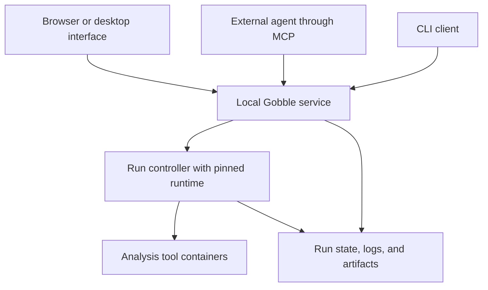

# Gobble — Application and Monitoring Design

Recorded: 2026-09-06. This document records the requested long-term direction.
Existing behavior and proposed contracts are distinguished below. Detailed
design choices remain subject to discussion before implementation.

Related: [Project roadmap](../roadmap/project.md), [Engine architecture](system.md),
[Inspection](../feature/inspect-run.md), [Recovery](../feature/recover-run.md).

## Vision

Gobble lets a person work with an external coding agent to design a
bioinformatics pipeline, inspect the proposed analysis, execute it locally,
understand progress and failures, and recover without losing valid work.

The application makes the analysis understandable and manageable. The Go
library remains the authoring foundation. The engine owns scheduling,
execution, artifacts, and recovery. All five assay products use those shared
contracts.

Use one installation and execution model across user experience levels.
Agents and humans operate the same projects and runs. An agent is optional
and does not have to remain connected for an analysis to continue.

## Current foundation and intended extension

The implementation baseline reviewed for this design is
[`39584ce`](https://github.com/HahyeonJeon/gobble/tree/39584ce8785aa66c14788c7d484e6ef088b58c2a).

| Concern | Existing foundation | Intended extension |
|---|---|---|
| Distribution | Public runtime containing Go, Git, Gobble, and authoring dependencies; common Compose workflow | Local application service and browser interface |
| Execution | Detached controller; tool containers are siblings on the local daemon | Durable run registration independent of client connections |
| Inspection | Coherent JSON snapshots, sample-aware TUI, persistent logs | Multiple-run navigation, web monitoring, reconnectable updates, attempt history |
| Recovery | Lease-addressed Stop and reconciliation before Resume | Shared command contract, request deduplication, resume impact preview |
| Agents | Local source editing and documented CLI operations | MCP tools over the same application operations |
| Platforms | Linux/amd64 containers and cross-platform installation guidance | Actual Desktop acceptance, then an optional desktop shell |

Linux Docker CI has exercised installed WGS and RNA-seq runs and Resume reuse.
Actual Windows and macOS Docker Desktop acceptance remains outstanding.
Native macOS launcher tests do not establish Docker Desktop acceptance.
The development image is not a stable v0.2.0 release.

## Application form

Start with a local web application served by a small Go service. Compose
provides the first service deployment path; the browser is the first visual
client. Keep data and execution local by default, without a required Gobble
account or hosted backend.

Later, the same frontend may be packaged as a desktop application for folder
selection, tray status, notifications, and updates. Wails is the first
candidate to evaluate because it supports Go and web interfaces across
Windows, macOS, and Linux. React and TypeScript are frontend candidates.
Neither framework is an implementation commitment in this document.

A desktop shell does not replace the Linux environment required by analysis
containers. UI architecture support, controller architecture support, and
individual tool-image support are separate claims. Current runtime and task
images remain linux/amd64; Apple Silicon uses emulation.

## Architecture and ownership

This is the application target, not the current CLI topology. The Go library
and existing direct paths remain usable. Application clients share operations
and engine rules rather than implement independent schedulers.

| Component | Responsibility and boundary |
|---|---|
| Frontend | Presents plans, status, and actions; does not infer authoritative state from logs or write workspace controls |
| Local service | Registers projects, discovers runs, serves queries, and routes commands; its restart must not terminate run controllers |
| CLI and MCP adapters | Translate protocol inputs and results into the same application operations |
| Run controller | Owns one execution, scheduling, settlement, checkpoints, and reconciliation using the selected runtime and daemon |
| Executors | Submit, observe, cancel, and reconcile tasks; containers use the host daemon, without a nested daemon |
| Run workspace | Remains authoritative for durable execution facts, attempts, logs, artifacts, and recovery |
| Project catalog | Owns registration and preferences; cached execution summaries are reconstructible, not a second run-state authority |

The service routes old runs through a compatible, pinned runtime. A new app
must not silently reinterpret a workspace through the latest engine. Version
negotiation and the runtime adapter boundary precede application mutations.

Initially register explicitly shared project roots. A browser-selected path
cannot automatically become a Docker bind mount. Preserve writable bind-mount
translation and project containment. Arbitrary folders, named-volume
workspaces, remote mounts, and workspace migration need separate design.

Publish the local API only to the host loopback interface, with a local session
credential and origin checks. Docker authority and project file access remain
behind the API. Remote access and multi-user authorization are later designs.

## Project, revision, run, and attempt

These proposed application concepts must be mapped to existing workspace and
engine identities before choosing a new schema.

| Concept | Meaning |
|---|---|
| Project | Registered local root containing pipeline source and associated inputs and runs |
| Pipeline revision | Recorded source, typed configuration, dependency/runtime identity, and reviewed plan |
| Run | Durable analysis record associated with an exclusive run workspace |
| Task instance | Executable unit, including explicit sample ownership or expanded membership |
| Attempt | One task execution attempt; resumed work can create another attempt |
| Operation | Durable start, stop, or resume request, with its own acceptance and outcome |

Pipeline code and typed configuration remain authoring authority. Display the
graph emitted by Gobble's validated plan. Initial visual authoring must not
promise arbitrary round trips between edited nodes and Go source.

Record the revision used by each execution or recovery attempt. Source edits
must not rewrite already-executed definitions or provenance. For changed-source
recovery, show plan differences and expected reuse. Whether it creates a new
run or a revision within a run is an explicit compatibility decision.

## User journey and monitoring

The primary journey is project registration, authoring with an agent, plan
review, execution, sample and issue monitoring, result inspection, and recovery.

| Surface | Main question | Required information |
|---|---|---|
| Projects and runs | What is active or needs attention? | Active, completed, interrupted, and actionable runs; observation freshness |
| Plan review | What will the analysis do? | Inputs, stages, commands, images, requested resources, destinations, validation findings |
| Run overview | What is happening now? | Preparation phase, active stages, counts, problems, available actions |
| Sample view | Which samples are delayed or failing? | Explicit sample ownership, stage progress, shared/cohort context, search |
| Task details | Why did this task behave this way? | Attempts, command, logs, timestamps, resource requests and measurements, recorded error |
| Results | What was produced, and how? | Artifacts, QC reports, provenance, execution history, reuse information |

Prioritize sample progress and attention items during execution. Use the DAG
for plan review, dependencies, and selected-stage context. Large runs require
grouping, filtering, and bounded rendering instead of an expanded node for
every task.

Display environment checks, input preparation, compilation, and image
acquisition as preparation phases when observations are available. Silence
before the first task must not look like a frozen analysis.

Keep these distinctions visible:

- Task-count percentage is not elapsed compute progress. Dynamic expansion
  can increase its denominator.
- Reused work is part of successful work and should be identifiable.
- Requested CPU and RAM differ from measured utilization. Docker VM capacity
  is not automatically the host machine's full capacity.
- Failed, blocked, skipped, incomplete, unfinalized, and unknown work retain
  their meanings even when the overview groups them.
- Execution success and scientific QC outcome are separate facts.
- Recorded errors and an agent's proposed diagnosis are labeled separately.
- ETA requires suitable historical evidence; otherwise omit it.

Use readable labels as well as color, keyboard access, and layouts that handle
dense tables and long names. Notifications lead to specific runs and actions;
the application remains useful without notifications.

## Lifecycle and recovery contract

Connection health, controller liveness, backend observability, and persisted
run outcome are separate facts. A disconnected client cannot declare a run
stopped or failed. Show the last valid observation and its time when fresh
state cannot be established.

| Scenario or action | Required application behavior |
|---|---|
| Window or agent closes | Execution continues while Docker and the computer remain running |
| Start accepted | Return durable identifiers; acceptance is not execution success |
| Stop requested | Show request acceptance; report stopped only after settlement is proved |
| Stop repeated or delayed | Address the correct owner lease; do not stop a newer recovery owner |
| Resume | Reconcile, verify reuse, and execute unfinished or changed work in new attempts |
| Docker or controller interruption | Preserve uncertainty and reconcile before launching more work |
| Service restart | Rediscover runs and controllers without starting duplicate analysis |
| Request retried | Deduplicate by request identity and detect conflicting inputs |
| Application update | Preserve active runs and runtime pins; negotiate compatibility before control |

Current Resume is task-level recovery, not process-memory restoration. There
is no automatic rerun after Docker or computer restart.

An optional future **finish active tasks and wait** action would stop new
admission while allowing active tasks to finish. It needs a separate name and
admission/resume contract. It is distinct from current Stop, OS suspension, and
Docker pause, and is outside the initial application scope.

## Shared API and agent integration

First expose reads backed by the existing Inspect projection. Add controls
after specifying versioning, request identity, concurrency, lifecycle outcomes,
and reconciliation.

Illustrative MCP tools are `validate_pipeline`, `preview_run`, `start_run`,
`inspect_run`, `preview_resume`, `stop_run`, and `resume_run`. These names and
their exact schemas are proposals, not shipped commands.

Long operations return durable identifiers and remain observable after a
request or agent session ends. Transport cancellation must not silently become
pipeline cancellation after execution is accepted. All clients receive the
same factual state and action eligibility from the backend.

External agents continue to edit local source. Gobble does not need its own
model subscription, agent loop, or chat platform for structured integration.
Plan changes and their execution effects remain reviewable within the user's
established authorization scope.

## State, events, logs, and metrics

Keep coherent checkpoints as the initial execution authority. Add event
history explaining who requested Stop, when tasks changed state, and why work
was reused or rerun. Define checkpoint/event ordering and crash recovery before
making history authoritative. Avoid independent writers for the same facts.

Start with bounded snapshot polling. Add an event stream, such as server-sent
events, after the event contract is ready. Reconnection needs a cursor and
full-snapshot fallback for gaps or expired history. Events need ordered
identities and consumer deduplication; do not assume exactly-once delivery.

Read logs by task attempt, stream, and byte range/cursor. Handle truncation,
rotation, and completed attempts. The current 4 KiB inspection tail is a preview,
not a full-history protocol. Render tool output as text.

Measurements and estimates include observation time and availability.
Monitoring collection must not determine task success or block the scheduler.
Timelines, run comparison, notifications, and reports follow the basic viewer.

A catalog database, potentially SQLite, can support discovery and preferences.
Its format and location remain open. Large artifacts and logs stay in files;
catalog loss must not invalidate workspace recovery.

## Decisions still requiring discussion

| Decision | Working recommendation | Resolve before |
|---|---|---|
| Frontend / desktop framework | Browser first; evaluate React/TypeScript and later Wails | Frontend work / desktop packaging respectively |
| Service and project registration | One local service with explicitly shared roots | Multi-project service implementation |
| Run/revision identity | Preserve executed definitions and link recovery attempts | Application persistence schema |
| API/runtime compatibility | Versioned operations routed to the pinned runtime | Application mutations |
| Event durability | Checkpoint-led state and recoverable history | Durable event publication |
| Catalog persistence | Rebuildable execution index; separately owned registration/preferences | Persistent catalog |
| Background recovery | Reconnect and reconcile; no silent automatic rerun | Automatic recovery features |
| Finish-active-and-wait | Separate scheduling action | Adding a pause-like control |

Remote execution, HPC, cloud, native ARM analysis, cross-workspace caching,
retention/deletion, an embedded agent, and bidirectional visual authoring remain
separate designs. None is required for the first useful local application.

## References

- [Container distribution](../../../../../../distribution/runtime/README.md)
  — installation, pinning, detached execution, and acceptance limits.
- [Monitoring](../../../../../../docs/monitoring.md)
  — projections, sample semantics, logs, and TUI boundaries.
- [Agent guide](../../../../../../docs/agent-guide.md)
  — current external-agent operation.
- [Wails introduction](https://wails.io/docs/introduction/)
  — desktop capabilities; candidate only.
- [MCP tools specification](https://modelcontextprotocol.io/specification/2025-11-25/server/tools)
  — structured tool interfaces; Gobble tool names remain proposed.
