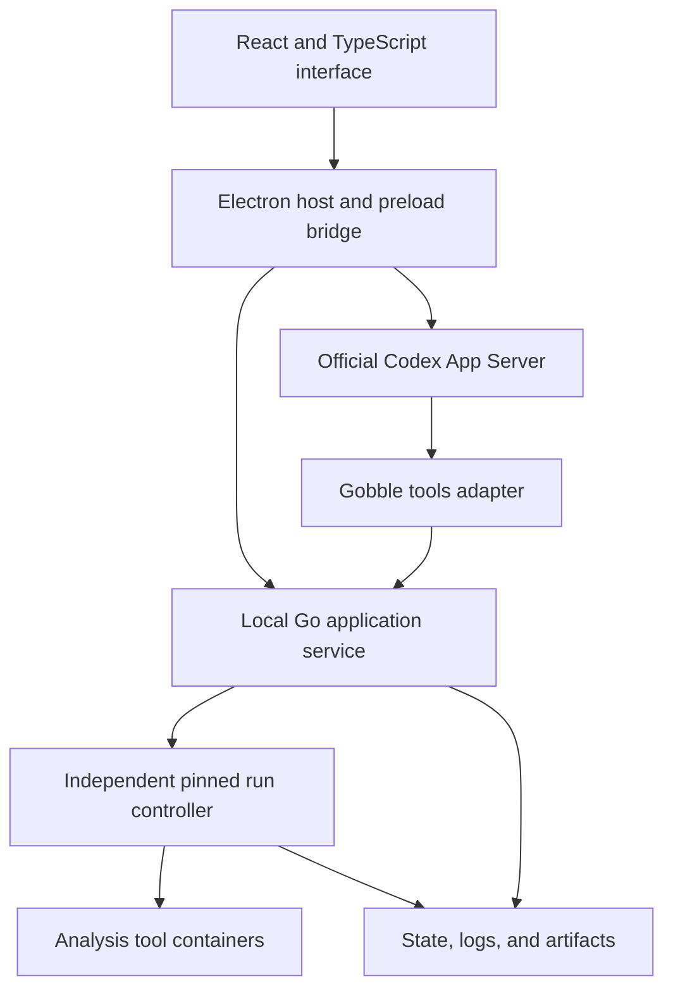

# Gobble — Application and Monitoring Design

Updated: 2026-09-06. Electron, React/TypeScript, desktop-first delivery, and
ChatGPT subscription authentication as the first agent target are user-selected
directions. Existing behavior and planned capabilities are distinguished below.
Detailed contracts and release qualification remain implementation work.

Related: [Project roadmap](../roadmap/project.md), [Engine architecture](system.md),
[Inspection](../feature/inspect-run.md), [Recovery](../feature/recover-run.md).

## Vision

Gobble is a desktop application for working with an agent to design a
bioinformatics pipeline, review the analysis, execute it locally, understand
progress and failures, and recover without losing valid work. Its first agent
experience uses OpenAI models through the user's ChatGPT subscription sign-in.
The initial integration route is the official Codex App Server.

The application makes the analysis understandable and manageable. The Go
library remains the authoring foundation. The engine owns scheduling,
execution, artifacts, and recovery. All five assay products use those shared
contracts.

Use one installation and execution model across user experience levels.
The integrated agent and direct UI controls operate the same projects and runs.
Agent assistance is a first-product capability; monitoring and controlling an
existing run must still work when the agent is unavailable or signed out.

## Current foundation and intended extension

The implementation baseline reviewed for this design is
[`39584ce`](https://github.com/HahyeonJeon/gobble/tree/39584ce8785aa66c14788c7d484e6ef088b58c2a).

| Concern | Existing foundation | Intended extension |
|---|---|---|
| Distribution | Public runtime containing Go, Git, Gobble, and authoring dependencies; common Compose workflow | Electron desktop distribution managing the same container execution model |
| Execution | Detached controller; tool containers are siblings on the local daemon | Durable run registration independent of client connections |
| Inspection | Coherent JSON snapshots, sample-aware TUI, persistent logs | React/TypeScript desktop monitoring, multiple-run navigation, reconnectable updates, attempt history |
| Recovery | Lease-addressed Stop and reconciliation before Resume | Shared command contract, request deduplication, resume impact preview |
| Agents | External source editing and documented CLI operations | In-app agent using ChatGPT subscription sign-in and official Codex runtime integration |
| Platforms | Linux/amd64 containers and cross-platform installation guidance | Electron installers and actual application plus Docker acceptance on supported hosts |

Linux Docker CI has exercised installed WGS and RNA-seq runs and Resume reuse.
Actual Windows and macOS Docker Desktop acceptance remains outstanding.
Native macOS launcher tests do not establish Docker Desktop acceptance.
The development image is not a stable v0.2.0 release.

## Selected product and technology direction

The first visual product is an **Electron desktop application with React and
TypeScript**. A standalone browser application is a later delivery option, not
a prerequisite. Reusable frontend components and API contracts should permit
that extension without delaying the desktop product.

| Layer | Selected direction |
|---|---|
| Desktop host | Electron; TypeScript main process and a narrow preload bridge |
| Interface | React and TypeScript; project, agent, plan, monitoring, and result surfaces |
| First agent target | OpenAI models available through the user's ChatGPT subscription, integrated through Codex App Server |
| Agent transport | Host-managed official Codex runtime, initially using its stdio interface |
| Application operations | Independent Go service with versioned query and command contracts |
| Analysis execution | Pinned Gobble controllers and sibling analysis containers on local Docker |
| Later distribution | Browser access reusing the interface and application operations |

Electron replaces the earlier Wails candidate. Controlling the desktop
rendering environment and using established native integration and distribution
tools matter more here than keeping the desktop host in Go. The engine remains
Go; it is not moved into Electron's main process.

The application should guide project-folder selection, Docker readiness,
runtime acquisition, and agent sign-in. Users need not use a terminal for the
first desktop journey. Existing Compose and direct Linux entry points remain
usable for automation, compatibility, and development without audience tiers.

A desktop installer does not eliminate the Linux environment required by
analysis containers. Electron host architecture, Codex runtime architecture,
Gobble controller architecture, and tool-image architecture have separate
support matrices. Current analysis images remain linux/amd64, with emulation on
Apple Silicon. Shipping an ARM desktop binary does not prove native ARM analysis.

## Architecture and ownership

This is the intended application topology, not shipped behavior. The provider
runtime manages agent turns; Gobble manages analysis. An agent thread and a
pipeline run have different identities, state, and lifetimes.

| Component | Responsibility and boundary |
|---|---|
| React renderer | Presents conversation, plans, progress, and results; has no direct provider credentials, Docker socket, or arbitrary process-launch interface |
| Electron main/preload | Owns windows, native dialogs, browser sign-in handoff, notifications, and validated host calls |
| Codex adapter | Connects the UI to the official runtime; maps conversation events and tool calls without implementing a replacement model loop |
| Gobble tools adapter | Exposes structured project and run operations to the agent; uses the same commands as direct UI actions |
| Local Go service | Registers projects, discovers runs, serves queries, and routes commands; restart must not terminate controllers |
| Run controller | Owns scheduling, settlement, checkpoints, and reconciliation with its pinned runtime and verified daemon |
| Executors | Submit, observe, cancel, and reconcile analysis tasks on the local daemon |
| Workspace and catalog | Workspace owns execution truth; catalog owns registration/preferences and rebuildable execution summaries |

Run the agent integration on the host so it can edit the selected local project
and use the host's sign-in environment. Keep compilation and analysis in the
Gobble container runtime. The proposed application service may initially run
in a runtime container; define its exact startup and mount contract before
implementation. No nested Docker daemon is required.

The service routes old runs through compatible pinned runtimes. Application,
Codex runtime, and analysis-runtime versions are managed independently. An app
update must not silently replace software required by an existing run.

Native folder selection initiates registration and Docker mount checks; a file
picker does not prove a folder is shareable. Preserve writable bind-mount
translation and containment. Arbitrary mounts, named-volume workspaces, remote
roots, and migration require separate designs.

Keep Electron renderer privileges narrow, with context isolation and validated
IPC. If the service exposes HTTP, publish only to loopback with a local session
credential and origin checks. Provider credentials remain with the host-side
agent runtime, outside renderer state, pipeline folders, logs, and images.

## First agent target: ChatGPT subscription sign-in

Use OpenAI's subscription OAuth through the official **Sign in with ChatGPT**
flow. This is the selected meaning of ChatGPT subscription authentication.
OpenAI documents Codex App Server as a product integration surface for
account authentication, conversation history, approvals, and streamed agent
events. This is the initial integration route for Gobble's agent panel.
[Official App Server documentation](https://learn.chatgpt.com/docs/app-server)

Proposed sign-in flow: Electron requests ChatGPT login from App Server, opens
the returned authorization URL in the system browser, and observes completion.
App Server handles the callback and credentials. Model choices come from the
runtime's available-model list. Verify this flow against a pinned runtime on
each supported OS before claiming working subscription integration.

Subscription access applies to models and usage available to that account
through Codex. It does not establish access to every ChatGPT UI model or a
Platform API allowance. Keep subscription sign-in as the initial provider
path; an API-key mode and other providers are later choices with explicit
billing semantics. Account eligibility and limits remain provider-controlled.
[Official authentication documentation](https://learn.chatgpt.com/docs/auth)

The following are Gobble product requirements, not claims of completed provider
integration:

- Expose account connection, model selection, conversation, tool activity,
  reviewable source/plan changes, and run links in the desktop app.
- Keep provider thread/turn identifiers separate from Gobble run/operation IDs.
  Restore the association when reopening a project.
- Preserve pending authorization and tool outcomes across UI reconnection;
  never translate a missing client response into permission to execute.
- Distinguish **interrupt agent turn** from **stop pipeline**. Signing out,
  expired authentication, a provider limit, or an agent crash must not stop an
  already accepted analysis or disable direct local Stop/Resume controls.
- Local analysis data and results remain on disk, while agent prompts and
  selected context are sent to OpenAI. Make context selection visible and avoid
  automatically attaching raw sequencing files or unrelated project data.
- Prefer runtime-supported OS credential storage; design and verify fallback
  behavior for systems without a usable credential store.

Choose the Codex binary acquisition method, version compatibility, and upgrade
policy during the initial integration work. Bundling versus a managed install,
license notices, and native host availability are release decisions. A successful
sign-in alone is not evidence that project editing and Gobble tool execution work.

## Project, revision, run, and attempt

These proposed application concepts must be mapped to existing workspace and
engine identities before choosing a new schema.

| Concept | Meaning |
|---|---|
| Project | Registered local root containing pipeline source and associated inputs and runs |
| Pipeline revision | Recorded source, typed configuration, dependency/runtime identity, and reviewed plan |
| Run | Durable analysis record associated with an exclusive run workspace |
| Task instance | Executable unit, including explicit sample ownership or expanded membership |
| Attempt | One task execution attempt; resumed work can create another attempt |
| Operation | Durable start, stop, or resume request, with its own acceptance and outcome |

Pipeline code and typed configuration remain authoring authority. Display the
graph emitted by Gobble's validated plan. Initial visual authoring must not
promise arbitrary round trips between edited nodes and Go source.

Record the revision used by each execution or recovery attempt. Source edits
must not rewrite already-executed definitions or provenance. For changed-source
recovery, show plan differences and expected reuse. Whether it creates a new
run or a revision within a run is an explicit compatibility decision.

## User journey and monitoring

The primary desktop journey is installation and dependency checks, ChatGPT
sign-in, project registration, in-app agent authoring, plan review, execution,
sample and issue monitoring, result inspection, and recovery. Browser use is
needed for official sign-in, not as the Gobble application interface.

| Surface | Main question | Required information |
|---|---|---|
| Setup and account | Can I start working? | Docker/runtime readiness, project-folder checks, account connection, available models |
| Agent panel | What is being proposed or changed? | Conversation, tool activity, source/plan changes, authorization requests, linked runs |
| Projects and runs | What is active or needs attention? | Active, completed, interrupted, and actionable runs; observation freshness |
| Plan review | What will the analysis do? | Inputs, stages, commands, images, requested resources, destinations, validation findings |
| Run overview | What is happening now? | Preparation phase, active stages, counts, problems, available actions |
| Sample view | Which samples are delayed or failing? | Explicit sample ownership, stage progress, shared/cohort context, search |
| Task details | Why did this task behave this way? | Attempts, command, logs, timestamps, resource requests and measurements, recorded error |
| Results | What was produced, and how? | Artifacts, QC reports, provenance, execution history, reuse information |

Prioritize sample progress and attention items during execution. Use the DAG
for plan review, dependencies, and selected-stage context. Large runs require
grouping, filtering, and bounded rendering instead of an expanded node for
every task.

Display environment checks, input preparation, compilation, and image
acquisition as preparation phases when observations are available. Silence
before the first task must not look like a frozen analysis.

Keep these distinctions visible:

- Task-count percentage is not elapsed compute progress. Dynamic expansion
  can increase its denominator.
- Reused work is part of successful work and should be identifiable.
- Requested CPU and RAM differ from measured utilization. Docker VM capacity
  is not automatically the host machine's full capacity.
- Failed, blocked, skipped, incomplete, unfinalized, and unknown work retain
  their meanings even when the overview groups them.
- Execution success and scientific QC outcome are separate facts.
- Recorded errors and an agent's proposed diagnosis are labeled separately.
- ETA requires suitable historical evidence; otherwise omit it.

Use readable labels as well as color, keyboard access, and layouts that handle
dense tables and long names. Notifications lead to specific runs and actions;
the application remains useful without notifications.

## Lifecycle and recovery contract

Connection health, controller liveness, backend observability, and persisted
run outcome are separate facts. A disconnected client cannot declare a run
stopped or failed. Show the last valid observation and its time when fresh
state cannot be established.

| Scenario or action | Required application behavior |
|---|---|
| Window or agent closes | Accepted analysis continues while Docker and the computer remain running |
| Agent interrupted, signed out, or limited | Agent activity stops or waits; direct local monitoring and pipeline controls remain usable |
| Start accepted | Return durable identifiers; acceptance is not execution success |
| Stop requested | Show request acceptance; report stopped only after settlement is proved |
| Stop repeated or delayed | Address the correct owner lease; do not stop a newer recovery owner |
| Resume | Reconcile, verify reuse, and execute unfinished or changed work in new attempts |
| Docker or controller interruption | Preserve uncertainty and reconcile before launching more work |
| Service restart | Rediscover runs and controllers without starting duplicate analysis |
| Request retried | Deduplicate by request identity and detect conflicting inputs |
| Application update | Preserve active runs and runtime pins; negotiate compatibility before control |

Current Resume is task-level recovery, not process-memory restoration. There
is no automatic rerun after Docker or computer restart.

An optional future **finish active tasks and wait** action would stop new
admission while allowing active tasks to finish. It needs a separate name and
admission/resume contract. It is distinct from current Stop, OS suspension, and
Docker pause, and is outside the initial application scope.

## Shared operations and Gobble tools

First expose reads backed by the existing Inspect projection. Add controls
after specifying versioning, request identity, concurrency, lifecycle outcomes,
and reconciliation.

Illustrative tools are `validate_pipeline`, `preview_run`, `start_run`,
`inspect_run`, `preview_resume`, `stop_run`, and `resume_run`. Their names and
schemas remain proposals. A Gobble MCP adapter is the initial candidate for
exposing these shared operations to Codex; its local transport and registration
are resolved during the integration work. It is distinct from the protocol
between Electron and Codex App Server.

Long operations return durable identifiers and remain observable after a
request or agent session ends. Transport cancellation must not silently become
pipeline cancellation after execution is accepted. All clients receive the
same factual state and action eligibility from the backend.

The integrated agent edits project source and invokes Gobble operations through
the approved project scope. External agents and CLI clients can use the same
contracts. Source changes and execution effects remain reviewable within the
user's established authorization. The engine, rather than the conversation,
is authoritative for run success and reusable outputs.

## State, events, logs, and metrics

Keep coherent checkpoints as the initial execution authority. Add event
history explaining who requested Stop, when tasks changed state, and why work
was reused or rerun. Define checkpoint/event ordering and crash recovery before
making history authoritative. Avoid independent writers for the same facts.

Start with bounded snapshot polling. Add an event stream, such as server-sent
events, after the event contract is ready. Reconnection needs a cursor and
full-snapshot fallback for gaps or expired history. Events need ordered
identities and consumer deduplication; do not assume exactly-once delivery.

Read logs by task attempt, stream, and byte range/cursor. Handle truncation,
rotation, and completed attempts. The current 4 KiB inspection tail is a preview,
not a full-history protocol. Render tool output as text.

Measurements and estimates include observation time and availability.
Monitoring collection must not determine task success or block the scheduler.
Timelines, run comparison, notifications, and reports follow the basic viewer.

A catalog database, potentially SQLite, can support discovery and preferences.
Its format and location remain open. Large artifacts and logs stay in files;
catalog loss must not invalidate workspace recovery.

## Decisions still requiring discussion

| Decision | Working recommendation | Resolve before |
|---|---|---|
| Codex distribution and compatibility | Official runtime with a pinned, tested host integration | First installer and agent integration |
| Agent state and tool bridge | Separate provider thread/turn IDs from Gobble operation/run IDs | First complete agent-driven analysis |
| Service and project registration | One local service with explicitly shared roots | Multi-project service implementation |
| Run/revision identity | Preserve executed definitions and link recovery attempts | Application persistence schema |
| API/runtime compatibility | Versioned operations routed to the pinned runtime | Application mutations |
| Event durability | Checkpoint-led state and recoverable history | Durable event publication |
| Catalog persistence | Rebuildable execution index; separately owned registration/preferences | Persistent catalog |
| Background recovery | Reconnect and reconcile; no silent automatic rerun | Automatic recovery features |
| Finish-active-and-wait | Separate scheduling action | Adding a pause-like control |

The desktop framework, frontend language, desktop-first sequence, and initial
subscription-backed OpenAI provider are selected. The table above concerns their
remaining implementation contracts, not reopening those product choices.

Standalone browser delivery, remote execution, HPC, cloud, native ARM analysis,
cross-workspace caching, retention/deletion, additional providers, and
bidirectional visual authoring remain later designs. The integrated agent is
part of the first useful desktop product.

## References

- [Container distribution](../../../../../../distribution/runtime/README.md)
  — installation, pinning, detached execution, and acceptance limits.
- [Monitoring](../../../../../../docs/monitoring.md)
  — projections, sample semantics, logs, and TUI boundaries.
- [Agent guide](../../../../../../docs/agent-guide.md)
  — current external-agent operation.
- [Electron process model](https://www.electronjs.org/docs/latest/tutorial/process-model)
  — desktop main, renderer, and preload responsibilities.
- [Electron distribution](https://www.electronjs.org/docs/latest/tutorial/distribution-overview)
  — packaging and release integration.
- [Codex App Server](https://learn.chatgpt.com/docs/app-server) and
  [authentication](https://learn.chatgpt.com/docs/auth)
  — official integration and subscription sign-in; checked 2026-09-06.
- [MCP tools specification](https://modelcontextprotocol.io/specification/2025-11-25/server/tools)
  — structured tool interfaces; Gobble tool names remain proposed.
