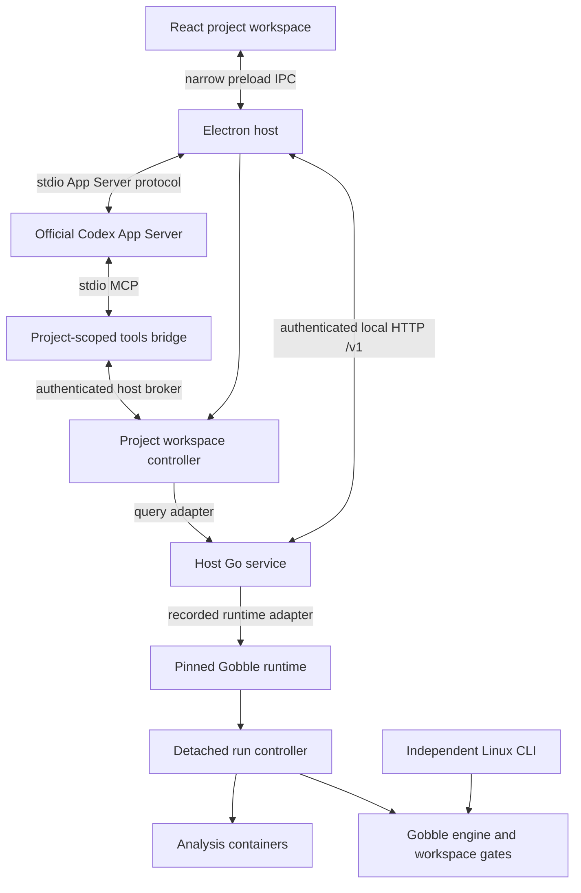

# Gobble App — Project Workspace Contract

Updated: 2026-09-06. The user approved the Project-centered shared-workspace
concept, multiple attached agents, user/agent-opened panels, and selection-based
discussion. The implementation choices below make that concept reviewable;
they describe the complete first-slice direction. Local stages 1–3 implement the
contracts, Project service and user-driven shared workspace. Provider/tools and
real engine integration remain later stages; this is not a release claim.

Parent: [Application architecture](application.md). Interface:
[Project workspace](../feature/agent-workspace.md). Scope and evidence:
[Desktop review](../../../../../../docs/desktop-workspace/README.md).

Precise terms, presentation kinds and per-metadata owners are defined in
[workspace domain model](workspace-domain.md). That document distinguishes App
Workspace from engine execution workspace and authored tasks from runtime instances.

## Product boundaries

| Component                                        | Owns                                                                                                           | Must not own                                                  |
| ------------------------------------------------ | -------------------------------------------------------------------------------------------------------------- | ------------------------------------------------------------- |
| Gobble library, Linux CLI and pinned controllers | Plan validation, execution, attempts, artifacts, occupancy, Stop, reconciliation and Resume reuse              | Project UI, agent identity, account, layout or conversation   |
| Local Go application service                     | Project registration, contained file queries, run discovery, runtime routing and application operation records | Scheduler, a second execution checkpoint or provider dialogue |
| Gobble App workspace controller                  | Project surfaces, layout, agent attachments, selection references, pending questions and presentation outcomes | Engine truth, model inference or provider credentials         |
| Electron host                                    | Windows, local process lifecycle, validated bridges, native dialogs and persistence adapters                   | Analysis execution or model reasoning                         |
| Official Codex App Server                        | Account sign-in, provider threads, turns and tool requests                                                     | Gobble run ownership or shared layout authority               |

One Project contains zero or more agents, plans, runs, files, results, surfaces
and decisions. A Project is useful before an agent signs in or a run exists.
Removing an agent attachment preserves its Project's surfaces and runs.

All app-owned text, menus, errors and accessibility labels are English. Project
names, user-authored content and filenames retain their original language.

## Process topology

The first service runs as a native host Go process. This keeps project selection
and workspace browsing available without Docker and avoids remounting one
service container for every newly registered root. The service invokes the
recorded container runtime for engine operations; native service delivery does
not add native macOS/Windows analysis support. Directly importing the current
engine to control an old run is not a compatible-runtime strategy.

One primary Electron instance owns one service process and workspace controller
per app profile. A second launch focuses that instance. The service is
restartable; it is not a required always-on daemon. Normal app quit stops app-owned
service, bridge and provider processes, while Docker continues accepted run
controllers. A host crash may leave an orphan helper; it must be identified by
its instance handshake before reconnecting or stopping it, never by an unproved
PID. Parent-pipe closure should end app helpers, not detached controllers.

## Identity and authority

| Identity                        | Lifetime and authority                                                                                         |
| ------------------------------- | -------------------------------------------------------------------------------------------------------------- |
| `projectId`                     | Stable app-service ID for a registered canonical local root; no new analysis identity                          |
| `agentId`                       | Stable Project attachment with a display name, instruction profile and provider binding                        |
| `threadId`, `turnId`            | Provider-owned conversation identities, scoped through the attachment                                          |
| `runRef`                        | App registration pointing to a workspace, engine identity and runtime binding; not a replacement engine run ID |
| `runId`, task identity, attempt | Passed through from the compatible engine; never synthesized from a tab or chat                                |
| `surfaceId`                     | Stable Project-owned view reference independent of the opening agent                                           |
| `decisionId`                    | App-owned question and recorded response tied to evidence dependencies                                         |
| `requestId`                     | Client intent identity; a transport retry retains it                                                           |
| `operationId`                   | Durable service command identity, separate from an agent turn and run                                          |

Registering the same canonical root reuses its Project. Show a clear conflict
for overlapping registered roots in the first version; do not silently duplicate
scope. Folder selection grants registration of that root, not every path it
contains through symlinks. Resolve containment at use time. Files outside the
root need a separately registered, explicit mapping; remote roots and arbitrary
mounts are later designs.

Stage 2 persists resource-ID-to-relative-path mappings and the registered root's
physical identity. Reads detect a replaced root. Explicitly selecting the same
moved folder retains its Project and resource IDs, subject to overlap checks.

## Persistence

The host resolves one app data directory, called `appData` below. Nothing here
belongs under a run's engine control directory or the synced ChatGPT `sources/`.

| State                                                                                     | Sole writer and proposed location                                   | Recovery                                                                                                 |
| ----------------------------------------------------------------------------------------- | ------------------------------------------------------------------- | -------------------------------------------------------------------------------------------------------- |
| Project/root and run/runtime registrations                                                | Go service: `appData/service/catalog.json`                          | Versioned atomic replacement; retain last valid backup; unknown registrations need explicit reattachment |
| Surfaces, layout, agent bindings, context references, decisions and discussion references | Workspace controller: `appData/workspace/projects/<projectId>.json` | Serialized writes and revision checks; restore safe references, never replay an effect                   |
| Window geometry and last Project                                                          | Electron host: `appData/workspace/window.json`                      | Clamp to an available screen; fall back to Project chooser                                               |
| Provider transcript and credentials                                                       | Codex-owned store under an app-specific home                        | Resume through provider APIs; do not parse its private storage or copy credentials                       |
| Execution state, logs and artifacts                                                       | Existing Gobble workspace/controller                                | Existing CLI recovery, independent of app catalog                                                        |
| Execution summaries and display caches                                                    | Derived, bounded app caches                                         | Discard and query the engine again                                                                       |

Use schema-versioned JSON with atomic writes for this first single-writer slice;
SQLite is not required for the initial catalog size. A migration makes a backup,
accepts only known versions and refuses a newer unknown schema. No automatic
state deletion on corruption. This choice reopens for measured scale,
multi-process writers or transactional cross-record operations.

Provider history and the shared discussion are different records. The shared
discussion stores addressed user messages, published agent responses and
evidence references. It does not automatically aggregate every provider item
or expose one agent's private context to another.

## Transport contracts

### Renderer to host

Expose named actions such as `projects.chooseFolder`, `workspace.open`,
`workspace.arrange`, `workspace.observe`, `agents.send` and `decisions.answer`.
No arbitrary channel, path, shell, JavaScript evaluation or Docker interface
crosses the preload boundary. Runtime-validate arguments and the current trusted
top-level sender before asynchronous handling; TypeScript is not authorization.

The renderer reports a render acknowledgment containing the current renderer
session, surface ID, request generation and displayed data revision. An old
renderer or late result cannot mark a newer view ready. The host stores layout
authority; the renderer stores transient focus and unfinished input.

Stage 3 implements `workspace.connect`, `openProject`, `command`, `updateDraft`,
`loadSurface`, `acknowledge` and a closed native-shortcut subscription. Command
variants cover user open/activate/focus/close/pin/move/arrange/resize/maximize,
discussion, recipient and selection. The command carries Project ID, expected
workspace revision and request ID. The host is the only writer; it retains the
latest 256 request receipts. Agent-facing tools need their own actor authorization
and pin policy before reusing this state machinery.

`WorkspaceDocument` wraps the portable workspace with titles, active/maximized
pane, discussion draft/size, local selections, activity and receipts. Schema and
cross-field checks apply on read and write. Each private JSON file retains its
last valid `.backup`; corrupt/future/external changes are preserved with an error.
Normal close/quit flushes received writes. A failed draft save prevents leaving
the Project; native close offers Keep Open. Recovery restores committed state,
not unsaved crash-time input or previously requested effects.

The durable WorkspaceController delegates ephemeral observation state to
RenderSession; ProjectService centralizes native routes/schema/association, and
presentRun projects Monitor facts into a typed RunPresentation for React.
Existing workspace/catalog v1 JSON remains readable. See the domain record for
the legacy log taskId field and bundled IPC presentation change.

A ready lease is ephemeral and tied to the active Project, visible surface,
renderer session, load generation and data revision. Hiding/closing a pane or
reconnecting invalidates it. File bytes use content hashes; displayed log text
has a separate hash because log tails can change without a new checkpoint.
Selection validates the exact Project/surface/resource plus its actual row,
text range or image bounds. No stored selection claims a live agent observation.
See [stage 3 evidence](../../../../../../docs/desktop-workspace/stages/03-workspace.md).

### Renderer isolation and content

For the first packaged local renderer, require `nodeIntegration: false`,
`contextIsolation: true`, `sandbox: true`, `webSecurity: true` and
`allowRunningInsecureContent: false`. Use a restrictive CSP and a packaged
origin; keep sandboxed preload output compatible with its loader. Register
narrow IPC and validate the trusted top-level sender synchronously before
handling payloads. No raw Electron event or generic invoke crosses the bridge.

Default-deny permission checks/requests, popups, webviews, frame navigation and
redirects on every app-owned session and webContents. External navigation is
limited to parsed, validated authentication URLs and explicitly requested
trusted links. A future HTML report viewer must have no privileged preload or
native bridge and must constrain its own assets/navigation. Static first-slice
image/text views do not require executable report content.

Stage 1 pins Electron `44.2.0` and verifies the emitted sandboxed CommonJS
preload, built app origin and narrow IPC on macOS/arm64. This is source-build
evidence, not an installed/package or cross-platform qualification. See the
[stage record](../../../../../../docs/desktop-workspace/stages/01-contracts.md).

The initial portable contracts live in `app/contracts/src`. TypeBox definitions
produce both inferred TypeScript types and the committed Draft 7 JSON Schema
bundle at `app/contracts/schema/v1.json`. Unknown versions and extra fields are
rejected. Cross-record association, ordered selections and layout membership
also require semantic validation, listed in `app/README.md`; a foreign-language
consumer must not mistake JSON shape validation for these checks or authorization.
No Node tooling is required to build the existing engine or future Go consumers.

### Host to Go service

The first service binds an OS-assigned port on `127.0.0.1` only. The host gives
it a fresh random credential through a private inherited pipe; startup returns
the endpoint, service instance ID and protocol major. The credential must not
appear in argv, URLs, renderer state, logs or project files. All requests require
the credential. Reject unexpected Host values and browser Origin headers; do
not enable browser CORS in this slice. Rate, body and response sizes are bounded.

Start with HTTP/JSON `/v1`. A capabilities response describes actual supported
methods and the protocol major. The private startup handshake identifies the
service instance; availability of a Run's recorded runtime is checked per query.
Unsupported versions or
capabilities produce a typed error, never a best-effort mutation.

| Initial route family                           | Contract                                                                      |
| ---------------------------------------------- | ----------------------------------------------------------------------------- |
| `GET /v1/capabilities`                         | Protocol major and actual query/catalog mutation capabilities                 |
| `GET /v1/projects`, `POST /v1/projects`        | List and idempotently register a validated root                               |
| `GET /v1/projects/{id}/files`                  | Bounded directory listing by optional `directoryId`, with explicit truncation |
| `GET /v1/projects/{id}/files/{resourceId}`     | Text, CSV or image preview; optional `expectedRevision` rejects stale content |
| `GET /v1/projects/{id}/runs`                   | Registered/discovered workspace references and unresolved entries             |
| `POST /v1/projects/{id}/runs/attach`           | Register a workspace after compatibility and mount checks                     |
| `GET /v1/projects/{id}/runs/{runRef}/snapshot` | Coherent compatible-runtime Monitor projection and observation metadata       |
| `GET /v1/projects/{id}/runs/{runRef}/logs`     | Current supported selected-attempt tail, with actual limits and availability  |

Project creation in the initial UI creates an app Project and optionally an
empty user-chosen folder. It does not claim to scaffold a valid assay or launch
analysis. Registry writes carry request IDs; repeated matching requests reuse
the record, conflicting payloads return `request_conflict`.

All service replies carry `schemaVersion` and an `ok` result discriminant.
Snapshot values contain `projectId`, `runRef`,
`engineRevision`, `observedAt`, `runtimeBinding` and `availability` alongside
unchanged engine facts. `engineRevision` is an opaque equality marker unless
the engine specifies ordering. Log bytes may advance after a checkpoint; record
their own observation and truncation instead of claiming atomic log/state reads.

Errors use stable codes such as `not_found`, `outside_project`,
`runtime_unavailable`, `incompatible_runtime`, `stale_revision`, `unsupported`
and `request_conflict`, with a readable message and a retry classification.
Every response verifies Project and resource association on the server.

### Runtime routing

The complete adapter design uses the project's existing `.gobble-runtime.json`,
Compose binding and workspace engine identity to resolve the exact
daemon/image/path mapping.
Invoke existing structured commands with fixed argument construction and bounded
output; do not parse TUI text or edit checkpoints. Container paths stay inside
the runtime adapter. A UI row carries opaque resource references, not an
arbitrary host path accepted as authority.

Stage 2 implements only the recorded local Unix Docker endpoint, exact
Linux/amd64 image and default `/gobble/project` mapping for Project-local
workspaces. Custom Compose mappings, external workspaces and remote endpoints
remain unqualified; do not infer support or retry using the current engine.
The read-only query container disables bootstrap, exposes no Docker socket and
runs only the pinned image's `inspect identity/monitor`. Run ID, engine identity
and current selected attempt are checked before presenting data. Discovery of a
`.gobble` directory is only a workspace candidate, never execution state.

For the first proof, query existing Inspect/Monitor projections through a
compatible pinned runtime. Per-poll short-lived containers may be expensive:
coalesce requests for the same workspace, allow at most one active poll per
workspace, poll the selected run conservatively and back off when hidden or
unavailable. A persistent runtime query helper is a measured follow-up; it must
remain pinned and have its own cleanup contract.

### Host to provider and tools

Use the official App Server stdio transport, its initialize handshake,
account/login flow, model listing, thread resume and turn events. The inspected
local candidate is Codex `0.153.4`; exported types must come from the selected
binary. The App Server surface is experimental; this is a pinned integration
candidate, not a provider compatibility promise.

Provision an app-managed official binary with verified version/digest and
notices during packaging; allow an explicitly configured compatible binary for
development. Do not depend on the private installation path of another app.
Use an app-specific Codex home and official ChatGPT managed login. The user
performs the browser authentication step. No token import from this Codex task,
implicit API billing fallback or fixed model catalogue is part of the design.

Use two logical MCP tool sets: `workspace_*` for shared views/questions and
`gobble_*` for supported engine queries/operations. A bridge instance receives
an authenticated, host-created binding to one Project and agent attachment.
The model cannot choose another actor by supplying an `agentId`. Its stdio MCP
process uses a private loopback host broker for workspace calls; the broker
routes engine queries through the same Go-service client as direct UI actions.
Only declared tool names and bounded schemas are exposed. The first bridge is
read/query and workspace-interaction only.

Stage 4 refines the initial process-per-attachment candidate to one app-server
per app profile, with independent attachment threads and explicitly targeted
turns. The official protocol multiplexes these conversations; one account owner
avoids concurrent credential refresh across processes. This also makes process
failure a shared connection failure, while message ownership remains separate.
The runtime starts on an explicit account connection and ends on app quit.
At most two turns are admitted across the app, with one pending message per agent.
There is no process-wide mutable Project path: discussion has no environment
access. Stage 5 must separately prove thread-scoped MCP identity and observation
before exposing any tool. It may revisit the process topology with evidence.
See the [stage 4 design](../../../../../../docs/desktop-workspace/stages/04-agents.md).

Experimental dynamic tools are an alternative transport, not a silent fallback
if the MCP bridge cannot deliver images or contextual answers. Prove text,
structured observation and scoped-image delivery against the pinned runtime.

The [stage 5 proposal](../../../../../../docs/desktop-workspace/stages/05-shared-context.md)
now requests an explicit choice of that dynamic-tool alternative, with a
provider-neutral application port and a future MCP adapter. This transport change
and its tool-version transition are pending user approval; no tool capability
is claimed in the current stage 4 build.

## Multi-agent coordination

Agents are peer attachments, not mandatory manager/worker roles. Names and
instructions are editable; image labels such as Analysis/QC are examples.
Each has its own thread and active turn. Switching the addressed agent preserves
the Project layout. Sending a message explicitly selects one recipient in this
slice; broadcast and automatic cross-agent delegation are later behavior.

The host owns a durable submission ID before contacting the provider. An
uncertain turn submission is reconciled through provider history; it is not
automatically submitted again. Engine read calls can run concurrently. Layout
and decision writes pass through the single workspace controller with revision
checks. Two agent requests cannot silently replace pinned user work.

Project files are the common source, not a common unrestricted model context.
The first slice is read-only for agent source access and execution capabilities.
Future source edits require a separate change-set contract: base file hashes,
one validated apply operation, conflict reporting and no automatic overwrite
of user edits. A read-only hint alone does not constrain arbitrary shell tools;
the pinned runtime's actual sandbox/tool policy must enforce the chosen scope.

## Future execution commands

Start/Stop/Resume and plan-building commands are not first-slice endpoints.
Plan generation executes trusted project code; classify it explicitly rather
than treating it as an inert file read. Future direct UI and agent controls call
the same service command handler and engine gates.

Before enabling mutations, settle and implement a durable command protocol:
`requestId`, action, Project/run identity, canonical payload digest, reviewed
source/plan revision and expected owner lease when applicable. Persist acceptance
before returning an `operationId`. Matching retries return the original
operation; differing content under one ID is a conflict. HTTP cancellation
ends waiting, not an accepted analysis.

An operation journal alone cannot guarantee duplicate-free Start after a crash
between launch and recording its result. The launch intent must be discoverable
on the controller/workspace, correlated to the request, and reconciled before
another launch. A transport retry must never call Start again blindly. Late Stop
must be conditional on the observed lease; a service-side precheck followed by
an unconditional current-owner Stop is insufficient. These are Phase 2 engine
adapter requirements and may require a focused Go contract extension.

## Future directions and reopen conditions

| Direction                      | Preserved extension point and prerequisite                                                           |
| ------------------------------ | ---------------------------------------------------------------------------------------------------- |
| Browser client                 | Portable React components and Project contracts; add web auth/origin/session lifecycle before access |
| Detached OS windows            | Project-owned surface IDs and host authority; add focus, restore and synchronized observation rules  |
| Event streaming                | Snapshot authority first; define cursor ordering, gaps and snapshot fallback before SSE              |
| Remote/HPC/cloud               | Runtime adapter boundary; separately define remote identity, auth, storage and reconciliation        |
| More agent providers           | Agent/provider binding; provider capabilities do not alter Project or engine identities              |
| Multiple source-writing agents | Reviewed change sets and conditional apply before simultaneous writes                                |

Reopen this contract if implementation needs broad renderer privilege, runtime
identity bypass, silent context broadcasting, ambiguous operation replay or a
second writer for the same authoritative state.

## Source basis and limits

Repository baseline: `7fe3d5c9e10d0cc104a15b6e7aa3def0d15b98f1`, checked
2026-09-06. `monitor/snapshot.go` uses Monitor schema 2, and `stop.go`
distinguishes request acceptance from settlement. The designs above extend those
facts; none of the service routes or workspace tools exist at that baseline.

- [Electron process model](https://www.electronjs.org/docs/latest/tutorial/process-model)
  supports host/renderer separation; [context isolation](https://www.electronjs.org/docs/latest/tutorial/context-isolation)
  supports bounded preload capabilities.
- [Electron security](https://www.electronjs.org/docs/latest/tutorial/security)
  informs sender validation, sandboxed renderers and isolated report content.
- [Codex App Server](https://learn.chatgpt.com/docs/app-server) supplies the
  documented stdio/account/thread integration; runtime-specific proof is still required.
- [MCP tools](https://modelcontextprotocol.io/specification/2025-11-25/server/tools)
  provides tool/result framing; Gobble-specific tools are application work.

## 2026-09-07 · Stage 5.1 implementation checkpoint

The user approved stacked central resource Panes and a right Project chat with one
composer, and requested communication tools usable by both User and Agent. The first
implementation slice introduces WorkspaceDocument v2 (`paneOrientation: vertical`,
chat width), immutable v1 migration backup, actual mounted-Pane reporting and a dedicated
renderer/chat owner. The Workspace Pane graph and native service contracts remain v1.
User/Agent pointing shares `EvidenceRef` + `Selection` with author-separated shared references;
Agent marks must not overwrite local selection. Text ranges, table row/column IDs and
normalized image regions refer to exact source revisions. Semantic Plot point/axis selection
needs a future interactive Plot resource contract. The accepted initial Agent tool transport
is official Codex dynamic tools through the application-owned port; MCP remains a future
adapter. These tools/overlays/attachments/replies are the subsequent implementation slices.

Current evidence and next checkpoint: [Stage 5.1](../../../../../../docs/desktop-workspace/stages/05-1-chat-foundation.md).

## 2026-09-07 · R1 durable references

The user approved the first shared-research-workbench implementation slice. WorkspaceDocument v3 separates Surface-owned LocalSelection from portable EvidenceRef v2 targets (Project, Resource, data revision and optional typed selector). Origin Surface is optional provenance, never authority or identity. User capture/publication commands name the current Surface separately; Agent pointing resolves a ready matching instance. The exact resolver and selector units are shared by main and renderer.

A storage-only v1/v2 migration validates every reference owner and preserves exact original bytes in an immutable version-specific archive on the first write. Historical evidence assets retain their bytes and hashes. Changed sources are historical, missing/incompatible sources unavailable; no silent re-anchoring is performed. Gobble execution/native service ownership stays unchanged. R2 table/plot interaction remains pending.

Contract, ownership diagram, migration policy and verification: [R1](../../../../../../docs/desktop-workspace/stages/r1-durable-references.md).

## P1 pipeline-registration supplement — 2026-09-09

Owner-approved P1 adds a distinct `pipelineId`, package-resource and entry-source
binding in service catalog v2. `GET /v1/projects/{project}/pipelines` and the matching
registration POST are additive capabilities. Input is request ID, registered
package resource and display name; only the service resolves source paths. Source
recognition uses a bounded Go parser, never compilation or execution. One
registration per Project/package and durable request receipts make retries stable.
Runs remain separately registered engine facts; labels do not imply associations.

The first write after strict v1 decoding archives original catalog bytes before
publishing v2. Workspace v14, evidence and Agent toolset v9 are unchanged; generated
contract bundle is v17. PresentationState now owns transient helper lifetimes;
WorkspaceController keeps its single serialized durable writer and authority checks.

[The P1 record](../../../../../../docs/desktop-workspace/stages/p1-foundation/README.md)
provides the schema/sketch, source constraints and observable tests. Source editing,
Plan preparation and execution commands above remain future stages; registration
does not grant them. The pipeline-collaboration design refines future Plan admission
using an isolated evaluator and a Gobble-owned prepared payload, rather than
reevaluating Project code with controller authority.

## P2B-1 source-review supplement — 2026-09-09

The owner accepted B / Change spotlight: a Proposed flow and paired detail below.
Gobble owns checked fingerprints and portable comparisons; the native service owns
retained scoped candidates, one managed current pointer and its adoption receipt.
Main binds source authority to one explicit User message and exact current artifact.
Agent tools can read/propose/review/point; only User IPC can request adoption.
A retained comparison reference names both artifact identities and its exact change.
It is separate from a current-flow observation and never claims viewport visibility.
User selection, Agent references and the unsent draft have independent ownership.

Workspace v17 / bundle v20 / toolset v11 / service catalog v3 are current. Frozen
v16 Workspace and v1/v2 catalog inputs retain original migration archives. Flow v2
and v7 evidence remain unchanged. First adoption makes a separate managed source
copy and creates no Run. Qualified processing is Trim quality/length changes and
an added canonical FastQC leaf, initially with one registered Pipeline per Project.

[Design, source boundaries and verification](../../../../../../docs/desktop-workspace/stages/p2b1-visual-proposals/README.md)
are the current checkpoint. Older source-editing text above is historical context;
new-Pipeline creation and execution remain unimplemented.

## P2B-2 first-creation supplement — 2026-09-12

The current creation slice uses Workspace18 / bundle23 / catalog5 / tools12.
Creation drafts and candidates are separate from registered Pipelines. Only User
adoption atomically registers a Pipeline, its first Current, a durable receipt and
a retained birth mapping. The birth mapping survives later Current refinement.
Current source names exactly one origin: creation candidate or refinement proposal.
The App presents checked flow and exact setting references; Agent tools author,
review and point without adoption or execution authority. No-current creation
history remains a historical comparison, not a substitute for the opened Current.

[Concepts, ownership and verification](../../../../../../docs/desktop-workspace/stages/p2b2-4-first-adoption/README.md)
are the current result-review checkpoint. Execution preparation remains P3 and
requires the next staged design review; first adoption starts no Run.
