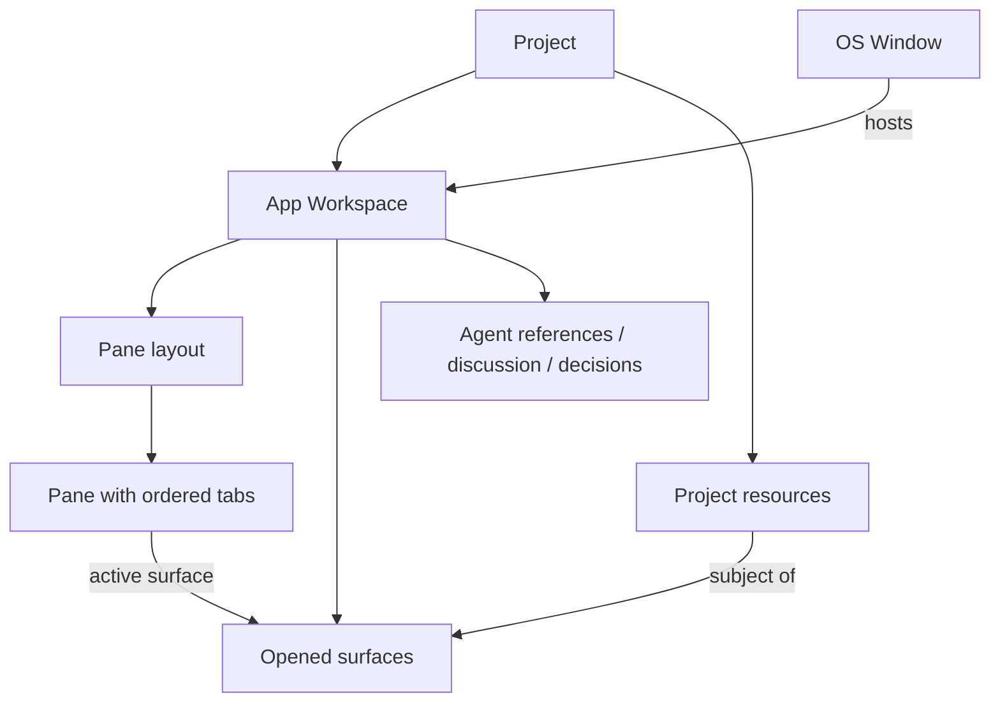
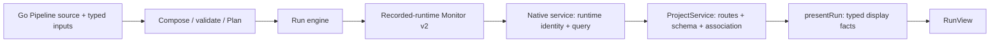
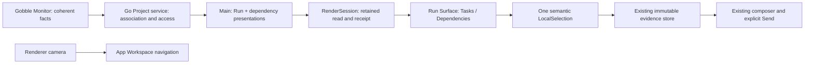
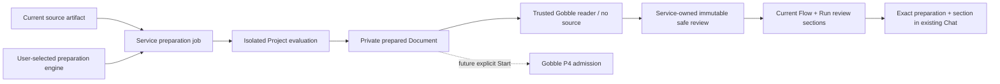

# Gobble App domain model and ownership

Updated: 2026-09-12. Pipeline origin, Current ownership and creation-draft storage now follow [P2B-2.1](../../../../../../docs/desktop-workspace/stages/p2b2-1-creation-storage/README.md). [P2B-2.2](../../../../../../docs/desktop-workspace/stages/p2b2-2-creation-check/README.md) adds profile-bound scaffolds, immutable candidates and complete creation checks. [P2B-2.4](../../../../../../docs/desktop-workspace/stages/p2b2-4-first-adoption/README.md) adds first adoption and retained birth ownership. [P3](../../../../../../docs/desktop-workspace/stages/p3-run-preparation/README.md) adds independently verified private preparation and exact Run review discussion. Earlier feature-stage references below remain historical. P1 implements Pipeline registration/source reading and a
focused presentation-lifetime boundary. The owner approved this first pipeline
collaboration stage after the [architecture/design review](../../../../../../docs/desktop-workspace/proposals/pipeline-collaboration/README.md).
See [P1 implementation](../../../../../../docs/desktop-workspace/stages/p1-foundation/README.md).
Earlier reference refinements remain supported. Parent: [workspace contract](project-workspace-contract.md).

## Definitions

| Concept                       | Meaning and identity                                                                                                                                                | Owns / does not own                                                                                                                                                                         |
| ----------------------------- | ------------------------------------------------------------------------------------------------------------------------------------------------------------------- | ------------------------------------------------------------------------------------------------------------------------------------------------------------------------------------------- |
| Project                       | Stable work and access scope (`projectId`). Currently registered against one canonical local root; it is not a Git repository, a conversation, a Pipeline, or a Run | Associations to registered Pipeline definitions, files, Runs, agents and app work state. Service owns root mapping. Future multiple roots require an explicit mapping design                |
| App Workspace                 | The Project's shared application work state. Current cardinality is one per Project, so no independent workspace ID                                                 | Open surfaces, pane layout, local selections, discussion draft/activity, attached-agent and decision references. Never execution checkpoints                                                |
| Execution workspace           | A filesystem directory whose `.gobble` control data identifies an engine Run                                                                                        | Engine-controlled execution facts, attempts, logs and artifacts. In code/API documentation always qualify this as execution workspace; existing engine CLI `--workspace` keeps its meaning  |
| Pipeline definition | Registered analysis identity within a Project (`pipelineId`, `pip_`), with imported or managed source origin | Native service owns registration. Imported origin names Project package/entry resources; managed origin names no Project files and requires a retained Current. Registration alone is not scientific validation. |
| Current source revision | One Pipeline-owned pointer to an immutable checked source artifact | Service catalog5 publishes it with an adoption receipt; Gobble supplies checked facts. Each Pipeline has an independent pointer. |
| Creation draft | Separate service-owned intent (`draftId`, `drf_`), optional input metadata observation and generation | A draft alone creates no Pipeline or Run. P2B-2.3 provides its shared View and exact discussion; P2B-2.4 User adoption closes it with an immutable birth mapping. Current may later advance while this creation history remains. |
| Graph                         | Immutable composed graph produced from the Pipeline builder                                                                                                         | Gobble's composition/validation model, not app layout                                                                                                                                       |
| Plan                          | Inspectable, validated pre-execution document for one composed graph                                                                                                | Gobble `BuildPlan` output. A saved Plan file can be read without running source. Producing a new Plan can compile/execute trusted Go and is a separate future operation                     |
| Run                           | Engine-owned execution identity and state in an execution workspace                                                                                                 | Run ID, status, attempts, runtime facts and execution metadata. UI/agent lifetimes never create or redefine it                                                                              |
| Run registration              | App-owned association (`runRef`) from a Project to an execution workspace, engine Run ID and pinned runtime                                                         | Native catalog mapping and display name. It is not a second Run checkpoint. Replaced Run/runtime is a conflict, not an automatic rebind                                                     |
| Authored task                 | Node definition in a composed graph/Plan (`task_id`)                                                                                                                | Definition-level dependencies. Several runtime instances may originate from one task                                                                                                        |
| Task instance / attempt       | Executed or expanded task identity (`identity`) and its numbered attempt                                                                                            | Logs and runtime state use instance + attempt. Monitor edges use authored task IDs; they must not be wired to instance rows as if those were the same nodes                                 |
| Resource                      | Addressable subject inside a Project                                                                                                                                | Current `ResourceRef`: file, Run registration, or task-instance attempt log. Reference is not content, permission, an open tab, or an immutable snapshot                                    |
| Surface (opened view)         | One Project-owned presentation of a resource (`surfaceId`)                                                                                                          | Resource reference, view kind, pin, opening actor, and display title. Repeated open normally reuses it; explicit duplicate makes another surface for comparison                             |
| Pane                          | Layout container for ordered Surface tabs and one active Surface                                                                                                    | Placement and active tab only. It does not know file paths, Run state, content decoding or provider credentials. Current layout has primary and optional secondary panes                    |
| Tab                           | UI selector and ordering entry for a Surface in a Pane                                                                                                              | Uses `surfaceId`; no additional tab identity is needed. Closing it closes that Surface, not its resource                                                                                    |
| Window                        | Native Electron OS window                                                                                                                                           | Size, position, focus and renderer lifecycle. Currently one primary window hosts the active Project's Workspace; a split Pane is not another OS window                                      |
| ReferenceTarget / EvidenceRef | Project + Resource + exact data revision + optional typed selector; EvidenceRef adds optional origin Surface provenance                                             | Durable address independent of open views. Explicit text/table/image coordinate spaces. Origin is never authority; a pointer is not captured content                                        |
| LocalSelection                | One open Surface plus an EvidenceRef                                                                                                                                | Per-view gesture state. Move preserves it; duplicate is independent; close removes the local binding without deleting shared marks or captured evidence                                     |
| Captured evidence             | EvidenceManifest plus immutable Project-local asset bytes                                                                                                           | Sent/question history remains readable after source or view changes. Missing assets are reported without substituting current source contents                                               |
| Render observation            | Ephemeral confirmation that this renderer session displayed a specific load generation/revision                                                                     | `RenderSession`; invalidated on hide, close, refresh, replacement or reconnect. Not persisted as permanent truth                                                                            |
| Agent attachment              | A named Project collaborator (`agentId`) with instructions and provider binding                                                                                     | Provider identity/conversation is distinct from Project, Surface and engine Run. Current code preserves references; live connections remain stage 4                                         |
| Discussion / decision         | Addressed collaboration and an explicit question/answer record                                                                                                      | Current discussion contains unsent draft/activity/local context. Decisions can retain evidence after a view closes. Sending and answering need stages 4/5                                   |

A file can be input data, source, a report or an engine-produced artifact. That
role does not change its preview into another ownership type. An Artifact is an
engine-declared output/provenance concept; merely opening a PNG does not create
an Artifact record. Future artifact/provenance views need engine-backed references.

## Containment and display

One resource may have multiple opened surfaces. A current surface belongs to
exactly one pane. Moving it keeps its identity and evidence; duplicating it gives
a new identity and independent local selection. A hidden tab remains open but
is not rendered-ready. Pin protects against future automatic replacement; an
explicit user close/move is still allowed. Closing the last view leaves an empty
workspace. Closing a Project view never edits its file or stops a Run.

The public UI uses familiar terms: Project, file, Run, view, tab and pane.
`Surface` is the precise internal name for an opened view, not an extra object
users must learn. The title is presentation metadata, not resource identity.
Persisted v1 stores titles alongside surfaces; one validator and writer enforce
the one-title-per-surface invariant. No new title registry is introduced.

## What a Pane displays

| Subject / request                  | Surface presentation                                                                                                         | Current or future                                                                                                                             |
| ---------------------------------- | ---------------------------------------------------------------------------------------------------------------------------- | --------------------------------------------------------------------------------------------------------------------------------------------- |
| Open `samples.csv`                 | `file` resource + `table` view with bounded CSV rows                                                                         | Current; row selection retains file content hash                                                                                              |
| Open `quality.png` / JPEG          | `file` resource + `image` view with decoded image dimensions                                                                 | Current; region coordinates are normalized against the original image                                                                         |
| Open text, Go source or saved JSON | `file` resource + `text` view                                                                                                | Current; reading source does not execute it, JSON is not automatically interpreted as a Plan                                                  |
| Open registered Run                | `run` resource + `run` view: Tasks/Dependencies modes, observed task instances and bounded authored group/pair graph or list | Current R3b2; projected from one pinned Monitor v2 read. Exact instance/attempt logs stay in a companion Surface                              |
| Open instance attempt logs         | `log` resource + `log` view using a read-only text presenter                                                                 | Current; exact instance/attempt and bounded tails, with their own display hash                                                                |
| Open a registered Pipeline         | Resolve its entry source to an existing `file` resource + `text` view                                                        | Current P1; no new Pane/resource kind. A Plan graph and a Run remain separate subjects; never guess a definition from a Run label             |
| Show a saved Plan as a graph       | A validated `plan` resource revision + Plan graph presentation                                                               | Future; consumes saved Plan data. No compose/start side effect from opening it                                                                |
| Agent-created result/report        | A registered Project file/resource and supported presentation, or a future bounded typed artifact                            | Future Agent call over the same controller. No arbitrary React component, JavaScript, native window command or privileged HTML from the model |

A view kind chooses a renderer; it does not create a new domain identity. Current
file views are selected from validated content. Alternative views of one file,
HTML reports, graphical Plans and arbitrary extension renderers are not current
capabilities. Add a closed typed presentation case only when that feature exists;
a plugin registry or inheritance hierarchy is not required now.

## Metadata owners and data flow

| Metadata                                                                            | Authoritative owner                                                         | App responsibility / code                                                                                                                                 |
| ----------------------------------------------------------------------------------- | --------------------------------------------------------------------------- | --------------------------------------------------------------------------------------------------------------------------------------------------------- |
| Project root, stable resource paths and Run registration                            | Native Go catalog (`internal/appservice/catalog.go`, `types.go`, `runs.go`) | Register/resolve under containment; never infer engine state from folders                                                                                 |
| Pipeline recipe/name, modules, typed configuration | Agent-authored source interpreted by Gobble; native catalog owns Pipeline identity/origin and Current | Typed Main service clients validate associations. App displays engine-qualified facts and stores View references; it does not derive execution authority from the diagram. |
| Graph/Plan and validation                                                           | Gobble `pipeline.go`, `graph.go`, `plan.go`                                 | Future compose/Plan adapter invokes compatible Gobble; previewing a saved Plan remains a read operation                                                   |
| Run ID/status, task instance/attempt, authored dependencies, observed Pipeline name | Pinned engine's Monitor (`monitor/snapshot.go`)                             | Go verifies identity and returns facts. Run name in the app catalog is only presentation/registration metadata                                            |
| Host service route/schema/response association                                      | `main/service/project-service.ts`                                           | One typed gateway for IPC and workspace resource resolution                                                                                               |
| Display-oriented Run metadata                                                       | `main/service/run-presentation.ts` and portable `RunPresentationSchema`     | Normalize naming once, retain unknown/missing as unavailable, preserve engine status strings. Never recompute execution state                             |
| File decoding and bounds                                                            | Native `files.go`                                                           | Return bounded text/CSV/image data and content revision                                                                                                   |
| Surface kind/title and pane placement                                               | `main/workspace/service.ts`, `model.ts`, controller                         | Resolve resource for display; commit layout. A RunView emits a log target; Pane decides where to open it                                                  |
| Ready/selection validity                                                            | `RenderSession` + `selection.ts`                                            | Validate current visibility/session/generation and exact source revision before local evidence use                                                        |
| Credentials and provider thread/turn metadata                                       | Official provider integration, stage 4                                      | Never stored in a pane, file-preview model, native Run catalog or engine checkpoint                                                                       |

App and Go metadata are deliberately not mirrored as two independently writable
truths. `RunPresentation` is a disposable read model. Pipeline name from Monitor
is an observation, not proof that two Runs share a definition/source revision.
The current dependency list is not an instance-expanded execution graph.

## Code boundaries and APIs

- `contracts`: portable domain records and validated message shapes. `project`,
  `agent`, `resource`, `file`, `run`, `surface`, `workspace`, `workspace-document`
  describe separate concepts; `service`, `workspace-bridge`, `bridge` describe
  transports; `result` is the shared error/envelope. The public barrel is one
  locator, not another implementation. Runtime dependency cycles are avoided.
- `ProjectServiceClient`: private process/HTTP lifetime and bounded transport.
  `ProjectService`: named routes, result schemas and response association.
  `ServiceResources`: resolves those domain resources into workspace displays.
- `WorkspaceController`: Project authorization, command ordering, revision and
  persistence. `model.transition`: pure user layout/state transitions.
  `WorkspaceStorage`: private atomic persisted state; `RenderSession`: ephemeral
  load tickets and ready observations. No generic command bus or DI container.
- `WorkspaceApp`/`Pane`: composition and placement. `FilesBrowser`/`RunsBrowser`:
  their own query/attach display lifetimes. `RunView`: typed read-only props and
  `onOpenLogs(LogTarget)` callback. File presenters own only rendering and selection.
- Unknown Surface lookup fails explicitly. Log construction uses `logResource`
  with `{runRef, instanceId, attempt}`. Resource equality has one shared owner.

Classes are reserved for lifecycle/state ownership or an injected I/O boundary.
Pure transitions, projections, selection checks and identity helpers are functions.
Split a file when its inputs, owner or reason to change differs; do not split each
small function into a file or add abstractions for unimplemented future providers.

## Compatibility and future Agent contract

Existing workspace/catalog JSON versions and native HTTP envelopes are retained.
In persisted ResourceRef v1, the legacy `taskId` key on a log contains the runtime
instance identity. Only `logResource` / `logTarget` interpret that legacy key in
new application code. A future public protocol revision may rename it with an
explicit recursive migration of surfaces, selections and decision evidence.

The bundled host/preload/renderer now exchange the typed Run presentation in the
workspace load response. This internal IPC model is rebuilt together; it is not
an independently versioned remote-client compatibility promise. The native
`runs.snapshot` HTTP/bridge remains the unchanged raw projection for existing
query consumers. Workspace storage contains references, not these loaded values.

A future Agent requests a registered resource and supported presentation; the
host authenticates its Project/actor, validates expected revision and pin policy,
then creates/reuses a Surface and selects its Pane. A separate ready acknowledgment
confirms what is visible. The Agent receives scoped evidence only through the
future observation/context contract. Opening a view neither grants source-write
permission nor starts analysis. No arbitrary native Window handle is exposed.

## Stage 4 collaboration ownership

An Account is app-profile sign-in owned by the official provider runtime.
An AgentAttachment is a Project collaborator with name, role instructions,
selected model/effort and an opaque provider binding. A provider Thread is that
attachment's private conversation; a Turn is work for one addressed input.
An app Submission is a durable record written before a Turn is requested.
A local account-session ID identifies a sign-in boundary; it is neither an
OpenAI account ID nor a credential. New sign-in never silently inherits an old
attachment's provider thread.

The WorkspaceController remains the single Project aggregate writer.
CollaborationStore exposes only roster and shared discussion changes; it cannot
change Surfaces or Pane layout. A consumed draft is cleared only if it still
matches the submitted text, in the same atomic commit as the submission.
The optional v1 collaboration section contains addressed user text, published
agent text and delivery evidence. Provider reasoning and tool internals stay
outside that section. Old v1 documents without the extension remain readable;
older apps reject the added fields and preserve their files.

CollaborationCoordinator owns per-agent admission, two-turn capacity, stream
association, persistence-before-send, targeted interrupt and reconciliation.
Its account/provider/store ports belong to the application, not the Codex adapter.
CodexTransport owns the child, framing, pending request timers and disconnect;
CodexConversations decodes the pinned protocol into the application ports;
CodexAccount owns account/catalog queries and official browser login. The host
composes them and throttles renderer status updates. There is no event bus or
container for unimplemented providers.

A terminal provider status is evidence of a Turn outcome. An interrupt response
alone is not. Missing history does not prove non-delivery. Explicitly starting a
new conversation can close an unresolved record as `abandoned`, whose provider
outcome remains unconfirmed; it never resends that input. Stream deltas are
transient, completed text/outcomes durable. Saved running records on restart
require Check status, not automatic provider input.

Stage 4 sends only typed text to one Agent. Opening/selecting a Resource does
not transmit it, expose other Project discussion, or authorize analysis. Account
changes do not change the Project, panes or engine Runs. Scoped shared-view tools
and image/selection delivery remain stage 5 and require their own acceptance.

An app dialog (account sign-in or agent settings) is transient UI, not a Resource,
Surface or Pane. It is not persisted as Project layout or opened by an Agent's
workspace tool. AccountPanel/AgentEditor and ProjectBar/AgentMenu own their respective content;
renderer/ui/ModalDialog owns native
modality, body-portal placement, Escape/close and trigger-focus restoration.
A native modal layer changes visual stacking but does not isolate ancestor CSS;
placing dialogs outside navigation DOM preserves the shared control styling.

Stage 5's proposed distinction between local selection, draft attachment, prepared
evidence, observation and answer delivery is documented in the
[shared-context proposal](../../../../../../docs/desktop-workspace/stages/05-shared-context.md).
The user approved this design; implementation and verification are tracked by the dated checkpoints below.

The 2026-09-07 stage 5 UI revision keeps questions as durable domain records but
presents them as ordinary Agent chat messages. The right-side Project chat has
one timeline and one composer; a quoted reply target identifies the question.
Draft autosave does not answer it. A chat region is not a Resource Surface or an
additional Pane. Central Panes default to upper/lower placement, with stable
primary/secondary identities and explicit v2 geometry migration. See the
[revised design](../../../../../../docs/desktop-workspace/stages/05-shared-context.md).

## 2026-09-07 · Stage 5.1 implementation checkpoint

The user approved stacked central resource Panes and a right Project chat with one
composer, and requested communication tools usable by both User and Agent. The first
implementation slice introduces WorkspaceDocument v2 (`paneOrientation: vertical`,
chat width), immutable v1 migration backup, actual mounted-Pane reporting and a dedicated
renderer/chat owner. The Workspace Pane graph and native service contracts remain v1.
User/Agent pointing shares `EvidenceRef` + `Selection` with author-separated shared references;
Agent marks must not overwrite local selection. Text ranges, table row/column IDs and
normalized image regions refer to exact source revisions. Semantic Plot point/axis selection
needs a future interactive Plot resource contract. The accepted initial Agent tool transport
is official Codex dynamic tools through the application-owned port; MCP remains a future
adapter. These tools/overlays/attachments/replies are the subsequent implementation slices.

Current evidence and next checkpoint: [Stage 5.1](../../../../../../docs/desktop-workspace/stages/05-1-chat-foundation.md).

## 2026-09-07 · Stage 5.2 shared pointing

A SharedReference is a Project-owned, authored pointer to `EvidenceRef` + optional `Selection`.
It captures a display label, note, creation time and (for an Agent) its originating public
submission. It contains no source bytes. A local Selection remains editable and private;
`Share selection` publishes explicitly without sending a message. Retraction removes a mark
while preserving history. Closing its Surface does not erase the reference or its label.
Reveal resolves the resource and highlights only the original revision; old coordinates are
never applied to a changed resource. A static Plot region addresses normalized image pixels.

`contracts/shared-tools` owns the provider-neutral inputs. `main/shared-context` owns catalog,
protective view policy, bounded preview materialization and invocation receipts.
CollaborationCoordinator authorizes a callback from the active submission/account/thread/turn
and revokes it on Stop, disable, disconnect or completion. CodexConversations only projects
that port onto generated 0.153.4 dynamic-tool schemas. WorkspaceController remains the sole
Project writer; RenderSession owns acknowledgment identity, not durable observation history.
The renderer owns interaction and labelled overlays, never Agent identity or source authority.

Account and settings dialogs acquire an app-window interaction block before entering native
modality. The foreground, visible window plus current mounted Surface acknowledgment authorize
preview observation; opening a tab alone does not. Image results are generated from loaded
resource bytes, cropped by normalized selection and bounded before provider delivery.
A result retry revalidates its original lease. No desktop screenshot or unrelated window enters
this path. The official runtime's isolated orchestration string/image conversion is pinned in
the adapter instruction and verified separately from UI fixtures.

Existing conversations default to Messages only. Shared-view opt-in starts a new conversation
because tool registration occurs at thread creation, retaining earlier public history. Disabling
revokes tools and interrupts owned work. A reconciled earlier running turn has no replayed tool
session. A new submission is required for new shared-tool authority. Addressed immutable
attachments/evidence and question replies remain 5.3/5.4, separate from these shared pointers.

Implementation and current evidence: [Stage 5.2](../../../../../../docs/desktop-workspace/stages/05-2-shared-pointing.md).

## 2026-09-07 · Stage 5.3 addressed evidence

DraftAttachment is a Project-draft-owned copy of an EvidenceRef, with its own identity, label and
creation time. PreparedEvidence is session state containing exact bounded bytes for that attachment
intent, recipient configuration, account and workspace session. Editing message text does not alter
attachment content. Changes to recipient/model or attachment membership invalidate preparation.
Sent evidence is a manifest inside its addressed Submission plus an immutable content-addressed
asset. A closed Surface or changed original source does not erase or reconstruct that content.

The App owns this entire sharing lifecycle. The native service continues to own contained resource
reads and Gobble continues to own engine/Run truth. `main/evidence` separates draft transitions,
materialization, immutable byte storage and temporary preparation. WorkspaceController alone commits
the Submission, its manifests and matching draft consumption. Collaboration owns admission and
delivery recovery; CodexConversations maps the provider-neutral text/image input. The renderer owns
only explicit attachment actions and inline previews in the existing composer/message timeline.

Send revalidates source versions after storing bounded assets and immediately before acceptance.
It never substitutes current source, drops an attachment, changes recipient or replays a message.
Only accepted immutable bytes are sent. Missing/corrupt historical assets are visibly unavailable.
An explicit message can deliver attachments to a Messages-only Agent without granting shared tools.
Prepared tokens expire and do not survive restart; draft references and sent evidence do.

The accepted bounds are 16 attachments, two images, 64 KiB combined text, 1 MiB encoded image bytes,
1536-pixel image edge, 4 MiB delivery and 64 MiB physical Project evidence quota. Historical deletion
and future paginated history need their own storage/lifecycle revision. Questions/replies remain 5.4.

Implementation, actual Agent consumption and restoration: [Stage 5.3](../../../../../../docs/desktop-workspace/stages/05-3-addressed-evidence.md).

## 2026-09-07 · Stage 5.4 inline questions and reply ownership

A **Question** is the evidence-backed `kind: question` variant in the Project's
existing Decision collection. It is projected as an ordinary Agent message, with
immutable evidence manifests and optional plain-text suggestions. The foundation
Decision schema remains a frozen compatibility shape; it is not upgraded by
inventing missing snapshots or provider origin records.

A **reply target** is the current draft's question link. It binds the requesting
Agent only after explicit Reply and preserves typed text/attachments. Cancel reply
removes that link; Dismiss changes question state without sending. Autosave never
creates an answer. An **answer** is the existing addressed Submission referenced by
an answered Question, with its independent provider delivery outcome. There is no
second writable answer body or Questions database. Acceptance commits the answer
link, Submission and matching draft consumption through WorkspaceController.

QuestionService owns turn-scoped observation receipts, question creation and
source dependency checks through narrow QuestionTools/QuestionReplies ports.
EvidenceStorage owns saved bytes; the native service still owns contained resource
reads; Gobble still owns execution facts. QuestionMessage and ReplyTarget have no
input/submit flow. ChatComposer remains the sole editable message owner.

Only an Agent's active observations and evidence received in the same provider
conversation authorize question references. Evidence explicitly delivered with a
reply also counts, including after the user starts a replacement conversation for
that Agent. Shared UI visibility alone does not expose another peer's messages or
attachments. The `shared-views-v2` registration requires explicit replacement of
older shared bindings; public history and pending questions remain.

[Stage 5.4 record](../../../../../../docs/desktop-workspace/stages/05-4-inline-questions.md)
contains limits, state transitions, author review and verification evidence.

### First response order and reading position (5.5)

Submission remains the sole owner of addressed input, evidence, response and delivery.
New records have `responseStartedAt: null` until Main commits the first nonempty response.
A numeric value fixes that response's position in the Project chat projection. Later
streaming, completion and reconciliation retain it. The value is local first receipt,
not provider generation time. Old records lacking the field retain their paired
presentation; migration never fabricates their missing arrival times. The v1 reader
remains frozen. Ties among unlike events resolve by stable ID.

ChatTimeline projects user and response items that refer to the same Submission;
SubmissionMessage owns their content and delivery controls. useChatScroll owns transient
follow/latest, unread and item-offset reading state. It observes both viewport and
content size. Neither owner writes another message store or persists scroll pixels.
Switching Project remounts this reading state; hiding a region preserves it and the
single composer. Errors remain at Project shell level, visible in either compact region.

Toolset renewal is one shared predicate used by composer, Agent settings/sidebar,
coordinator and provider adapter. Disabling shared access revokes calls but does not
rewrite old registered provider tools. An old binding still requires explicit new
conversation; earlier Project history is retained. Model and recipient changes block
Send while their requested setting is being committed; they never trigger a delayed send.

Stage 5.6a moves Agent membership/status/settings into the right chat header and
keeps recipient selection beside the sole composer. ProjectChat owns pending
recipient changes shared by those entry points; it does not own Agent storage.
ProjectBar owns one Project identity/switcher and Account access. Sidebar owns
Files/Runs; useExplorer owns window-local visibility and the compact drawer's
interaction/focus guard. Hiding a region preserves its mounted state. No Project,
Run/Pipeline, evidence, provider or host authority moves into these UI controls.
[Implementation and evidence](../../../../../../docs/desktop-workspace/stages/05-6a-structure.md).

Stage 5.6b locates local selection actions beside the loaded source. SurfaceView owns
current-version readiness; selections/SelectionToolbar emits attach/share/clear intents,
and SelectionMenu only locates saved selections. WorkspaceApp owns compact-region and
focus routing. ModalDialog.onAfterClose finishes dialog cleanup before that routing; Pane completes the transient focus intent after host-confirmed presentation mounts its tab. Neither owner writes another selection or evidence store.

AttachmentList opens saved evidence in ModalDialog + EvidencePreview. This overlay is
not a Pane, Surface, live Resource or second input; it has no presentation lease and
blocks shared-view observation while obscuring the workspace. Preview request kind
continues to distinguish prepared content, sent evidence and saved question evidence.
Close/Escape restores focus without modifying the draft or viewport geometry.

PaneActions owns temporary action disclosure, not layout facts. EmptyPane emits browse
or move intents to existing owners. Chat activity groups are read-only consecutive
routine-event projections with the first source event's scroll identity. Unknown
activity, questions, messages, errors and shared marks remain independent. Authored
marks preserve source, author, selection, full note and Reveal; retraction remains an
explicit history-preserving action. No Gobble engine, Run/Pipeline metadata, IPC,
provider or persistence boundary changes.
[Implementation and evidence](../../../../../../docs/desktop-workspace/stages/05-6b-communication.md).

## 2026-09-08 · R3b2 dependency navigation ownership

A dependency overview is a presentation of observed Run facts, not a new Resource, Plan or
execution graph. Its group key is the authored Task ID; its edge key is the directed pair of
those IDs. Group member rows identify exact runtime instances and attempts. Counts describe
returned facts only; missing membership, unknown flags and partial topology stay explicit.

The Run Surface persists mode, task filter, dependency query/representation and camera. Camera
updates have a separate command from search/representation; late scrolling cannot overwrite a
new query. Main validates exact target, current observation and render authority before capture.
Pane owns log placement. Dependencies that exceed the retained-view budget are omitted while an
admissible Tasks observation remains usable. Renderer geometry never assigns IDs or status.

Workspace v9 activates local v4 dependency targets and frozen attachments; v1–v8 storage readers
and published v1–v10 bundles remain frozen. Agent v6 inputs stay at v2/v3; new graph references,
Agent marks and temporary Show/Return are R3b3. See the
[checkpoint and verification](../../../../../../docs/desktop-workspace/stages/r3b2-user-navigation.md).

## Pipeline collaboration boundaries

The current entry-source binding is not an immutable source revision. A future
source revision retains the exact multi-file manifest; an Agent-authored change
set links base and candidate; a Plan artifact records Gobble validation against
those bytes and declared bindings. Execution authorization names the exact accepted
Plan and effects. Operations belong to the Go service and engine, not the App
workspace. Those concepts are specified in the approved direction but their
capabilities arrive in separate owner-reviewed stages.

P1 stores Pipeline definitions and their registration receipts in service catalog
v2. Strict v1 migration preserves the original bytes before the first update. UI
Workspace v14 and reference semantics remain unchanged. Current schema bundle v17
adds the registration contract without rewriting frozen bundles.

PresentationState owns transient render leases, reference sessions, observed
reference views and table snapshots as one lifetime unit. WorkspaceController
remains the sole durable writer, including chat/evidence transactions, Project
checks and visibility epochs. Opening a Pipeline source uses this existing path;
no analysis state or secondary save queue belongs in PresentationState.

## 2026-09-12 · P3 preparation and shared review

**Preparation** is an immutable service operation tied to one Current artifact, retained source revision, selected-input metadata observation, exact preparation runtime and fixed serial scheduling. Its request identity admits replay, never a second evaluation. A ready **Run review** is the safe, engine-verified projection of one private prepared payload. It is not a Run, launch intent, Current pointer or UI workspace snapshot. Changed preconditions make a prior review historical without rewriting its data or sent references.

The **prepared payload** is Gobble's private versioned complete engine Document plus binding. Public Plan JSON and a rendered Flow omit executable fields and cannot serve as launch authority. After isolated Project evaluation, a separate trusted reader decodes and qualifies the sealed bytes without mounting source, regenerates safe Flow/settings/resources, and rejects discrepancies with the evaluated description or Current. The service stores opaque payload bytes privately; it never interprets executable semantics. P3 qualifies App-created single-end Trim Galore → FastQC and refinements only.

Preparation engine identity is independent of Current's earlier inspection engine. Selection never rewrites that historical source binding. The service resolves the local engine's actual daemon/image/mapping and checks it during preparation; the renderer supplies no arbitrary endpoint or command. Input identity here proves a metadata observation only. Actual data staging, content validation, tools, workspace occupancy and admission of the exact reviewed digest belong to P4.

`PipelineReviewContext` can address an exact preparation and optional Data/Settings/Environment section. Main resolves that saved artifact and controls scoped Agent observation/pointing. Discussion grants no adoption or execution; explicit author permission is restricted to Current or a fresh preparation. Independent Agent marks require reading the same saved review first and retain their originating submission. WorkspaceController alone writes Chat references and marks; the native service alone writes preparation history. The renderer owns transient section disclosure, engine choice and pending request identity.

Current persistence is Workspace19 / bundle24 / catalog5 / toolset13. Workspace18 and published bundle23 remain frozen; migration preserves original storage bytes. Subsequent Start/Stop must introduce a separate durable launch intent and reconciliation contract, not a flag on the App Workspace or an automatic effect of Prepare.
