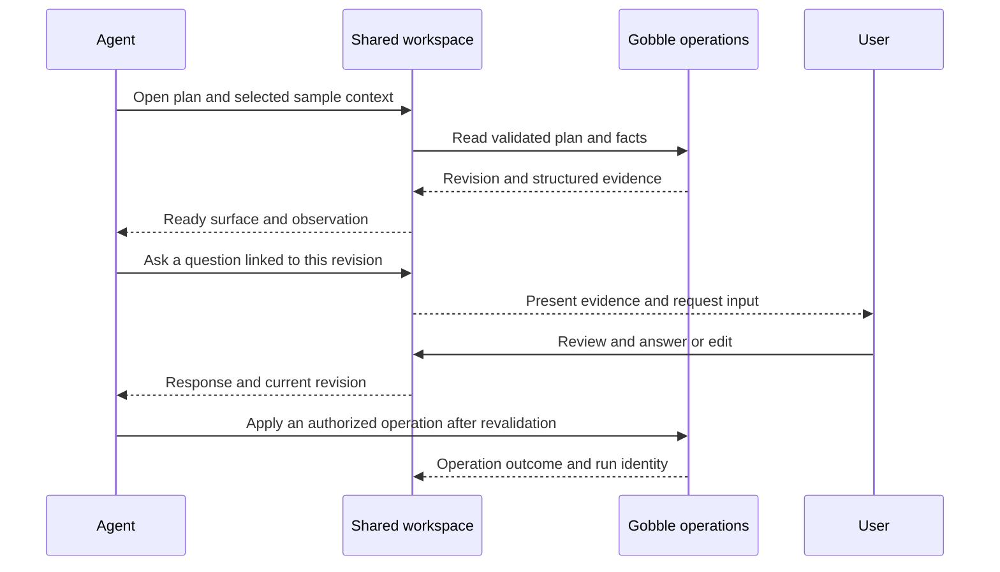

# Gobble — Agent-Centered Workspace

Updated: 2026-09-06. Agent-centered interaction is a user-selected product
principle. Layouts, surface APIs, and attention rules below are proposals to
review with the user before UI implementation. These capabilities are not
implemented by the current CLI or guaranteed by Codex App Server alone.

Related: [Application architecture](../architecture/application.md),
[Project roadmap](../roadmap/project.md), [Inspection](inspect-run.md),
[Recovery](recover-run.md).

## First product outcome

Create a local workspace where a person and an agent design, execute, control,
and monitor bioinformatics pipelines together. Gobble supplies the core Go
engine; the application makes its source, plans, execution facts, and artifacts
available as shared working material. The Linux CLI remains independently usable.

The agent can open the relevant view, select a sample or task, inspect evidence,
show alternatives, ask for a decision, and continue from the user's response.
People can manipulate the same views and operate a run directly. Agent-centered
describes this collaboration model, not the physical size of the chat panel.

VS Code is a reference for a persistent workbench with documents and tools.
The Gobble layout must be designed around analysis decisions, long-running work,
and results. Its first UX should be evaluated as a whole, including how agent
actions change the workspace, instead of assembling screens independently.

## Interaction principles

1. **Bring evidence to the discussion.** Link statements and questions to the
   exact plan revision, selected rows, task attempt, log range, or artifact.
2. **Let the agent use the interface.** Opening, selecting, comparing, observing,
   and requesting feedback are explicit app capabilities with observable results.
3. **Keep the user in control of attention.** Preserve pinned views and unsaved
   edits; make agent activity visible without repeatedly moving keyboard focus.
4. **Separate presentation from execution.** Opening a plan does not start it;
   closing a view does not stop a run; answering a scientific question does not
   implicitly authorize unrelated changes.
5. **Use engine facts as evidence.** A visible chart or agent statement is not
   proof of task completion. Execution state comes from Gobble; interpretations
   remain distinguishable from measured and recorded facts.
6. **Preserve continuity.** Reopening the app restores relevant work and pending
   questions. Existing monitoring and Stop/Resume stay available without a model
   response, account connection, or active conversation.

## Workspace structure to discuss

Use one shared workspace with a persistent conversation, a contextual work area,
and accessible run controls. The work area can contain source changes, sample
tables, plans, logs, plots, images, and reports. Project/run navigation remains
available while the agent presents a particular piece of evidence.

| Layout candidate | Structure | Strength and tradeoff |
|---|---|---|
| Shared analysis workspace — recommended | Main work area with tabs/splits, persistent agent conversation, compact project/run navigation and status | Enough room for tables, graphs, and comparison; requires clear focus and view-lifetime rules |
| Conversation-led workspace | Main conversation containing results/cards that expand into an adjacent view | Direct question-to-answer flow; long analyses can bury evidence and make comparison harder |
| Free canvas | Movable analysis views and conversation objects | Flexible spatial comparison; adds layout management and discovery work |

Begin discussion with the shared analysis workspace. Compare it with the
conversation-led alternative using the same pipeline and recovery scenarios.
Exact positioning, dimensions, visual language, docking behavior, and shortcuts
remain open. Do not equate agent-centered design with a fixed IDE clone.

Here, a **surface** is a managed application view. Start with tabs and split
panels inside one window. Detachable native windows can serve large reports
and multiple monitors; whether they belong in the first release is a separate
UX decision. An agent's request to open a surface need not create an OS window.

## Two purposes for agent-opened views

| Purpose | Example | Observable outcome |
|---|---|---|
| Present and discuss | Open the sample table beside validation findings and ask which sample identifier is intended | Ready view plus a question linked to the selected rows and source revision; an explicit user response |
| Inspect and verify | Open a task's error/log view or a QC report to investigate a result | Structured observation, and a scoped rendered capture when needed, tied to its source and observation time |

An inspection may run in an agent-owned background surface so it does not
replace what the person is reading. Its activity remains discoverable. A
presentation marks the relevant view and invites attention; a minimized app or
background tab must not be recorded as evidence that the user has seen it.
Only the user's response completes a request for input.

Prefer structured observations for engine state, tables, selections, and
available actions. Use a scoped screenshot for information that depends on
rendering, such as a plot or report layout. A capture does not prove scientific
validity, replace full data, or imply a model has actually read the image.
The Codex bridge must demonstrate that the returned observation or image is
consumed by the agent; verify the exact tool/result transport during integration.

## Proposed surface and decision contract

These conceptual operations define behavior to discuss, not a committed SDK.

| Capability | Proposed behavior |
|---|---|
| Open or reuse a surface | Identify a supported view kind and a project/run/artifact reference; return a stable surface ID and loading/ready/error state |
| Update a surface | Select a sample/task, filter a table, or compare named revisions through typed view actions |
| Observe a surface | Return its rendered revision, selected context, data freshness, and bounded structured content; optionally capture that surface |
| Request a decision | Attach a question and options or free-form input to specific evidence and proposed effects; return a request ID while awaiting the user |
| Receive a decision | Record the user's response, linked request, and revision; revalidate affected state before applying it |
| Close or release a surface | Release an agent-owned temporary view while preserving pinned views and unsaved user work |

Each action carries project scope and a request identity. Return acknowledgments
for actual outcomes: requested is different from rendered, and rendered is
different from user-reviewed. Repeated tool delivery should reuse the intended
surface or decision request rather than create duplicate tabs and questions.

A decision remains pending, answered, dismissed, or invalidated. Link it to the
evidence version and record its relationship to subsequent operations. If the
agent session ends, a pending decision remains recoverable. Silence, timeout,
or a closed pane is not an affirmative answer. If source, plan, or selected
inputs change while awaiting an answer, show the change and renew the decision
when its original meaning no longer holds. Ordinary live progress updates need
not invalidate an unrelated question.

Opening and inspecting supported project views can proceed within existing
authorization without a confirmation for every panel. Applying source changes
and executing analysis follow the user's established authorization and the
shared operation rules. Questions gather missing domain intent; they must not
become repetitive approval steps for already authorized work.

## Example interaction to validate

This is an illustrative RNA-seq journey, not a claim that a specific fixture
currently contains these input defects or QC results.

| Moment | Agent action | User experience and execution boundary |
|---|---|---|
| Design | Open sample metadata and highlight an ambiguous input mapping; ask a concrete question | Inspect the same rows and answer or edit; the answer remains linked to that source revision |
| Review | Open the validated DAG alongside a source/configuration difference | Compare intended stages, inputs, resources, and outputs before the authorized run |
| Execute | Submit the shared Gobble operation and open its run surface | See preparation, sample progress, and persistent controls for that exact run |
| Investigate | Open a task attempt's logs or an available QC artifact; read the facts and inspect the rendering if relevant | See cited evidence and the agent's interpretation, then discuss changes |
| Recover | Present unfinished work and a Resume impact preview | Stop or Resume directly or through the agent; closing the view never changes run lifetime |

The diagram is a logical interaction, not a new network protocol. The existing
application service and provider adapter remain responsible for routing.

## Ownership and bounded autonomy

The application owns surface lifecycle, layout, selection, and pending user
decisions. Its workspace controller mediates both user actions and agent UI
tools. The engine owns plans, runs, attempts, and recovery; it must not depend
on React, Electron, conversation state, or open windows.

Use separate adapters for **workspace interaction tools** and **Gobble execution
tools**. The first opens/observes views and receives user input; the second
queries or changes analysis through shared Go operations. Neither gives the
renderer or model unrestricted Electron IPC, arbitrary JavaScript evaluation,
Docker socket access, or control of unrelated applications.

Initially support an explicit set of React surface types. Existing local HTML
reports need an isolated viewer with no privileged preload or native bridge;
declare required assets and navigation behavior. Agent-provided text and tool
output render as data. Agent-authored executable UI, arbitrary websites, and
general OS computer use need separate designs. Electron's isolation guidance
applies to any report or external content that is loaded.
[Electron security](https://www.electronjs.org/docs/latest/tutorial/security)

Respect user pinning and manual focus. Reuse a view for repeated updates, keep
background observations from stealing focus, and avoid immediately reopening a
view the person dismissed. Show a compact reason when the agent opens or changes
a view. Provide keyboard access and an activity history sufficient to understand
what was shown, observed, asked, and answered.

App restart restores surface references and pending decisions independently of
provider history. UI crashes or unavailable renderers return an explicit
unavailable result to UI tools; they must not become successful observations or
stop accepted runs. Missing/deleted artifacts, stale data, and unsupported view
capabilities remain explicit. A screenshot observation and its transmission to
the model follow the visible context-sharing rules in the application design.

## Discussion and acceptance

Before building the first screens, review low-fidelity layouts and the example
journey with the user. Decide the starting layout, attention behavior, supported
surface types, decision placement, and whether detached windows are necessary.
These UX choices remain open despite the selected Electron and React stack.

The first integration proof must demonstrate the agent opening a real
Gobble-backed surface, consuming its observation, asking a contextual question,
and receiving the user's answer. A chat response alone is insufficient. Follow
with a real fixture-backed run, control, monitoring, and recovery journey.

Acceptance also covers duplicate open/decision requests, delayed rendering,
manual edits while a question is pending, dismissed or pinned views, unavailable
captures, agent interruption, and reopening the app. Linux CLI inspection and
recovery must continue to work without any UI session.
