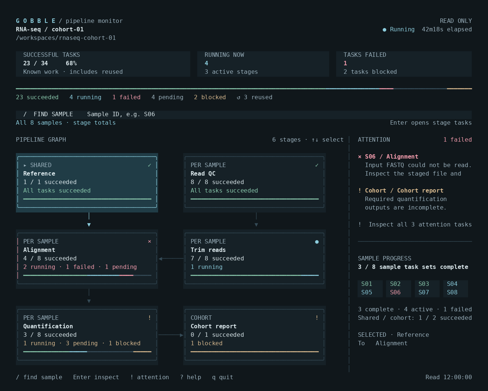

<div align="center">

# Gobble

**Design pipelines with a coding agent. Run them locally. See what is happening.**

[](https://github.com/HahyeonJeon/gobble/actions/workflows/test.yml)
[](LICENSE)
[](CHANGELOG.md)

[Get started](#get-started) · [Pipelines](#bioinformatics-pipelines) · [Monitoring](#see-your-run) · [Documentation](#documentation)

</div>

Gobble is a Go pipeline engine for local bioinformatics work. A coding agent or
Go developer assembles the steps, inputs, outputs, and resources. Gobble runs the
work, records what happened, and reuses compatible completed tasks when you resume.

- **Composable pipelines** — connect reusable modules, branches, and parallel tasks.
- **Local execution** — run tools in Docker with declared resources and local files.
- **Visible progress** — follow the pipeline graph, search samples, and inspect failures.
- **Recoverable work** — inspect attempts, validate outputs, and selectively rerun work.
- **Shareable runners** — pack one pipeline into a binary an operator can use without Go.



*Actual terminal renderer with illustrative fixture data. See
[Monitoring](docs/monitoring.md) for controls and state meanings.*

> **Development preview:** this branch contains the pipeline family and terminal
> monitor planned for the next release. Published `v0.1.0` predates those features.
> Current execution support is **Linux/amd64**. The accepted v0.2.0 default is
> **Docker-based installation and agent-driven authoring**, with direct Linux
> installation for advanced users. The launcher is implemented; Docker and Windows execution still
> require validation; see the [installation design](docs/v0.2.0/container-installation.md).

## Get started

| Installation | Who it is for | Setup |
|---|---|---|
| **Docker + Gobble launcher (default)** | Beginners and users working with a coding agent, including Windows | [Prepare the Docker preview](distribution/runtime/README.md) |
| Direct Linux | Advanced users who manage Go, Git, and analysis tools themselves | [Linux installation](docs/installation.md) |

The Docker runtime includes Go and Git. Your agent works with ordinary local
files; Gobble runs the pipeline inside the selected runtime. Release images and
installers are not published yet: the linked preview guide builds them with
Docker. Windows Desktop execution remains a release validation gate.

After preparing the launcher:

```sh
gobble init my-pipeline
cd my-pipeline
gobble doctor
gobble plan .
gobble run . --workspace runs/hello
gobble inspect run --workspace runs/hello
```

Open `runs/hello/results/sequence-count.txt`: it contains **2**. The generated
project includes a tiny FASTA input and instructions for your coding agent.
[Hello Gobble](examples/hello/README.md) explains inputs, outputs, selective
reruns, and packing a runner.

## Work with your coding agent

Give your agent the analysis goal, sample files, reference organism/build,
available CPU and memory, and desired outputs. Ask it to:

1. Select or assemble a pipeline and explain its inputs and analysis choices.
2. Validate it and show the execution plan before starting.
3. Stage local inputs and check the required tools and resources.
4. Run the pipeline, open its monitor, and explain any failed tasks.

The agent writes ordinary Go using Gobble's library and invokes the CLI. Gobble
currently does not bundle an AI agent. Customization belongs in your project's
pipeline/configuration code. See [Authoring](docs/authoring.md).

## Bioinformatics pipelines

| Pipeline | What it runs | Guide |
|---|---|---|
| Whole-genome sequencing | BWA/GATK germline workflow through an unfiltered joint VCF | [WGS](assets/pipelines/wgs/README.md) |
| Bulk RNA sequencing | STAR-Salmon, quantification, and cohort QC | [RNA-seq](assets/pipelines/rnaseq/README.md) |
| DNA methylation sequencing | Directional Bismark/Bowtie2 workflow | [Methyl-seq](assets/pipelines/methylseq/README.md) |
| Chromatin accessibility | BWA, MACS2 peaks, consensus counts, and cohort QC | [ATAC-seq](assets/pipelines/atacseq/README.md) |
| Single-cell RNA sequencing | Simpleaf, QCatch, and matrix assembly | [scRNA-seq](assets/pipelines/scrnaseq/README.md) |

These pipelines require Docker, prepared samplesheets, and staged reference/data
files. Each guide describes configuration and outputs. The engineering tests do
not establish scientific or clinical validity. Exact reference workflows,
versions, and evidence are in [Products](docs/products.md) and
[Provenance](docs/provenance.md).

## See your run

Open another terminal and use the same command that started the run:

```sh
gobble watch --workspace runs/hello
```

The dashboard starts with the graph and overall progress. Press `/` to search a
sample, `!` for problems, and Enter to inspect tasks. Press `q` to close the
monitor while execution continues. The small Hello example finishes quickly;
longer pipelines make the live progress view useful.

For agents and scripts, use structured output:

```sh
gobble inspect monitor --workspace runs/hello
gobble inspect errors --workspace runs/hello
```

Process and Docker task logs are collected into attempt files while work runs.
The monitor reads those files without owning the run. Docker collection is
covered by hermetic tests; actual Docker execution remains a release gate.

## Stop and resume

Run `stop` from another terminal, or press **Ctrl+C** in the run terminal.
Completed results remain available. Resume reconciles the previous owner and
reuses valid completed tasks:


```sh
gobble stop --workspace runs/hello
gobble inspect run --workspace runs/hello
gobble resume . --workspace runs/hello
```

Stop reports `settled` only after termination is known. A `requested` result
means its wait ended before settlement; repeat Stop or inspect the run.
Advanced users can still use Release to reconcile and close a run lock.
Resume reuses valid completed work and reruns unfinished or changed tasks. It
restarts tasks, rather than continuing inside an interrupted analysis tool.
For a fully completed unchanged run, there may be nothing to resume.

If backend state is unknown, restore Docker access and follow the
[recovery guide](docs/operations.md#recovery). Closing the run terminal is not a
supported detached-execution mode. State is published as
[complete checkpoints](docs/checkpoints.md). Docker submissions now record the
owning engine and container ID before starting work; see
[Docker execution and recovery](docs/docker-execution.md) for the tested
boundaries and remaining live validation.

## Share a pipeline

From a clean, committed checkout:

```sh
./bin/gobble pack ./examples/hello --output ./bin/hello-runner
```

An operator can run `./bin/hello-runner run --workspace DIR` with staged inputs,
without Go or a package operand. The runner targets Linux/amd64 and still needs
the tools or Docker used by its pipeline. See the
[example guide](examples/hello/README.md).

## Documentation

| Start here | Details |
|---|---|
| [Installation](docs/installation.md) | Choose a revision and set up an agent-owned project |
| [Authoring](docs/authoring.md) | Samplesheets, typed configuration, modules, and outputs |
| [Operations](docs/operations.md) | Environment preparation, run lifecycle, and recovery |
| [Monitoring](docs/monitoring.md) | Dashboard, sample search, task details, and shortcuts |
| [Provenance](docs/provenance.md) | Pinned tools/data, reference workflows, and test evidence |
| [v0.2.0 review and plan](docs/v0.2.0/review.md) | Findings, proposed designs, and sequential improvements |

## Development

Resolve dependencies once, then run the local suite:

```sh
go mod download all
GOTOOLCHAIN=local GOPROXY=off go test -count=1 ./...
go vet ./...
```

[Docker tests](tests/docker/README.md) describe Linux userspace checks and the
separate real-container smoke suite. Windows/WSL requires its own validation.

Gobble is pre-1.0 and its public API may change. Current supported execution is
trusted local Linux/amd64; cloud, cluster, and remote execution are future work.
Pipeline code and container images must be trusted. Data and run state remain
local; Gobble does not provide an account or hosted analysis service.

Gobble is [MIT licensed](LICENSE). Pipeline tools, images, and datasets retain
their own licenses. See [Changelog](CHANGELOG.md) for release history.
