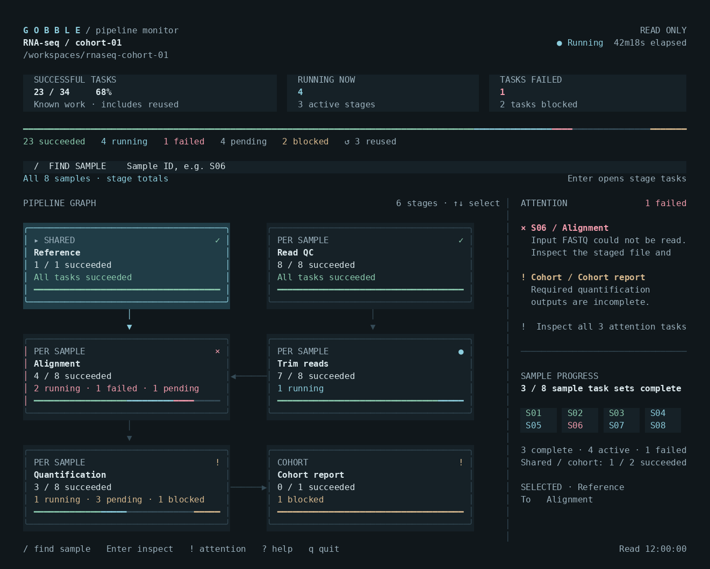

<div align="center">

# Gobble

**Design pipelines with a coding agent. Run them locally. See what is happening.**

[](https://github.com/HahyeonJeon/gobble/actions/workflows/test.yml)
[](LICENSE)
[](CHANGELOG.md)

[Get started](#get-started) · [Try test data](docs/tutorials.md) · [Pipelines](#bioinformatics-pipelines) · [Monitoring](#see-your-run) · [Documentation](#documentation)

</div>

Gobble is a Go pipeline engine for local bioinformatics work. A coding agent or
Go developer assembles the steps, inputs, outputs, and resources. Gobble runs the
work, records what happened, and reuses compatible completed tasks when you resume.

- **Composable pipelines** — connect reusable modules, branches, and parallel tasks.
- **Local execution** — run tools in Docker with declared resources and local files.
- **Visible progress** — follow the pipeline graph, search samples, and inspect failures.
- **Recoverable work** — inspect attempts, validate outputs, and selectively rerun work.
- **Shareable runners** — pack one pipeline into a binary an operator can use without Go.



*Actual terminal renderer with illustrative fixture data. See
[Monitoring](docs/monitoring.md) for controls and state meanings.*

> **Development preview:** this branch contains the pipeline family and terminal
> monitor planned for the next release. Published `v0.1.0` predates those features.
> The common installation uses **Docker Compose** on macOS, Windows, and Linux.
> Go and Gobble run in Linux/amd64 containers, emulated on Apple Silicon.
> Real Mac/Windows Docker Desktop acceptance remains a release gate.

## Get started

Install Docker with Compose and save the official
[compose.yaml](https://raw.githubusercontent.com/HahyeonJeon/gobble/develop/distribution/runtime/compose.yaml)
in a local project folder. Then download the prebuilt runtime:

```sh
docker compose pull
docker compose run --rm gobble doctor
```

No host Go, Git, or Gobble installation is needed. Your coding agent follows the
same [installation guide](distribution/runtime/README.md) and
[Agent procedure](docs/agent-guide.md). Go files, data, and results stay local.
Development images are published only after Docker CI; see its **publish** job
for availability and the exact digest-pinned distribution artifact.

After preparing Docker, try an existing pipeline with official test data:

```sh
docker compose run --rm gobble demo rnaseq my-rnaseq
cd my-rnaseq
docker compose run --rm gobble doctor
docker compose run --rm gobble validate .
docker compose run --rm gobble plan .
docker compose run -d gobble run . --workspace runs/demo --cap 1
```

Open `runs/demo/results/rnaseq/multiqc/multiqc_report.html` after completion.
The [test-data walkthrough](docs/tutorials.md) covers resource requirements,
expected outputs, WGS and other assays, and Stop/Resume. `demo` verifies the
existing assay's input checksums and prepares instructions for your agent.

For a tiny installation check, use `docker compose run --rm gobble init my-pipeline`,
enter the new project, then run `docker compose run --rm gobble run . --workspace runs/hello`.
Its result is `runs/hello/results/sequence-count.txt` (expected: **2**).

## Work with your coding agent

Give your agent the analysis goal, sample files, reference organism/build,
available CPU and memory, and desired outputs. Ask it to:

1. Select or assemble a pipeline and explain its inputs and analysis choices.
2. Validate it and show the execution plan before starting.
3. Stage local inputs and check the required tools and resources.
4. Run the pipeline, open its monitor, and explain any failed tasks.

The agent writes ordinary Go using Gobble's library and invokes the CLI. Gobble
currently does not bundle an AI agent. Customization belongs in your project's
pipeline/configuration code. See [Authoring](docs/authoring.md).

## Bioinformatics pipelines

| Pipeline | What it runs | Guide |
|---|---|---|
| Whole-genome sequencing | BWA/GATK germline workflow through an unfiltered joint VCF | [WGS](assets/pipelines/wgs/README.md) |
| Bulk RNA sequencing | STAR-Salmon, quantification, and cohort QC | [RNA-seq](assets/pipelines/rnaseq/README.md) |
| DNA methylation sequencing | Directional Bismark/Bowtie2 workflow | [Methyl-seq](assets/pipelines/methylseq/README.md) |
| Chromatin accessibility | BWA, MACS2 peaks, consensus counts, and cohort QC | [ATAC-seq](assets/pipelines/atacseq/README.md) |
| Single-cell RNA sequencing | Simpleaf, QCatch, and matrix assembly | [scRNA-seq](assets/pipelines/scrnaseq/README.md) |

These pipelines require Docker, prepared samplesheets, and staged reference/data
files. Each guide describes configuration and outputs. The engineering tests do
not establish scientific or clinical validity. Exact reference workflows,
versions, and evidence are in [Products](docs/products.md) and
[Provenance](docs/provenance.md).

## See your run

From the generated project directory, open the monitor:

```sh
docker compose run --rm gobble watch --workspace runs/demo
```

The dashboard starts with the graph and overall progress. Press `/` to search a
sample, `!` for problems, and Enter to inspect tasks. Press `q` to close the
monitor while execution continues. Use the RNA-seq or WGS test-data run to follow real analysis progress.

For agents and scripts, use structured output:

```sh
docker compose run --rm gobble inspect monitor --workspace runs/demo
docker compose run --rm gobble inspect errors --workspace runs/demo
```

Process and Docker task logs are collected into attempt files while work runs.
The monitor reads those files without owning the run. Live Docker collection and controller recovery are exercised in Linux Docker CI;
Desktop hosts require their own acceptance run.

## Stop and resume

Use `stop` to end the detached analysis. Closing the Agent or terminal leaves it running.
Completed results remain available. Resume reconciles the previous owner and
reuses valid completed tasks:


```sh
docker compose run --rm gobble stop --workspace runs/demo
docker compose run --rm gobble inspect run --workspace runs/demo
docker compose run -d gobble resume . --workspace runs/demo --cap 1
```

Stop reports `settled` only after termination is known. A `requested` result
means its wait ended before settlement; repeat Stop or inspect the run.
Advanced users can still use Release to reconcile and close a run lock.
Resume reuses valid completed work and reruns unfinished or changed tasks. It
restarts tasks, rather than continuing inside an interrupted analysis tool.
For a fully completed unchanged run, there may be nothing to resume.

If backend state is unknown, restore Docker access and follow the
[recovery guide](docs/operations.md#recovery). The `-d` commands above use detached Docker controllers. Save the returned
container ID and check `docker logs CONTAINER_ID` if startup fails. A successful
launch is not successful pipeline completion. Docker or computer restart still
requires reconciliation through Resume. State is published as
[complete checkpoints](docs/checkpoints.md). Docker submissions now record the
owning engine and container ID before starting work; see
[Docker execution and recovery](docs/docker-execution.md) for the tested
boundaries and remaining live validation.

## Share a pipeline

From a clean, committed checkout:

```sh
./bin/gobble pack ./examples/hello --output ./bin/hello-runner
```

An operator can run `./bin/hello-runner run --workspace DIR` with staged inputs,
without Go or a package operand. The runner targets Linux/amd64 and still needs
the tools or Docker used by its pipeline. See the
[example guide](examples/hello/README.md).

## Documentation

| Start here | Details |
|---|---|
| [Test-data walkthrough](docs/tutorials.md) | Run existing assays, inspect results, and practice recovery |
| [Docker installation](distribution/runtime/README.md) | Common Compose setup on macOS, Windows, and Linux |
| [Agent guide](docs/agent-guide.md) | Installation, execution, diagnosis, and recovery |
| [Direct Linux development](docs/installation.md) | Build and use the Go library and engine |
| [Authoring](docs/authoring.md) | Samplesheets, typed configuration, modules, and outputs |
| [Operations](docs/operations.md) | Environment preparation, run lifecycle, and recovery |
| [Monitoring](docs/monitoring.md) | Dashboard, sample search, task details, and shortcuts |
| [Provenance](docs/provenance.md) | Pinned tools/data, reference workflows, and test evidence |
| [v0.2.0 review and plan](docs/v0.2.0/review.md) | Findings, proposed designs, and sequential improvements |

## Development

Resolve dependencies once, then run the local suite:

```sh
go mod download all
GOTOOLCHAIN=local GOPROXY=off go test -count=1 ./...
go vet ./...
```

[Docker tests](tests/docker/README.md) describe Linux userspace checks and the
separate real-container smoke suite. Mac and Windows Docker Desktop require their own validation.

Gobble is pre-1.0 and its public API may change. Execution uses trusted local Linux/amd64 (inside Docker on macOS/Windows); cloud, cluster, and remote execution are future work.
Pipeline code and container images must be trusted. Data and run state remain
local; Gobble does not provide an account or hosted analysis service.

Gobble is [MIT licensed](LICENSE). Pipeline tools, images, and datasets retain
their own licenses. See [Changelog](CHANGELOG.md) for release history.
