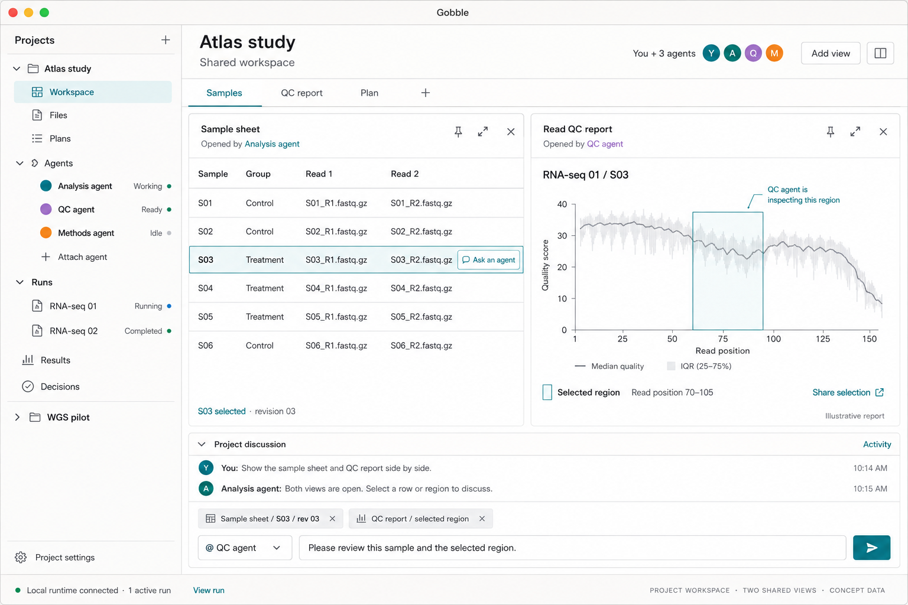

# Gobble App — Project 작업공간 설계 검토

작성일: 2026-09-06. 기준 브랜치 커밋: `7fe3d5c9e10d0cc104a15b6e7aa3def0d15b98f1`.
Project 중심 컨셉은 사용자 승인 완료입니다. 이 문서는 그 컨셉을 구체화한
설계와 첫 구현 범위를 검토하기 위한 안내입니다. 앱 구현 완료 보고가 아닙니다.

Current checkpoint: **session wrap-up, 2026-09-29.** The bounded single-FASTQ pipeline collaboration, continuation and report-sharing sequence is implemented and qualified. The [actual-engine/live-Agent walkthrough](stages/report-live-walkthrough/verification.md) was followed by the [comparison navigation repair](stages/pipeline-review-navigation/verification.md): maximize/restore and compact Chat return now retain the selected proposal/change while presentation authority is renewed independently. Product versions are Workspace v21 / bundle v30 / catalog v5 / shared tools v15. See [remaining work](remaining-work.md) and the [publication checkpoint](publication-checkpoint.md).

## 승인된 컨셉

Project가 하나의 공동 작업공간입니다. 여러 Agent, 파일, 계획, Run, 결과물,
질문과 결정이 Project에 속합니다. 사용자와 Agent는 중앙의 같은 자료를 열고
배치하고, 특정 행·텍스트·이미지 영역을 지정하여 대화합니다.

- 왼쪽: 접을 수 있는 Project 파일·Run 탐색기.
- 중앙: 하나 또는 위아래로 쌓인 두 자료 Pane과 각 Pane의 탭.
- 우측: 채팅 형태의 Project 대화, 헤더에서 여는 Agent 목록과 하나의 공통 입력창. 질문에도 같은 입력창으로 답합니다.
- Agent를 바꾸거나 대화를 닫아도 Project의 화면과 Run은 유지됩니다.
- 앱 자체의 문구·메뉴·오류·접근성 라벨은 영어로 작성합니다. 사용자 데이터와 파일명은 원문을 유지합니다.

위 이미지는 초기 승인 컨셉입니다. 2026-09-07 사용자 요청에 따른
[승인된 최신 배치](stages/05-shared-context.md)은 중앙 상하 Pane과 우측 채팅 구조입니다.
이미지의 분석 데이터, Agent 역할명, 그래프와 연결 상태는 예시입니다.
이 이미지는 내장 Imagegen으로 생성했으며 [생성 프롬프트](project-workspace-v1.prompt.txt)를
함께 보관했습니다. 첫 버전의 시각 자료 검증은 실제 이미지 결과물을 사용합니다.
인터랙티브 QC 보고서 전체를 구현했다는 의미는 아닙니다.

## 상세 설계의 기준 문서

| 문서                                                                                                      | 결정하는 내용                                                         |
| --------------------------------------------------------------------------------------------------------- | --------------------------------------------------------------------- |
| [Project 작업공간](../../.gobbi/projects/gobble/memory/design/feature/agent-workspace.md)                 | 화면 구조, 여러 Agent, 패널 조작, 선택 공유, 질문, 복원, 접근성       |
| [역할과 통신 계약](../../.gobbi/projects/gobble/memory/design/architecture/project-workspace-contract.md) | 프로세스, 상태 소유자, 식별자, 저장, 로컬 API, 런타임 연결, 미래 확장 |
| [전체 앱 아키텍처](../../.gobbi/projects/gobble/memory/design/architecture/application.md)                | 기존 Gobble과 앱의 관계 및 전체 분석 제품 방향                        |
| [이번 세션 구현 계획](session-plan/plan-index.md)                                                         | 작업 범위, 의존 관계, 각 단계의 결과와 책임                           |
| [프로젝트 로드맵](../../.gobbi/projects/gobble/memory/design/roadmap/project.md)                          | 첫 공유 작업공간 이후 실행·복구·배포 순서                             |

## 이번에 구체화한 기술 선택

1. **Gobble은 실행의 최종 책임자입니다.** 앱이나 Agent가 성공·중단 완료를 추측하지
   않습니다. Linux CLI는 앱·계정·서비스 없이 계속 사용할 수 있어야 합니다.
2. **Go 서비스는 호스트에서 Project와 실행 연결을 관리합니다.** 분석 조회는 그 실행에
   기록된 Gobble 컨테이너 버전을 통해 수행합니다. 앱 버전과 실행 엔진 버전을 분리합니다.
3. **공유 화면은 앱의 Project 작업공간 관리자가 소유합니다.** 사용자와 모든 Agent의
   화면 조작을 같은 규칙으로 처리하고, 고정한 화면과 사용 중인 입력을 보호합니다.
4. **Agent마다 독립적인 대화와 작업 상태를 둡니다.** 첫 버전은 명시적으로 한 Agent를
   선택해 질문합니다. 전체 Project나 다른 Agent의 대화를 자동 전송하지 않습니다.
5. **통신 경계를 분리합니다.** React↔Electron은 제한된 앱 동작 IPC,
   Electron↔Go 서비스는 인증된 로컬 HTTP/JSON, Electron↔Codex는 공식 stdio,
   Agent 도구는 Project 범위가 검증되는 공통 포트를 거칩니다. 승인된 5단계는 공식 Codex dynamic tools로 연결하며, MCP는 미래 어댑터로 남깁니다. 상세 근거와 기존 대화의 전환 경계는 [5단계 설계](stages/05-shared-context.md)에 있습니다.
6. **저장소도 소유자별로 나눕니다.** Project 등록은 Go 서비스, 화면·질문·Agent 연결은
   앱, 대화 원본과 인증은 Codex, 실행 기록과 결과물은 Gobble이 저장합니다.

첫 버전은 단일 사용자·단일 앱 인스턴스이므로 앱 상태는 버전이 있는 JSON 파일을
원자적으로 교체하여 저장합니다. 규모나 트랜잭션 요구가 생기면 SQLite를 검토합니다.
Run 제어 요청의 내구성은 단순 UI 저장과 별개의 계약으로 다룹니다.

## 이번 세션 구현 목표

**같은 Project에 두 Agent를 연결하고, 실제 자료를 두 화면으로 열어 특정 부분을
지정해 질문·응답한 뒤, 앱을 다시 열어 작업공간을 복원하는 Electron 앱.**

| 단계              | 완료되어야 할 결과                                                    |
| ----------------- | --------------------------------------------------------------------- |
| 1. 공통 계약      | Project·Agent·화면·선택·질문의 식별자와 제한된 프로세스 경계          |
| 2. Project 서비스 | 폴더 등록, 파일 탐색, 기존 Run 연결과 호환 런타임 조회                |
| 3. 공유 작업공간  | Project 탐색기, 1/2 패널, 탭·고정·크기 조절, 우측 채팅, 저장·복원     |
| 4. 여러 Agent     | 공식 ChatGPT 로그인, 모델 선택, 두 독립 Agent의 연결·대화·중단·재연결 |
| 5. 함께 보기      | Agent의 열기·관찰, 사용자의 선택 전달, 근거와 연결된 질문·응답        |
| 6. 통합 확인      | 실제 엔진 조회와 실제 Agent 도구 결과 소비, 오류·재시도·복원 검증     |
| 7. 로컬 앱 패키지 | 현재 Mac에서 여는 `.app`, 필요한 실행 파일과 사용 방법                |

이 범위의 Agent는 자료 조회와 작업공간 조작에 집중합니다. 소스 수정, 새 분석 실행,
Stop·Resume 조작, 재실행 영향 미리보기는 다음 단계입니다. 현재 실행 중인 분석을
표시하는 화면에서 아직 구현하지 않은 제어를 작동하는 것처럼 보이게 하지 않습니다.
Go 서비스의 초기 기능 목록도 실제 제공하는 조회 기능만 알립니다.

별도 OS 창, 자유 배치 캔버스, HTML 보고서 전체 뷰어, 브라우저 배포, 원격/HPC,
자동 업데이트와 전체 OS 설치 검증은 이후 범위입니다. 첫 패키지는 로컬 검증용이며
서명·공증된 일반 배포 완료를 의미하지 않습니다.

## 완료 판정에 필요한 장면

- Project를 등록하고 두 Agent를 연결해도 파일·Run·선택이 다른 Project와 섞이지 않습니다.
- 사용자와 Agent가 같은 두 화면을 열고 조작하며, 고정된 화면을 임의로 덮어쓰지 않습니다.
- 표의 선택 행과 이미지 영역이 정확한 버전·수신 Agent와 함께 전달됩니다.
- 화면 로딩 실패, 오래된 선택, 모델의 이미지 입력 미지원은 명확한 결과로 표시됩니다.
- 질문을 닫거나 Agent를 중단해도 답변한 것으로 처리하지 않습니다.
- 앱을 다시 열면 Project·패널·Agent 연결·대기 질문이 복원되며, 메시지나 실행을 자동 재전송하지 않습니다.
- 실제 CLI 실행의 Monitor 정보와 앱 표시가 일치합니다. 연결 실패는 마지막 관찰 시각과 함께 표시합니다.
- 실제 Agent가 화면 관찰 결과와 범위가 제한된 이미지를 소비하는 것을 확인합니다.
- 앱·Agent 종료 후에도 이미 실행 중인 독립 컨트롤러가 계속 동작합니다.
- 키보드로 패널 열기·선택·분할·닫기·Agent 지정·질문 응답을 수행할 수 있습니다.

계약 테스트나 예시 화면만으로 실제 로그인·분석 연동이 검증됐다고 보고하지 않습니다.
동일 파일 변경 충돌, 중복 Start 방지, 늦은 Stop의 실행 소유권 보호는 이후 실행 명령
계약의 완료 조건입니다.

## 확인된 환경과 남은 외부 조건

2026-09-06 이 Mac에서 Node `25.7.0`, Go `1.27.1`, Codex `0.153.4`를 확인했습니다.
npm에 Electron `44.2.0`, React `19.2.8`, TypeScript `7.0.2`가 게시되어 있는 것도
확인했습니다. 이 번호들은 설치·통합 검증 전의 후보이며, 구현 시작 시 실제 사용할
정확한 버전을 고정합니다. 저장소의 Go 모듈 선언은 `1.26`입니다.

Docker 명령은 있지만 데몬에 연결되지 않았습니다. 앱과 문서 작업을 막지는 않지만
실제 컨테이너 조회·종료 독립성 검증 전에는 Docker를 실행해야 합니다. ChatGPT의
브라우저 로그인은 사용자가 직접 수행해야 합니다. 4단계에서 계정 저장소는 단일 Codex 프로세스가 소유하도록 구체화했습니다.
MCP 이미지 전달과 선택한 모델의 이미지 입력은 이후 단계에서 고정 런타임으로 확인해야 합니다.
확인되지 않은 결과는 남은 항목으로 보고합니다.

## 다음 검토 지점

사용자가 위 설계와 개발 진행을 승인했습니다. 추가 요청에 따라 각 단계를
**착수 전 스케치 → 구현·테스트 → 결과 요약 → 사용자 승인** 순서로 진행합니다.
각 단계의 승인을 받은 뒤에만 다음 단계로 넘어갑니다.
[1단계](stages/01-contracts.md)는 사용자 승인을 받았습니다.
[2단계](stages/02-project-service.md) 결과와 3단계 진행도 사용자 승인을 받았습니다.
[3단계 결과 기록](stages/03-workspace.md)에 공유 작업공간 UI와 검증 결과를 정리했습니다.
사용자 요청에 따라 4단계 전에 [개념·설계 리뷰와 구조 보완](stages/03-design-refinement.md)을 진행했습니다.
사용자가 개념·설계 보완 결과를 검토하고 4단계 진행을 승인했습니다.
[4단계 계정·Agent 연결](stages/04-agents.md)의 구현과 검증을 마쳤습니다.
사용자 로그인 후 두 실제 Agent 응답, 독립 중단, 재시작 복원을 확인했고,
기본 상태에서 로그인 버튼이 보이지 않던 스타일 경계와 키보드 포커스도 수정했습니다.
93개 단위·계약 테스트와 15개 실제 Electron 테스트가 통과했습니다. 사용자가 4단계 결과를 승인했습니다.
[5단계 함께 보기 설계안](stages/05-shared-context.md)에 새 스케치, 소유 경계와 구현 순서를 작성했습니다.
사용자 피드백에 따라 별도 질문·답변 영역을 없애고 우측 채팅과 공통 입력창으로 수정했습니다.
중앙 Pane은 상하 배치합니다. 수정된 스케치와 통신·저장 전환은 구현 전에 사용자 검토를 받습니다.
구현 중 이 계약을 바꾸는 충돌이 발견되면 해당 설계 항목과 근거를 먼저 제시합니다.

## 2026-09-07 · Stage 5.1 검토

[우측 채팅·상하 Pane 구현 기록](stages/05-1-chat-foundation.md).
사용자 승인 컨셉에 따라 레이아웃과 v1→v2 이전을 구현했습니다. 공통 선택 참조를
User와 Agent가 함께 쓰는 설계도 반영했습니다. 실제 Agent 도구·선택 공유·질문 응답은
뒤따르는 5.2–5.5 작업이며, 이번 화면 결과만으로 구현 완료를 주장하지 않습니다.

## 2026-09-07 · Stage 5.2 검토

사용자가 5.1 결과를 승인하고 5.2 진행을 요청했습니다.
[공유 도구·작성자별 참조 구현 기록](stages/05-2-shared-pointing.md)에 소유 경계,
실제 Codex 이미지 전달, User/Agent 표시, 복원과 검증 결과를 정리했습니다.
118개 단위·계약 테스트와 21개 실제 Electron 테스트가 통과했습니다. 로그인된 실제
Agent가 CSV와 Plot을 관찰하고 두 공유 표시를 게시한 화면도 포함되어 있습니다.
사용자가 이 결과를 검토하고 5.3의 수신자 지정 근거 전달을 승인했습니다.

## 2026-09-07 · Stage 5.3 검토

[수신자 지정 첨부·불변 근거 구현 기록](stages/05-3-addressed-evidence.md)에 개념 정의,
저장과 전달의 소유 경계, 작성자 설계 리뷰 및 검증 결과를 정리했습니다.
선택 내용이나 전체 미리보기를 공통 입력창에 첨부하고, 실제 전달될 내용을 그 안에서
펼쳐 확인합니다. 원본 변경·수신자 변경·이미지 미지원·저장 실패 시 초안을 보존합니다.
전송한 첨부는 원본이나 열린 Surface와 독립적으로 기록됩니다.
132개 단위·계약 테스트와 24개 실제 Electron 테스트가 통과했습니다. 실제 Messages-only
Agent가 첨부된 코드와 이미지 추세를 읽었고, 정상 재시작 후 같은 첨부를 다시 열었습니다.
사용자가 이 결과를 검토하고 5.4의 채팅 내 질문·같은 입력창을 통한 답변을 승인했습니다.

## 2026-09-07 · Stage 5.4 검토

[질문·답변 설계와 검증 기록](stages/05-4-inline-questions.md)을 추가했습니다.
Agent 질문은 채팅 메시지로 표시되며, Reply가 기존 입력창의 질문·수신자 연결을
설정합니다. 초안 저장은 답변 확정과 구분하고, 명시적 Send만 답변과 전송 기록을
함께 저장합니다. 질문 상태 규칙, 근거 보관, 단일 Project 저장자, 전송 결과의
책임을 나누었습니다. 근거를 펼쳐도 입력창과 Send가 보이도록 보완했습니다.

148개 단위·계약 테스트와 27개 실제 Electron 테스트가 통과했습니다. 실제 Agent의
노트·Plot 관찰, 질문 생성, 재시작 후 답변 전송과 수신, 완료 후 복원을 확인했습니다.
검토용 앱은 열린 상태이며, 5.5 통합 UI 검토는 이번 결과 승인 후 진행합니다.

## 2026-09-07 · Stage 5.5 통합 검토

사용자가 5.4 결과를 승인하여 [5.5 UI 통합 검토](stages/05-5-ui-integration.md)를
완료했습니다. 새 사용자 메시지와 Agent 응답을 최초 수신 순서로 표시하고,
읽던 항목의 위치를 유지하며, 좁은 Chat 화면에도 전송 오류가 보이도록 수정했습니다.
타임라인의 표시·응답 내용·스크롤 책임을 분리했고, 이전 도구 연결의 호환성
판정과 수신자/모델 변경 중 전송 제어를 정리했습니다.

최종 전체 검증: 단위·계약 테스트 155개와 실제 Electron 시나리오 29개 통과.
중간 이미지 관찰 테스트의 일회성 거절과 진단·전면 창 조건 보완도 기록했습니다.
실제 두 Agent의 역순 응답 도착, 전면 창에서의 텍스트·이미지 관찰과 Agent 영역 표시,
정상 재시작 후 12개 메시지·질문 답변·원본 근거·선택 보존을 확인했습니다.

검토용 앱은 열린 상태입니다. 아래 5.6 UI/UX 재검토가 추가되어 6단계 실제
Gobble/Docker 연동 검증은 보류합니다. 패키징은 연동 검증 다음 단계입니다.

## 2026-09-07 · Stage 5.6 UI/UX 리뷰와 개선안

사용자 요청에 따라 [시나리오·체크리스트·실제 앱 리뷰](stages/05-6-ui-ux-review.md)를
작성했습니다. Agent 정렬과 크기, 중복된 Project 제목, 첨부 미리보기로 인한 대화
공간 축소, 좁은 창에서 탐색기가 더 넓어지는 문제를 확인했습니다.

[생성한 A안 이미지](stages/05-6-review/concept-a.png)와
[A/B 인터랙티브 스케치](stages/05-6-review/prototype.html)를 준비했습니다.
대화 헤더에서 Agent 목록을 여는 A안을 추천하며, 항상 작은 참여자 바를 두는
B안과 비교할 수 있습니다. 스케치는 예시 데이터이며 실제 메시지를 전송하지 않습니다.

사용자가 A안과 5.6a를 승인하여 [구조·Agent 배치 구현](stages/05-6a-structure.md)을
완료했습니다. 제목은 44px 단일 바, 탐색기는 180px 접기/펼침 구조이며 Agent 목록은
오른쪽 Chat에 있습니다. 초안·수신자 보존과 작은 창의 탐색·포커스를 검증했습니다.
최종 단위·계약 테스트 155개 및 Electron 시나리오 31개가 통과했습니다.
사용자가 5.6a 결과를 검토하고 5.6b 진행을 승인했습니다.
6·7단계는 아직 승인 범위에 포함되지 않습니다.

## 2026-09-07 · Stage 5.6b 사용 흐름 정리

[선택·첨부·Pane 도구 설계와 검증](stages/05-6b-communication.md)을 정리했습니다.
버튼과 글자 크기를 더 줄이는 대신 자료 옆의 선택 도구, 저장된 첨부 미리보기,
숨겨진 선택으로 돌아가기, 이름이 보이는 Pane More 메뉴로 작업 흐름을 개선했습니다.
빈 Pane에서 탐색하거나 기존 자료를 옮길 수 있으며, 반복적인 화면 변경 기록은
펼쳐 볼 수 있습니다. 작성자·출처·공유 마크와 질문·오류·메시지는 유지합니다.

최종 단위·계약 테스트 156개와 Electron 시나리오 32개가 통과했습니다.
사용자가 5.6b 결과를 승인하여 5.6c 통합 UI/UX 검토를 진행했습니다.
6·7단계의 실행 및 패키징은 여전히 별도 승인 범위입니다.

## 2026-09-07 · Stage 5.6c 통합 UI/UX 검토

[통합 시나리오·소유 경계·최종 검증 기록](stages/05-6c-integrated-review.md)을 작성했습니다.
Agent 0–12명, 긴 이름·파일명·초안, 첨부 4개와 대기 질문을 작은 창 및 100–150% 확대에서
검토했습니다. 상단 제목 겹침, 스크롤에 가려진 모델·첨부 오류, 빠른 Browse 후 파일이
다른 Pane으로 열리는 순서 문제를 수정했습니다. 탐색기는 열기 의도만 전달하고 기존
작업 큐가 대상 Pane을 결정하도록 의존성을 줄였습니다.

최종 단위·계약 테스트 156개와 실제 Electron 시나리오 35개가 모두 통과했습니다.
로그인된 앱에서도 첨부 미리보기·설정 취소·선택 복귀·채팅 접기·확대·정상 재시작을
확인했습니다. 검토 전의 초안·수신자·선택·화면 배치를 복원했으며 메시지는 12개 그대로입니다.
최종 검토용 앱은 열린 상태입니다. 사용자 승인 후 6단계 실제 Gobble/Docker 통합 검증으로
진행하며, 패키징은 이후 별도 단계입니다.

## 2026-09-07 · Stage 6 실제 엔진·Agent 통합 검증

사용자가 5.6c를 승인하여 [실제 통합 검증과 소유 경계](stages/06-integration-evidence.md)를
진행했습니다. 실제 Docker의 Run·현재 attempt·로그 표시, 앱 종료 후 독립 실행과 복원,
실제 Agent의 Run·이미지 관찰·포인터·질문·단일 입력창 답변을 확인했습니다.

검증 중 발견된 엔진의 새 파일 잠금 문제, 읽기 전용 잠금 관찰 문제,
실시간 로그를 종료 시 다시 생성하던 충돌을 수정했습니다. 실행 상태는 계속 Gobble이
소유하며, 앱이 상태를 추측하거나 로그 파일을 쓰지 않습니다.

앱 156개 단위·계약 테스트와 35개 Electron 시나리오, 최종 실제 Docker 시나리오,
엔진·모니터 동시성 검사와 정적 검사가 통과했습니다. 전체 엔진 검사에는 현재 Mac 환경의
기존 packed-runner 실패 2개가 남으며, 수정 전 원본에서도 동일하게 재현됩니다.
이를 전체 테스트 통과로 표시하지 않았습니다. 세부 실패와 검증 범위는 단계 기록에 있습니다.

검토용 앱은 최종 `verified-integration` Project를 보여줍니다. 기존 Review Project는
12개 메시지와 초안·선택·배치를 그대로 보존했습니다. 사용자 검토 후 7단계 로컬 Mac
앱 패키징으로 넘어가며, 이번 단계에서 패키징·배포는 진행하지 않았습니다.
