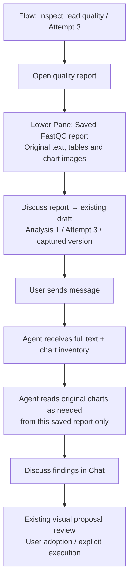
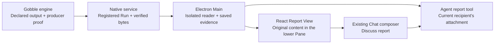

# FastQC report sharing — design for owner decision

2026-09-27 · Draft, not implemented or accepted. Follows the accepted
[completed Run presentation](../../../stages/completed-run-presentation/README.md).
The owner authorized this design checkpoint. Existing production remains Workspace
v19 / bundle v28 / catalog v5 / shared toolset v13.

Read [design](design.md) for concepts, public contracts, code ownership and proof;
[discussion](discussion.md) for alternatives, source evidence and independent advice;
[fixture measurements](study.json) for the bounded example.

## Recommendation

Open the selected FastQC step's latest successful **Saved FastQC report** below its Flow. Preserve the
tool's original text, tables, status labels and PNG charts in one immutable reading model. Use that
same model for the User's View and the Agent's observations. Reuse the existing
composer, captured-evidence store and shared workspace. Do not build a generic HTML
browser, chart generator, scientific metric interpreter or a new chat system.

Whole-report attachment does not mean every chart is placed in one model message.
The fixture contains eight charts; current messages allow two images. The report
must remain fully available, with visible disclosure of deferred chart reading.

## Ownership sketch

Design levels: **concepts** (output evidence → saved report → shared reference),
**public contracts** (engine read → verified source → capture/preview/read), then
**code ownership** (engine → native service → Main → React/tool adapters).
The [contract and file tables](design.md#class-and-function-design--material-change)
define each unit's responsibility and boundary.

## Decisions requested

| Decision | Recommended | Alternative and cost |
| --- | --- | --- |
| Reading presentation | FastQC-specific reading model; preserve source content, use Gobble's readable layout | Original HTML appearance requires a separate isolated HTML host plus a second Agent extraction path and consistency checks. |
| Agent delivery | Whole frozen report; text/tables immediately, chart images read on demand | All charts in one message requires broader message limits; one screenshot loses content/readability. |
| Older Runs | Explicit unsupported-report state for engines without output-evidence capability; qualify a new Run on the new engine | A compatible historical reader is a separate compatibility design. Never replace a registered Run's pinned engine. |

The first attachment slice requires a `sharedViews` Agent with an image-capable
model. Show an actionable reason before sending if unavailable. Other Agent access
modes remain usable for existing messages; broader report delivery can be designed later.

## Screen behavior

Retain the approved upper Flow / lower report / right Chat layout. The report body
uses the source module headings, text/tables and original charts; original HTML CSS
and decorative layout need not be reproduced. A module contents list is navigation,
not a new shared section/metric selection. `Open logs` remains available for the
exact producer attempt when its logs remain available. A later attempt never replaces
the saved report or its logs target. `Focus report` uses existing Pane maximize/restore behavior.

Display `Analysis 1 · Quality inspection · Attempt 3` above the report, with captured
version details available on demand. `Discuss report` adds one report attachment to
the existing composer. Preview opens the saved reading model. Initial UI disclosure:
**“Whole report saved. The Agent reads charts as needed.”** No automatic claim that
all charts were reviewed. For this first slice, attach the report to each message
that needs chart access; opening a Pane alone is not a full-report attachment.
Agent whole-report pointers remain distinct from User selection.

Missing/changed output, unsupported engine/format, oversized report, and unavailable
saved evidence have different explanations. A saved report opens from retained
content even after the source changes, the Pane closes or the App restarts. There is
no silent refresh to another attempt or file version.

## Proposed sequence after design approval

1. Gobble output-evidence contract and native service verified read; qualify exact
   attempt/port/hash ownership with a fresh supported-engine Run.
2. FastQC reading model, retained report and lower-Pane opening. Verify whole-content
   fidelity, bounds, saved reopening and the selected-attempt logs route.
3. Whole-report attachment, recipient-scoped chart reads and whole-report shared
   references. Verify User/Agent content equality, restart and cross-recipient refusal.
4. End-to-end Electron walkthrough and owner result review.

Keep stage summaries and approval boundaries. This draft requests the design choices
above; it does not authorize implementation of optional formats, report-region
selection, old-engine migration, paired-end workflows or packaging.
