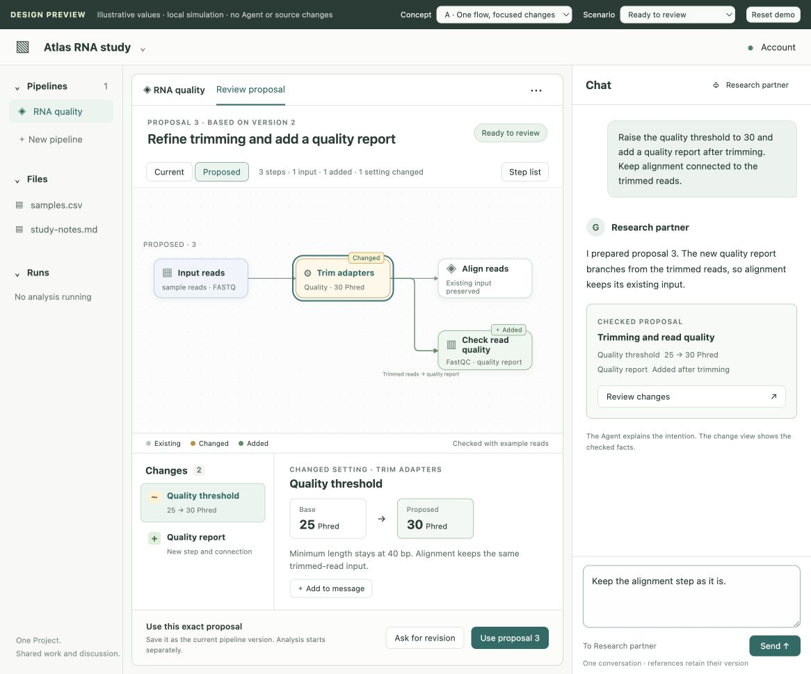

# P2B — Review an Agent's pipeline proposal

Design checkpoint, 2026-09-09. **Proposed; owner review pending.** P2A-2 is
accepted. This checkpoint adds a local interactive sketch and a concrete next
implementation plan. It does not add production authoring or adoption APIs.

The User asks for a change in Chat, reviews the checked flow and before/after
facts, and chooses whether that exact proposal becomes current. The Agent edits
the implementation behind the view. Starting an analysis remains a later action.

- [Interactive preview](http://127.0.0.1:54402/sketch.html) — choose Concept and
  Scenario in the preview toolbar. It uses illustrative data and local simulation.
- [Design and ownership diagrams](design.md) — comparison meaning, references,
  source ownership, publication and recovery.
- [Implementation sequence](plan.md) — P2B-1 existing pipeline refinement,
  followed by P2B-2 new pipeline creation, with separate result checkpoints.
- [Review evidence and limitations](review.md) — alternatives, walkthrough,
  open user evidence and verification boundaries.

Recommended decisions: use one flow with Current/Proposed switching; retain the
existing Chat and composer; store reviewed analysis versions under service
ownership and publish an exact current-version pointer. Unexplained processing
changes and stale comparisons prevent adoption.

For owner review, try changing a step, adding its reference to the message,
opening Revised proposal 4, and switching to Unexplained change. The earlier
attachment should remain understandable, and the blocked action should explain
what is needed next. Feedback on these tasks is still pending; the walkthrough
recorded here is an author review, not a representative-user study.

The preview can be served again from this directory with any local static file
server; `sketch.html`, `sketch.css` and `sketch.js` are self-contained. Its port is
session-local. [Two-flow alternative](concept-b.jpg), [incomplete comparison](incomplete.jpg)
and [compact window](compact.jpg) are retained for review if the server is stopped.
