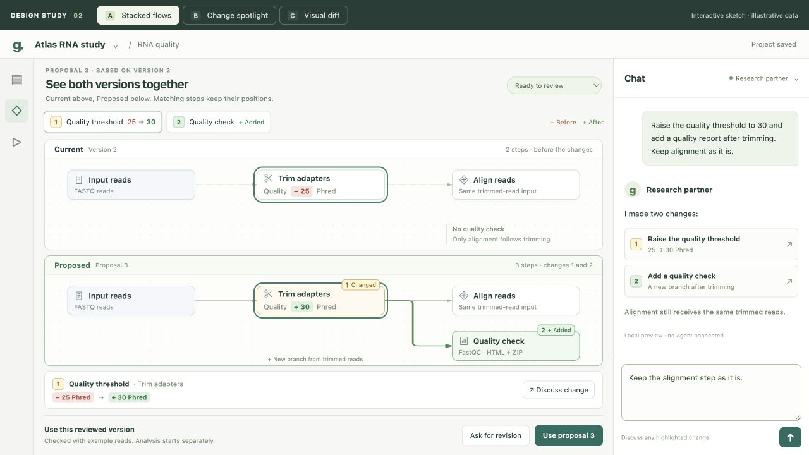
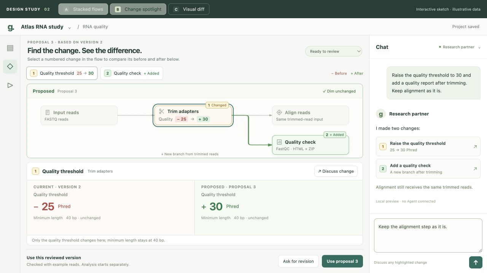
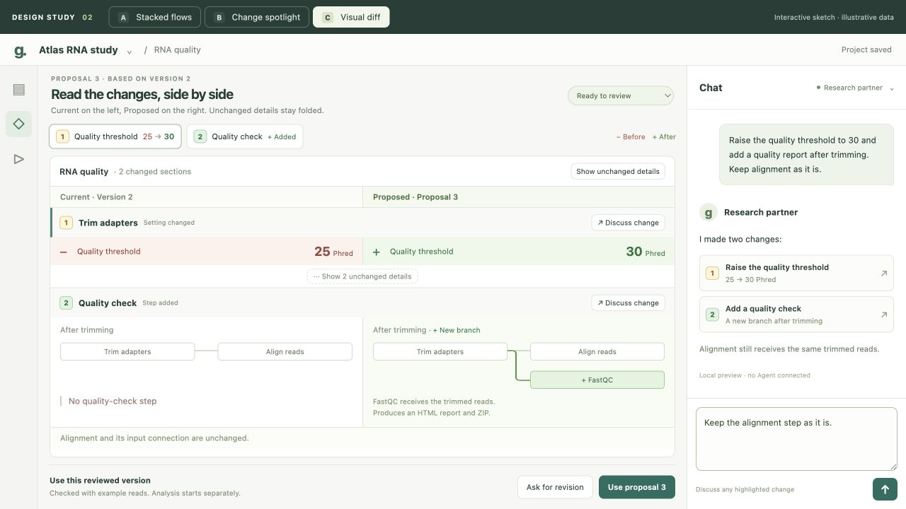

# P2B comparison alternatives — revision 2

2026-09-09. **Owner review pending; production implementation has not started.**
The owner found the original Current/Proposed toggle difficult to understand and
requested more direct, Git-diff-like alternatives, including vertically stacked
versions and a highlighted flow with detail below. The original recommendation is
therefore reopened. This revision changes the presentation proposal, not the
previously proposed source/engine ownership boundaries.

## Three concepts, one example

All three show the same illustrative changes: quality threshold 25 → 30 Phred,
plus a FastQC branch after trimming. Alignment retains its input connection. These
are checked-design mock facts, not a scientific recommendation or executed result.

| Concept                  | What the User sees first                                                                                         | Strong point                                                                           | Cost to evaluate                                                                       |
| ------------------------ | ---------------------------------------------------------------------------------------------------------------- | -------------------------------------------------------------------------------------- | -------------------------------------------------------------------------------------- |
| **A — Stacked flows**    | Current above Proposed; matching steps in matching positions; changes marked in Proposed                         | Full topology before and after is visible without switching                            | Repeats unchanged steps and needs more vertical space; large graphs remain unqualified |
| **B — Change spotlight** | Proposed flow with numbered changes and subdued unchanged steps; selected change's Current/Proposed detail below | Connects “where” to “what changed”; gives a setting or added step room for explanation | Examines one change at a time; full previous topology is not always visible            |
| **C — Visual diff**      | A sequence of changed sections with Current on the left and Proposed on the right                                | Closest to reading a Git diff; values and local topology compare directly              | Local neighborhoods provide less overall pipeline context                              |

These are alternatives to choose between, not a plan to add three permanent modes.
Author hypothesis: B is a useful everyday starting point; A may work better for
structural changes, and C for reviewing many settings. The owner's judgment on
these actual sketches must determine the next design, not that hypothesis.

### A — Stacked flows

[Open A](http://127.0.0.1:54402/alternatives-v2/sketch.html?concept=stacked).
Click either Trim adapters card to highlight the corresponding step in both
versions. Click change 2 to discuss the added branch. The compact strip below the
flows retains the selected change's before/after facts.

### B — Change spotlight

[Open B](http://127.0.0.1:54402/alternatives-v2/sketch.html?concept=spotlight).
Click the numbered Trim adapters or Quality check card. The lower comparison
changes from a paired numeric value to the new step's input, output and route.
[Added-step detail](b-added-step.jpg) is also retained.

### C — Visual diff

[Open C](http://127.0.0.1:54402/alternatives-v2/sketch.html?concept=diff).
Unchanged details can be expanded like context around a diff. An added step uses a
small before/after flow instead of exposing source code. Each section can be
attached to the existing Chat.

## Common interaction rules

- Number 1 or 2 identifies the same change in the graph, detail and Chat.
- Red `−` identifies a previous value; green `+` identifies its proposed replacement
  or an addition. They are not arithmetic signs, deltas or Run status. No-step
  placeholders are neutral; a missing step is not presented as a deleted step.
- Full graphs show separate coherent versions. Mini-flow comparisons show the local
  neighborhood of a change. Neither presents a merged old/new graph as executable.
- Discuss change adds a frozen comparison reference to the existing composer and
  preserves its text. Switching concepts/selection does not replace that reference.
- Incomplete comparison and moved-current-version states disable adoption with a
  reason. Simulated adoption relabels the retained comparison Previous/Accepted;
  it does not start an analysis.

This sketch has no Agent/service connection, file authoring or durable adoption.
Only highlighted changes, comparison controls, Chat references and local preview
states are simulated. The source-free workflow and exact revision/coverage rules
in the [P2B design](../design.md) still require implementation and qualification
after a concrete interface is accepted.

The next owner decision is the preferred comparison approach, or a specific
combination of its elements. After that decision, update the design and P2B-1
implementation sketch around the chosen interaction. Do not implement all three
or resume the original toggle design by default.

[Author walkthrough and evidence limits](review.md). The live URLs depend on the
current local server; the screenshots remain available without it.
