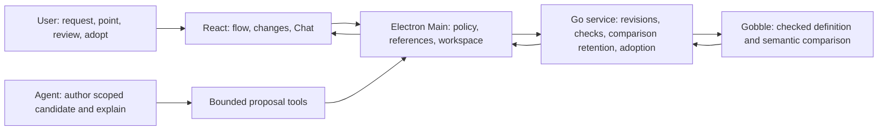

# P2B visual change review — proposed design

2026-09-09. **Historical ownership proposal.** The owner subsequently accepted
B / Change spotlight in **alternatives-v2** and authorized P2B-1 implementation.
[Current design and owners](../../stages/p2b1-visual-proposals/design.md) supersede
the original A/B comparison labels and pending status below. Those historical
alternatives are not separate production modes. The accepted managed-copy lifecycle
is implemented for the qualified first scope; new-Pipeline creation and execution
remain later checkpoints.

## Outcome and identity

“Raise the quality threshold and add a quality report” produces a checked proposal
the User can discuss and accept through the analysis UI. The User does not need to
read Go. Keep the Project navigation, central work Pane, right Chat and one
composer from the accepted workbench. Use the accepted rounded orthogonal flow
connections, compact cards and readable labels. The governing sources are the
accepted workspace design, [flow polish](../../stages/p2a1-flow-polish/README.md),
and current `pipeline.css` and flow components; this proposal introduces no new
global design system.

Illustrative scenario: quality 25 → 30 Phred; add FastQC as a branch from trimmed
reads; preserve the existing alignment input. These values demonstrate interaction,
not a scientific recommendation. A quality-report node represents a declared
processing step/output, not a generated report or completed Run.

## Concepts and proposed choice

| Concept                      | Information and action model                                                                              | Benefit                                                                                    | Cost / decision                                                                                                                                     |
| ---------------------------- | --------------------------------------------------------------------------------------------------------- | ------------------------------------------------------------------------------------------ | --------------------------------------------------------------------------------------------------------------------------------------------------- |
| A: one flow, focused changes | Default Proposed flow; switch to Current in the same Pane; change list and exact before/after facts below | Keeps graph and Chat readable; supports narrow windows without consuming another work Pane | Requires switching to see topology before and after. Recommended first implementation; human task evidence remains open.                            |
| B: simultaneous flows        | Current and Proposed side by side within the same Pane, with shared change selection                      | Direct spatial comparison on a wide display                                                | At the observed 619 px canvas it needs 900 px of content and horizontal scrolling. Retain as a tested alternative, defer production implementation. |

Both are in the sketch. Do not render a union graph as if old and new routes form
one executable pipeline. Removed steps remain reachable from Changes and the base
flow. Added steps select Proposed automatically. A trustworthy correspondence can
preserve position across versions; an unproven rename is removal plus addition.
The complete change list, rather than graph color alone, accounts for differences.

Amber means Changed and green means Added, with visible text badges. These colors
do not indicate execution state. Show the check's dataset/sample scope. Proposed
facts, declared outputs and observed Run results remain distinguishable. No
animated rearrangement is needed for the first comparison; preserve the existing
camera and keyboard/list alternative where possible.

The comparison is a View within an existing Pane, not a new window or separate
selection/reply panel. The lower change details belong to that View. Existing
second-Pane and pinned-tab rules continue to apply.

## Concepts and owners

| Concept                  | Definition                                                                                              | Owner                                                             |
| ------------------------ | ------------------------------------------------------------------------------------------------------- | ----------------------------------------------------------------- |
| Project                  | Durable collaboration and analysis context with data references, Pipelines, Agents and Runs             | Service catalog for analysis registration; Main for collaboration |
| Workspace / Pane         | Project presentation state / a bounded slot displaying a View                                           | Main is the sole state writer; React renders                      |
| Pipeline                 | Stable named analysis identity, separate from any source version or Run                                 | Service; Gobble defines checked processing facts                  |
| Analysis source revision | Immutable declared Go/config bytes, file manifest, runtime/check identity and Pipeline bindings         | Service, scoped to a Project                                      |
| Proposal                 | Immutable candidate source revision based on an exact prior revision, with author and requested intent  | Service retains it; Agent supplies edits and explanation          |
| Check attempt / artifact | Evaluation attempt / retained facts for one exact source and sample                                     | Service owns lifecycle; Gobble produces facts                     |
| Comparison               | Two exact artifacts, subject correspondence, complete classified differences and explicit coverage gaps | Gobble owns semantic comparison; service retains the result       |
| Adoption                 | User decision publishing that exact reviewed revision as current, with a durable outcome receipt        | Main admits User intent; service commits it                       |
| Run                      | Execution against separately prepared/admitted engine input                                             | Gobble; no Run is created by adoption                             |

The current inspection directory called `candidates` contains **check attempts**,
not authoring proposals. New proposal storage must not overload that identity.
Proposal state, check state, comparison eligibility and adoption outcome are
separate facts; a single mutable `status` must not substitute for all four.



The renderer neither parses Go nor decides equivalence. Main does not write source
files or derive pipeline semantics. The service does not import internal engine
types or execute an Agent's arbitrary shell. Gobble remains usable by the CLI
independently of App accounts and presentation.

## A complete comparison is more than two pictures

Current `PipelineInspection` v2 exposes ports, control/resource facts and explicit
module settings. It does not expose all command, script, environment or parameter
behavior in `internal/engine/plan.go`. Therefore identical cards or a claimed
Quality setting do **not** prove that processing is unchanged.

Add a Gobble-owned, versioned review definition beside the visual flow, covering
every supported execution-bearing field: command/script or executable identity,
tool/image/backend, resources, parameters/environment, input/output rules and
sources, branches/scatter/conditions and other control semantics. Keep sensitive
values out of public explanations and routine logs; use identity/digests and
explicit “changed” facts where disclosure is not appropriate. Secret or otherwise
opaque behavior changes cannot become a silently accepted residual.

Each difference must have a readable scientific fact, a qualified mapping to the
checked definition and an exact subject, or a visible coverage gap. Unknown fields
or unsupported schema changes fail closed. Labels and module-authored display
metadata are descriptions, not proof of that mapping. The Agent's narrative does
not make an incomplete comparison complete.

Start with qualified Trim Galore settings and an added FastQC branch. The Gobble
implementation must verify their **whole canonical processing definition** against
the supported module construction, including untouched arguments and defaults.
Do not recognize a recipe solely by its name/image, or strip two flags from an
arbitrary command and assume the remainder is safe. An unchanged unsupported step
can remain if its full checked identity is equal; changing/adding an unsupported
processing definition blocks adoption. This is a bounded first mapping, not a
general plugin registry, alternate DSL or promise to explain arbitrary code.

The current asset modules import the public Gobble package. The public package
therefore cannot import those modules back to verify them. Share only the required
pure canonical command construction in a dependency-free internal leaf, consumed
by the two module wrappers and Gobble's verifier; validate the remaining normalized
processing fields in the review owner. Do not add an import cycle or trust a
Project-supplied verifier callback. Qualification must demonstrate that these
shared constructors and the actual module output agree.

Source provenance and comparison coverage are distinct. Show every changed source
unit in retained provenance; do not call altered opaque configuration “no change.”
Coverage means the checked definition for the displayed sample and runtime, not
proof about every possible input or arbitrary Go side effects. Project evaluation
can itself perform I/O; existing bounded evaluation policy must continue. P3 must
prepare and qualify exact execution payloads for the intended inputs. Neither
review JSON nor a graph becomes execution authority.

Cross-version matching uses Gobble-owned structural correspondence where proved;
otherwise report remove/add. Existing edge ordinals (`edge-1`, etc.) are local to
an artifact and cannot identify the same edge across revisions. Compare exact
directional endpoints, including ports and multiplicity, never labels alone.

## Sharing a change in Chat

User and Agent use the same comparison reference model. A captured reference binds
Project, Pipeline, comparison, base artifact, candidate artifact, side and an exact
change/subject. It contains bounded before/after evidence and check scope. A click
is a local focus; **Add to message** creates an immutable attachment; Send delivers
it to the selected Agent. These are separate actions.

Switching side, selecting another change, receiving a revised proposal or adopting
one must not rewrite a captured reference. A later proposal marks the old reference
as historical. Reopening it restores its retained comparison, not whatever is
current. Agent marks retain author and side, and do not replace User selection,
draft or camera. Agent observation uses loaded, checked facts under the current
Main policy. No file contents or full datasets are implied by a selected input.

Extend the existing reference union and migration only at implementation; active
v7 Pipeline references and existing evidence remain readable. Do not preemptively
bump bundle v19, Workspace v16, toolset v10 or service catalog v2 in a design turn.

## Source publication: proposed ownership refinement

| Alternative                                                                          | Consequence                                                                                                                          | Proposed decision                               |
| ------------------------------------------------------------------------------------ | ------------------------------------------------------------------------------------------------------------------------------------ | ----------------------------------------------- |
| Rewrite imported Project files with a journal                                        | Must coordinate many writes, shared files, external editors and interrupted recovery; readers can observe mixed versions             | Defer direct working-tree synchronization       |
| Retain an immutable Project analysis-source revision and publish one current pointer | Reviewed bytes stay stable; catalog publication and outcome can share a commit; imports and managed sources need an explicit handoff | Recommend for the App's Agent-authored analyses |

This recommendation is an inference from the existing single-owner catalog and
bounded source retention. File rename is not a portable multi-file transaction:
the [Go `os.Rename` contract](https://pkg.go.dev/os#Rename) has platform/filesystem
limits. Conditional pointer updates in [Git's update-ref contract](https://git-scm.com/docs/git-update-ref)
provide useful prior art for rejecting a moved base, but this design introduces
no Git dependency or claim that the current catalog already has the new guarantees.

An imported definition remains imported until the User explicitly adopts a managed
copy. At that first decision, show: **“Save a Project version in Gobble. Your
imported files remain separate.”** Include the imported base identity and changed
source scope. A single reviewed Use action can authorize that handoff; do not add
a second generic consent dialog. Existing data locations remain Project data
references. Optional implementation details must resolve to the accepted bundle,
not silently display stale imported code as current. Re-importing external edits
creates a new review; it never silently refreshes the managed current version.

Use Project-level analysis-source ownership so a shared source change cannot
silently alter another Pipeline. A revision records participating Pipeline bindings
and the declared source set. Adoption needs comparisons for every affected managed
Pipeline. The first implementation qualifies one participating Pipeline and rejects
shared/multiple-pipeline publication with an actionable explanation. Broader shared
changes require a later explicit scope extension, not hidden per-Pipeline forks.

No Project-wide file crawl or arbitrary import is added. Reuse contained reads,
explicit manifests and current bounded UTF-8/source limits. Candidates may add or
replace allowed Go/config text; delete/rename, binaries, dependencies and runtime
changes are outside the first authoring capability. Runtime/config changes that
are not qualified remain visible blocked differences.

```mermaid
sequenceDiagram
  participant U as User
  participant M as Main / scoped tools
  participant S as Service revision owner
  participant G as Gobble checker
  U->>M: Ask for a change on this Pipeline
  M->>S: Bind authoring scope to exact base
  S-->>M: Bounded retained files and edit capability
  M->>S: Submit Agent candidate bytes
  S->>G: Check sealed candidate; compare with retained base
  G-->>S: Facts, changes, correspondence, coverage gaps
  S-->>M: Immutable comparison
  M-->>U: Flow + before/after facts + same Chat
  U->>M: Use this exact proposal
  M->>S: Adopt(comparison, expected head, operation ID)
  S->>S: Revalidate; commit current pointer + receipt
  S-->>M: Recorded outcome
  M-->>U: Now current; analysis has not started
```

Persist/seal the candidate before publication. Under the existing catalog writer,
check expected head, hashes, current policy and complete comparison; commit the new
pointer and operation receipt together. Filesystem durability, including directory
sync and the actual macOS profile location, must be qualified before claiming crash
recovery. No second manifest/pointer writer is introduced in WorkspaceController.

Repeated operation IDs return the same recorded outcome; changed request bodies
with the same ID are rejected. If the App loses the response, query that operation.
Do not automatically repeat an uncertain write. Orphans left before publication
remain unreferenced; published revisions and referenced history cannot be garbage
collected. Keep storage bounded and refuse new work when retention limits are
reached. A rollback is a new review/adoption based on the current head, not a force
write. Missing/corrupt published bytes stop resolution and preserve evidence.

## APIs and code boundaries

Names below describe proposed operations, not new exported APIs already present.

| Boundary                  | Minimum operation / responsibility                                                                                                                                                                                          |
| ------------------------- | --------------------------------------------------------------------------------------------------------------------------------------------------------------------------------------------------------------------------- |
| Main authoring capability | Bind Project, Pipeline, exact base, allowed text files, recipient/turn and limits. Revoke when scope/turn changes; content cannot expand its authority.                                                                     |
| Service proposal commands | Begin, read scoped source, submit candidate, check/cancel check, read comparison. Inputs use opaque identities and manifests, not arbitrary host paths. A submission seals bytes; revisions create new proposal identities. |
| Main User command         | Adopt comparison with expected head and operation ID; Agent tools cannot invoke it.                                                                                                                                         |
| Service recovery query    | Resolve the same adoption operation after timeout/restart; do not infer success from UI state.                                                                                                                              |
| Gobble review API         | Produce versioned normalized facts, safe correspondence, differences and coverage. No service/Main engine-internal imports.                                                                                                 |

Current shared-view permission is read-only and cannot authorize source authoring.
Add the specific proposal capability through existing dynamic tools and policy;
keep host filesystem and generic shell disabled. A future external MCP adapter
can call the same handlers with equivalent policy. No MCP server is needed now.

Suggested source organization follows existing owners: focused
`internal/appservice/pipeline_proposal*.go` and `analysis_revision*.go` for lifecycle
and persistence; a Gobble review projection beside `pipeline_inspection.go` with
engine normalization owned internally; contract validators by feature; a focused
Main proposal coordinator beside shared-context handlers; comparison presentation
under the existing renderer pipeline feature. Keep persistence, normalization,
policy and React components independently testable. Extend WorkspaceController
only through narrow resource/reference ports. Avoid a catch-all pipeline manager,
generic workflow framework or parallel store for Workspace state.

## Visible states and recovery

| State                 | User view / next action                                                                          |
| --------------------- | ------------------------------------------------------------------------------------------------ |
| Checking              | Existing checked flow and draft stay available; new candidate cannot be adopted                  |
| Invalid candidate     | Readable missing-input/check issue; request a revision in the existing composer                  |
| Incomplete comparison | Show unexplained change alongside known changes; adoption disabled                               |
| Current head moved    | Preserve base comparison labelled Base, not Current; ask for a proposal against the new head     |
| Ready                 | Exact comparison and check scope; Use proposal or Ask for revision                               |
| Outcome unknown       | Query the recorded operation; preserve evidence and avoid a second adoption                      |
| Adopted               | Current version confirmed by service; comparison history labels Previous/Accepted; no Run starts |

The preview simulates these states and an initial new-Pipeline entry; production
must also cover permission loss, offline service, storage full/corrupt, cancellation
and late results. Use semantic buttons, visible focus, text state labels and the
existing Step list path. Compact windows switch Workspace/Chat without losing the
draft. No new menu/tray/global shortcut or notification is required for this
in-window review; platform accessibility still needs native qualification.
