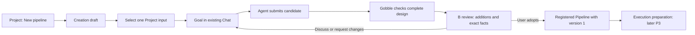
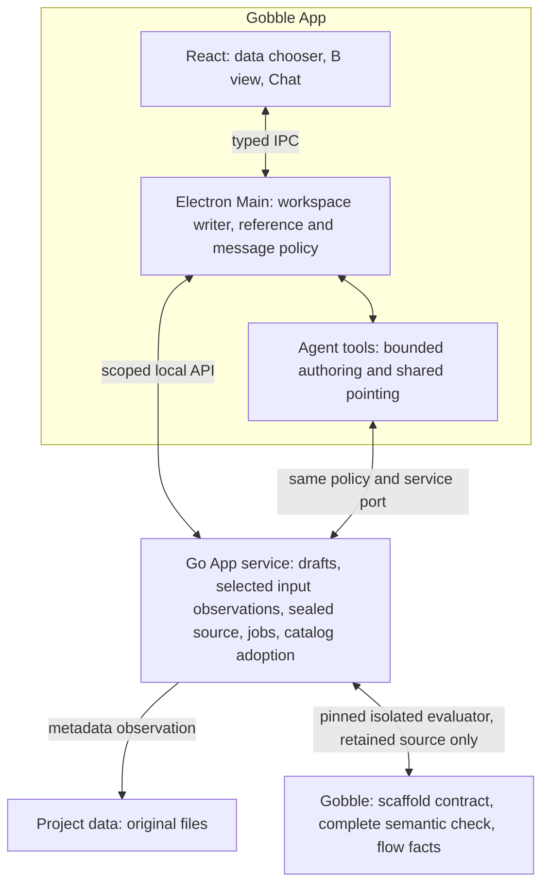
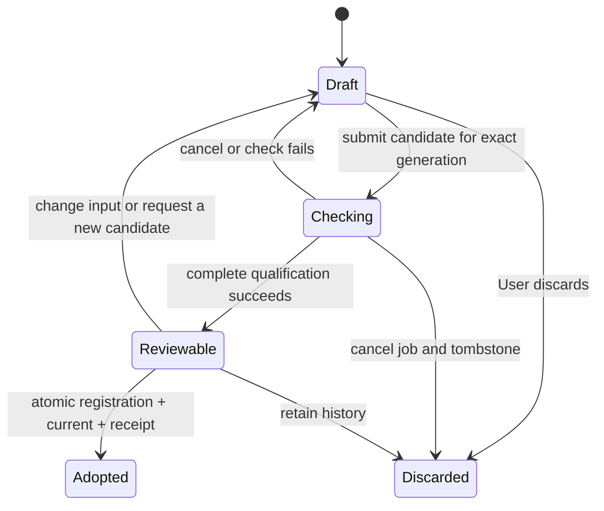

# P2B-2 design — creation, checking and first adoption

Proposed, 2026-09-12. Authority: the owner's UI-centered pipeline collaboration
instruction, accepted P2B-1 and B / Change spotlight. This extends creation;
it does not redesign the Project shell, comparison concept or Chat ownership.

## User flow and alternative

| Entry | Interaction | Benefit | Cost / decision |
| --- | --- | --- | --- |
| Project action | New pipeline opens data selection; Use selected file attaches creation context to the existing composer | Explicit new-versus-refine intent and discoverable data choice | One intentional entry action; recommended for this slice |
| Chat first | User describes a goal; Agent offers Start pipeline draft; User confirms and selects data | Natural when already talking | Ambiguity between creating and refining, extra clarification; retain as a later alternative |

Both lead to the same draft and B comparison, not different Pipeline types. The
prototype concept switch compares entry behavior only. No modal goal form or
second composer. Use existing Project Agent routing and per-message authoring
opt-in. Ordinary discussion never silently authorizes a source proposal.

## Concepts and lifetimes

| Concept | Definition and owner | Lifetime |
| --- | --- | --- |
| Project | Service-owned research container for data, multiple Pipelines, Agents and Runs | Independent of Views and conversations |
| Workspace | App-owned arrangement of Panes, selected tabs and shared attention | Restored by the existing single Main writer |
| Pane | Slot displaying a typed View; not a Pipeline, draft or source owner | Closing it changes presentation only |
| Creation draft | Service-owned creation intent, selected input observation, generation and candidate history; separate `draftId` | Open/close retains it; discard tombstones it; adoption records the resulting Pipeline identity |
| Candidate | Immutable Agent-authored source bundle for one draft generation and runtime/scaffold/input contract | Every revision is a new candidate; checking never rewrites previous evidence |
| Checked artifact | Gobble-derived complete flow and qualification evidence for exact retained inputs | Immutable, historical and referenceable |
| Pipeline | Registered logical analysis with an origin and adopted version | Created atomically with the first adopted version, not when the View opens |
| Current revision | Service-owned pointer for one Pipeline | Changes only through a confirmed, exact adoption |
| Run | Engine-owned execution history and results for a prepared version | No Run is created by this stage |

Draft and registered-Pipeline references must be discriminated types. Do not mint a
fake Pipeline ID to satisfy the existing `PipelineSurface` assumptions. After
adoption, retain an explicit draft-to-Pipeline mapping; historical references keep
their original draft/candidate/artifact identity.

## Ownership and communication

The App chooses presentation and preserves exact communication. It must not infer
scientific semantics from Agent prose or recognize shell fragments itself. The
Agent proposes bounded source changes; it cannot choose arbitrary runtime bindings,
register a checked result as Current, or make the UI claim success. Gobble owns
complete processing semantics. The service owns source storage and durable state.
MCP can later adapt these same scoped commands; it is not needed for this slice.

## Input contract and first supported scope

One existing Project `fastq`, `fq`, `fastq.gz` or `fq.gz` file, explicitly declared
single-end by the User. No inferred pairing from filenames and no sample-sheet
builder. The diagram shows selected input → Trim Galore → FastQC. Node details
explain inputs, outputs and all qualified settings using scientific labels.

Selection records Project resource ID, relative path, size, modified time and
available file identity in a service observation. Reobserve before candidate
publication and adoption. Missing, moved or observably changed data invalidates
adoption and offers **Review selected file**; preserve the old comparison.
These observations are not a content hash and cannot prove byte identity. Do not
claim FASTQ validity or scientific suitability from an extension or successful
flow check. Full input identity and processing admission belong to P3.

The evaluator receives the retained source and declared input descriptor; it does
not mount or copy large research data for this design check. Selected metadata
and the User's message are visible to the addressed Agent. Preserve existing
explicit evidence policy for any additional data reading.

## First-version review and precise discussion

Use a discriminated comparison base: `none` for creation, retained artifact for
refinement. Do not synthesize an empty Current graph or fake its digest. First
creation shows every supported input, step, edge and setting as new. The compact
flow highlights numbered additions; the detail section pairs **No current version**
with the proposed facts. Green and plus/number labels indicate additions, never
completed task status. Existing pipelines are not removed or overwritten.

A discussion attachment identifies the Project, draft, candidate, checked artifact,
comparison and exact addition target. Sending freezes that attachment. Moving
selection to another node does not change an already attached reference. Removing
an attachment does not unbind the draft's input. Agent marks and User selections
keep their independent ownership. Late responses cannot point to an unrelated
new Current revision. Preserve prior evidence after revision, discard and adoption.

The prototype keeps the graph and selected-detail heading visible together, with
independent overflow for longer details. Production uses the existing fit/list
behavior rather than duplicating the sketch's fixed graph geometry. Narrow windows
use the existing workspace/chat switching convention, retain the one draft composer,
and keep the adopted/disabled action reachable. Restore focus to a stable section
or control when selection or lifecycle transitions change the rendered content.

## Service lifecycle and atomic adoption

A generation fence rejects late candidates after data/brief changes or discard.
Stage all immutable bytes before catalog commit. One atomic catalog transaction
creates the Pipeline definition, per-Pipeline revision, adoption receipt and draft
mapping. Retrying the same request resolves the same outcome; crash recovery must
not produce an empty Pipeline, duplicate registration, or a fabricated success
from a failed in-memory save. Reuse P2B-1's catalog-failure discipline.

Closing a View retains the draft. Discard removes it from active drafts and cancels
work without deleting historical Chat evidence; preserve unsent global Chat text.
Restart restores saved draft state but does not resend messages or resume checks.
The HTML prototype illustrates these states but has no persistence.

## Code review findings and required changes

| Current evidence | Implication and proposed correction |
| --- | --- |
| `internal/appservice/pipelines.go`: Pipeline registration requires Project package/source references | Add imported/managed origin variants; managed sources live in service storage and must not masquerade as Project files |
| `pipeline_proposal_source.go`, `pipeline_inspection.go`, `pipeline_adoption.go`: `Revisions[projectID]`, single-Pipeline guard | Migrate revision pointers to Pipeline identity. Qualify creation alongside existing pipelines; preserve restrictions for imported pipelines sharing one source package |
| `internal/engine/pipeline_review.go`: Trim recognition plus residual equality used by refinement | New creation cannot rely on a recipe flag alone. Require full canonical TaskPlan qualification, including hidden environment/control/resource fields, for every initial step |
| `internal/pipelinereview/definition.go`: Compare assumes refinement, allows a narrow added FastQC leaf | Add a distinct first-creation qualification path covering all inputs/nodes/edges/settings; preserve existing refinement comparison rules |
| `pipeline_source.go`, `pipeline_runtime.go`: bounded retained source and pinned isolated evaluator | Reuse the sealing/job/integrity mechanisms. Separate imported source capture from managed scaffold creation; do not duplicate evaluators |
| `runtime.go`: current binding comes from Project `.gobble-runtime.json` | Creation needs a service-profile binding to a previously qualified local runtime; normal users must not hand-author runtime JSON |
| `cmd/gobble/setup.go`: CLI initialization owns project/setup scaffolding | Provide a bounded read-only Gobble scaffold export; do not wrap Git-producing project initialization as an invisible App operation |
| `app/contracts/src/resource.ts`, `PipelineSurface` and Main review host | Add a draft View subject and reuse the existing Pane registry, comparison presentation and workspace writer |

## Runtime and scaffold boundary

Use one qualified installed local analysis engine. The service profile retains
its exact image/daemon binding, exposes readiness and revalidates it before use.
Import or select an already qualified local binding through existing host ownership;
no Agent-supplied arbitrary image/endpoint and no silent network installation.
Normal creation UI shows **Local analysis engine: Ready / unavailable / Reconnect**.
If no engine is available, save intent and explain what is missing. Minimal profile
binding support is an implementation prerequisite, not a claim that onboarding
already exists.

Gobble exports a versioned, bounded authoring scaffold from that qualified runtime:
file manifest, fixed dependencies/setup, allowed source edits and an input contract.
The service validates the export, freezes setup/runtime identity, and only accepts
Agent edits to declared pipeline source. Do not have React, Main or the Agent guess
Go module versions or copy arbitrary project setup. Extend the existing runtime
protocol minimally; no template marketplace, installer or generic plugin framework.

## Recovery and accessibility contract

| Condition | User-facing behavior |
| --- | --- |
| No supported input | Explain accepted file types, allow Project file navigation; no empty candidate |
| Unsupported analysis | Explain the qualified scope and retain the goal; do not substitute a different analysis silently |
| Engine unavailable | Preserve draft/input/Chat; Reconnect rechecks the selected local binding |
| Check rejected | Show a readable cause and Ask Agent to revise; source details optional, adoption disabled |
| Data changed or deleted | Preserve earlier comparison, disable adoption, Review selected file |
| Save outcome uncertain | Show unresolved status, reconcile receipt; do not encourage blind duplicate creation |
| Cancel/discard during check | Reject late result publication; existing Pipelines remain unchanged |

Pointer, keyboard and assistive technology use the same native controls and named
regions. Selection is conveyed with text and pressed state as well as color. No
hover-only primary actions. Keyboard users can choose data, focus Chat, activate
addition details, attach a reference and confirm adoption; use the existing App
focus and announcement patterns. Announce check/adoption/failure once, not on every
render. Tray, menus, global shortcuts, additional OS windows and background launch
policies gain no new behavior in this slice.

## Boundaries to keep explicit

Creation support does not establish arbitrary Pipeline authoring, data-content
validation, execution readiness, packaging or representative-user usability.
General multi-input/paired-end workflows, assay presets, execution data mounting,
Start/Stop/Resume and additional scientific viewers require their own checkpoints.
No Notebook/document editing or CSV chart construction is added.
