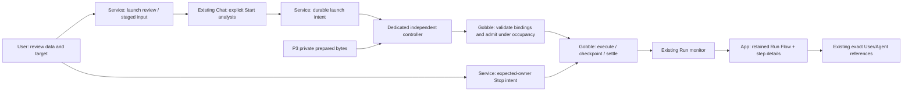
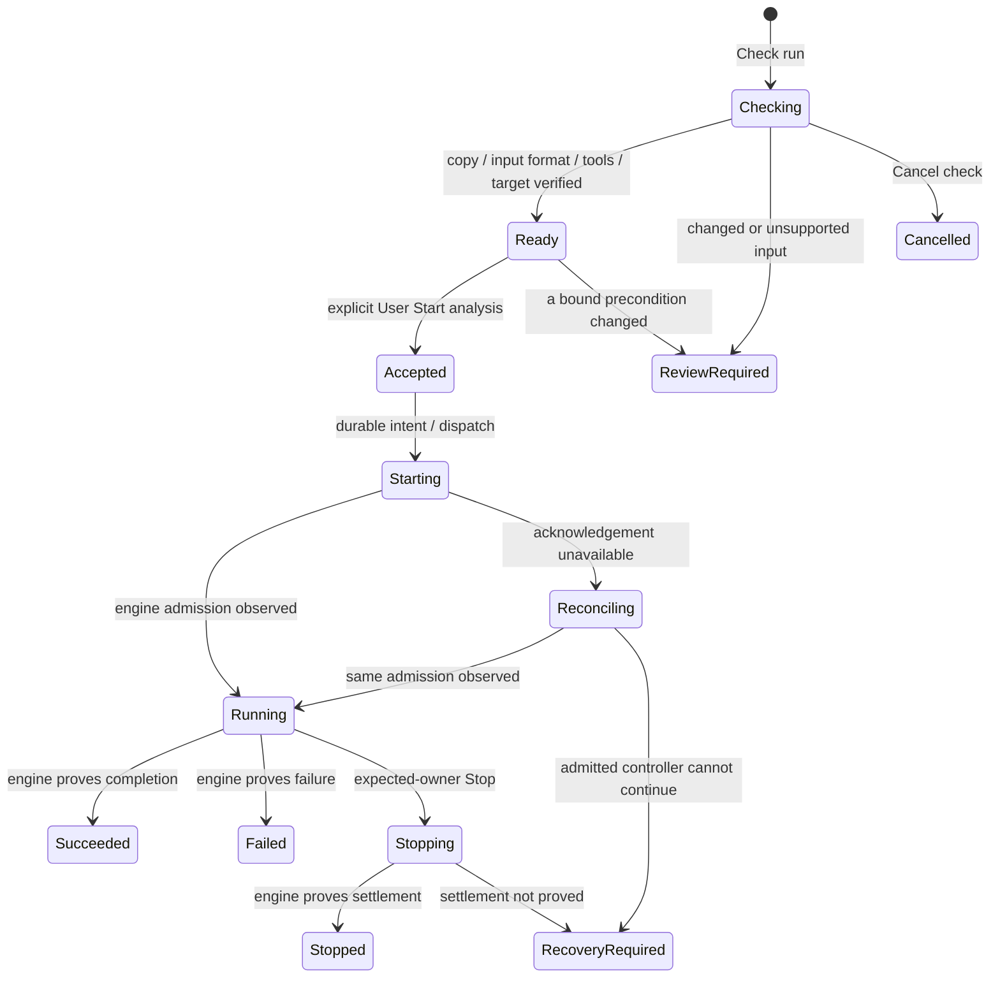

# P4 — Start, monitor and Stop the reviewed analysis

Status: concrete design proposal for owner review, 2026-09-12. P3 is implemented and accepted. This checkpoint changes design documents and a non-executing interactive sketch only; it does not authorize a research Run or add production controls.

[Interactive sketch](sketch.html) · [Implementation plan and acceptance](plan.md) · [P3 result](../../stages/p3-run-preparation/README.md)

## User outcome

Review the analysis through Flow, data and scientific settings, then start that exact version. Follow real task states on its Flow and discuss a step, failure or result through the existing Chat. Stop addresses this Run's observed owner. Closing the App leaves an admitted controller running; reopening reconnects to it.

The first scope remains App-created single-end Trim Galore → FastQC, including supported refinements, on local Docker. It adds neither Resume nor arbitrary imported workflows. Scientific task commands remain Gobble-owned. All product UI is English.

## Findings in the current code

| Evidence                                                                                                                                               | Implication for P4                                                                                                                                                                                     |
| ------------------------------------------------------------------------------------------------------------------------------------------------------ | ------------------------------------------------------------------------------------------------------------------------------------------------------------------------------------------------------ |
| `internal/engine/prepared.go: DecodePrepared` validates complete sealed bytes and binds source/input metadata/runtime.                                 | Reuse this codec before effects. Do not compile Project Go at Start. Actual input content and output workspace are additional launch facts.                                                            |
| `run.go: Run` accepts a Graph and builds a Document; `internal/engine/run.go: Run/occupy` checks and creates an occupancy.                             | Add a prepared admission path at the engine owner. Calling today's public Run from arbitrary Project source is the wrong App boundary.                                                                 |
| `internal/engine/state.go: jsonRun` retains identity, snapshot and occupancy, but no launch correlation.                                               | A service journal alone cannot distinguish lost acknowledgement from no launch. Retain an exact admission identity inside the committed engine checkpoint.                                             |
| `stop.go` and `internal/engine/stop.go: Stop` choose the owner at call time. Internal durable requests already address one lease.                      | Add expected-owner Stop. Compare the expected lease in Gobble, write only that lease's request, and never reconcile/release a later owner. Preserve existing CLI Stop behavior.                        |
| `internal/appservice/runtime.go` exposes bounded identity/monitor queries; `runs.go` attaches existing workspaces.                                     | Add a separate launch owner and bind its result to existing Run registration/query paths. Keep query containers disposable and execution controllers independent.                                      |
| `cmd/gobble-container/main.go` creates a random controller and attaches the caller; `containerenv.Prepare` expects a writable Project and runtime pin. | Do not reuse that wrapper as a generic App Start command. Use a dedicated no-source entry, exact target mounts and discoverable controller identity. Review bootstrap/mount assumptions explicitly.    |
| `internal/engine/exec/docker.go: ensureImage` can pull a missing tool image.                                                                           | Checking an image name is not proof of launch readiness. Resolve required installed images before confirmation and enforce the accepted image set at dispatch; no surprise image download after Start. |

These are source findings, not reproduced defects in P3. No new runtime behavior has been tested at this design checkpoint.

## Concepts and ownership

| Concept       | Identity and owner                                                                                                                                                                             |
| ------------- | ---------------------------------------------------------------------------------------------------------------------------------------------------------------------------------------------- |
| Preparation   | Existing immutable P3 safe review and private executable payload. It does not acquire execution authority.                                                                                     |
| Launch review | One service-owned candidate binding a preparation to staged input content, qualified installed tools and a reserved new output location. Its ready state is read-only evidence, not a Run.     |
| Staged input  | A complete copied file with a content digest and explicit validation result. Original data stays separate. Never silently treat P3 metadata as a content snapshot.                             |
| Launch intent | A durable User-authorized command binding the ready launch review, exact prepared digest, input digest, runtime/tools and workspace allocation. Request replay returns this command's outcome. |
| Admission     | Gobble's decision, committed with the first Run checkpoint before any task submission. It binds launch intent, prepared digest, execution identity and owner lease.                            |
| Controller    | Gobble's independent execution process. Service launch/query/Chat lifetimes do not own its lifetime.                                                                                           |
| Run           | Existing engine execution facts registered in the Project, associated with its exact preparation and launch intent. A Current edit never changes an active Run's source Flow.                  |
| Run Flow      | A presentation of the Run's retained design plus engine task states, linked by engine task IDs. No positional/name matching or App scheduler. Unknown facts stay unknown.                      |
| Stop intent   | An independent durable request with Run identity and expected owner lease. Request accepted, settling and stopped are distinct observations.                                                   |

## Recommended decisions

**Stage a data copy before final Start confirmation.** Checking a live file in place is cheaper but later changes can invalidate what was reviewed. Prefer a streamed copy, content digest and declared FASTQ-format validation into one service-owned staging allocation. Display copy progress, disk use and Cancel check. Reject incomplete/truncated compression and unsupported format without calling the data scientifically valid. Source metadata is checked before/after copying; the copied bytes are the exact launch input. If source/Current changes before confirmation, require another review. After accepted Start, later original edits do not affect staged input.

**Allocate a new result directory per launch.** Reusing an existing execution workspace adds occupancy and overwrite choices prematurely. Prefer a service-reserved unique directory under the Project's `runs/` area, with a readable name plus collision-proof identity. The UI displays the exact relative output location before confirmation. Do not reuse, overwrite or release an unrelated workspace. Reservation identity is bound into the launch review. Private payload/intent stay in the private profile; mount only exact required inputs and this output workspace into the controller. Preserve original prepared logical paths through explicit mount/staging mapping rather than rewriting authored executable semantics.

**Use an independent controller with engine admission correlation.** An App child is simpler but ties execution to App shutdown. Prefer a durable intent before dispatch and a deterministic controller identity derived from that intent. Reconnect through the exact container and engine admission receipt. Container labels/name alone do not prove correct execution: verify daemon, exact image, configured mounts/entry/intent and the committed engine receipt. Never create a second controller after an ambiguous dispatch. A stopped/dead admitted controller requires recovery; P4 never restarts its completed or interrupted work automatically.

**Confirm once in the existing Chat.** Preserve the established direction that execution approval is a typed User action. The middle panel provides detailed launch review; one compact linked action card in the existing Chat shows exact data copy, output location and effects with Start analysis / Back to review. It is not another input window or generic question answer. The Agent may explain and point, but has no Start/Stop tool in this first scope. Persist/revalidate the exact action card identity through Main/service; copying text or replaying an Agent message cannot approve execution.

**Keep Run status distinct from design.** On admission, show the Run Flow in the central surface, with a compact Design / Run switch and the exact Run label. Clicking a node opens its existing task/log details below. Current can advance independently; the active Run never inherits the new Flow. Do not present progress percentages or ETA unless Gobble actually supplies them.

**Stop the observed owner.** Provide Stop analysis in the Run header. One explicit action requests stopping; the UI then says Stopping while Gobble settles work. No destructive confirmation dialog is needed for this recoverable action. An owner mismatch yields “This run changed. Refresh its status.” App close, lost connection and stopping an Agent turn do not issue Stop.

## Lifecycle and recovery

This is a UI outline, not one persisted mega-enum. Launch-review lifecycle, command delivery, Run state and observation availability belong to different records. Lost connection is an observation condition and can occur alongside any Run outcome. It must never overwrite execution facts with “failed.” Stop requested before a delayed Start acknowledgement is reconciled against the same admission; the first UI does not expose Stop until an exact owner is known.

Check cancellation removes only task-owned incomplete staging after the operation is terminal; no Run exists yet. Accepted execution is not cancelled on service shutdown. Admitted data, workspace and controller evidence are retained; automatic cleanup or retention policies need a separate design. A rejected launch may offer explicit retry only when non-admission is proved. Unknown dispatch gets Check status, never a new Start.

## Scope and implementation boundary

The proposed P4 milestone contains engine admission/conditional Stop, native staging and launch/reconciliation, then App control/Run-Flow integration with full acceptance. No remote execution, arbitrary command runner, new scientific viewer, Resume, packaging or analysis of the User's real data is included in implementation tests. Use synthetic FASTQ and task-owned temporary Projects for qualification; missing tools/images are reported rather than downloaded silently.

Production version changes are to be assigned after implementation compatibility review. Do not alter frozen P3 payload format, Workspace19/bundle24 or engine schema2 merely to add a convenient field. An admission-bearing execution record requires an explicitly versioned read/write contract; old monitors must refuse unsupported records rather than partially interpret them.
