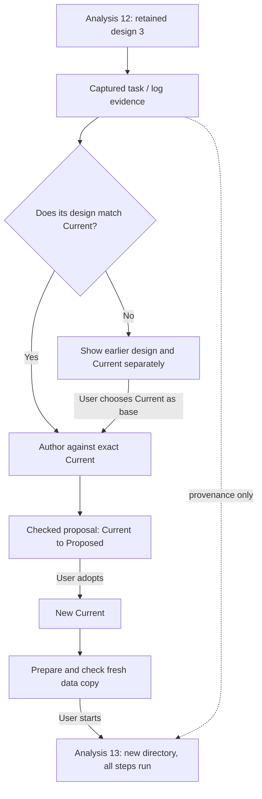

# P5 ownership and source review

Design proposal, 2026-09-12. Findings are source inspection, not newly reproduced runtime defects. Paths below are repository-relative. Existing P4 verification is reused only for its recorded scope.

## Definitions

| Concept            | Meaning / owner                                                                                                                                                                                           | It must not mean                                                     |
| ------------------ | --------------------------------------------------------------------------------------------------------------------------------------------------------------------------------------------------------- | -------------------------------------------------------------------- |
| Project            | Durable collaboration scope containing Pipelines, Runs and shared evidence. Native catalog owns associations.                                                                                             | One execution directory or one chat turn.                            |
| Workspace          | App presentation state: surfaces, panes, selections and navigation, owned by Main's existing single writer. The engine separately calls an execution directory a workspace; UI names it Results location. | A second Pipeline or execution authority.                            |
| Pane / Surface     | Pane is a layout slot; Surface is a view of an identified resource. A Run Flow and a Pipeline Flow can occupy the same pane at different times.                                                           | A mutable copy of the resource.                                      |
| Pipeline Current   | Latest User-adopted checked design. Native source lifecycle owns it.                                                                                                                                      | The design every historical Run used.                                |
| Run                | Engine execution identity with its own admitted preparation, input snapshot, state and task attempts.                                                                                                     | A mutable view of Current or a conversation.                         |
| Task attempt       | An engine-identified execution attempt. A step label is display text; selection requires instance identity and attempt.                                                                                   | A renderer-assigned attempt number.                                  |
| Feedback reference | Existing immutable captured evidence for an exact Run snapshot, task attempt or bounded log selection. Main owns capture/availability and Agent exposure.                                                 | A free-text diagnosis or permission to edit/execute.                 |
| Follow-up context  | Proposed service-owned association connecting an origin Run to a proposal and, eventually, a fresh launch. Carries provenance, not execution semantics.                                                   | A generic workflow engine or proof of cached outputs.                |
| New analysis       | Existing P3/P4 preparation and Start into a new results directory; proposed provenance links it to earlier evidence.                                                                                      | Resume or an in-place replacement of earlier results.                |
| Resume             | Future separately admitted continuation of the same Run. Gobble decides ownership, work reuse and new attempts.                                                                                           | Repeating Start, reopening a pane or restarting a missing container. |

## Current code evidence and implications

| Source anchor                                                                                                  | Finding                                                                                                                        | Design / implementation consequence                                                                                                                                |
| -------------------------------------------------------------------------------------------------------------- | ------------------------------------------------------------------------------------------------------------------------------ | ------------------------------------------------------------------------------------------------------------------------------------------------------------------ |
| `app/desktop/src/renderer/run-launch/RetainedRunFlow.tsx: RetainedRunFlow`                                     | Uses the launch's retained preparation; joins observed tasks by task ID and requires an unambiguous instance.                  | Reuse it. Historical Flow must not switch to Current when discussing a fix.                                                                                        |
| `app/desktop/src/renderer/workspace/views/RunView.tsx: selectionFlight`                                        | Awaits selection acknowledgement before discussion.                                                                            | Preserve this barrier through the feedback shortcut; fast clicks must not attach the previously selected task.                                                     |
| `app/contracts/src/observed-reference.ts: containsObservedTarget`                                              | Requires the same Project, resource and data revision; exact instance/attempt or contained log range.                          | Build on existing references; do not replace them with screenshots or task names.                                                                                  |
| `internal/appservice/pipeline_proposal.go: proposePipeline`; `pipeline_proposal_source.go: proposalBaseLocked` | Proposal request binds the exact base artifact, retained source and bounded managed authoring scope.                           | Add provenance alongside that contract. Origin Run never becomes the editable base by accident.                                                                    |
| `internal/pipelinereview/authoring.go`; `definition.go`                                                        | Current refinement covers Trim Galore Quality/Length and supported FastQC addition.                                            | Do not mock a memory/CPU/tool-version repair as a currently supported Agent action. Unsupported fixes must be stated and preserved as discussion.                  |
| `internal/appservice/launch_operations.go`; `launch_review.go`                                                 | Start has durable admission/reconciliation and blocks a new launch when an earlier outcome is unconfirmed.                     | A “follow-up” must call the same Start path; no bypass on controller loss or unknown prior execution.                                                              |
| `internal/engine/resume.go: checkResume`                                                                       | Explicitly refuses admission-bearing prepared Runs. Ordinary Resume can classify a supplied changed graph.                     | P5A cannot expose Resume by removing a UI guard. Prepared Resume needs an engine entry and compatibility review.                                                   |
| `internal/engine/resume.go: occupyResume`                                                                      | Creates a new occupancy lease, preserves Run ID and task history, and constructs a new Run header without admission.           | Simply deleting the refusal loses P4 admission semantics. Preserve original launch receipt plus separately versioned continuation receipts before enabling Resume. |
| `internal/engine/admission.go: ReadAdmission/validAdmission`; `checkpoint.go`                                  | Current admission lease must equal occupancy lease; format 2 requires coherent admission.                                      | A new owner cannot just overwrite the old lease. Old launch replay and Stop association must remain unambiguous after continuation.                                |
| `internal/engine/reuse.go: classifyReuseMode/compareInputIdentity/destReuseMiss/classifyResume`                | Actual reuse examines identity, commands, parameters, environment/images, content fingerprints, outputs and downstream impact. | A green node is not reuse proof. Only an engine-produced, freshness-bound review may say “Can reuse.”                                                              |
| `internal/engine/resume.go: resumeNeedsFreshAttempt/checkResumeOutputs`                                        | Attempt handling differs by prior state; failed/blocked output destinations have stricter rules than incomplete/succeeded.     | Begin P5B with settled stopped work; qualify failed retries separately, including attempt history and attributed outputs.                                          |
| `internal/engine/install_identity.go: matchInstallIdentity`                                                    | Resume still validates installation/module/platform identity; packed and module identities differ.                             | Do not present general engine Resume as portable App recovery across runtime changes.                                                                              |

## Communication and ownership

```mermaid
flowchart LR
  U[User selects observed step] --> V[App Run Flow and task details]
  V --> E[Main: capture exact reference]
  E --> C[Existing Chat draft]
  C -->|User sends| A[Agent: explain and propose]
  A -->|scoped source proposal| N[Native: retain base and candidate]
  N --> G[Gobble: check design and compare]
  G --> B[App: Change spotlight]
  B -->|User adopts| P[Native: advance Current]
  P --> L[Existing preparation and data check]
  L -->|User Start in Chat| X[Existing P4 admission and execution]
  X --> R[New Run with retained Flow]
  E -. origin reference .-> F[Native: follow-up provenance]
  F -. link only .-> N
  F -. link only .-> R
```

Agent authoring tools may read a User-shared captured reference and request a supported proposal. They cannot adopt it, forge a User action or Start/Stop/Resume. No new external MCP server is needed. Existing named in-App tools remain the transport; service/Main validate identity and scope on every call.

### Proposed minimal data boundary

Use a bounded, versioned `RunFollowUp` record, not a second persisted workflow state machine:

- identity: Project, Pipeline, follow-up ID, created-at;
- origin: Run ref, exact launch/preparation identity, observed revision;
- evidence: validated existing attachment/reference IDs and capture digests (bounded list); no copied raw log blob in service metadata;
- base: exact Current artifact against which authoring was authorized;
- links: proposal ID, adopted artifact and fresh launch-review ID as they become known.

Main owns the referenced evidence bytes. Native validates the Project/Run/preparation/Pipeline relationship; Main validates evidence scope and completeness before sending it to the Agent. Missing evidence may be shown as unavailable but must not silently retarget the current Run or authorize a new proposal. A draft attachment becomes a sent evidence association only after the existing Send path succeeds. Freeze the actual wire shape, version increments and limits during P5A contract work, following compatibility tests; the above is a proposed model, not an implemented API.

Keep native follow-up behavior in a dedicated `internal/appservice/run_followup.go` owner and named routes; `pipeline_proposal.go` only receives a validated optional association. Preserve its existing responsibilities. Add `app/contracts/src/run-followup.ts`, a matching Main adapter and a small renderer `run-feedback/` feature containing the attachment action, provenance view and observation hook. Existing `PipelineReviewPanel`, `RunPreparation`, `LaunchActionCards` and their stores retain review/execution behavior. Extract common launch utilities only when needed by two actual callers. Do not split every DTO or button into an abstraction.

A proposed `createRunFollowUp` operation is idempotent by request ID and exact content. `readRunFollowUp` is read-only. Proposal/adoption/launch link writes belong to their successful native transition, with crash-safe retry; the renderer never marks a link complete optimistically. An optional validated follow-up ID in existing requests is preferable to parallel proposal/Start APIs. User-facing display names are not identifiers.

## Identity transitions and stale information

Revision numbers in the sketch are readable illustrative labels; production may use retained version names and timestamps. Identity uses artifact digests.

- If Current advances before proposal submission/adoption: refuse the old base, retain the proposal, ask for a fresh checked proposal. Do not auto-rebase or map renamed steps.
- If a historical Run differs from Current: show “This analysis used an earlier design.” Offer **Open current design** with its exact inspected base. Sharing the older evidence remains valid. A Current selection must be explicit before an Agent edit targets it.
- If original data changes before fresh launch confirmation: existing P4 freshness rules require another check. If new bytes differ from the origin Run, disclose “Data differs from Analysis 12”; preserve content hashes without implying a controlled comparison. Reusing the old staged input as a new input source is a later capability, not silently added here.
- If the origin Run outcome/owner is unknown: observation may continue; it is not marked failed. New execution retains P4's unresolved-launch guard. Offer Check status.
- Adoption does not imply successful correction; launch success does not establish scientific improvement. Evidence remains available even when a proposal is declined or a later analysis fails.

## P5B future continuation contract

Keep same Run identity and sealed preparation for the first continuation scope. Store immutable original launch admission separately from a chain of continuation admissions; associate each command, owner lease and attempt history explicitly. New format/version readers must reject incompatible records; do not weaken format-2 validation. Original Start replay continues to return the original admission, never schedules again. Old Stop addresses only its recorded lease.

Gobble needs a read-only continuation review with exact origin snapshot, preparation/input/runtime/tools, result fingerprints, owner state, per-step reuse/rerun/block reason and review digest. Successful review must not acquire occupancy or start/reconcile work. If recovery requires mutation, return recovery-required as a separate future action. Under the execution lock, recheck all acceptance facts and atomically persist the accepted continuation before task submission. If they changed, return review-stale; never silently turn “reuse 1 step” into “rerun 2.” Unknown/live owner, missing data or incompatible runtime block confirmation. Request replay follows the exact continuation receipt.

During review use **Can reuse**; only the admitted engine decision may say **Reused**. Steps needing work use **Will run**. “Check continuation” is not Resume permission. This is the architecture target for a later proposal, not a complete wire contract or an implementation commitment in P5A.
