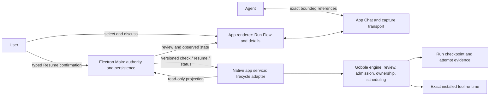

# P5B architecture and source study

Status: proposed, not shipped. Source examined in the local dirty working tree on 2026-09-13 KST. HEAD `7fe3d5c9e10d0cc104a15b6e7aa3def0d15b98f1` alone does not identify these inputs; [production-before.json](evidence/production-before.json) records the app/internal file hashes. Existing P5A contracts remain unchanged in this design checkpoint.

## Concepts

| Concept              | Meaning and owner                                                                                                                        |
| -------------------- | ---------------------------------------------------------------------------------------------------------------------------------------- |
| Project              | App collaboration boundary linking Agents, discussions, Pipelines, Runs and resources; not an engine execution owner                     |
| Workspace            | App arrangement of shared views and navigation; a native execution workspace is separately the engine-owned durable Run directory        |
| Pipeline Current     | Checked adopted design for future analyses; Agent changes it through reviewed proposals                                                  |
| Run                  | One analysis using its sealed prepared design/data and result location; immutable initial identity plus chronological execution history  |
| Execution epoch      | One admitted scheduling ownership interval, including its exact lease; initial Start and each accepted continuation have distinct epochs |
| Task attempt         | An execution of one step; a continued stopped step creates the next attempt, while verified completed work keeps its earlier attempt     |
| Continuation review  | Read-only engine evidence of eligibility and exact per-step decisions at a particular snapshot/history head; not authorization           |
| Continuation intent  | A typed User action bound to that review and a unique request ID; neither free text nor an Agent tool call                               |
| Continuation receipt | Durable engine acknowledgement of one committed continuation epoch; retries with the same body return the same receipt                   |
| Pane                 | App presentation container for a resource; continuation is a presentation mode of the existing Run resource, not a new resource family   |
| Shared reference     | Immutable bounded capture of Run/review/step/attempt identity and visible meaning; a later attempt never retargets an earlier discussion |

## Existing code: why a Resume button is insufficient

| Source                                                   | Observed behavior                                                                                                          | Design consequence                                                                                                                            |
| -------------------------------------------------------- | -------------------------------------------------------------------------------------------------------------------------- | --------------------------------------------------------------------------------------------------------------------------------------------- |
| `internal/engine/resume.go:37` (`checkResume`)           | Prepared Runs explicitly reject ordinary Resume with a separate-reviewed-admission requirement                             | Preserve this guard. Add a dedicated prepared continuation path                                                                               |
| `internal/engine/resume.go:201` (`occupyResume`)         | Claims ownership, may reconcile interrupted execution, accepts generic graph changes, creates attempts                     | Cannot serve as a read-only review or App's narrowly scoped continuation implementation                                                       |
| `internal/engine/admission.go:151` (`validAdmission`)    | Original admission lease must match current occupancy; duplicate Start returns its original receipt                        | Separate immutable origin admission from current epoch. Never reinterpret replayed Start as Resume                                            |
| `internal/engine/checkpoint.go:61,84,210`                | Readers accept formats 1/2; format 2 validates admission; coherent state publishes through a durable pointer               | Add explicit continuation-aware format 3 with strict readers. Preserve history in retained canonical state, not pruned prior checkpoint files |
| `internal/engine/reuse.go:64,68`                         | Full classification compares actual input/output content and task/tool properties; cheaper views are not equivalent        | Only authoritative content checks can justify reuse. Status/mtime-only display must not imply it                                              |
| `internal/engine/resume.go:96`                           | Generic output handling may replace attributable incomplete destinations; published-unfinalized has special reuse behavior | First slice rejects ambiguous/published-unfinalized outputs; no permissive generic cleanup during review                                      |
| `internal/engine/install_identity.go:121`                | Resume checks exact local executable identity and version/revision                                                         | Old qualified image cannot be swapped for a new Resume engine. First-slice compatibility begins at the new engine's initial admission         |
| `internal/engine/stop.go`, `stop_test.go`                | Stop is lease-specific; tests protect against a delayed Stop releasing a new owner                                         | Each epoch gets its own Stop intent and target lease; historical Stop cannot stop the continuation                                            |
| `internal/appservice/launch_operations.go:11,93,105,191` | One launch operation stores one Start/owner and Stop request                                                               | Keep initial operation immutable; add a focused continuation lifecycle and project latest epoch for observation                               |
| `cmd/gobble/prepared_run.go`                             | Dedicated prepared status/stop and sealed Start path                                                                       | Add a versioned continuation boundary using sealed inputs, not Project Go compilation                                                         |
| `internal/engine/exec/exec.go`, `exec/logs.go`           | Attempt-specific files refuse conflicting existing attempt files                                                           | Keep old logs and evidence; qualify fresh-attempt scratch and publication behavior                                                            |

These findings are an inspection of the current repository, not external product claims or test results from this turn. Existing ordinary Resume tests show useful invariants but do not qualify prepared continuation.

## Ownership



Renderer selects and presents, Main validates User authority and associates Project/Pipeline/Run, native transports the dedicated protocol and recovers command status, engine alone decides reuse, commits ownership and schedules. Agent authors design proposals and discusses reviews; it cannot approve its own execution. Existing shared view tools may expose a read-only review; execution capability remains separate. MCP is a transport option for Agent references, not permission or a second execution store.

## Proposed contract and storage

Names below describe responsibilities, not final exported APIs or shipped schema versions.

- `ContinuationReview`: schema version, Project/Pipeline/Run binding, immutable origin admission digest, stopped snapshot, history head, prepared digest, installed engine/tool identities, staged input digest, verified output evidence, eligibility/block reasons, and per-task `{taskID, priorAttempt, decision, plannedAttempt?, reason}`. Canonical digest covers the complete decision and evidence. Bound sizes and permitted graph shapes in the contract phase.
- `ContinuationIntent`: version, request ID, exact Run binding, review digest and expected history head. Host resolves stored authoritative review; renderer/Agent cannot supply arbitrary paths, graph, command, tool identities or output decisions.
- `ContinuationReceipt`: intent digest, origin Run ID, previous history head, new epoch ID/lease, accepted review digest, admission snapshot and per-task plan. Same request/body returns same receipt; same request/different body conflicts.
- Format 3 Run state retains immutable initial Start admission plus an ordered continuation chain and current execution epoch. Previous receipt identities remain queryable after checkpoint pruning. Proposed history cap: 32 continuation admissions per Run, explicitly blocked at the limit; finalize bounds after serialized-size and lifecycle tests.
- The existing launch operation is the initial Start record. A new focused continuation operation stores pending intent/status, while observation derives the latest epoch. Stop intent belongs to the epoch being stopped. Avoid adding another mutable “latest request” into the original Start record.
- Capability/version negotiation distinguishes inspection support from prepared-continuation support. New initial admissions use format 3 only with qualified engine support. No silent format 2 migration, pointer downgrade, or image replacement. Retain older inspection and initial Start replay semantics.

Suggested source organization: `internal/preparation/continuation.go` owns sealed wire types/validation; `internal/engine/continuation_review.go` owns read-only checks; `continuation_admission.go` owns lock/revalidation/receipt; existing scheduler and attempt persistence retain scheduling mechanics. `internal/appservice/continuation_operations.go` adapts lifecycle, not reuse policy. Main gets a dedicated continuation service using existing stores/authority. Renderer gets feature-local Run continuation projection/components rather than extending the proposal editor or generic Pane switch. Share pure validation only when both callers need the same invariant. Do not introduce an extensible recovery framework for one linear workflow.

## Sequence and crash boundaries

```mermaid
sequenceDiagram
  actor U as User
  participant A as App / Main
  participant N as Native adapter
  participant G as Gobble engine
  participant C as Durable checkpoint
  U->>A: Check continuation
  A->>N: Exact saved Run binding
  N->>G: Read-only review
  G-->>A: Decisions + review digest (or blocked)
  U->>A: Discuss exact review / step
  Note over U,A: Selection and sending grant no execution permission
  U->>A: Resume analysis
  A->>A: Persist typed intent and request ID
  A->>N: Resume exact reviewed intent
  N->>G: Admit continuation
  G->>G: Lock; verify stopped owner and all reviewed facts
  alt Review changed or unsupported
    G-->>A: Refuse; check again
  else Facts match
    G->>C: Atomically publish new epoch + receipt + attempts
    G->>G: Schedule authorized work
    G-->>A: Same Run; new epoch receipt
  end
  Note over A,G: Lost acknowledgement: query same request; never create a replacement Start
```

No check claims occupancy, reconciles an interrupted owner, deletes outputs, pulls a retagged tool, or starts work. Content hashing must return unavailable/changed if a coherent observation cannot be obtained. Admission revalidates while holding the engine's mutation lock and uses the same checked plan; it never silently expands work. External file mutation is not solved by the engine lock alone: execution must retain existing sealed input protections, revalidate immediate task consumption/publication boundaries, and refuse inconsistent inputs. Do not promise protection against arbitrary privileged concurrent filesystem writes.

Crash before atomic publication grants no work; recover by inspecting the same request. Crash after publication preserves the receipt; an unresponsive owner is not automatically restarted by this feature. Status can report admitted/interrupted and route to a later recovery design. A valid receipt proves admission, not task completion. App restart restores the same pending operation; no second Resume/Start is synthesized.

## Reference semantics

Existing Run/task/log captures remain historical. A new versioned continuation selector carries Run snapshot, review ID/digest, task identity, prior and planned attempt, decision/reason and bounded visible content. Overview and step references must have distinct selectors. A later recheck cannot update an attached or sent reference. Opening an old reference shows its captured meaning; explicit navigation may reveal a newer review with a clear difference. Agent-origin references undergo the same Project/Run binding and stored-content validation as User captures. No arbitrary file contents or entire logs are attached by selecting a Flow step.

## Blocking and recovery vocabulary

| State                                | User-facing consequence                        | Allowed next action                           |
| ------------------------------------ | ---------------------------------------------- | --------------------------------------------- |
| Stopping / active owner              | Wait for Stop to settle                        | Refresh status, discuss                       |
| Stopped, unchecked                   | Recorded state is not reuse evidence           | Check continuation                            |
| Checked                              | Explain each kept result and restarted attempt | Discuss, Resume, Not now                      |
| Stale review                         | Prior plan cannot authorize work               | Recheck; retain old reference                 |
| Missing/changed completed output     | No silent rerun of completed work              | Discuss; separate new analysis                |
| Current advanced                     | Saved Run design stays authoritative           | Continue saved Run or explicitly open Current |
| Earlier engine                       | Inspection only for this feature               | Inspect or separate new analysis              |
| Unknown acknowledgement              | Outcome unknown, no duplicate command          | Query same request                            |
| Continued                            | Same Run, distinct epoch/attempts              | Observe; Stop current epoch                   |
| Failed/interrupted/ambiguous publish | Outside first-slice recovery                   | Inspect/discuss; no enabled Resume            |
