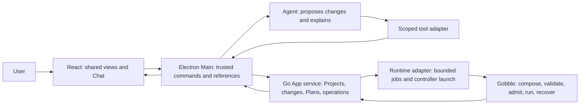
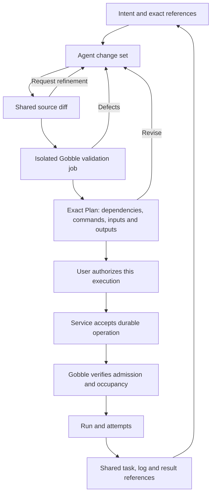

# Pipeline collaboration — Proposed design

> Draft for owner review, 2026-09-09. Accepted direction: Project-centered,
> Agent-authored pipeline work, shared views and right Chat. The detailed contracts
> below are proposals, not implemented capabilities.
> Sources: [study](study.md), [architecture review](architecture-review.md) and the
> [existing ownership contract](../../../../.gobbi/projects/gobble/memory/design/architecture/project-workspace-contract.md).

## Product outcome

A researcher can ask an Agent to design or change a Go pipeline, inspect exactly
what changed and what Gobble will run, authorize execution, monitor it, and point
to a failed task or log passage to request the next change. The same Project,
Panes and Chat carry this whole interaction.

Agent-authored changes are the editing mechanism. The App owns communication,
review and commands. Gobble owns composition, validation, execution and recovery.
Code, tables, images, PDFs and saved Notebooks remain supporting shared views.
Notebook editing, CSV chart generation, a graph editor and new viewer families are
outside this proposal.

## Concept definitions

| Concept                              | Definition / identity                                                                                                                                                                | Authority and important distinction                                                                                                                                                                                                           |
| ------------------------------------ | ------------------------------------------------------------------------------------------------------------------------------------------------------------------------------------ | --------------------------------------------------------------------------------------------------------------------------------------------------------------------------------------------------------------------------------------------- |
| Project                              | Durable collaboration context binding registered source/resources, pipeline definitions, Agents and Run registrations.                                                               | Go service owns registration; App owns its presentation and chat. A Project is not a directory alias or a single Run.                                                                                                                         |
| Pipeline definition                  | Registered Go package entry point `Pipeline()` plus declared source/config/data bindings; stable `pipelineId`.                                                                       | Agent authors Go; service owns registration; Gobble defines Go DSL semantics. The existing Run pipeline label is only a label.                                                                                                                |
| Source revision                      | Immutable manifest of exact source/config bytes and relevant dependency declarations, rooted in a pipeline definition.                                                               | Service records content identity. Include dirty/untracked registered sources, go.mod/go.sum, declared local modules/config/sample sheets; a Git commit alone is insufficient. Large datasets remain explicitly versioned or mutable bindings. |
| Change set                           | Agent-authored intent and base → candidate source difference, with author/turn provenance and its own revision.                                                                      | Service owns lifecycle and conflict checks. A chat message or provider diff event alone is not authoritative source state.                                                                                                                    |
| Graph                                | Composed Gobble definition graph containing task definitions and dependency semantics.                                                                                               | Gobble; not a UI layout graph or a runtime task-instance list.                                                                                                                                                                                |
| Plan artifact                        | Gobble validation result for a specific source revision, declared inputs, runtime/toolchain and execution options; has an opaque service artifact ID and an engine admission digest. | Gobble owns semantics and the digest over its executable representation. App owns a read-only projection. A successful Plan does not authorize execution.                                                                                     |
| Execution authorization              | User-owned approval of a concrete Start or Resume request, source/Plan identity, target and declared effects.                                                                        | Recorded by the service via a trusted User action. A generic Question answer, Agent claim or old approval is insufficient.                                                                                                                    |
| Run                                  | Engine-owned execution identity and facts, attached to a Project through a Run registration.                                                                                         | Gobble owns run IDs/checkpoints/results; service maps opaque App Run references. Resume may retain an engine Run identity while creating a new controller lease.                                                                              |
| Task definition / instance / attempt | Definition node; runtime expansion of a definition; numbered execution attempt of an instance.                                                                                       | Gobble. Selection and commands name the appropriate level. Historical `taskId` fields that mean instance ID remain compatibility data.                                                                                                        |
| Engine workspace                     | Execution directory containing Gobble-owned control/checkpoint/log/output state.                                                                                                     | Gobble; not App layout or an Agent conversation working directory.                                                                                                                                                                            |
| App workspace                        | Project presentation state: Pane layout, open views, view state, chat and explicit evidence.                                                                                         | Electron Main's existing serialized workspace writer. It does not own mutable execution facts.                                                                                                                                                |
| Agent workspace                      | Isolated provider working context. Initially the existing read-only discussion context.                                                                                              | Provider adapter; not execution storage. New change tools have separate scoped service authority.                                                                                                                                             |
| Operation                            | Durable accepted command, distinct from a provider turn and an engine Run.                                                                                                           | Service owns command acceptance/reconciliation; Gobble owns execution admission and actual outcome. Closing Chat or App does not mean cancel analysis.                                                                                        |
| Surface / shared view                | A versioned presentation of a resource or workflow artifact, such as source, changes, Plan or Run.                                                                                   | Main resolves subject identity and references; renderer displays.                                                                                                                                                                             |
| Pane                                 | A display slot containing tabs and their view state.                                                                                                                                 | App; Pane identity is not data identity. The same Plan can appear in either Pane.                                                                                                                                                             |
| Reference / observation / evidence   | Exact target; receipt of what a participant actually saw; deliberately retained content supporting a conversation.                                                                   | Existing Main reference subsystem. References carry revision; stale targets are explicit, never silently moved.                                                                                                                               |

Source revision identity, Plan admission identity, dataset identity and engine
workspace identity answer different questions. Do not compress them into one
`version` or `workspaceId`.

## Ownership and communication



| Owner          | Owns                                                                                                                        | Calls / must preserve                                                                                    |
| -------------- | --------------------------------------------------------------------------------------------------------------------------- | -------------------------------------------------------------------------------------------------------- |
| React          | Read-only source/diff/Plan/Run views, navigation, English controls, User intent.                                            | Narrow preload API. No filesystem, engine rules, provider credentials or arbitrary execution arguments.  |
| Electron Main  | Sender/account/Project/Agent binding, shared context, durable UI/chat writer, provider adapter.                             | Service DTOs, not engine imports. Tool and User paths share policy and command semantics.                |
| Go App service | Pipeline/source registrations, candidate manifests, Plan job/artifact records, command journal and runtime dispatch.        | Exact pinned runtime via adapter. Never import engine internals or duplicate its checkpoint/reuse rules. |
| Gobble         | Go composition and validation, admission comparison, workspace occupancy, scheduling, Stop/Resume and reuse classification. | Remains useful through CLI without App, account or provider.                                             |
| Agent          | Change content, explanation, analysis and requested actions.                                                                | Bounded tools; cannot self-grant User execution authority.                                               |
| Provider       | Authentication, conversation protocol and model inference.                                                                  | Provider messages/events are input, not filesystem truth or successful execution receipts.               |

MCP is a possible future adapter over the same commands and references. The current
dynamic-tool transport is sufficient for this slice. No external MCP server,
extension host or generic tool registry is required.

## One collaboration loop



Validation and source acceptance are distinct actions. A user can validate a
candidate before accepting source changes. Start is offered only for an accepted
candidate with a matching validated Plan. Start executes retained candidate bytes,
not whatever later happens to be in the Project working directory.

## Agent authoring and source lifecycle

Select **a bounded change tool**, retaining the present read-only conversation
profile. Agent output supplies edits; the host performs mechanical containment,
revision checks and materialization. This is Agent authoring without a manual editor
or a general shell. A future native coding profile is an alternative only after
pinned-provider and isolation qualification.

First source scope: registered UTF-8 Go/config/sample-sheet files. Changes may edit
existing files and create declared new files across one candidate. Binary editing,
arbitrary deletion/rename, dependency installation, credentials, execution outputs
and files outside registered source bindings are excluded initially. A tool explains
unsupported work instead of guessing. Creation of a Go dependency declaration may
be proposed; fetching new dependencies is a separately authorized setup operation.

1. A User asks for pipeline work. Main binds that turn's change capability to a
   Project, pipeline and source scope; the Agent cannot broaden it.
2. Service captures the base manifest and retains original bytes. Agent proposals
   carry exact base file hashes and bounded replacements with unambiguous locations.
   Patch coordinates are UTF-8 byte offsets with expected content; view selections
   use their renderer-specific coordinate contracts and are translated by the host.
3. Service checks containment, unsupported file types, limits, scope and all base
   preconditions before publishing an immutable candidate. No partial candidate is
   visible. One authoring operation per pipeline is active at a time; other Agents
   can review and propose the next revision.
4. App opens Changes and shows base/candidate sides. User requests refinements in
   Chat. Each revision is retained under a new identity; old references keep their
   original targets.
5. User accepts exact changes. Applying them to Project source uses the service's
   managed writer, staging and a recovery journal. A changed base yields a conflict,
   never an automatic overwrite/rebase. Rejection retains the candidate for review.
6. A multi-file application publishes success only after all required writes are
   owned and complete. An interruption is an explicit incomplete application;
   recovery compares each file to retained before/after bytes and preserves unknown
   external edits. Plan/Start is blocked on an incomplete managed application.
7. Execution always uses a sealed candidate. Editing the working tree later creates
   another revision; it does not change an already authorized Run.

**Shared-source ownership:** managed source writes serialize at Project scope,
not only per pipeline. Two pipeline definitions can share Go modules/configuration.
Accepting a change invalidates every registered Plan whose source manifest includes
the affected bytes. Isolated candidate discussion may remain separate, but source
application has one Project writer and rechecks the complete base manifest.

**Concurrency limit:** the first apply path supports one managed source writer.
Ordinary filesystem hashes do not provide an atomic compare-and-swap against an
arbitrary external editor between check and replacement. The stage-3 design must
make this limit visible, detect external edits where observable, and must not claim
general concurrent-editor safety. If coexistence cannot be bounded for a selected
Project, keep its candidate isolated and require explicit source handoff instead of
overwriting that working tree. An isolated candidate is a real source directory,
not a second Pipeline language or a new general VCS.

Candidate publication and execution identity are strong service boundaries; atomic
visibility of every Project file to unrelated processes is not promised. The
accepted design checkpoint must review this distinction before enabling source writes.

## Plan generation and executable identity

Plan generation runs Go package initialization and Pipeline code. It runs in a
separate bounded container job with a read-only candidate, scratch output and
explicit declared input mounts. It has no controller credentials or Docker socket.
Network is disabled during validation; unavailable dependencies yield a setup
requirement, not a silent online install. Container process/memory/time/output
limits and the exact runtime/toolchain binding are qualified before this capability
is enabled. The normal host service never imports or evaluates Project Go code.

A Plan artifact records source revision, configuration/sample-sheet content,
declared data bindings, runtime image/toolchain identity, execution options, engine
plan format, normalized plan/admission digest and structured validation defects.
Sensitive environment values stay outside chat and plan JSON; their identity follows
Gobble's existing digest policy. Mutable datasets are disclosed rather than falsely
called snapshotted or reproducible.

The existing CLI rebuilds and invokes Go independently for each operation.
Source equality alone is insufficient. The proposed path is **isolated preparation
followed by engine-owned admission of the exact prepared document**:

1. Project Go code runs only in the bounded evaluator, which produces Gobble's
   inspectable Plan and a versioned, private prepared execution payload.
2. Gobble owns that payload's complete encoding, validation and admission digest.
   The service retains immutable bytes and opaque identity; App/Agent receive the
   safe Plan projection. This is a Gobble interchange artifact, not a new authored
   Pipeline language or a replica of runtime checkpoints.
3. The execution controller loads and validates the prepared payload, compares it
   to the exact authorized digest/options/bindings, and only then obtains occupancy
   and launches tasks. It does not invoke arbitrary Project Go code with controller
   or Docker authority before admission.
4. Resume uses the same prepared candidate and Gobble's prior-workspace classifier.
   Re-preparing a nondeterministic Go definition creates a new artifact/Plan, and
   never silently replaces the reviewed one. Changed admission/input/workspace
   preconditions return an explicit review requirement.

This is a focused new Gobble contract and requires qualification before effects.
Do not turn present Plan JSON into an assumed executable serialization: it omits
values such as environment contents, and Path/Directory internals need an owning
codec rather than default JSON marshaling. Private prepared payloads may contain
sensitive values; retain them under service/runtime access controls and never export
them as ordinary chat evidence. Runtime options and input checks that happen later
must be included in admission or explicitly disclosed and revalidated. The existing
trusted standalone CLI path remains supported; the new App path must not inherit
its unrestricted Project-code evaluation boundary.

A Plan graph represents task definitions. Runtime expansions/attempts appear in a
Run graph. A graph click can point to a Plan node; a Go source location is linked only
when an actual mapping exists. Agent-suggested source links are labeled suggestions.

## Commands, authorization and recovery

Proposed service commands are narrow domain operations, not a generic `execute`:

| Operation          | Required identity / result                                                                                             |
| ------------------ | ---------------------------------------------------------------------------------------------------------------------- |
| Register pipeline  | Project, registered entry point and declared bindings → pipeline ID.                                                   |
| Propose changes    | Bound authoring scope, base source revision, bounded changes → candidate/change-set revision or conflict.              |
| Accept changes     | Exact change-set revision and current base → accepted source revision, conflict or recoverable incomplete application. |
| Validate candidate | Exact source revision, runtime and options → validation operation; later a Plan artifact or structured defects.        |
| Start              | Trusted authorization, accepted source revision, Plan ID/digest, runtime/target and request ID → durable operation.    |
| Stop               | Run reference, expected controller lease and request ID → requested / settled / recovery-required / owner-changed.     |
| Preview Resume     | Candidate Plan plus observed prior Run/checkpoint identity → engine-owned reuse/rerun/rejection reasons.               |
| Resume             | Exact preview/admission identity, expected workspace ownership, authorization and request ID → durable operation.      |
| Get operation      | Operation ID → acceptance, dispatch/reconciliation and engine outcome.                                                 |

Every mutation receives a request ID and canonical payload digest. Reusing the ID
with the same payload returns the same operation; a different payload is rejected.
Acceptance is durably written before an operation ID is returned. Transport
cancellation ends the caller's wait; it is not Stop. An Agent turn ending does not
end a validation/execution operation.

A service journal does not itself guarantee exactly-once launch. Gobble must record
a discoverable launch correlation under its workspace admission/occupancy boundary.
After a crash between dispatch and acknowledgement, the service resolves that
correlation before any retry. An unknown result stays unknown/reconciling; never
present failure as proof that nothing ran. A controller outlives Electron and the
query service; closing the App must not kill a Run.

Stop must atomically compare the caller's expected lease inside Gobble. A service
preflight followed by today's unconditional public Stop leaves a race. Resume
preview must reuse Gobble's classifier against the candidate and recorded workspace;
the App's visual DAG diff is not a reuse oracle. Any source, runtime, input or prior
workspace change invalidates relevant authorization/preview.

A Chat question answer is communication. Run approval is a separate typed trusted
User action, presented inline in the same Chat with an exact summary. The Agent may
request that action, but cannot fabricate the authorization receipt.

## Shared views and interaction sketch

```text
┌──────────────── Project: RNA study ────────────────────────────────┐
│ Files / Pipelines / Runs │ Pipeline: RNA-seq              │ Chat    │
│ (collapsible)            │ Changes  Plan  Run             │ Agent A │
│                         │                               │         │
│ RNA-seq                 │ [read-only diff or Plan graph] │ Change  │
│   Current source        │                               │ summary │
│   Latest Plan           │ Select lines / hunk / node    │ + exact │
│   Runs                  │ → Discuss selection            │ sources │
│                         ├───────────────────────────────┤         │
│                         │ Optional second Pane:          │ Review  │
│                         │ source, task details or log    │ action  │
│                         │                               │         │
│                         │                               │ Composer│
└─────────────────────────┴───────────────────────────────┴─────────┘
```

This is an information/ownership sketch, not a replacement visual design.
Changes/Plan/Run are contextual views for a selected pipeline, not three permanent
dashboards. Keep the current compact Project header, collapsible navigation, central
one/two Panes and right Chat. Agents stay near Chat.

- A diff line/hunk is selected and added to the existing composer with file, side,
  base/candidate revision and range. User asks “Why did this parameter change?”
- An Agent points to the same exact hunk or Plan node and explains it. Show/Return
  respects User view state. A missing revision is unavailable, not guessed.
- Selecting a Plan node yields Plan artifact ID, node ID and visible projection
  receipt. Selecting a runtime node adds Run/instance/attempt/snapshot identity.
- A log excerpt preserves its attempt and content revision. The Agent can propose
  a source change from that evidence; it cannot pretend the log itself identifies
  the exact source line.
- Inline review actions describe real effects in English: “Review changes”,
  “Validate plan”, “Start run”, “Request stop”. “Stop requested” remains distinct
  from “Stopped”. Source changes mark the old Plan “Out of date”.
- Source approval, validation and execution do not each require a new window.
  Keep the current composer and exact-review card; detailed parameters open in a
  Pane when requested. No global approval queue UI in this first slice.

Example reference schema (illustrative, not a committed wire format):

```ts
type PipelineReference =
  | {
      kind: "change-hunk";
      changeSetId: string;
      revision: string;
      fileId: string;
      side: "base" | "candidate";
      range: TextRange;
    }
  | { kind: "plan-node"; planId: string; nodeId: string }
  | {
      kind: "run-attempt";
      runRef: string;
      instanceId: string;
      attempt: number;
      snapshotRevision: string;
    };
// Host adds Project, resource/projection identity, observation receipt
// and bounded quoted content through existing reference/evidence contracts.
```

## Code structure and abstraction decisions

| Current boundary                                                              | Proposed change                                                                                                                                                                                        | Preserve / avoid                                                                                                               |
| ----------------------------------------------------------------------------- | ------------------------------------------------------------------------------------------------------------------------------------------------------------------------------------------------------ | ------------------------------------------------------------------------------------------------------------------------------ |
| Public Go Pipeline → Graph → Plan → Run/Resume                                | Add focused admission/reuse-preview/conditional-Stop contracts at the actual Gobble owner.                                                                                                             | No scheduler in App; no broad redesign of the Go builder. Existing CLI remains usable.                                         |
| Portable container identity/mount helpers and Linux bootstrap share a package | Document the portable-helper/Linux-bootstrap boundary. If host root-library tests become a supported need, separate bootstrap with explicit target guards; do not require that extension for App work. | Do not silently no-op privilege setup on an unsupported host. Linux runtime behavior needs its own evidence.                   |
| `internal/appservice`                                                         | Add focused pipeline, source-change, validation and operation modules as capabilities arrive. Separate read query runtime from effect jobs/controllers.                                                | Keep service independent from engine imports; do not split every concept into a package before a dependency boundary needs it. |
| `app/contracts/src`                                                           | Add current pipeline/change/plan/operation contracts with explicit exports and validators.                                                                                                             | Frozen version files remain compatibility assets. Service protocol and UI document versions evolve independently.              |
| `workspace/controller.ts`                                                     | Extract transient presentation-session/resource loading ownership behind a small port, preserving the serialized durable writer.                                                                       | Pipeline lifecycle records never join the UI document. Keep transactional chat/reference updates together.                     |
| `workspace/service.ts`                                                        | Separate read-only resource access from retained render/evidence-session lifetime.                                                                                                                     | No pipeline effects in a file reader; no method-per-hypothetical-viewer interface.                                             |
| Main collaboration/shared tools                                               | Add domain tool adapters calling the same service commands as trusted User actions.                                                                                                                    | Keep provider-specific events out of shared domain contracts; retain uncertain-turn no-replay behavior.                        |
| Renderer workspace views                                                      | Add focused read-only Changes and Plan views; reuse existing Run/log views and reference affordances.                                                                                                  | No editor framework, graph-authoring engine or universal plugin system.                                                        |

Proposed placement, introduced only when the stage has a real consumer:

```text
gobble public API + internal/engine/  # semantic admission and execution authority
internal/containerenv/              # portable helpers / explicit Linux bootstrap
internal/appservice/
  pipelines.go                      # definition and binding registration
  changes.go                        # candidate, source application and conflicts
  plans.go                          # validation job and immutable Plan artifact
  operations.go                     # command journal and reconciliation
  runtime.go + focused adapters     # separate read and effect lifetimes
app/contracts/src/
  pipeline.ts  change-set.ts  plan.ts  operation.ts
app/desktop/src/main/
  workspace/                        # UI writer and extracted presentation sessions
  collaboration/                    # Agent turn coordination
  shared-context/                   # reference and scoped tool adapters
  service/                          # typed workflow client / read projections
app/desktop/src/renderer/
  workspace/                        # existing Pane composition
  workspace/views/changes/         # read-only source change review
  workspace/views/plan/            # validated Plan and its references
```

Use the existing ports/adapters pattern, explicit discriminated state types and
single owners. A small operation journal is for real effect recovery, not general
event sourcing. Extract responsibilities because their lifetimes differ, not because
a file exceeds an arbitrary line count. Renderer state stores view choices and
cached projections; the service/engine remains authoritative after restart.

## Acceptance scenarios and stage gates

| Scenario                       | Required observable result                                                                                           |
| ------------------------------ | -------------------------------------------------------------------------------------------------------------------- |
| Design a small pipeline        | Agent creates/changes registered Go source; User reviews exact candidate and Gobble Plan in the same Project.        |
| Refine a selected hunk/node    | Both participants resolve the same revision and target; no silent source/node retargeting.                           |
| External source changes        | Detected conflict or explicit unsupported concurrent-writer handoff; no claimed automatic merge.                     |
| Plan changes at launch         | Gobble rejects admission before occupancy/tasks and returns the new review requirement.                              |
| Duplicate or interrupted Start | Same accepted request reconciles to one admission; uncertain launch does not produce a blind second Run.             |
| App closes during execution    | Controller continues; reopening reattaches and resolves its actual state.                                            |
| Delayed Stop                   | An old lease request cannot stop or release a newer owner.                                                           |
| Failure → fix → Resume         | Agent cites exact failure evidence; Gobble reports candidate reuse/rerun reasons and enforces the reviewed decision. |
| Existing references and layout | Chat drafts, source evidence, saved views and Show/Return remain valid across the focused refactor.                  |

Each stage starts with a concrete schema/interaction sketch and ends with design
review, appropriate automated checks, visual review where UI changed, and owner
approval before the next stage. The [plan](plan/plan-index.md) stops at the core
collaboration loop. It does not schedule additional viewers or release work.
