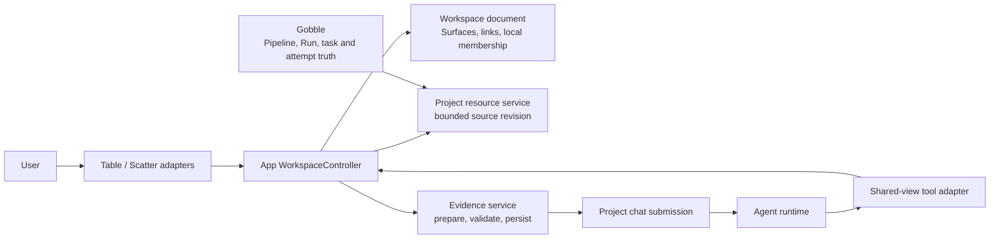

# R2 — Linked table, scatter plot and Project chat

Status: **R2a–R2c implemented, 2026-09-08; R2c completion accepted by the user.** See [R2a contracts/chart](../../stages/r2a-contracts-and-chart.md), [R2b linked interaction](../../stages/r2b-linked-interaction.md), and [R2c evidence, references and actual Agent trial](../../stages/r2c-evidence-and-agent.md). R3a design is proposed separately; its implementation has not started.

Related: [research and viewer roadmap](../shared-research-workbench/research.md), [shared workbench concepts](../shared-research-workbench/design.md), [R1 implementation](../../stages/r1-durable-references.md), [R2 implementation checkpoints](implementation-plan.md).

## 1. Outcome and bounded scope

A User opens a CSV table, opens a linked scatter plot, selects samples in either view, and attaches that exact selection to the existing Project chat. The Agent receives the selected rows, source version and relevant plot context. Its reply can point to another sample without changing the User's selection. The User explicitly follows that reference and can return to the previous view.

R2 supports the existing bounded CSV preview: at most 500 rows and 100 columns, subject to the existing file/read limits. Show the preview boundary and invalid-coordinate count. This is not a claim to support a full large dataset. Axes initially use finite numeric columns and linear scales. A precomputed PCA or UMAP coordinate table is viewable; calculating those coordinates belongs to an analysis execution, not to a chart renderer.

Notebook execution, arbitrary dashboards, scientific transformations, cross-dataset joins, external plugins and a public MCP server remain later slices. The first deliverable is a reliable interaction loop using one source.

## 2. Concepts and ownership

| Concept                | Definition and owner                                                                                                                                                                                                |
| ---------------------- | ------------------------------------------------------------------------------------------------------------------------------------------------------------------------------------------------------------------- |
| Project                | The durable research/work boundary that relates resources, attached Agents, discussions and Gobble execution references. The App owns its collaboration state; Gobble remains authoritative for executions.         |
| Workspace              | The Project's saved arrangement and interaction state. It does not own dataset contents, execute a pipeline or become a second Project.                                                                             |
| Pane                   | A layout slot that presents an active Surface. Moving a Surface between panes does not change its subject or reference identity.                                                                                    |
| Resource               | The addressed subject, such as a CSV file, Run or log. A file reference is resolved through the existing Project-scoped service. A filename is a label, not identity.                                               |
| Surface                | An opened presentation of a Resource: table, scatter, text, image, Run or log. A CSV can have a table Surface and a scatter Surface over the same source.                                                           |
| ViewLink               | An explicit App-owned relationship between compatible Surfaces over one Resource and one coherent data revision. It owns shared row membership and an optional shared filter. It is not a new data storage service. |
| Plot specification     | The scatter's column encodings, scale types and label choice. It describes how existing values are shown.                                                                                                           |
| View state             | Filter, sort and viewport settings. Shared filter belongs to the ViewLink; table sort and plot viewport belong to their Surface.                                                                                    |
| Local selection        | The User's editable row membership. A linked pair has one owner for this membership. Unlinked text/image/table selections retain R1 behavior.                                                                       |
| Reference target       | A durable Project + Resource + source revision + selector. Closing the original Surface does not invalidate this address.                                                                                           |
| Reference presentation | Optional typed context describing the plot specification and visible state at the explicit reference action. It helps interpret/reveal a target; it cannot grant access or change its identity.                     |
| Evidence capture       | Bounded, immutable content materialized by the Evidence service for an accepted message. This is distinct from attaching a target to a draft.                                                                       |



Gobble does not receive pane sizes, pointer coordinates or chat draft state. The App does not manufacture Run status from presentation state. Agent tools and User actions call the same host policy; a future MCP transport can expose that policy without becoming another state owner.

## 3. Proposed interaction

The central area keeps the upper plot / lower table arrangement, with chat on the right. There is one selection summary and one `Discuss selection` action for a linked pair. Agent controls stay with chat. Axis settings are behind the existing plot control rather than permanently occupying another panel.

| Action                          | Result                                                                                                                                                             |
| ------------------------------- | ------------------------------------------------------------------------------------------------------------------------------------------------------------------ |
| Open scatter plot from a table  | Choose valid X/Y columns, open the complementary Surface under normal pane-protection rules, and create an explicit ViewLink.                                      |
| Click a point or a row checkbox | Toggle that row in the shared User membership. Table and plot reflect the same committed set.                                                                      |
| Drag a selection box            | Replace membership with the exact visible point rows inside the completed rectangle. Shift-drag adds them. A drag preview is transient until committed.            |
| Sort table                      | Change display order only; row keys and membership stay unchanged.                                                                                                 |
| Filter linked views             | Apply the explicit shared filter to both views; retain hidden selected members and report how many are not shown.                                                  |
| Pan, zoom, change axes          | Change presentation only; keep selected row membership. Invalid numeric coordinates remain selectable in the table and are counted as excluded from the plot.      |
| Discuss selection               | Append an attachment to the existing composer and focus it. Freeze target and relevant presentation context; do not send. Existing attachments remain independent. |
| Send                            | Validate recipient, draft revision, source freshness and evidence size; then submit through the existing collaboration flow.                                       |
| Agent publishes a reference     | Add an author-labelled reference and appropriate marks. Do not change User membership, filters, viewport or focus.                                                 |
| Show in views                   | Explicitly open a temporary reference view using the target revision and applicable plot context. Preserve the User's base view state.                             |
| Return to my view               | End the temporary reference view and restore the previous filter, axes and viewport. User membership is retained.                                                  |
| Close one linked Surface        | Keep the selection with the remaining Surface. Closing the last removes local link state; attachments and shared references survive.                               |

Reference view is a temporary overlay, not a persisted replacement of User settings. Navigation controls that would modify the base axes/viewport are disabled until `Return to my view`; selecting rows remains possible. A newly arriving Agent reference does not replace an already opened reference view. Each message's `Show in views` resolves that message's target, not a global “latest reference”.

The sketch also demonstrates a narrow Work/Chat switch that preserves the single composer. This is a responsive proposal, not a request to reduce the existing desktop minimum window size or change saved chat-width bounds. The compact chat width in the inline sketch is illustrative; production resizing must respect existing window constraints and the desktop scenario tests.

## 4. Exact identity and coordinate semantics

Use the existing R1 table selector for a scatter selection: a scatter point is a projection of an exact source row. Reuse `revision-row-column-keys`; do not add a pixel-based “plot identity”. Current CSV ordinal row keys are valid only within the source revision. Duplicate sample names or gene symbols are legal labels and cannot be used to relocate a target after the source changes.

| Recorded value                          | Meaning                                                                                                    |
| --------------------------------------- | ---------------------------------------------------------------------------------------------------------- |
| `resource` + `dataRevision` + `rowKeys` | Exact selected members.                                                                                    |
| `columns`                               | Exact selected source columns. A plot attachment includes X/Y and any declared label column.               |
| Plot specification revision             | Which columns/scales were used. Changing an axis changes this revision without changing the data revision. |
| View-state revision                     | The filter/viewport state relevant to the displayed presentation.                                          |
| Renderer session + generation           | Which completed render may be observed or used to accept a selection.                                      |
| Optional box bounds                     | Gesture context in the declared data-coordinate system; never a replacement for the resolved member list.  |

Illustrative host-normalized reference, not a finalized wire-schema fixture:

```text
target
  Project: project_…
  Resource: samples-pca.csv's service-issued resource ID
  Source revision: exact file revision
  Selector: table / revision-row-column-keys
  Members: row_3, row_5
  Columns: service-issued IDs for Sample, PC1, PC2
presentation
  Kind: scatter
  X: PC1 column ID / linear
  Y: PC2 column ID / linear
  Filter: Group equals A
  Viewport: explicit X and Y data-coordinate ranges
  Plot specification revision / view-state revision
```

The adapter resolves a completed box into exact row keys against the loaded source revision. A region is not a standing query that silently includes future rows. Sort order, trace order, `pointNumber`, sample labels and screen pixels are never authoritative membership.

Linked membership and included columns are distinct. Row membership is shared; the table's existing included-column controls remain local to the table. A plot-origin attachment always includes its required axis columns and identifies them in the preview. Changing a column choice must not create a second competing row set.

Numeric conversion must be explicit and shared between rendering and evidence validation: preserve raw cell strings, distinguish empty/missing values from zero, reject non-finite values, and avoid guessing locale-specific numbers or applying hidden transformations. R2a freezes this as trimmed ASCII decimal/scientific notation, rejecting malformed, non-finite, overflow and nonzero-underflow values; raw cells remain unchanged.

## 5. Attach versus capture

R1 currently freezes a draft's target at attachment time. The Evidence service materializes bounded bytes during preparation, validates the target against the current source, and checks freshness again before acceptance. R2 preserves that policy.

`Discuss selection` additionally freezes typed presentation context. Changing local selection, sort, filter, axes or zoom afterwards does not mutate an existing attachment. It does not promise that arbitrary source bytes have already been durably archived. If the source changes before Send, the draft becomes visibly outdated and Send is blocked until the outdated attachment is removed or replaced with a deliberate current selection. Previously accepted messages retain their captured evidence.

The initial model payload is semantic table evidence: exact row and column IDs, raw values, source revision, declared numeric encodings, selected count and captured presentation context. The existing 16-attachment and evidence-size limits still apply. If all requested selected values cannot fit, show the limitation and require a smaller selection; do not silently represent a partial subset as complete.

A screenshot is not required to claim this semantic context. An optional plot image must be tied to the same completed render, source revision and plot/view-state revisions before it can be described as visual evidence. Supporting semantic observation does not imply that the Agent has seen the live plot pixels.

## 6. Host state and APIs

The main-process WorkspaceController stays the only durable workspace writer. React reads the committed document and emits intent. There must be no second reference store, no general-purpose event bus and no per-view copy of the linked row set. This follows React's single-owner approach for shared component state. [React: sharing state](https://react.dev/learn/sharing-state-between-components)

R2 intent map below describes the complete design. R2a reuses the existing `select` command with a current render acknowledgment and adds `invalidate`; the remaining named interaction intents are implemented and frozen in R2b/R2c:

```text
openLinkedScatter(tableSurfaceId, plotSpec, expectedWorkspaceRevision)
setLinkedRows(surfaceId, rowKeys, renderAcknowledgment, expectedWorkspaceRevision)
setLinkedFilter(linkId, filter, expectedWorkspaceRevision)
setPlotSpec(surfaceId, plotSpec, expectedWorkspaceRevision)
setPlotViewport(surfaceId, viewport, expectedWorkspaceRevision)
attachSelection(surfaceId, renderAcknowledgment, expectedAttachmentRevision)
revealReference(referenceId, requestId)
```

Every call carries the existing Project/session/request context. The host resolves the link, verifies Project access, actual membership, source identity, exact revision and renderer readiness, and derives the portable target. The renderer cannot grant access by supplying a Resource or assert that arbitrary row keys are present.

The existing mutation queue and stale-revision handling remain authoritative. Only explicit known stale outcomes may be retried with the existing request semantics. An uncertain side effect must not be blindly replayed.

Two linked views must consume one coherent bounded source snapshot. Independently reading the same file twice is insufficient: the file could change between reads. Use a host-owned in-memory snapshot lease associated with the link/revision, invalidated when the source changes or the link closes. It reuses the existing Project resource reader; it is not an additional persisted data repository. Different loaded revisions suspend linking and attachment until refreshed coherently.

The existing `RenderSession.complete()` currently requires Surface view kind to equal loaded content kind. R2 must explicitly permit a scatter presentation of validated table data, not remove this guard. `RenderAcknowledgment` gains the relevant plot and view-state revisions. Axis/filter/viewport changes invalidate the prior observation lease; an older chart callback cannot acknowledge or select from a newer presentation.

## 7. Code structure and React boundary

These are responsibility destinations, not a mandate to create every proposed filename. Extract only where independent behavior or validation requires it.

| Owner                                                                               | Planned responsibility                                                                                                                                                       |
| ----------------------------------------------------------------------------------- | ---------------------------------------------------------------------------------------------------------------------------------------------------------------------------- |
| `app/contracts/src/selection.ts`, `reference-target.ts`                             | Reuse exact table selector; optional typed scatter presentation context is separate from target identity.                                                                    |
| `app/contracts/src/surface.ts`, bounded new `tabular-view.ts`                       | Scatter presentation, ViewLink and supported filter/spec shapes; closed schemas, finite ranges and column references.                                                        |
| `workspace-document.ts`, `workspace-migration.ts`                                   | New document version and invariants, migration of existing state, one membership owner per explicit link.                                                                    |
| `main/workspace/controller.ts`, `model.ts`, `selection.ts`                          | Validate intents and aggregate invariants; coordinated link lifecycle and local membership. Delegate focused projection calculations rather than growing a giant controller. |
| `main/workspace/render-session.ts` and a focused tabular snapshot/projection module | Bounded source coherence, render revisions and pure row/axis conversion. No persistence writer in the projection module.                                                     |
| `renderer/workspace/Pane.tsx`, `SurfaceView.tsx`                                    | Pane layout and adapter dispatch only. They do not parse CSV, choose sample identity or materialize evidence.                                                                |
| Existing `views/TableView.tsx`, new `views/ScatterView.tsx`                         | Controlled selection props, native table accessibility, plot interaction adapter and explicit ready lifecycle.                                                               |
| A small chart-library adapter adjacent to `ScatterView`                             | Own chart mount/update/dispose and chart event translation. Never call the service, evidence store or Agent provider directly.                                               |
| `renderer/selections/SelectionToolbar.tsx`                                          | One action surface for the active explicit link; focus existing composer after attachment.                                                                                   |
| `main/evidence/*`, `renderer/evidence/*`                                            | Attach/prepare/accept semantics, immutable presentation context, bounded semantic payload and historical preview.                                                            |
| `main/shared-context/*` and `contracts/shared-tools.ts`                             | List/open/observe/point capabilities through the same host, author attribution and compatible toolset version.                                                               |

Use pure functions for filtered rows, finite-coordinate projection, membership resolution and presentation compatibility. The stateful chart adapter has one purpose: managing the external chart lifecycle. React Effects are reserved for that external synchronization and actual DOM focus/reveal; selection, attachment and filter commands belong in event handlers.

Persist link membership/filter and each Surface's accepted settings through the workspace owner. Keep hover, in-progress brush, pending chart operation and temporary reference view ephemeral. Derive displayed rows and marks. Reset chart internals for a new source/spec generation; preserve unrelated composer text, shared references and other Surface state.

Each Surface retains its ErrorBoundary. Chart event callbacks and asynchronous host calls need explicit error handling; a render ErrorBoundary is not sufficient for ordinary event or async failures. [React: ErrorBoundary scope](https://react.dev/reference/react/Component#catching-rendering-errors-with-an-error-boundary)

## 8. Library decision and evidence needed

Recommended implementation investigation: a bounded Plotly SVG scatter adapter. Plotly exposes selection, relayout and completed-plot events; scatter has per-point IDs and custom data. These provide useful translation hooks, but its event indices are not source identity. Carry the service row key explicitly and validate it at the host. [Plotly events](https://plotly.com/javascript/plotlyjs-events/), [scatter reference](https://plotly.com/javascript/reference/scatter/)

The sketch uses D3 to make this interaction reviewable without installing a production dependency. D3 offers spatial brushing primitives, but a complete scientific chart would leave more zoom, accessibility, resize, export and lifecycle behavior for the App to own. [D3 brush](https://d3js.org/d3-brush)

R2a must record an exact library version and test it inside this repository's Electron/React/CSP combination: local bundling, zero runtime network dependency, lifecycle cleanup, row-key event mapping, resizing, keyboard alternative, selection/render completion and a 500-row fixture. Measure startup/bundle cost and interaction latency before choosing the dependency. The prototype proves none of these production-library properties. Do not loosen CSP to make a library appear compatible. If the candidate fails, present the bounded alternative and its ownership cost at the R2a checkpoint.

## 9. Persistence and compatibility

Proposal: WorkspaceDocument v4 adds explicit links and plot settings; keep an immutable v3 reader beside the existing historical schemas. Migrate v1/v2/v3 through validated steps, preserve the original backup before first write, and reject unsupported future versions without stripping fields.

Existing v3 Surfaces remain unchanged and unlinked. Do not infer links from duplicate filenames or merge two existing User selections. A newly explicit link gets one membership owner; the migration cannot invent cross-revision biological identity. Existing sent evidence assets retain their hashes and content.

Version the updated render acknowledgment and shared toolset together with their adapters. Update generated schemas and compatibility fixtures. A tool client that cannot express scatter capabilities receives a clear unsupported result; it cannot observe stale pixels while claiming a ready scatter Surface.

## 10. Reviewable evidence and limitations

The interactive sketch contains eight synthetic samples, seven with valid initial plot coordinates. Its Agent reply is simulated, and it performs no source file reads, real Agent turns, statistical calculations or kernel operations.

Behavior checks and screenshots are recorded in [sketch verification](review/sketch-checks.json). These checks cover local prototype interaction and layout only. Production source hashes are compared with the R2 design baseline in [source boundary verification](review/source-boundary.json).

The user approved each checkpoint in sequence. R2c now binds the complete interaction and actual Agent loop; its completion record is the current acceptance subject. The next viewer family requires a new bounded sketch and approval.

## R2b implementation clarification

The User interaction checkpoint adds Workspace document v5 while freezing v1–v4
readers and original-version backups. `ViewLink` remains the sole exact row-set
owner and also owns the shared filter. A table Surface optionally owns display
sort and included discussion columns; a scatter Surface owns axes and viewport.
The link records the interaction source that determines column scope. Sorting
alone does not switch it. Local gesture/form state remains in the renderer.

The first visible linked Surface presents one Discuss action. It copies the
host-derived row/column target and explicitly focuses the existing composer,
without sending. Later membership changes cannot mutate that attachment. This
checkpoint uses existing semantic table evidence: plot-presentation binding and
Agent reference-view/return semantics are implemented in R2c with host-owned transient state and renderer-owned table scroll restoration.

An explicit **Refresh linked views** uses one new source snapshot. Same revision
preserves settings; changed revision clears local row membership and view settings
without moving old IDs onto new data. Existing attachments and sent references
remain at their original revision. Normal file/reveal/shared-open paths match
both Resource and view kind; duplicating a view never silently joins a link.
