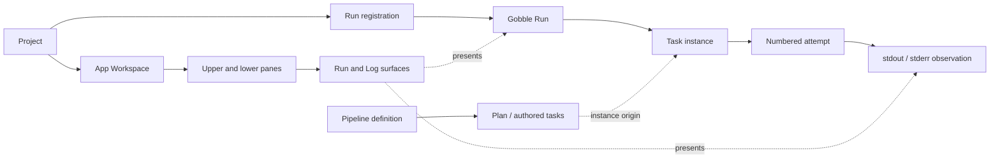

# R3a — Discuss an exact task and log observation

Status: **R3a1–R3a3 implemented, verified and accepted, 2026-09-08.** The user's latest “네 진행해주세요” accepts [R3a3](../../stages/r3a3-agent-observation.md) and requests the next scope/ownership sketch. [R3b](../r3b-run-dependencies/design.md) is a proposal; its production implementation has not started.

Reading order: this design, [delivery checkpoints](implementation-plan.md), then the [interactive layout sketch](sketch.html). The sketch uses synthetic observations and a simulated Agent. Parent: [research workbench roadmap](../shared-research-workbench/implementation-plan.md).

## Outcome and scope

A researcher locates a failed task instance, opens its current attempt's logs, attaches an exact excerpt to the existing composer, and follows an Agent's separate pointer without losing their own selection. The original observation remains readable when the engine advances or the log grows.

Include compact task navigation, one selected task at a time, explicit current-attempt navigation, separate stdout/stderr previews, typed task/log selectors, immutable discussion evidence, and the existing shared-view tools. Preserve the Project-centered shell, upper/lower work panes and right Chat. A Run is one Project resource, not the application's organizing root.

Defer previous-attempt enumeration, full-log paging or streaming, execution controls, graphical Plan/Run views, PDF/HTML/MultiQC, Notebook sessions and external MCP. R3 can deliver these as separate view families. No new renderer library or engine execution change is needed for this first slice.

## Findings that constrain this design

These are source-review findings, not new runtime-test results.

| Inspected source                                                                                                                     | Fact                                                                                                                                                                                                 | Design consequence                                                                                                                                               |
| ------------------------------------------------------------------------------------------------------------------------------------ | ---------------------------------------------------------------------------------------------------------------------------------------------------------------------------------------------------- | ---------------------------------------------------------------------------------------------------------------------------------------------------------------- |
| [RunView](../../../../app/desktop/src/renderer/workspace/views/RunView.tsx)                                                          | Displays one current attempt number per task, with no task selector. Its summary and repeated metadata consume vertical space.                                                                       | Use compact rows and contextual actions; add an exact task selector instead of passing display names.                                                            |
| [Native Run query](../../../../internal/appservice/runs.go)                                                                          | `queryRun` requires the requested instance and attempt to match current Monitor tasks. Earlier attempts return `stale_revision`.                                                                     | Label current attempt explicitly. Do not manufacture a 1…N attempt menu.                                                                                         |
| [Engine Monitor](../../../../internal/engine/monitor.go)                                                                             | Tasks use instance `identity`; dependency edges use authored task IDs. Template/expanded facts are available.                                                                                        | Keep authored task, expanded instance and numbered attempt distinct. No inferred instance DAG.                                                                   |
| [Log reader](../../../../internal/engine/inspect.go)                                                                                 | Returns at most 4096 source bytes per stream; size and tail are separate reads; absent/unreadable content can return empty text. No cursor, original line offset or atomic stream range is supplied. | Show tail bounds and preview-local positions. Zero returned text is not proof of an empty or successful stream. Do not infer exact file byte offsets.            |
| [Log contract](../../../../app/contracts/src/run.ts) and [reference resolver](../../../../app/contracts/src/reference-resolution.ts) | Current logs flatten two streams into one display string. Its text hash is separate from the engine checkpoint.                                                                                      | New log selectors name the stream; legacy flattened references retain their original interpretation.                                                             |
| [Evidence service](../../../../app/desktop/src/main/evidence/service.ts)                                                             | Preparation and acceptance currently re-read live source data.                                                                                                                                       | Add an explicit captured-observation path for Run/log evidence so a growing log does not silently replace or repeatedly invalidate the evidence being discussed. |

The current native API is sufficient for a bounded, current-attempt observation. It is insufficient for a historical-attempt browser or an exact original-file log cursor. Those require a Gobble-owned read contract, not App filesystem guesses.

## Concepts and identity

| Concept             | Precise meaning                                                                                                                                | Authority                                                       |
| ------------------- | ---------------------------------------------------------------------------------------------------------------------------------------------- | --------------------------------------------------------------- |
| Project             | Stable work/access scope relating files, registered Runs, Agents and collaboration. Current storage root mapping remains local.                | Native Project catalog; App owns collaboration.                 |
| App Workspace       | Saved opened views, layout, drafts and shared references for one Project.                                                                      | `WorkspaceController`, durable.                                 |
| Execution workspace | Directory containing Gobble's Run/control data.                                                                                                | Gobble; native service resolves the registered mapping.         |
| Pipeline definition | Authored composition source and its inputs. A displayed Pipeline name does not identify a source revision.                                     | Gobble/product source.                                          |
| Plan                | Validated composed graph before execution. Its edges address authored task IDs.                                                                | Gobble Plan contract.                                           |
| Run                 | Engine execution identity and its observed state. `runRef` is the Project's registered association to it.                                      | Gobble facts; native service owns association/pinned runtime.   |
| Authored task       | Definition node identified by `task_id`; can produce several instances.                                                                        | Gobble Plan.                                                    |
| Task instance       | Runtime identity inside a registered Run. A readable name is only a label.                                                                     | Gobble Monitor `identity`.                                      |
| Attempt             | A numbered execution of an instance, identified by Run + instance + positive attempt. Zero means no numbered attempt has started.              | Gobble.                                                         |
| Run observation     | Read-only copy of task facts with engine revision and observation time. A selection refers to this copy, not all future states of that task.   | App derives it from verified Gobble facts.                      |
| Log observation     | Bounded decoded stdout/stderr returned for one exact attempt. It has its own content revision; logs can grow without a new control checkpoint. | Gobble supplies bytes/facts; App owns the retained observation. |
| Surface             | Open Run or Log presentation of a Resource. A log Surface contains two stream views of the same attempt.                                       | App Workspace.                                                  |
| Pane                | Tab/layout container. It does not parse logs or own task state.                                                                                | App Workspace.                                                  |
| Inspection focus    | Row/stream currently being browsed. Changing it does not send, attach or publish a reference.                                                  | Typed Surface state.                                            |
| Selection           | Exact task observation or stream-local text range the actor has deliberately selected.                                                         | User local state or separate Agent-authored reference.          |



## Screen and interaction sketch

```text
Project ▾                                      Layout             Account
┌──────────┬─────────────────────────────────┬─────────────────────────┐
│ Files    │ Run tab              Refresh    │ Chat       Researcher ▾ │
│ Runs     │ Tasks  [Search…] [All states ▾]  │                         │
│          │ Name / instance  State  Attempt │ User + frozen excerpt   │
│ compact  │ Align · S03      Failed       2 │                         │
│ optional │ Selected task     Open logs    │ Agent + own reference   │
│          │                  Discuss task  │ Show in view            │
│          ├─────────────────────────────────┤                         │
│          │ Align · S03 / Current attempt 2│                         │
│          │ [stderr] [stdout]      Refresh  │                         │
│          │ Bounded selectable log text    │ One composer            │
│          │ Tail preview · Observed 14:32  │ Frozen attachment       │
│          │ Selection     Discuss selection│                    Send │
└──────────┴─────────────────────────────────┴─────────────────────────┘
```

- Keep the compact existing shell. The Run tab supplies the title; remove the large `EXISTING RUN` heading and repeated Pipeline/Run names. Place provenance and authored dependencies in a collapsed `Details` section.
- Task search and status filter operate on the returned task preview. Show loaded/available counts when bounded; never report no failed tasks in the entire Run from a partial preview. Preserve engine status text, including unfamiliar statuses.
- Selecting a task row establishes local task selection and inspection focus. `Open logs` is an explicit navigation action; `Discuss task` attaches frozen task facts. Neither starts an Agent turn. Templates and attempt 0 show the engine facts and an unavailable log action, with a reason.
- User `Open logs` prefers a lower companion tab and reuses an identical attempt resource. Other tabs remain available. Pin and existing Agent placement protections apply. No OS window is created, no third permanent panel, no attempt-history dropdown.
- Select a stream with labelled tabs. Default a new log view to stderr when it has returned text, otherwise stdout; retain a User-selected stream on refresh. Never merge them into a claimed chronological transcript.
- Text drag or keyboard selection creates a stream-local range. `Discuss selection` freezes the exact observation and adds one attachment to the existing composer. No new answer dialog. Cross-stream selections are two attachments.
- R3a uses explicit `Refresh`, with `Observed …` instead of `Live`. A refresh failure leaves the last observation visible with `Refresh failed · Showing earlier observation`. Refreshing a selected view clears only its stale local range; already captured attachments are unchanged. No polling/silent autoscroll.
- The Agent can point to another task or excerpt. Its mark has an author label and distinct treatment; User selection survives. Incoming references do not navigate automatically. Explicit `Show in view` reveals the target through host policy; `Return` restores prior stream, filter, scroll and focus.
- Historical references offer `View captured evidence` in the existing evidence preview. `Show current task` is a separate, labelled navigation to the same instance's current facts, never a rewrite of the old reference. A bare pointer without captured bytes reports that limitation if its source is gone.
- At narrow widths, collapse resource navigation and use the existing focus/restore view controls. Preserve Chat and the composer. Controls remain visible without hover; row selection, stream switching and Show/Return are keyboard-operable. Details never require a third inspector column.

## Portable selection and provenance

Proposed typed additions, not final exported TypeScript names:

| Target                    | Resource address                                 | Selector                                                                                 | Required captured meaning                                                                                                            |
| ------------------------- | ------------------------------------------------ | ---------------------------------------------------------------------------------------- | ------------------------------------------------------------------------------------------------------------------------------------ |
| One task's observed facts | Project + `runRef`                               | `run-task`: exact `instanceId`, observed attempt (0 permitted for an unstarted instance) | Instance ID, authored task ID when supplied, attempt/status/reason/template facts, engine revision, observed time, observation hash. |
| A log excerpt             | Project + `runRef` + instance + positive attempt | `log-text`: `stdout` or `stderr`, start/end in decoded-preview coordinates               | Exact selected text, stream, attempt, observed time, engine revision, log observation hash, tail limit and completeness limits.      |

Log coordinates are **1-based preview lines, 0-based UTF-16 columns, half-open ranges**. They do not identify original log-file line numbers. Preserve line endings in the defined decoded source; reject invalid/split-surrogate ranges. Hash a versioned normalized observation payload including subject, engine revision, both streams and relevant reported size/limit facts. Keep `observedAt` as provenance, not content identity. Render readiness must also bind active stream and view generation.

For each stream retain `sourceBytesReported` when supplied, `decodedUtf8Bytes`, `tailLimitBytes: 4096`, and an explicit completeness result. A size greater than the limit proves earlier bytes were omitted, but a smaller reported size does not prove an atomic full-file read. Original byte start/end and absolute line numbers remain unavailable. Empty text is displayed as `No text returned`, with the current API limitation in Details. Control-state and log observations may have different observation times/revisions; display that provenance rather than claiming an atomic combined capture.

Evidence JSON must hash-bind subject + selector + selected facts/text + provenance + bounds. Chat chips show human labels such as `Align · S03 · Attempt 2 · stderr · preview lines 7–9`; expandable details carry IDs and revisions. Whole-Run capture remains bounded and explicitly describes its preview scope.

The persisted legacy log ResourceRef calls instance identity `taskId`. Keep `logResource`/`logTarget` as its sole compatibility boundary in R3a; new APIs and documentation use `instanceId`. Renaming that stored key is unnecessary for this delivery. Never interpret it as authored `task_id`.

## Ownership and time

```mermaid
flowchart LR
  G[Gobble: execution facts and current log tails] --> N[Native service: Project scope and pinned runtime]
  N --> P[App projections: Run / Log observations]
  P --> O[Main: bounded observed content]
  O --> UI[React Run and Log views]
  UI -->|typed selection + current render receipt| W[WorkspaceController]
  W --> E[Evidence service and existing asset storage]
  E --> C[Existing Chat composer / Send]
  C --> A[Agent runtime]
  A --> T[Versioned shared-view tools]
  T --> W
  W -->|separate authored pointer / explicit reveal| UI
```



| State or behavior                                 | One owner and lifetime                                                                                                                                             |
| ------------------------------------------------- | ------------------------------------------------------------------------------------------------------------------------------------------------------------------ |
| Run state, attempts, log production               | Gobble, execution lifetime. App is a read consumer.                                                                                                                |
| Project root, registered Run/runtime mapping      | Native catalog, durable. Each query revalidates scope/identity.                                                                                                    |
| Projection validation and field naming            | Main service projection functions, derived. Unknown fields do not become renderer authority.                                                                       |
| Loaded Run/log observation                        | One bounded Main-process observation owner, session-scoped; released on obsolete load/closed view/Project switch. It is not a checkpoint repository.               |
| Surface task focus/filter/stream; local selection | WorkspaceController owns the useful saved subset; renderer owns gesture/scroll mechanics. Version changes invalidate selection exactness, not historical evidence. |
| Render receipt and reference override             | Existing Main render/reference owners, transient. A hidden view cannot claim current display.                                                                      |
| Captured observation asset                        | Existing EvidenceStorage, immutable and Project-scoped; referenced from draft/message/question as appropriate.                                                     |
| Draft, addressed send, Agent marks                | Existing Workspace/collaboration owners, durable. Recipient/permission/session checks remain mandatory.                                                            |

For Run/log `Discuss`, validate a current render receipt and freeze the retained Main observation into the existing evidence store **before committing its draft attachment**. Later prepare/send validates the asset, draft and recipient; it does not require the engine still to be on that attempt. Store a discriminated capture source so this deliberate historical path cannot bypass live-source checks for unrelated attachments. Preserve existing file/table/scatter behavior.

A failed asset write leaves the draft unchanged. An asset written before a failed workspace commit remains unreferenced and counts against quota. R3a1 must add reference-aware reclamation within the existing evidence-storage owner; current storage does not provide it. Reclamation requires a complete validated set of draft, sent, question and retained-history references under the Workspace write boundary. If that set is unavailable or a document is corrupt/unknown, preserve the bytes and enforce quota rather than guessing what is unused. Retained draft captures survive normal relaunch; transient load caches and render receipts do not. Missing/corrupt assets report unavailable and never fetch a replacement. Removing an attachment removes its reference without deleting assets still used in history. App/Pane close does not stop a Gobble execution.

Agent reads use the same projection/selector definitions. `gobble_run`/`gobble_logs` are source observations; they are not proof of a visible screen. `workspace_observe` returns a displayed revision/stream and receipt; `workspace_point` must match it for a visual mark. Agent opening remains subject to existing Project, pin, other-Agent and dismissed-view protections. MCP can later adapt these host operations; it does not define selection semantics.

## Alternatives and approval boundary

| Choice                                                                | Assessment                                                                                                             |
| --------------------------------------------------------------------- | ---------------------------------------------------------------------------------------------------------------------- |
| Add task details and attempt history as permanent sidebars            | Consumes central work space and implies unsupported history. Rejected for R3a.                                         |
| Retain a flat combined log textarea                                   | Smallest change, but ambiguous stream provenance and poor navigation remain. Retain only as a legacy reference reader. |
| Compact task view + companion stream log + frozen discussion evidence | Recommended. Uses current engine facts and the accepted shared workspace model; adds an explicit observation lifetime. |

R3a first delivers contracts and capture ownership, then the compact interaction, then the actual Agent loop. Each ends with a review checkpoint. A future history slice must obtain stable attempt enumeration, availability and log-range contracts from Gobble before presenting those controls. A future graph slice must separately identify saved Plan graphs and runtime instance graphs.
