# R3b — Shared Run dependency navigation

Status: **R3b2 User navigation implemented for owner review on 2026-09-08.**
The owner approved R3b1 and authorized R3b2. R3b3 Agent graph tools/Show/Return remain a separate
approval checkpoint. The interactive [sketch](sketch.html) includes synthetic data and simulated
Agent behavior; current product evidence is in the [R3b2 stage report](../../stages/r3b2-user-navigation.md).

The user removed CSV chart creation from the product scope. CSV remains a selectable table; existing scientific result viewing is separate. See the [R3b1 implementation and qualification decision](../../stages/r3b1-foundation.md).

## Outcome and scope

Understand where a failed Task sits in a Run, choose the exact instance/attempt, open its
logs, and discuss a Task group or dependency with an Agent through an exact shared target.
Keep the existing Project shell, upper/lower panes and right-side Chat.

Recommend **Tasks / Dependencies inside the existing Run Surface**, with logs kept in the
other pane. Compare the separate-graph/list concept in the sketch and [research](research.md).
The main acceptance question is whether the group → instance → log path remains clear
without confusing a dependency with evidence of why an attempt failed.

This is a read-only dependency overview of an observed Run. Saved Plan import/viewing,
per-instance execution edges, timeline, graph editing, execution controls, PDF/HTML/MultiQC,
Notebook sessions and new transports are separate work. Graphical group relationships do
not advertise a biological network viewer or a general graph plugin framework.

## Definitions and owners

| Concept                 | Exact meaning                                                                                                                                   | Authority                                                                  |
| ----------------------- | ----------------------------------------------------------------------------------------------------------------------------------------------- | -------------------------------------------------------------------------- |
| Pipeline definition     | Authored workflow and Task definitions. A displayed pipeline name alone is not a registered definition.                                         | Gobble authoring contract.                                                 |
| Plan                    | Validated composed graph before execution, with its own identity/revision. It must not be manufactured from a monitor label.                    | Gobble Plan contract; no App Plan registration is implemented yet.         |
| Run                     | Registered analysis execution, observed through its pinned runtime.                                                                             | Gobble execution facts; Go service registration/access.                    |
| Task group in this view | Authored `taskId` grouping the instances returned in this Run observation. It is not one executable attempt or an asserted complete sample set. | Gobble supplies IDs; App performs a labelled presentation grouping.        |
| Instance / attempt      | Exact runtime `instanceId` and observed attempt number. Attempt zero/template rows do not acquire logs.                                         | Gobble monitor and log capability.                                         |
| Dependency              | Reported directed pair `fromTaskId → toTaskId`. It proves neither sample-to-sample routing, port-level lineage nor the cause of failure.        | Gobble monitor edges.                                                      |
| Dependency overview     | Revision-bound App projection of reported edges, known groups, observed membership and availability.                                            | Main presentation layer; no scheduler/status inference.                    |
| Pane / Surface          | Pane owns placement. The Run Surface owns its view mode and active semantic target. Graph mode does not add a new application pane manager.     | App workspace aggregate.                                                   |
| Camera / layout         | Zoom, pan and node placement. These help display the graph and never identify a target or modify its source.                                    | Renderer adapter; useful serializable camera state only in App view state. |

Template and unstarted rows are displayed separately from started attempts. Count reported
state labels in the returned members; do not synthesize one “completed/blocked” group state.
Unknown states retain their labels. An edge endpoint with no returned members remains an
explicit group with “No instances in this preview”; it is not reported as missing from the Run.
Unknown `taskId` rows stay unmapped; never guess a group from a name or instance string.

## Ownership and communication

```mermaid
flowchart LR
  G[Gobble: coherent monitor snapshot] --> S[Go service: registered pinned Run read]
  S --> M[Main: validate and project dependency observation]
  M --> V[Run Surface: Tasks or Dependencies]
  V -->|select semantic target| L[App LocalSelection]
  L -->|Discuss target| E[Existing immutable evidence capture]
  E --> C[One Chat composer and recipient]
  C --> A[Agent]
  M -->|bounded observation receipt| A
  A -->|validated group or dependency pointer| R[Authored reference in Chat]
  R -->|User Show| T[Temporary graph presentation]
  T -->|Return| V
```



The renderer emits IDs and view intents; it never calculates an attempt, reads engine files
or receives native paths. Main validates all User/Agent targets through the same resolver and
existing serialization. The existing transient-reference owner and capture storage expand;
no parallel graph asset store, generic event bus or renderer scheduler is introduced.

Use one coherent monitor read. Do not combine an independently queried Plan DAG and Run
status because matching labels cannot prove matching snapshots. A future Plan Resource and
instance-edge contract can be added as separate capabilities without changing what an R3b
reference meant.

## Interaction and selection

- A node click selects its **Task group**; the detail area lists observed member instances.
  Choosing a member explicitly replaces that selection with an **instance/attempt**. Only
  then is **Open logs** available, through the existing exact-attempt companion behavior.
- Selecting an arrow, or choosing it from **Dependency list**, selects the **directed dependency**.
  A textual pair is available for keyboard and assistive-input use; a thin line is never the
  only hit target. **Discuss group / dependency / task** labels the current meaning.
- One LocalSelection belongs to the Surface. Switching Tasks/Dependencies preserves its
  target and mode-specific navigation; it does not choose the first member or broaden the
  target. A target absent from that representation gets a concise **Show selected target** action.
- Pan/zoom changes presentation only. Task dragging, edge creation, deletion and graph editing
  are disabled. Keyboard labels must not announce those unavailable actions. No animated layout
  rearrangement is proposed. Fit is explicit; Refresh must not repeatedly rearrange the user's view.
- The dependency overview uses its own Find group control. The saved Tasks search/state filter
  remains intact and does not silently prune topology. Counts always state the observation scope.
- **Discuss** freezes an attachment and focuses the existing composer; sending remains explicit.
  Agent pointers have distinct author marks and never change User selection or focus.
- **Show in view** temporarily selects the graph representation and reveals the Agent target.
  Return restores the saved mode/camera/selection/draft for the mounted view. Historical pointers
  refuse current substitution and offer a matching existing capture when available.

### Portable dependency target — allocated v4, live integration pending

```json
{
  "schemaVersion": 4,
  "projectId": "prj_example",
  "resource": { "kind": "run", "runRef": "run_example" },
  "dataRevision": "sha256:<dependency-observation>",
  "selection": {
    "kind": "run-dependency",
    "coordinateSpace": "observed-authored-task-pair",
    "fromTaskId": "prepare",
    "toTaskId": "align"
  }
}
```

The group counterpart identifies `taskId` in `observed-authored-task-group` space. Existing
`run-task` and `log-text` selectors keep their meaning. No target contains a canvas index,
layout coordinate, group label in place of ID, or assumed member wildcard.

A group capture contains its ID/label, observation time and engine/image/Run provenance,
reported state counts, template/unstarted facts and bounded returned member identities/attempts.
A dependency capture contains the directed pair and endpoint facts. It does not automatically
attach endpoint logs, upstream data, private paths or the entire Run. Metadata states requested,
returned and available counts where known, and whether members/topology are incomplete.

Agent observe returns those semantics and a receipt for exactly the returned groups/edges.
A pointer needs its turn-local read ID and the current render acknowledgment; Main checks
membership, direction, observation version and scope. Source-only reads cannot authorize a
visual pointer. R3b requires a new toolset version and the existing renewal flow for old bindings.

## Read-model and compatibility decisions for R3b1

The current presenter loses the difference between absent edges and a reported empty edge list.
R3b1 must preserve this distinction and expose topology completeness before drawing anything.
A complete empty list means “No dependencies reported”; unavailable topology means “Dependencies
unavailable”, with Tasks/logs still usable. Cyclic or malformed topology gets an explicit
unsupported diagnostic/list, not a fabricated DAG. Missing endpoints and omitted preview members
must stay visible as limitations.

Propose a closed, versioned Run read model carrying topology availability plus a separate pure
`DependencyObservation` projection. Qualify this shape in R3b1. **Freeze existing v1–v9 bundles,
v2/v3 evidence and their revision algorithms**: adding presentation metadata must not change old
reference hashes for unchanged input. Stored v8 workspaces need a backup-preserving migration
if mode/camera fields change. Old captured bytes are never rewritten. R3b1 allocates dependency target v4 and read/observation/capture v1 in contract bundle v10.
The live EvidenceRef union remains v2/v3. Toolset v6 only retires CSV chart creation;
Agent dependency tools need a later version at R3b3.

Qualified display bounds: 80 groups / 200 dependencies / the existing 1,000-instance
preview; inspect at most 1,000 source edge entries. The native harness verifies bounded fixtures
on one host; these limits do not claim support for full or arbitrarily large Runs. Over-limit graphs
fall back to a bounded searchable dependency list, with actual/returned counts and no invented
edges. Keep existing Main memory and evidence quotas. No automatic full-Run download or polling.

## Implementation responsibilities

- `contracts`: versioned topology/read model, selectors, resolution, view state and migration.
- `main/service`: validate source availability before normalization. `main/workspace`: source
  lifetime, serial commands and temporary reference presentation. Keep projection/capture out of
  the aggregate controller; add a focused pure dependency projection/resolver module.
- `main/evidence` and `main/shared-context`: extend existing capture and observe/point routing.
  Maintain one receipt model and one store. The Agent and User use the same target semantics.
- `renderer/workspace/views`: `RunView` delegates Dependencies mode to one controller component;
  one minimal HTML/SVG graph adapter owns layout and event translation; a group detail view
  owns instance choice. Pane remains placement-only. Extract files by responsibility, not size alone.
- Go App service/engine: no execution changes. Add a read-envelope field only if source inspection
  proves it cannot be carried truthfully by the current coherent monitor response.

See [sequential plan](implementation-plan.md), [source evidence](research.md) and
[design activity record](review/design-activities.md). R3b1 is complete for review.
R3b2 begins only after owner approval and a stage-specific ownership/interaction sketch.
