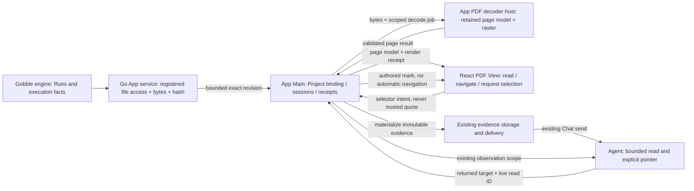

# R3c — PDF shared reading

Status: historical R3c concept, 2026-09-08. R3c1–R3c3 are now implemented and owner-accepted. [Final R3c3 implementation](../../stages/r3c3-agent-pdf.md) and its evidence supersede proposed details below: exact PDF text targeting remains deferred; page/region reading and references use Workspace v12 / bundle v14 / toolset v8. The next [Notebook concept](../r4-notebook-shared-reading/design.md) is proposed for review.

[Generated concept](concept-a.png) · [Interactive sketch](sketch.html) · [Research](research.md) · [Sequential plan](implementation-plan.md)

## Intended outcome

A researcher reads a PDF report in an existing central Pane, attaches a precise page, text excerpt or rectangular region to the existing Chat composer, and follows an Agent reference back to that same version. The conversation remains on the right. A second central Pane can keep notes or results visible.

The first implementation checkpoint qualifies the PDF decoder and target model. The full interaction shown in the sketch spans later checkpoints.

## Concepts and vocabulary

| Concept | Definition and owner |
| --- | --- |
| Project | Collaboration boundary binding resources, Agents, messages and saved Workspace state. It is not a PDF folder or a Run. |
| Workspace | The App's arrangement and current working state within a Project: Panes, Surfaces, navigation, local selection and composer. |
| Resource | Existing addressable Project file. Gobble's service controls access to source bytes; the file's content hash identifies the read revision. |
| PDF View | A bundled representation of a file Resource with explicit supported selection capabilities. It introduces no new execution authority. |
| Surface | An opened instance of that View. Two Surfaces can independently read the same PDF. |
| Pane | Placement container for Surfaces, not the PDF itself. Pages, thumbnails and the PDF text layer stay inside the Surface. |
| Page | A revision-scoped, zero-based physical page index. Displayed number is index+1; printed page labels are descriptive, never identity. |
| Target | Exact source revision, physical page and one supported selector. Durable identity excludes screen coordinates and transient Surface IDs. |
| Selection | User's temporary focus on a target. It neither writes annotations into the PDF nor sends a message. |
| Reference | Authored User/Agent pointer to a target with author and provenance. It does not replace the User's local selection. |
| Capture | Immutable evidence produced from retained source bytes/qualified decoder output, linked to the target. It survives source changes. |
| Observation | Bounded content actually delivered to an Agent, with current view scope and a turn-local receipt. It is distinct from the whole PDF. |

## Two spatial concepts

**A — Inline reader, recommended.** The page owns the Surface. One compact toolbar provides Pages, page navigation, fit/zoom and region mode. Pages is a temporary popover, closed by default. Text selection reveals Discuss; the existing selection controls provide a keyboard route. A region tool temporarily takes pointer ownership, then returns to reading. Chat receives one attachment chip.

**B — Persistent page navigator.** A page rail is always visible inside the PDF Surface, with page labels and miniature previews. It improves repeated jumps through long reports and makes page count visible, but consumes reading width and adds a third vertical information column beside Chat. At compact widths it must collapse.

The sketch's A/B controls switch this structural choice while preserving the selected page, local selection and draft. A is recommended because the user prioritizes the central result and conversation. Reopen this choice if the owner repeatedly loses their position or needs frequent nonsequential page jumps. Neither concept adds a second composer, an Agent sidebar or a selection inbox.

## Interaction contract

1. **Read:** Open a registered PDF. Page/fit state belongs to the Surface. Show page count and the actual page capability: Text available, Region only or Unavailable. No hover is needed to discover core actions.
2. **Select text:** Use normal text drag where the qualified text layer supports exact mapping. On completion, offer Discuss selection. No universal transparent overlay intercepts text. Multi-page selection is deferred; require one page per attachment rather than silently clipping it.
3. **Select a region:** Enter Select region explicitly, then drag within one page. Show a bordered rectangle and a descriptive page label. Escape cancels; a keyboard mode starts a bounded rectangle and exposes move/resize actions. PDF plot regions remain visual regions, not inferred data points.
4. **Discuss:** Freeze evidence, add a chip to the existing composer and keep unsent text. It never auto-sends. A failed capture leaves selection/draft intact and offers retry.
5. **Receive a pointer:** Agent marks use an amber dashed boundary and an author label. User selection uses teal. Pointer arrival does not move a page, open a window, change zoom or focus the composer.
6. **Show / Return:** User chooses Show in Chat. Use the existing temporary-reference owner. Return restores page, zoom, scroll, rotation, selection and draft. Source identity and a supplied capture decide whether to show the current exact page or historical evidence.
7. **Changed or missing source:** An old mark never relocates by quote matching. Show captured evidence only if an exact matching asset exists. Otherwise say the reference is unavailable; a separately labelled Open current file action has no exact-match promise.

The prototype uses synthetic HTML pages and explicit simulation controls. It demonstrates interaction intent, not PDF selection accuracy or real Agent communication.

## Target and coordinate contract

Three closed selector variants are proposed:

- `pdf-page`: physical page only.
- `pdf-region`: one rectangle in that page's unrotated PDF user coordinate system.
- `pdf-text`: ordered ranges in the retained canonical text-item model on one page; offsets use explicit UTF-16, with no surrogate splitting.

Common identity: Project + file Resource ID + SHA-256 source revision + pageIndex. Region/text also bind a versioned decoder/render profile and a page-model digest. Those prevent source-identical but differently interpreted content from silently acquiring equivalent authority.

Geometry is `[xMin, yMin, xMax, yMax]` in the retained page view box with its actual origin, userUnit and intrinsic rotation. Do not label all values as 1/72-inch points: userUnit can vary. UI rotation, browser scale, devicePixelRatio and zoom are presentation only. Convert pointer coordinates through the inverse of the actual render viewport; validate finite coordinates, nonempty bounds and containment. R3c1 establishes a numeric error bound and rounding policy before acceptance.

Text item IDs are derived from the exact page model, not DOM indexes, reading-order guesses or page-global byte offsets. The ordered item/range list is identity; a bounded quote and highlight quads are checked context and geometry. Main/decoder materializes them rather than accepting caller-supplied text or bitmap content. Text-layer normalization, optional-content visibility, annotation rendering and font policy are part of the profile. Initial PDF rendering is read-only with one fixed layer configuration.

Text extraction may be empty, incomplete or visually ambiguous. Such a page exposes region/page selection only. OCR, automatic paragraph reconstruction, semantic PDF table selection, arbitrary polygons and cross-revision quote relocation are deferred.

## Ownership and communication

The engine does not parse PDFs or own Pane state. The service adds a narrowly bounded PDF byte representation using its existing path/revision checks. Main remains the authority for Project access, current receipts, selection validation, evidence retention and publishing references.

The preferred decoder candidate is a small, reusable **sandboxed background WebContents** with bundled PDF.js and a minimal job bridge. It receives bytes, not arbitrary paths/URLs or the general Workspace bridge; it has no account/provider API. It returns typed, bounded page results to Main. Main binds each result to its own job and verifies schema, hash, page and limits. A Web Worker alone is not a new authorization boundary. This host choice is a proposal to qualify in R3c1, not an existing subsystem.

React renders the returned page representation, owns local gestures and focus, and requests selection. The decode result used for visual display and capture must be one defined representation; a screenshot of the desktop is never canonical evidence. R3c1 must reject a design that independently invents text/geometry in UI and delivery.

PDF-owned worker/font/asset allowances belong to that host's policy. Do not weaken the normal shell CSP globally. No remote viewer, CDN, PDF script execution, XFA editing, arbitrary attachment launch or in-document network navigation is included. Static unsupported content must be identified visibly.

## State, lifetime and evidence

| State | Lifetime / existing owner |
| --- | --- |
| Source bytes and decoded page cache | Transient, bounded Main-managed decoder session; terminate jobs on Project/Surface close or crash. No history promise from cache. |
| User page / fit / zoom / rotation / scroll | Serializable Surface presentation with the current Workspace writer; decoder handles never persist. |
| Local selection | Existing Workspace selection path; valid only against a matching page/render receipt. |
| Agent delivered targets | Existing turn-local ObservedReads; only returned targets/page areas gain pointing scope. |
| Authored references | Existing versioned shared-reference storage. |
| Capture assets | Existing content-addressed evidence storage and reclamation; no parallel PDF evidence database. |
| Temporary Show state | Existing temporary-reference owner; does not overwrite the durable User view. |

Captures store the selected page/region raster or verified text excerpt, target, page geometry, decoder profile, actual output dimensions/scale, source hash, timestamp and truncation policy. They do not silently retain/send the entire PDF. Current source refresh is explicit; captures never change after refresh. No attachment may be silently truncated into a different target.

A region/page image is delivered only through an image-capable provider path. If the selected Agent cannot receive it, explain that before send and keep the draft. A source filename plus rectangle metadata is not equivalent to delivering the image.

## Agent boundary and future transport

Extend the existing workspace observation/point tools only in R3c3. A visual read contains explicit page/visible-area scope, returned text item IDs or image geometry, limits and a receipt. An Agent may point to returned text ranges or a contained area of an image it actually received. Unreturned pages/areas, stale receipts, hidden Surfaces and source-only reads cannot publish visual marks. A whole-page image must be labelled as whole-page source context when the UI displays only part of that page; it must not claim full-page visual observation.

An explicit source-preview read may later inspect another page without moving the User. It remains non-pointable under the existing distinction. Show of an already-authored reference is a separate User action.

These typed targets and evidence references can later cross Workspace MCP. No PDF-specific MCP server or new transport is needed now. Notebook cells, HTML report entities and genomic loci will need their own selectors; PDF coordinates do not become a universal research-object model.

## Implementation shape

Keep the current aggregate writers and extract owners by responsibility:

- Service binary file support and its containment/revision tests.
- `contracts/src/pdf.ts`: closed public page/target/result shapes; no PDF.js runtime types.
- `desktop/src/pdf/`: shared pure profile/geometry/model code only where actually reused.
- `desktop/src/pdf-host/`: bundled decoder entry, worker/assets and narrow host protocol.
- `desktop/src/main/pdf/`: session lifecycle, bounded decoding port and source-bound job validation.
- Existing Main workspace/evidence/shared-context owners: integrate via small PDF-specific modules.
- `renderer/workspace/views/pdf/`: reader, toolbar, page and selection geometry presentation.

These names are proposed responsibilities, not permission to pre-create empty abstraction files. SurfaceView should delegate to PdfView rather than absorb decoding or another large conditional subtree. Decoder objects and callbacks never enter persisted schemas.

Public versions are assigned only when a slice changes the contract. Freeze historical schema readers/bundles and migrate exact backups before any write. Current accepted baseline remains Workspace v10, bundle v12, toolset shared-views-v7 until implementation changes it.
