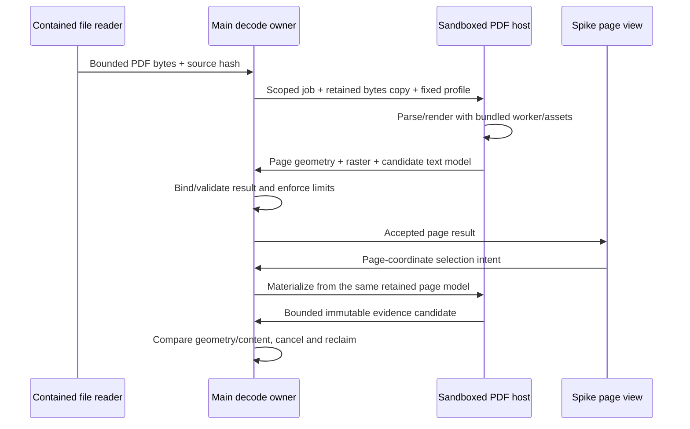

# R3c — Sequential implementation and review plan

Status: **R3c1–R3c3 implemented, verified and owner-accepted, 2026-09-08.** [R3c3 implementation](../../stages/r3c3-agent-pdf.md) adds scoped PDF image observation, authored marks and exact-page Show/Return. PDF semantic text targets and off-page background Agent reads remain deferred.

R3b3 is accepted. Its reported production baseline is 263 unit/contract tests and 43 native Electron scenarios; these were not rerun for the isolated qualification. R3c1 has its own 17 passing scenarios, 64 rendered transform combinations and byte-identical verification of 434 protected source files.

## Checkpoints

| Stage                                      | Concrete goal                                                                                                                                                                                          | Completion evidence                                                                                                                                                                            | Review before continuing                                            |
| ------------------------------------------ | ------------------------------------------------------------------------------------------------------------------------------------------------------------------------------------------------------ | ---------------------------------------------------------------------------------------------------------------------------------------------------------------------------------------------- | ------------------------------------------------------------------- |
| **R3c1: decoder and target qualification** | Evaluate/pin one PDF.js tuple in an isolated spike; prove source-bound page raster/model, offline assets/CSP, geometry, cancellation and limits; define closed target API and migration impact.        | Real PDF fixture results, measured geometry error, memory/time/cancellation data, exact dependency/license/asset list, source/evidence-owner diagram and an explicit text-capability decision. | Owner sees the working sample and final architecture; accepts R3c2. |
| **R3c2: User reading and discussion**      | Integrate bounded PDF file opening, one-page reader/navigation, page/region selection, keyboard access, capture-to-composer and history. Include text selection only if R3c1 proves its exact mapping. | Actual PDF → selection → immutable attachment → source-change/restart scenarios; all relevant old evidence and schema compatibility; native visual review at target sizes.                     | Owner reviews real reading/selection UX and approves Agent tools.   |
| **R3c3: Agent shared references**          | Extend existing observation/pointer contracts and toolset binding; exact page/text/region scope; authored marks; Show/Return and captured fallback.                                                    | Scope/replay/visibility rejection tests; scripted tool trials; one real signed-in Agent trial on synthetic PDFs; draft/navigation preservation.                                                | Summarize and obtain approval before another View family.           |

Each checkpoint completes only its accepted work. Do not bundle interactive HTML/MultiQC, Notebook, MCP hosting or a viewer marketplace into R3c. R4 remains the later Notebook track. CSV chart creation stays excluded.

## R3c1 implementation sketch

The spike can fail and still produce a useful checkpoint: report the failure and revise the decision rather than relaxing the shell's policy or claiming inaccurate text support. The spike is not a general plugin host.

Ordered work:

1. Freeze source hashes, inspect existing binary transport/bounds and exact test commands; record the real Electron/Node/React/PDF.js tuple.
2. Build the smallest isolated candidate with deterministic synthetic PDF fixtures. Compare direct PDF.js against React-PDF only if the wrapper materially reduces code; do not install both into production by default.
3. Qualify lifecycle, offline rendering, fonts/CMaps, unsupported content and transform inverses before introducing durable selectors.
4. Define the canonical page model and selected evidence derivation. Prove one representation is used for both visual output and delivery. Treat text mapping as an explicit pass/fail capability.
5. Publish a compact result with chosen owner/API, measured limits, unsupported cases, changed file inventory and next-stage sketch.

No production schema number is reserved here. The illustrative [contract sketch](contract-sketch.md) is not an exported wire format.

## Fixture and verification matrix

| Risk                      | Fixture / action                                                                                                | Required result                                                                                                  |
| ------------------------- | --------------------------------------------------------------------------------------------------------------- | ---------------------------------------------------------------------------------------------------------------- |
| Wrong geometry            | Nonzero crop origin, intrinsic and user rotations 0/90/180/270, nondefault userUnit, HiDPI, zoom                | Round-trip error measured against fixture coordinates; exact crop and overlay within accepted bound.             |
| Misidentified text        | Duplicate quotes, columns, ligatures, combining marks, emoji/surrogates, RTL, rotated text                      | Exact item/range mapping or explicit region-only capability. No guessed order/quote identity.                    |
| Missing text              | Image-only scan, missing font, extraction failure                                                               | Page/region still usable where render is valid; no empty successful text observation.                            |
| Large input/work          | Limit-1, limit, limit+1 bytes; many pages; image-heavy/complex page                                             | Deterministic rejection/cancellation; bounded pixel work/cache, responsive Chat; measured cold/warm latency.     |
| Malformed/active document | Truncation, password request, links, embedded actions/files, interactive forms                                  | No filesystem/network/action authority; descriptive unavailable/unsupported state. Password UI is deferred.      |
| Stale async results       | Change Project, change page, close Surface, refresh source or crash host mid-render                             | Old job cannot publish readiness, select, capture or point; resources reclaimed.                                 |
| Capture integrity         | Discuss then modify/remove source; restart; remove a draft chip                                                 | Frozen selected content still matches its manifest; drafts recover; storage reclamation preserves sent evidence. |
| Agent scope, R3c3         | Hidden Surface, off-page/off-viewport region, unreturned text, expired read, cancellation, cross-Project target | Refuse pointer without moving the User; source-only reads remain non-pointable.                                  |
| Compatibility             | Existing workspace backups, historical schema bundles, image/text/table/Run/log/dependency captures             | Old shapes/hashes unchanged; version migration only where needed and never retargets old marks.                  |

Initial admission proposal: reuse the existing 8 MiB file cap and decode only the requested page. Page count, work timeout, retained page count, raster pixel count, evidence size and Agent output limits must be measured and recorded in R3c1. Byte size alone is not a CPU/memory bound. Existing evidence limits are constraints to fit or explicitly revise; never silently downsample/truncate an exact selection.

## Owner walkthrough for this sketch

1. Keep Chat visible while reading. Switch **A · Inline reader** and **B · Page rail**; judge the reading width.
2. Use **Sample text** or drag text on the synthetic page. Press **Discuss selection**. Confirm there is one composer, a chip and no automatic send.
3. Enter **Select region** and drag across the synthetic figure. Alternatively focus the region area and use arrow keys, with Shift to resize. Escape cancels.
4. Change page/fit, type an unsent note, then choose the Agent card's **Show**. Confirm the reference is authored separately. **Return to my view** must restore the page, selection and unsent text.
5. Use **Source changed**. With a saved capture, Show explains that it is historical evidence. Disable **Saved capture** and repeat: show an unavailable explanation.
6. Use **Scanned page**. Text selection becomes unavailable while region/page actions remain.
7. Resize to 900×650 and 736×650. Core controls remain available without hover. Compact Workspace/Chat switching must retain the pending attachment.

The HTML pages, captures and Agent messages are synthetic. The sketch tests UI state; it does not decode PDFs, contact an Agent, write Workspace state or validate the source-coordinate contract.

## Design activity record

| Activity                            | Disposition and evidence                                                                                                                                                | Reopen condition                                                                                |
| ----------------------------------- | ----------------------------------------------------------------------------------------------------------------------------------------------------------------------- | ----------------------------------------------------------------------------------------------- |
| Discovery                           | Reused user constraints/current native screenshots; performed source-owner inspection and primary-source PDF research.                                                  | Real reports differ from bounded synthetic assumptions.                                         |
| Problem framing                     | Performed: one-page exact discussion and reversible Agent reveal, defined in design.md. Awaiting owner acceptance.                                                      | Selection or page labels are misunderstood.                                                     |
| Concepts                            | Performed: inline reader vs persistent page rail; A recommended, owner decision pending.                                                                                | Repeated loss of page position or navigation friction.                                          |
| Prototyping                         | Performed: generated concept image and stateful HTML sketch; checks recorded in review/verification.md.                                                                 | Layout, keyboard or restoration mismatch.                                                       |
| Representative-user testing         | Pending owner walkthrough. Prior user feedback is reused for compactness, not as evidence for novel PDF interactions. Expert checks are not a general usability result. | Owner walkthrough fails or new representative users need a different model.                     |
| Design/implementation collaboration | Performed: owner map, candidate APIs, sequential qualification and test matrix.                                                                                         | Decoder host cannot meet the contract or implementation changes the interaction.                |
| Post-release improvement            | Planned only: no release or analytics here. Review incorrect-target reports, restoration failures and inaccessible selection paths.                                     | Any target mismatch is a correctness failure; do not optimize time/click counts at its expense. |

Success means the User and Agent discuss the same bounded source content while User work survives. Faster attachment alone is not success if the selected region/quote is wrong. Repeated source-unavailable cases should reopen retention/refresh UX, not trigger automatic substitution.
