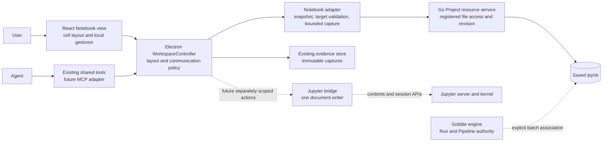

# R4 — Notebook shared reading and the future execution boundary

Status: **Concept A and R4a1 accepted; R4a2 implemented and verified, awaiting owner review**,
2026-09-09. [R4a2 integration and review](../../stages/r4a2-user-notebook.md)
records the production reading/evidence boundary. App UI and new documents are in
English. Agent Notebook tools, live integration and execution remain later stages.

[Interactive sketch](sketch.html) · [Implementation plan](implementation-plan.md) ·
[Review evidence](review/review.md) · [Generated concept](concept.png)

## Recommended direction

Start with **A: a saved Notebook reader in an existing Pane**, using the same
selection → attachment → Chat → authored reference → Show/Return loop as PDF.
Keep code and saved results together; the lower Pane remains available for a
method, image, table or Run. A cell is an address inside a document, not a new
Pane. A stored output is research evidence, not proof of current execution.

Later, qualify a Jupyter document/session bridge before offering editing or
execution. This preserves the original R4 roadmap: R4a reading/references, R4b
integration investigation, R4c editing/execution. R4a is now divided into three
reviewable slices, rather than renaming the later stages.

Concept A is accepted as the first direction. The prototype and native checks
can expose layout and state errors; they cannot establish representative-user usability.

## Evidence and concept comparison

Evidence classes chosen before this recommendation: primary format/protocol
documentation for technical claims; current source and accepted native screenshots
for integration constraints; a deterministic interactive sketch for state and
layout review; a future owner walkthrough for workflow feedback. No participant
study or large research Notebook trial has occurred.

| Concept                             | Interaction and ownership                                                                                                                          | Benefit                                                                                                          | Cost / reason to reconsider                                                                                                                                                                                |
| ----------------------------------- | -------------------------------------------------------------------------------------------------------------------------------------------------- | ---------------------------------------------------------------------------------------------------------------- | ---------------------------------------------------------------------------------------------------------------------------------------------------------------------------------------------------------- |
| **A — Saved reader inside Gobble**  | App renders bounded saved cells/outputs. Native selection attaches to the existing composer. Execution is absent from this mode.                   | Fits the approved compact workspace, works without Python/server setup and exposes exact saved references.       | An allowlist has incomplete rich-output support. Reconsider if representative files depend on widgets or if switching between reading and editing dominates work.                                          |
| **B — Connected Jupyter workspace** | A Jupyter document model/editor lives in the central area, with a scoped bridge for selection and session state. Jupyter retains kernel authority. | Rich notebook authoring and existing output renderers become available through one authoritative document model. | Requires environment choice, bridge/version qualification, host isolation, save conflicts, shortcut/focus integration and execution recovery. An embedded page alone does not deliver semantic references. |

B is a materially different action model, not another theme for A. Its sketch
shows connection choice and a disconnected state; it does not simulate successful
kernel execution. Component reuse versus a trimmed JupyterLab surface is an R4b
decision after a runnable spike, not a package choice made from screenshots.

Visual identity follows [the accepted shared-workbench design](../shared-research-workbench/design.md),
[R3c3 native evidence](../../stages/r3c3-review/visual-review.md), then the current
[renderer tokens](../../../../app/desktop/src/renderer/styles/tokens.css).
Reuse the slim Project bar, optional Files navigator, central stacked Panes,
right Chat and one composer. Teal is the User selection, an authored amber outline
identifies an Agent mark; labels also carry identity. No motion is needed.

## Concepts and owners

| Concept                          | Definition                                                                                              | Owner and lifetime                                                                                                                                     |
| -------------------------------- | ------------------------------------------------------------------------------------------------------- | ------------------------------------------------------------------------------------------------------------------------------------------------------ |
| Project                          | Registered research context containing resources, Agent bindings, attached Runs and the App workspace.  | Go service owns registration/access; each subsystem retains its own authoritative records.                                                             |
| Workspace                        | Project presentation and communication state: surfaces, layout, local selections, references, drafts.   | Electron WorkspaceController is the single durable writer.                                                                                             |
| Resource                         | Addressable `.ipynb` file in the Project. Notebook presentation does not create a second file identity. | Existing registered resource service, exact source-byte revision.                                                                                      |
| Notebook snapshot                | Bounded, validated projection of one saved file revision. It separates source and outputs.              | Main-side Notebook adapter; immutable while the reader holds it.                                                                                       |
| Cell                             | Ordered document item: code, Markdown or raw content. Its visible number is a navigation label.         | File declares identity; adapter validates it, never repairs or writes IDs silently.                                                                    |
| Saved output                     | One ordered code-cell output, possibly with several MIME representations.                               | File supplies content. Adapter chooses a supported representation and records which one.                                                               |
| Surface / View                   | One opened presentation instance / its renderer type and capabilities.                                  | App owns Surface identity and typed reading state; adapter owns Notebook rendering semantics.                                                          |
| Pane                             | One placement slot containing Surface tabs. Focus/split changes placement, not document identity.       | Existing workspace layout owner. A cell/output normally remains inside its Notebook Surface.                                                           |
| Selection / reference / evidence | Local intent to identify content / authored durable address / immutable captured payload.               | Existing separate selection, shared-reference and evidence owners. Selecting never sends or executes.                                                  |
| Tool session (future)            | Connection association to a selected Jupyter server/session. Several Surfaces can reference it.         | App bridge owns connection association; Jupyter owns actual session/kernel state. Closing a Pane is not kernel shutdown.                               |
| Kernel (future)                  | Live interpreter process, variable state and execution messages.                                        | Jupyter/runtime, never inferred from notebook metadata.                                                                                                |
| Run / Pipeline                   | Gobble execution record / authored execution definition.                                                | Gobble engine remains authoritative. An interactive kernel is not automatically a Run; a Notebook batch explicitly launched through Gobble may be one. |



R4a makes no kernel connection and no file write. Source edits in external tools
become a new file revision. Refresh explicitly loads that revision; old attachments
and marks stay historical. The App service is not the Gobble execution engine.

## Proposed reading capabilities

| Content                                | Initial behavior                                                                                                                                                             | Exact sharing                                                                                                                |
| -------------------------------------- | ---------------------------------------------------------------------------------------------------------------------------------------------------------------------------- | ---------------------------------------------------------------------------------------------------------------------------- |
| Code / raw cells                       | Readable source with line numbers, source selection and whole-cell action. Declared Python/R language is a label, not environment availability.                              | Cell-source range or bounded whole-cell source; no outputs silently bundled.                                                 |
| Markdown cells                         | Qualify a restricted formatted preview; raw HTML, external images and active content disabled. Always offer Source. Math, attachments and links need explicit qualification. | Whole-cell source or a range selected in Source. Rendered text is not called an exact source range without a proven mapping. |
| Stream, error, `text/plain`            | Bounded readable text. Terminal escape/control handling defines a versioned display projection; no terminal emulation.                                                       | Output index + representation + exact displayed-text range.                                                                  |
| Saved PNG/JPEG output                  | Decode within explicit byte/pixel limits and keep natural dimensions.                                                                                                        | Whole image or original-pixel rectangle. This is a visual region, not a biological entity or plot data-point set.            |
| HTML/SVG/JavaScript/widgets/other MIME | Prefer supported static PNG/JPEG or plain-text alternative when present; label that fallback. Otherwise show the output slot and “Preview unavailable”.                      | Only the displayed supported representation is pointable. No raw active payload forwarded as a current visual observation.   |

Choose one MIME representation deterministically and communicate the choice. A
pandas HTML table can fall back to its saved plain text; R4a will not reconstruct a
semantic table from arbitrary HTML. Existing figure images are viewable output;
**CSV chart creation remains excluded**. No chart builder or new plotting library.

Proposed supported document range is nbformat 4.0–4.5, subject to R4a1 fixtures.
Missing IDs in older valid files use revision-scoped ordinal addresses. Missing
required IDs in 4.5, duplicate IDs, malformed fields and unknown format versions
produce an explicit unsupported/invalid state; no silent conversion. A display
failure in one known output can be local to that output without hiding the rest of
a valid document. Unknown cell/output kinds keep an explicit unavailable slot.

## Exact selection and two-way communication

1. A cell header action identifies **that cell's source**. Text drag or keyboard
   selection identifies a source/output range. “Select region” on an image enters
   an explicit geometry mode. Hover and scrolling only change presentation.
2. The toolbar says `Cell 3 · Source · Line 1` or `Cell 3 · Output 1 · Image region`.
   `Discuss selection` creates a frozen attachment in the existing composer.
   `Share mark` uses the existing secondary authored-mark action. Neither sends.
3. `Send` delivers the addressed attachment and exact capture metadata to the
   selected Agent. Selecting something else does not rewrite an attachment.
4. Agent observation reports the actually ready, visible cell parts, including
   clipped ranges and omitted content. Collapsed/offscreen content is not claimed
   as seen. A separately requested bounded source preview is not pointable.
5. Agent pointing uses a same-turn observation receipt, an exact part within its
   observed scope, and host-validated identity. It adds an authored mark without
   changing the User's selection, scroll or composer.
6. `Show in view` temporarily reveals the referenced cell/part. `Return to my view`
   restores the prior Surface, scroll, expanded outputs and local selection. The
   composer remains mounted. Hidden/pinned view protection uses current policy.
7. If the source revision changed or disappeared, show captured evidence with an
   earlier-version label. No automatic search for similar source or matching cell
   numbers. Without a capture, show unavailable; do not invent one.

Proposed target shape below is **illustrative**, not a published contract or next
schema version. Main supplies actor/time/resource identity and verifies the content.

```json
{
  "projectId": "prj_example",
  "resourceId": "res_qc_notebook",
  "dataRevision": "exact-file-byte-digest",
  "cell": { "kind": "id", "id": "qc-filter" },
  "part": {
    "kind": "source",
    "range": {
      "start": { "line": 1, "column": 0 },
      "end": { "line": 1, "column": 29 },
      "units": "decoded-source-utf16-line-column"
    }
  },
  "projectionRevision": "qualified-notebook-projection",
  "quote": "keep = qc[\"mapped_pct\"] >= 80"
}
```

The illustrative end column must be derived from the actual selected source, never
trusted from an Agent. Text addresses reuse 1-based lines, 0-based UTF-16 columns
and half-open ranges. Join string-array fields with the empty string before
addressing; preserve source line endings and test CRLF/Unicode mapping. Reject
surrogate-splitting positions. A rendered Markdown quote is not a source offset.

Output addresses additionally contain the original output index, output type,
selected MIME representation, representation digest and text/image selector.
Outputs have no assumed persistent global IDs. Image rectangles use natural
decoded pixels, top-left origin, half-open bounds. Cell IDs support navigation
across reorder; **an old reference still targets its old document revision**.
Any future cross-revision comparison must be explicit and cannot replace evidence.

Capture manifests keep exact revision, target, representation, author, capture time,
content digest and returned/omitted counts. Do not add a generic metadata bag or
copy the whole Notebook into every Chat message. A saved `execution_count`,
`kernelspec` or execution timestamp is declared file metadata, not verified
provenance. Display `Saved output` and expose `Execution not verified` in details.

## UI behavior and recovery

The default shows a continuous Notebook reading surface. `Cells` opens a compact
jump list and closes after choosing; `Focus` temporarily expands the current Pane.
Source and output folding is local reading state. Every relevant cell/output
action is keyboard reachable and visible without hover; text supports ordinary
selection, and image selection needs a keyboard equivalent at implementation.
The sketch uses explicit preset-selection buttons to make the identity flow
reviewable; it does not prove production drag/range mapping.

At 900×650, the Files navigator starts collapsed and the Chat composer stays
visible. Secondary controls can wrap rather than shrinking targets. At enlarged
text, content scrolls inside its Pane/Chat; no extra selection inspector or answer
dialog appears. Notebook controls do not add tray/global shortcuts or notifications;
existing app/window conventions apply. Do not copy Jupyter's command-mode keys
into the read-only reader. Escape exits a temporary reference or selector mode;
focus returns to the invoking control.

Show these states explicitly: loading; invalid document; file too large; partially
unsupported output; source changed with retained snapshot; captured earlier version;
no saved outputs; missing source/capture. Scrolling never refreshes the file. Agent
arrival never scrolls the User's view automatically.

## Implementation structure to preserve

The current service handles `.ipynb` as generic UTF-8 text (1 MiB text limit), with
no Notebook Surface kind. Simply parsing that preview in React would put source
identity and capture authority in the wrong owner. R4a1 must first qualify a
bounded transport/decoder without changing production file APIs.

| Proposed location / existing owner                                    | Responsibility and API boundary                                                                                                                    |
| --------------------------------------------------------------------- | -------------------------------------------------------------------------------------------------------------------------------------------------- |
| `app/qualification/notebook/` — R4a1 only                             | Frozen fixtures, pure parser/target prototype and isolated native harness. No production imports from qualification code.                          |
| `app/contracts/src/notebook.ts` — after qualification                 | One schema owner for snapshot projection, cell/output addresses and typed reading state. Reuse existing reference/evidence envelopes.              |
| `internal/appservice/files.go` / focused source reader — R4a2         | Registered byte read and exact revision, with a named bounded Notebook transport; no cell UI or kernel state.                                      |
| `desktop/src/main/notebook/` — R4a2                                   | Pure normalization/target validation and MIME decisions. A worker/lifecycle object only if bounded decoding measurements require one.              |
| Existing `workspace/service.ts`, `render-session.ts`, `controller.ts` | Compose the reader, issue ready/visible leases and route durable operations. Controller coordinates; parser logic stays outside it.                |
| Existing `evidence/`, `shared-context/`, `questions/`                 | Bounded captures, observation receipts, authored marks and addressed delivery through current owners. Add only Notebook-specific payload handling. |
| `renderer/workspace/views/notebook/`                                  | Cell/source/output rendering, local reading controls, gesture mapping and reference content. No filesystem or provider calls.                      |
| Future `main/integrations/jupyter/` — R4b/c                           | Server authentication, document/session association, command correlation and reconnect. No empty framework folder in R4a.                          |

Prefer pure `parseNotebook`, `resolveNotebookPart` and `describeNotebookObservation`
functions with explicit bounded inputs and discriminated results. Keep asynchronous
read/capture at the host boundary. Public version numbers and exact signatures are
chosen at the qualified contract checkpoint. Avoid a universal BasePane, registry
framework, parallel Notebook repository or new transport just for this View.

## Future live execution direction

R4b must compare reusing a Jupyter model/editor with embedding a trimmed Jupyter
surface plus extension bridge. Both require one authoritative open document model;
the App must not save a competing copy behind Jupyter's back. Credentials remain
in Main and are never included in selections or Agent messages.

Execution commands must bind the selected environment/server, document and cell
source revision, kernel epoch and request ID. A disconnect after submission means
outcome unknown until reconciled; it does not mean failed and does not trigger
automatic resubmission. Outputs may update after their first display and require
new observation/capture revisions. Interrupt, restart and close each have different
effects. Batch execution through Gobble is separately associated with a Run.

MCP may later adapt the same scoped open/observe/point/capture semantics. It neither
defines Notebook identity nor supplies a Jupyter document bridge by itself.

## Primary research, checked 2026-09-08

| Source                                                                                                  | Verified fact                                                                                                                                    | Design implication (our judgment)                                                                                                |
| ------------------------------------------------------------------------------------------------------- | ------------------------------------------------------------------------------------------------------------------------------------------------ | -------------------------------------------------------------------------------------------------------------------------------- |
| [nbformat file description](https://nbformat.readthedocs.io/en/latest/format_description.html)          | Notebook content distinguishes cells and outputs; source/text can use string arrays; a display output can hold multiple MIME representations.    | Normalize once, address source/output separately, state the selected representation.                                             |
| [JEP 62: cell IDs](https://github.com/jupyter/enhancement-proposals/blob/master/62-cell-id/cell-id.md)  | Cell IDs are notebook-local identity introduced for addressing cells rather than relying on position.                                            | Validate IDs; older files need explicit revision-scoped fallback. IDs do not imply content or output equivalence.                |
| [Jupyter Server security](https://jupyter-server.readthedocs.io/en/latest/operators/security.html)      | Notebook trust involves signatures tied to a local secret/database; active outputs raise execution concerns.                                     | Do not interpret an arbitrary file's metadata as permission to execute embedded content. Qualify a passive MIME allowlist first. |
| [JupyterLab notebook architecture](https://jupyterlab.readthedocs.io/en/stable/extension/notebook.html) | Notebook, cell and output models, actions and MIME renderers are separate components; widgets involve notebook-specific state and communication. | Reuse is a candidate for R4b, with integration work and a clear authoritative model, not an immediate dependency.                |
| [Jupyter Server REST API](https://jupyter-server.readthedocs.io/en/latest/developers/rest-api.html)     | Contents, sessions and kernels have separate APIs/lifecycle operations.                                                                          | Model the saved file, opened Surface and execution connection independently.                                                     |
| [Jupyter messaging](https://jupyter-client.readthedocs.io/en/latest/messaging.html)                     | Execution uses correlated request/reply messages and output channels; display IDs may receive later updates.                                     | Saved execution counters alone are insufficient; live references need session/epoch/request and observation revisions.           |

These are documentation findings, not installed Jupyter compatibility results.
No Jupyter package, server, kernel or runtime environment was installed or started.
