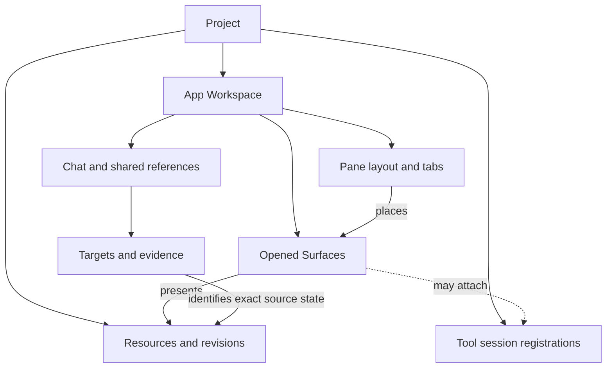
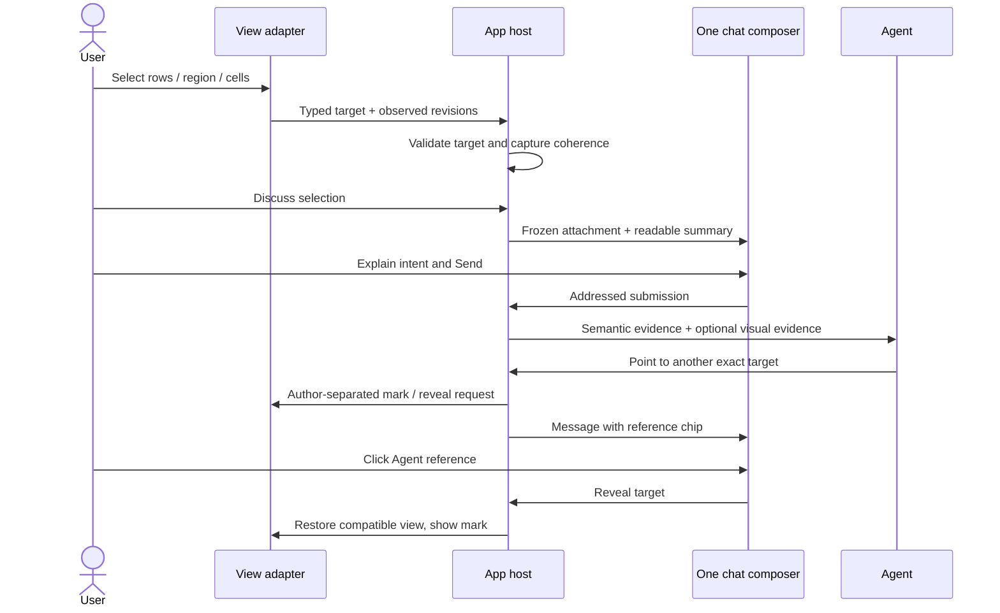
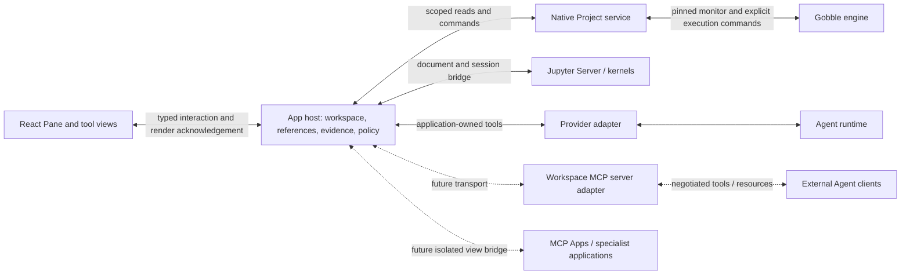

# Shared research workbench — Design proposal

Current scope correction (2026-09-08): App-generated charts from CSV are excluded.
CSV remains a table with selection and discussion. Previously captured plot metadata remains
readable for compatibility. Scientific result viewing and Run dependency navigation do not authorize
an App chart builder. The historical R2 design below is superseded on this point.

Status: **Draft for user review, 2026-09-07.** Not an accepted replacement for the current domain contract. Packaging remains outside this work. Evidence and alternatives: [research](research.md). Delivery checkpoints: [plan](implementation-plan.md).

## Product decision

The central area is the Project's **workbench**: User and Agents inspect, explore and work with shared research subjects through opened views. Viewing, selecting, explaining, proposing changes and authorized execution form a connected workflow. Workbench is a UI description, not a second persisted Workspace aggregate.

The existing Project-centered shell remains: compact navigation, central upper/lower panes, right Project chat with one composer. More tools should expand what a view can do without filling the shell with permanent tool-specific panels.

## Concepts and cardinality

| Concept                      | Definition / identity                                                                                                                                                 | Owner and lifetime                                                                                                                                                 |
| ---------------------------- | --------------------------------------------------------------------------------------------------------------------------------------------------------------------- | ------------------------------------------------------------------------------------------------------------------------------------------------------------------ |
| Project                      | Stable work/access scope tying resources, agents, app state and execution registrations together. It can eventually reference more than one storage/runtime location. | Native Project catalog owns current local-root mapping. Multi-root/remote storage is a separate future contract.                                                   |
| App Workspace                | Project-owned open views, layout, drafts and collaboration records. One per Project today.                                                                            | Existing WorkspaceController remains the single persisted aggregate writer.                                                                                        |
| Resource                     | Addressable research subject: existing file/Run/log, later a registered dataset or saved composite definition when needed. A resource can have many representations.  | Source owner holds the bytes/facts; catalog resolves identity and access. A file does not need a new resource kind merely to become a notebook view.               |
| Resource revision            | Identity of a specific source state, or an explicitly weak observation when immutable identity is unavailable.                                                        | Source/data provider. Do not present a timestamp or mutable URL as a content hash.                                                                                 |
| View definition              | Registered presentation type and supported capabilities; e.g. text, table, scatter plot, notebook, genome browser.                                                    | A bundled adapter initially; versioned external adapters only after an extension boundary exists.                                                                  |
| Surface / opened view        | One presentation instance of a resource and its view state. Two views can show the same resource, e.g. table above and plot below.                                    | App host owns identity and lifecycle. `surfaceId` is retained internally; UI calls it a view.                                                                      |
| Pane / Panel                 | Layout container with tabs and an active Surface. The user's central Panel corresponds to one or more of these panes.                                                 | Layout only. No data parsing, selection interpretation or kernel ownership.                                                                                        |
| View state                   | Filters, ordering, zoom, axes, camera, visible tracks, active notebook cell, etc.                                                                                     | Adapter has the typed schema; host persists the useful serializable subset. A filter is not a source edit.                                                         |
| Tool session                 | A live connection to an interactive service, such as a Jupyter session/kernel. It may be shown in several Surfaces.                                                   | App session manager owns association/connection; Jupyter owns actual kernel state. Closing a tab is not shutdown.                                                  |
| Local selection              | Actor-owned, provisional target produced by a deliberate gesture or command.                                                                                          | Interaction state. Selection alone neither sends a message nor authorizes a data change or execution.                                                              |
| Target / anchor              | Resource revision plus a typed selector describing what is meant. Can be resolved without the origin Surface.                                                         | Portable contract; source-specific adapter validates it. Origin Surface is an optional navigation hint.                                                            |
| Shared reference             | An authored pointer to a target, optionally with a note.                                                                                                              | Existing collaboration/workspace store. It has an author and audience/access scope; it is not itself a snapshot or delivery receipt.                               |
| Evidence capture             | Immutable bounded data/visual representation associated with the target and capture conditions.                                                                       | Host evidence service and assets. Retained independently of the tab, subject to explicit retention policy.                                                         |
| Observation                  | What the Agent actually received: semantic data, a rendered capture, or both, with limits and versions.                                                               | Host records capture/delivery association. Receiving data never proves the model understood it.                                                                    |
| Annotation / proposed change | A comment, named subset, label, patch or proposed action about one or more targets.                                                                                   | Initially use references and messages; add a dedicated persisted object only when its lifecycle requires one. A committed source edit belongs to the source owner. |



A dashboard is a saved composition of widget specifications and resource bindings. It is one Surface with internal subviews, not a second application-level pane manager. A graph resource means nodes/edges, while a plot means scientific coordinates/measures. A saved Gobble Plan graph and a live Run graph are distinct subjects.

## Support scope and priority

Priorities are proposed, assuming general research work until the user specifies a more focused workflow. “Support” must name its depth: **display → semantic reference → linked exploration → edit/execute**. An integration cannot advertise a later depth until its contracts and tests exist.

| Family                           | Useful content and interactions                                                                                                                                                                           | Required target semantics                                                                                                                                      | Proposed priority / integration                                                                                                           |
| -------------------------------- | --------------------------------------------------------------------------------------------------------------------------------------------------------------------------------------------------------- | -------------------------------------------------------------------------------------------------------------------------------------------------------------- | ----------------------------------------------------------------------------------------------------------------------------------------- |
| Documents and code               | Text, Markdown, JSON/YAML, source, diffs; PDF pages/text; ordinary PNG/JPEG, sanitized SVG. Navigate, search, compare and discuss. Editing/diff apply is a later capability.                              | Exact text and revision, diff side/base revision, PDF page and region/text layer, original-image geometry.                                                     | Foundation. Extend existing views; separate PDF/text extraction and safe SVG handling.                                                    |
| Tables and datasets              | CSV/TSV first; paged Parquet/Arrow later. Sample sheets, differential-expression tables, annotation tables. Filter, sort, select columns/cells/rows, create a named subset/export.                        | Dataset revision, row identity namespace and column IDs; exact membership or a version-pinned predicate.                                                       | First semantic expansion. Existing preview limits stay truthful until a paged provider exists.                                            |
| Scientific result viewing | Display existing analysis outputs with their supplied semantics; dedicated formats and Notebook outputs need their own approved contracts. App-generated charts from CSV are excluded. | Result revision and supplied coordinate/entity meaning; no inferred transforms or memberships. | Deferred, separately scoped viewers. No CSV chart builder or Plotly candidate is authorized. |
| Gobble monitoring and provenance | Plan/DAG, live Run/tasks/attempts/logs, input/output links, later comparison across Runs. Inspect/reveal; controls are separately authorized commands.                                                    | Run registration + actual Run ID; authored node vs runtime instance + attempt; observation revision, log stream offsets/time window.                           | Early. Improve the existing monitor through the same reference contract; do not recompute engine state.                                   |
| Reports and dashboards           | MultiQC, saved analysis reports, comparison dashboards. Select a sample/metric/widget and trace it to source data.                                                                                        | Report revision, section/widget ID, data bindings, filters and dependency revision vector.                                                                     | Early display + bounded bridges. MultiQC HTML and its machine-readable data need separate version-aware adapters.                         |
| Notebook                         | `.ipynb` cells and outputs, Python/R environments, editing, controlled cell execution, interrupt/reconnect, result promotion to a reusable resource.                                                      | Cell ID and source/output identity; document revision, kernel/session epoch and execution request for live outputs.                                            | Core planned capability. Read/reference first, then a real Jupyter session integration; not “notebook support” completed by JSON preview. |
| Genome browser                   | Reference sequence and annotation, BAM/CRAM alignment, VCF variants, BED/GFF/GTF features and bigWig signal where the chosen adapter supports them. Navigate locus, select feature/range, compare tracks. | Assembly identity/version, contig, explicit interval convention, track/data revision, feature/variant identity. Index and reference prerequisites are visible. | Domain expansion. Compare JBrowse embedded view and igv.js before choosing one; don't ship both initially.                                |
| Single-cell / spatial            | AnnData metadata, expression matrices, embeddings, clusters/cell sets; tissue image + spots/segmentation. Linked exploration and subset export.                                                           | Dataset + observation/cell IDs, feature namespace/version, coordinate frame, image resolution/transform, channel/z/time where relevant.                        | Domain expansion. Vitessce candidate; local data preparation and chunked serving are part of support.                                     |
| Biological networks and trees    | Gene/pathway networks and phylogenetic trees; select nodes, edges, clades and source sets.                                                                                                                | Graph/tree revision, stable node/edge/tip IDs; relationship provenance.                                                                                        | Later according to workflow. Cytoscape.js for networks; evaluate a tree-specific adapter separately.                                      |
| Molecular structures             | Protein/complex views, residues/chains/ligands, optionally density/trajectory.                                                                                                                            | Model/assembly, chain, residue identity including insertion code, atom set/frame.                                                                              | Later; Mol* candidate.                                                                                                                    |
| Specialist applications          | Existing JupyterLab, Shiny, Dash, Streamlit or other research web apps.                                                                                                                                   | Declared bridge capabilities; otherwise capture-only reference with explicit limits.                                                                           | Escape hatch and later integrations. App hosting does not imply semantic access or safe arbitrary code execution.                         |

FASTA/FASTQ should initially have bounded record/quality summaries and access to indexed sequence data where available. Loading a large raw file into a text component is not a scientific viewer. Likewise, `.h5ad`/HDF5 preparation must be an explicit data operation with output provenance, not a hidden side effect of opening a tab.

## Selection is a deliberate act of identifying a target

Selection answers **“which part do I mean?”** It does not answer **“what should happen to it?”** Those are separate actions expressed by a message or a named command.

| Gesture / command                                              | Meaning                                                                                        | Sharing behavior                                                                                               |
| -------------------------------------------------------------- | ---------------------------------------------------------------------------------------------- | -------------------------------------------------------------------------------------------------------------- |
| Hover                                                          | Temporary inspection/tooltip.                                                                  | Never starts a turn or emits durable references.                                                               |
| Scroll, zoom, pan, sort                                        | Change presentation.                                                                           | No instruction. May update a permitted observation's view state.                                               |
| Text drag, row/cell selection, box/lasso, explicit locus entry | Create/update the actor's local selection.                                                     | Local draft only by default; cross-view highlighting may use an existing explicit link.                        |
| `Discuss selection`                                            | Freeze a reference/evidence preview and attach it to the current composer; focus the composer. | No send until `Send`. No extra selection dialogue.                                                             |
| `Mark for discussion` in secondary actions                     | Publish an authored pointer without starting a turn.                                           | Visible to the Project's permitted collaborators; not proof every Agent received it.                           |
| `Send`                                                         | Send text and chosen evidence to the selected Agent.                                           | Captured revision and limits accompany the message. Draft attachment never silently updates to different data. |
| Agent `point` / `reveal`                                       | Publish its own reference or request view navigation through host policy.                      | Does not overwrite the User's selection or take input focus.                                                   |
| `Apply`, `Run cell`, `Stop run`                                | Change data or execution.                                                                      | Separate capability and explicit action authorization; the selection supplies target identity only.            |

The common primary affordance is `Discuss selection`. Tool-local native actions remain native: dragging in a notebook editor edits/selects text; dragging a plot may pan or select according to its visibly active mode. Do not put a universal transparent drag layer over every tool. Provide keyboard/select-by-ID equivalents for canvas views and a textual summary for screen readers.

### Selector families

| Content        | Durable addressing                                                                                                                                                 | Essential caveat                                                                                                                                                                                                                     |
| -------------- | ------------------------------------------------------------------------------------------------------------------------------------------------------------------ | ------------------------------------------------------------------------------------------------------------------------------------------------------------------------------------------------------------------------------------ |
| Text / code    | Source revision, half-open range, explicit units (initially 1-based lines + 0-based UTF-16 columns), exact quote with bounded prefix/suffix; optional symbol hint. | Duplicate quotes can be ambiguous. A symbol name alone is not an exact location; Unicode/line-ending conversion must be explicit.                                                                                                    |
| Table          | Dataset revision, column IDs, stable row IDs with identity namespace; cell set or rectangular row×column selection explicitly distinguished.                       | Existing `row_17` is ordinal only within its immutable CSV revision. Sorting cannot redefine it; across-file joins need a declared mapping.                                                                                          |
| Raster / PDF   | Resource revision; original pixel/page coordinate frame; rectangle/polygon, page and transform.                                                                    | Screen pixels differ from original pixels. Rotated PDF pages, image orientation and resolution need mapping. OCR is derived evidence with uncertainty.                                                                               |
| Plot           | Dataset revision, plot-spec revision, series ID and entity IDs; optionally data-space interval/lasso with axes, scales, transforms and resolved membership.        | Screen geometry alone is visual-only. A selection over a downsample must say so; log scales and categorical axes cannot use an implicit coordinate convention.                                                                       |
| Notebook       | File/doc revision, stable cell ID, source range or output target; output identity scoped to its cell/execution and content hash.                                   | nbformat does not guarantee persistent output IDs. The bridge must assign/resolve scoped identities; execution count alone is insufficient. Old cells without IDs require deterministic read-only fallback or an explicit migration. |
| Genome         | Assembly/ref sequence version, contig, zero-based half-open interval internally, original display convention; track/feature/variant refs.                          | Show familiar one-based intervals in UI with a labelled conversion. No implicit hg19↔hg38 mapping. Liftover is an explicit derived operation.                                                                                        |
| Cell / spatial | Dataset-scoped observation IDs, image coordinate frame, units and transform revision, channel/z/time/level as applicable.                                          | Cell labels may change; exact membership does not. UMAP coordinates do not equal tissue coordinates.                                                                                                                                 |
| Graph / Run    | Typed graph node/edge IDs; for execution, authored task or instance+attempt and Run identity explicitly distinguished.                                             | Same task name in different Runs/attempts is not the same target. Live metrics retain their capture interval/revision.                                                                                                               |
| Dashboard      | Widget ID/spec revision plus the target in its bound dataset(s).                                                                                                   | A composite may contain different capture times. Report a revision vector and time skew instead of claiming an atomic snapshot.                                                                                                      |

Do not force every selector into rectangles, or every semantic object into `kind: text`. Unsupported selectors return `unsupported` with a readable fallback, never an empty “successful” selection.

### Conceptual evidence envelope

Illustrative values only; this is a design sketch, not the current wire schema. The host fills actor identity, captures data and validates all adapter/model-supplied fields.

```json
{
  "schemaVersion": 2,
  "referenceId": "ref_example",
  "projectId": "prj_example",
  "target": {
    "resourceId": "res_expression",
    "revision": "opaque-dataset-r7",
    "selector": {
      "kind": "entities",
      "namespace": "expression-row-id",
      "ids": ["gene_A", "gene_C"],
      "columns": ["log2_fold_change", "adjusted_p"]
    }
  },
  "origin": {
    "surfaceId": "surface_volcano",
    "viewType": "scatter",
    "viewRevision": "opaque-plot-r3"
  },
  "presentation": {
    "x": { "field": "log2_fold_change", "scale": "linear" },
    "y": { "field": "adjusted_p", "transform": "negative-log10" },
    "filter": { "kind": "all" }
  },
  "evidence": {
    "captureId": "capture_example",
    "semanticCount": 2,
    "returnedCount": 2,
    "truncated": false,
    "representations": ["application/json", "image/png"]
  }
}
```

The real manifest also records author, creation/capture times, relevant source dependencies, selector/adapter version, asset hashes, bounds and capture integrity. Addressed delivery adds recipientAgentId/submissionId and actual provider representation. Credentials, unrestricted paths, arbitrary JavaScript and entire unbounded datasets never belong in this envelope.

Large membership sets use an immutable host-owned set resource/handle with exact count/hash and a small preview. A handle is meaningful only if the recipient has an authorized resolver tool; otherwise the host must send a bounded materialization and state what is missing. Distinguish **these exact members at r7** from **all rows satisfying this predicate at r7** and from **rerun this filter on future data**.

### Bidirectional lifecycle



The host may reject a stale, ambiguous, inaccessible or unsupported target. Errors should name the remedy. No wrong-target fallback:

- `exact`: resource/version and target match; highlight normally.
- `historical`: captured content exists but the current source differs; show `Earlier version` and offer captured evidence or explicit compare.
- `ambiguous`: multiple possible new locations; ask the user to resolve before updating the reference.
- `unavailable`: source/adapter absent; retain the readable reference and any retained evidence.

Re-anchoring creates a derived target with an explicit mapping result; it never rewrites the sent reference. Closing/duplicating/moving a tab does not change target identity. Revoking Agent access prevents new reads but cannot retract content already delivered to a provider.

## Shared view does not mean synchronized control

Live presentation and durable discussion have separate time semantics. A monitoring or streaming view can show `Live`, `Paused for selection` and `New data available`. During a selection gesture or evidence preparation, hold the relevant presentation generation long enough to capture it consistently; this pauses presentation only, not analysis. Resuming live updates preserves the sent reference. Do not force the user to reselect an item on every telemetry tick.

Entity identity and observed facts also differ. A task instance may remain the same while its status changes. The app can explicitly offer `Show current task` from an earlier status capture, but must label the original evidence as historical. This is a deliberate navigation to the current entity, not a silent replacement of the old observation.

The shared unit is the target + data/version + meaningful view state. User and Agent can have different active views and still discuss the same target. Exact visual observation additionally captures what was rendered, the viewport/transform and acknowledgement for that generation.

The host pairs semantic extraction and visual capture against the same revision. If a stream changes during capture, it retries within a bound or reports inconsistency. Large arrays/datasets use immutable manifests or versioned chunks; hashing an entire huge dataset per pointer is not the design. Live dashboards use a declared multi-source capture window.

Agent-authored marks use both author labels and a distinct visual treatment. Display only the current/relevant marks; history lives with message references. `Show in view` restores a view without overwriting the local selection. Automatic Agent opening uses the existing Project/pin/placement policy; unsolicited navigation does not steal the keyboard or replace user-protected work. An optional explicit `Follow agent` can synchronize navigation until the user interacts or stops following.

Linked views share targets only through declared dataset identity or a versioned mapping. Linking a plot and table from one dataset is straightforward. Joining two datasets by gene symbols, samples or cell barcodes requires explicit one-to-one/one-to-many/ambiguous mapping, with missing matches shown. Similar labels do not prove identity.

## UI sketch intent

The review sketch uses synthetic data. It demonstrates selection in a central plot/table, `Discuss selection`, one composer, an Agent-authored pointer and `Show in views`. It does not run an Agent or analysis.

- Compact Project chrome; navigation can collapse. Agents remain in the chat header.
- View title/tab and one context-aware local action row. Metadata expands only when needed.
- Upper/lower content stays dominant. `Focus view` temporarily maximizes a complex notebook/genome browser and restores the split with its state intact.
- Selection summary appears when there is a selection. The primary action prepares a chat attachment, not a new form.
- A chat attachment shows human-readable subject, count/location and version state. Technical identity details are available through details, not repeated in the main flow.
- Chat references remain clickable after the original tab closes. If reopening would displace protected work, open a new tab or present a non-disruptive suggestion.
- Notebook kernel status, disconnect/reconnect and execution progress are local to that view/session. A global dashboard banner is unnecessary.

The two compared UX concepts are an embedded-application container and this common workbench. The selected sketch explores the latter. We have not validated it with representative-user tasks yet.

## Ownership and transport



| Owner                  | Responsibilities                                                                                                                                                  | Excluded responsibility                                                                                                                                          |
| ---------------------- | ----------------------------------------------------------------------------------------------------------------------------------------------------------------- | ---------------------------------------------------------------------------------------------------------------------------------------------------------------- |
| Gobble                 | Pipeline composition/validation, Plan, Run execution, attempts, logs and artifact provenance.                                                                     | Pane layout, chat, Agent identity, image regions, notebook cursor or UI plugin system.                                                                           |
| Native Project service | Source registration/access, file and dataset I/O, bounded reads, pinned engine routing.                                                                           | UI gestures, provider credentials, inference about scientific meaning. Scientific heavy lifting can later run in a scoped data worker rather than Electron main. |
| App host               | Project/actor admission, opened views, registered adapters, target resolution, evidence, delivery, reference persistence, tool-session association.               | Reimplementing engine checkpoints or claiming kernel variables from a saved `.ipynb`.                                                                            |
| View adapter           | Render, interpret native gestures, describe view state, validate selector shape, map/reveal targets. Host/data-side adapter validates actual membership/revision. | Arbitrary host access or an independent persistent Workspace writer.                                                                                             |
| Jupyter                | Contents/session/kernel APIs, live execution state and messages.                                                                                                  | Defining Gobble Runs. A future notebook batch launched through Gobble is a Run; an interactive kernel is not automatically one.                                  |
| Provider/MCP adapter   | Convert a versioned application contract to negotiated tools/resources and delivery formats.                                                                      | Defining target semantics or deciding source permissions.                                                                                                        |

MCP is a useful interoperability boundary, not the selection model. Keep the current provider tool adapter working; add an optional Workspace MCP server over the same host APIs later. Independently, Gobble App can become an MCP Apps host for external interactive views. These two directions are different features. MCP Apps tool results placed in central Surfaces remain bound to a Project and explicit resource/session identity, rather than being owned only by a chat turn.

External HTML and rich notebook outputs run without privileged Electron APIs. Origin/session binding, message schema/size validation, lifecycle cancellation and capability checks belong at the bridge. MCP does not remove these obligations. No arbitrary model-generated component is installed into the trusted renderer. A future Agent creates a registered file or declarative plot/dashboard specification using approved renderers.

## Code organization and API design

Preserve existing ownership and migrate incrementally. The following is a target map, not permission to create empty framework folders:

```text
app/contracts/src/
  resource.ts, surface.ts             existing identities
  selection.ts                       typed selectors, units, validation (from context.ts)
  reference.ts                       durable target and origin hint
  evidence.ts                        captured content, limits and provenance
  view-capabilities.ts               small explicit capability descriptions
  tool-session.ts                    only when Jupyter session support starts
app/desktop/src/main/
  workspace/                         aggregate writer, layout, render readiness
  references/                        resolution and reference policy
  evidence/                          capture/assets; evolve current evidence owner
  views/                             bundled adapter composition and host-side ports
  collaboration/                     addressed messages and delivery
  integrations/jupyter/               document/session bridge, later
  integrations/mcp/                   protocol adapters, later
app/desktop/src/renderer/
  workspace/                         Pane/tabs/split/focus composition
  views/<family>/                     rendering, gestures and local view controls
  selections/                        common summary and Discuss selection
  chat/                              timeline, chips and composer
internal/appservice/                  access and bounded data/engine providers
```

Keep one schema owner per concept. Do not introduce a generic mutable `metadata: any` extension slot, a global event bus, an all-powerful `BasePanel`, or duplicate Project repositories. Bundled adapters can begin as an explicit typed registry; third-party discovery and installation are later products. Plain functions own normalization/resolution; classes own live connections or other real lifecycles.

Illustrative port responsibilities, not final public API names:

- `describeView(resource)` returns supported views and exact capabilities, not an implicit renderer guess from a title.
- `resolveTarget(target, expectedRevision)` returns exact/historical/ambiguous/unavailable with structured reasons.
- `captureEvidence(target, representations, limits)` returns a manifest plus bounded assets and declared observation coherence.
- `revealTarget(target, placementPolicy)` requests placement/highlight; success reports actual view/revision and does not claim User attention.
- `prepareAction(target, action)` validates capability and expected revision, returning a reviewable operation when a change requires review; `commitAction` is separate from observation.

Renderer and host ports are distinct: React/DOM belongs only to the renderer port; I/O, authorization and authoritative capture belong to host/data ports. Avoid one interface requiring every adapter to implement editing, execution and every selector. Capability negotiation reports unsupported combinations explicitly.

The existing `workspace_open`, `workspace_observe` and `workspace_point` can evolve behind a versioned toolset. Retain the current addressed submission and prepare/send guarantees. New capabilities are added at the application boundary once, then adapted to dynamic tools or MCP.

Persistence needs a tested migration from existing mandatory `surfaceId` evidence to durable targets with origin hints. Old attachments and selections keep their exact captured meaning. Do not add new fields to a closed schema without version/migration handling. Unsupported adapter versions preserve reference data and present a readable unavailable state.

## Notebook integration choice

Use two explicit slices: (1) validated file/cell/output reading and semantic reference; (2) an actual Jupyter-backed editor/session bridge. Compare reusing notebook components with embedding a trimmed JupyterLab surface plus an extension in a bounded spike. Prefer the bridge when mature widgets/extensions are needed; avoid promising universal ipywidgets compatibility.

The bridge must resolve active cells, source revisions and output updates through the document model. A model edits by proposing a typed cell patch against an expected revision. It does not write the file behind an open editor. The session manager tracks connection state and a kernel epoch; restart invalidates live state assumptions. Notebook re-execution can replace output evidence but must not rewrite old messages. Remote token/server credentials stay in the host, and reconnect does not resend uncertain execution requests.

Opening a notebook must not execute code. Starting/attaching a kernel, executing cells and publishing a generated result have explicit controls and scopes. App shutdown/hidden views detach according to session ownership; they do not silently kill a remote kernel or a Gobble Run.

## Acceptance questions

1. Is the common workbench with typed, bidirectional references the correct product direction?
2. Should the first concrete slice prove table ↔ plot ↔ chat before specialist tool integration?
3. Which real research scenario should follow: general Notebook work, genomics, or single-cell/spatial?

Approval of the direction authorizes only the next agreed slice. Each implementation checkpoint ends with its own tested demonstration and summary, as requested by the user.
