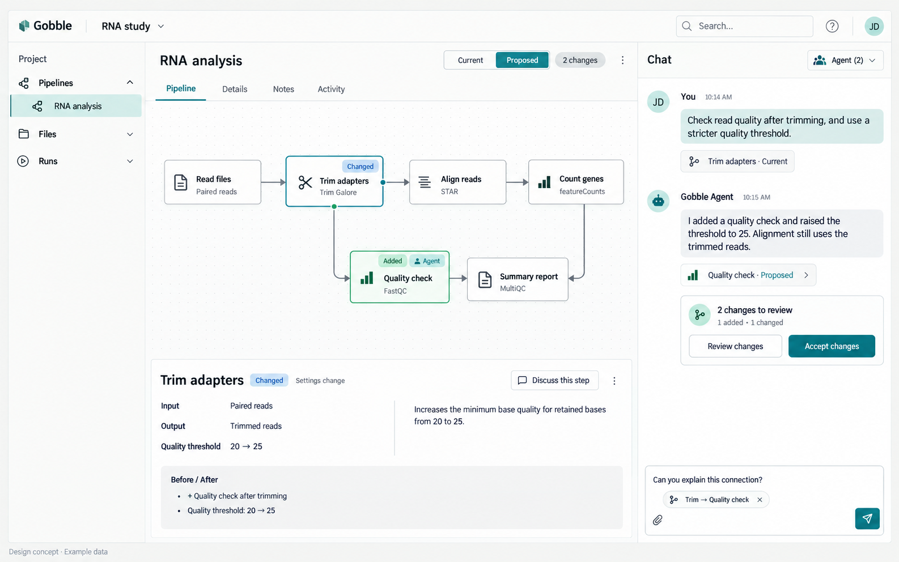

# Visual pipeline collaboration

Date: 2026-09-09. Status: owner-directed product correction; revised screen and
implementation checkpoints proposed for review before production changes.

The owner accepted continuing after P1 and clarified the essential interaction:
**User and Agent discuss the pipeline through its UI. The User does not need to
read Go, understand the Gobble API or review source diffs.** Agent-authored code
is an implementation mechanism behind a shared pipeline flow, its data, settings,
changes and observed results.

This correction supersedes the source-diff-first P2 interaction in the earlier
[plan](../pipeline-collaboration/plan/plan-01.md). P1 remains a completed technical
foundation; its Go-folder registration and default source opening are not the
target end-user journey. The earlier design, review and P1 evidence remain intact
as historical records.

## Review this proposal

1. [Screen and interaction contract](design.md): vocabulary, flow, selections,
   ownership, evidence gaps and compatibility.
2. [Revised checkpoints](plan.md): shared pipeline first, then Agent-authored
   visual changes, then execution and recovery.
3. [Interactive sketch](sketch.html): example steps, a selectable connection,
   selected settings, version-bound Chat references and failure-state controls.
4. [Review record](review.md): actual prototype checks, limits and user scenarios.

The image is a generated concept using the built-in Imagegen tool. Its
[prompt](flow-concept.prompt.txt) is retained. Example analysis choices and values
illustrate interactions, not a recommended or validated scientific workflow. The
interactive sketch defines the proposed minimum layout; extra search/navigation
decorations in the generated image are not added requirements.

The sketch has no Agent connection, source writes, persisted pipeline state,
validation job or execution. Its controls simulate review behavior locally. The
running preview for this review is [available here](http://127.0.0.1:61324/sketch.html);
the HTML file remains available if the preview server has stopped.

## What the User does

- Open a pipeline by its analysis name and see its flow.
- Select a processing step, connection, input/output or setting, then discuss it
  in the existing Chat composer.
- See the Agent's suggested changes on that flow: added/removed steps, rewired
  connections, changed inputs, tools and settings, with actual before/after values.
- Ask for another revision or accept the exact proposal. Accepting a pipeline
  change and starting an analysis are distinct actions.
- Later, select a failed step or output in a Run and ask the Agent to improve the
  pipeline while preserving the earlier Run's identity and evidence.

The default route exposes scientific concepts and clear action consequences.
Optional implementation details support developers; they are not a required step
for design, acceptance, execution or failure recovery.

## The ordering change

The old sequence put shared source diffs before Gobble Plan review. A truthful
visual review requires the composed pipeline and its metadata earlier. The revised
sequence is **shared pipeline inspection → Agent candidate and visual comparison
→ exact execution → failure/fix/Resume**. The first two are delivered in small
reviewed parts; Start and Resume retain their later boundaries.

No production code was changed for this proposal. Its [baseline](review-scope.json)
is the verified P1 source. The next owner checkpoint is the concrete shared-flow
design here and the first implementation slice described in [plan.md](plan.md).
