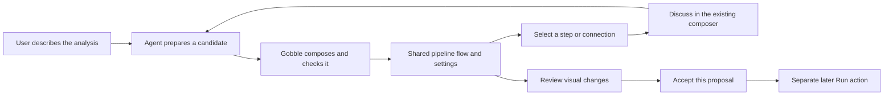
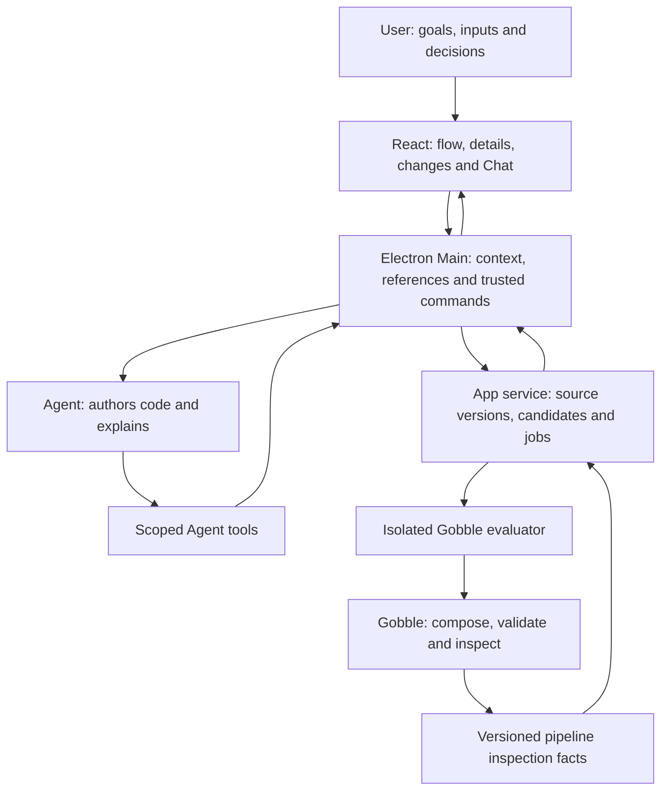

# Shared pipeline UI and ownership

Owner requirement: a researcher discusses and changes a pipeline without Go or
Gobble knowledge. English App UI, Project navigation, central work Panes and right
Chat remain the identity constraints. The present contract is a proposed response
to that requirement; it does not claim the pictured functionality exists.

## User experience and alternatives

The preferred concept is a **flow canvas with selected-item details inside that
Pane**, and the existing right Chat. A flow communicates branches, shared inputs,
dependencies and joins. Selection reveals details in a shallow area below it;
closing that area returns space to the flow. An optional second Pane can show a
result, earlier version or report. Selecting an item does not automatically send
a message, edit the pipeline or create another window.

A materially different alternative is a **guided sequence of step cards** with
inline questions and next/previous navigation. It is easier to read in order and
on narrow screens, but obscures parallel branches and makes a connection harder
to discuss. Use an accessible connected-step list as a representation of the same
facts when a graph is too dense or unavailable; do not make a second authored model.

This preference is a design hypothesis based on the owner's explicit flow-diagram
request and actual branching pipeline structure. It is not a measured usability
win. The next review uses the concrete scenarios in [review.md](review.md).

### One normal journey

Example: select Trim adapters and ask for quality checking after trimming. The
Agent proposes a quality-report branch. The UI shows its new node and connection,
the inputs it consumes and its output report. It must not draw a false sequential
Quality check → Align dependency when alignment still consumes trimmed reads.
A numeric change such as quality 20 → 25 appears beside its field and in the
change summary. These are illustrative values, not scientific recommendations.

Starting from an empty Project must ultimately mean describing an analysis and
choosing data/reference inputs, not creating a Go package. Agent creation and
managed registration arrive with P2B. P2A supports importing/inspecting an existing
pipeline through a friendly chooser; no user-entered entry function or command.

## Concepts visible to the User

| UI concept       | Definition and boundary                                                                                                                                                                                             |
| ---------------- | ------------------------------------------------------------------------------------------------------------------------------------------------------------------------------------------------------------------- |
| Pipeline         | The named analysis recipe in a Project. Its internal definition and source bindings remain service-owned.                                                                                                           |
| Flow             | A read-only interactive projection of one Gobble inspection artifact. Geometry is App state; steps and connections are engine facts.                                                                                |
| Step             | One processing operation, with purpose/name, input/output, tool and supported settings. A declared group may contain several steps; membership is explicit.                                                         |
| Connection       | A directed relationship between specific outputs and inputs, including dependency semantics. A curved line or matching filename is not its identity.                                                                |
| Inputs / outputs | Declared data or products. A declared output is not an existing result file. User data bindings and later Run outputs retain their own provenance.                                                                  |
| Setting          | A named, typed, reviewable value supplied by a supported module/engine metadata contract. Values and defaults are not inferred from prose.                                                                          |
| Proposed changes | A comparison of exact base and candidate artifacts plus changed source identity. Both the object changed and the before/after fact remain addressable.                                                              |
| Run              | Actual execution of a particular prepared pipeline. Monitoring can use similar geometry, but facts name a Run, task instance and attempt. Editing a new proposal does not rewrite a running or historical analysis. |

User-facing labels should be meaningful, such as Trim adapters, Input reads,
Reference genome, Quality threshold and Needs input. Module/tool names can appear
as secondary scientific detail. Internal identifiers, Go functions, compiler flags,
resource IDs and JSON paths are not default UI content. Setup errors explain the
missing requirement and offer a recovery action; technical diagnostics are optional.

### View states

| State                            | Display and permissible actions                                                                                                                                                             |
| -------------------------------- | ------------------------------------------------------------------------------------------------------------------------------------------------------------------------------------------- |
| No checked flow yet              | Show the analysis goal, required inputs or Checking state. Never present an Agent sketch as a Gobble-verified pipeline.                                                                     |
| Current                          | Show the exact adopted pipeline artifact and its scope. Checked means structurally inspected, not a scientific endorsement or execution permission.                                         |
| Proposed                         | Show candidate changes against its recorded base. Added, Removed, Reconnected and Changed have text/icon cues as well as color.                                                             |
| Checking / needs input / invalid | Preserve the current flow and unsent conversation. Show which candidate is being checked and what is missing. No old result is relabeled as current candidate success.                      |
| Pipeline changed                 | Keep the old proposal and historical references readable. Require an updated comparison before accepting its effects. Discussion of retained earlier artifacts remains allowed and labeled. |
| Incomplete projection            | Expose the scope/omissions and offer a step list or narrower view. Do not imply that missing nodes, settings or effects are absent.                                                         |

The first production slice does not require a separate editable planning diagram.
An Agent may discuss an idea in Chat before a candidate is valid. A future dedicated
idea sketch must be explicitly labeled and cannot become an executable source of
truth. There is no App-authored graph language or diagram-to-Go compiler.

## Selection is an address for discussion

**Inspect**, **attach a reference**, **share a mark** and **request a modification**
are different actions. Click selects and reveals details. Discuss attaches the
selected subject to the existing draft. Send delivers that draft and its checked
references. An instruction referencing a connection requests an Agent proposal;
moving or selecting the line does not mutate the analysis.

| Selected item | Exact target and conversation context                                                                                                              |
| ------------- | -------------------------------------------------------------------------------------------------------------------------------------------------- |
| Step          | Inspection artifact and step ID; visible purpose, tool and declared inputs/outputs.                                                                |
| Connection    | Artifact and edge ID with both endpoint/port identities; relationship kind and carried data. Multiple edges between the same steps stay distinct.  |
| Input/output  | Artifact, owning step or pipeline boundary, port/binding ID and declared data identity.                                                            |
| Setting       | Artifact, step, stable field ID, value, unit and origin when supplied. Selecting a displayed value cannot silently select a similarly named field. |
| Change        | Comparison ID, base/candidate artifacts and exact changed item/field. Removed items remain addressable in the base.                                |
| Several steps | A bounded explicit set in one artifact. The first UI may ship single-step/edge/field selection before a grouped-selection control.                 |

The internal envelope binds Project, Pipeline, source/config revision, artifact,
target kind/ID, selected value/context, representation version and the existing
observation receipt. Where relevant it includes candidate/comparison identity.
Coordinates describe camera/layout only; screenshots complement structured facts
and never replace identity. An Agent receives only the scope actually observed or
deliberately attached, with any truncation stated.

Both participants use the same target resolver. Agent points have author labels
and do not overwrite User selection, input or camera. The User can explicitly
Show the target and Return, using existing shared-view policy. A requested open
uses existing protected-Pane rules. An old mark is not migrated to a similarly
named node. New proposals create new artifacts; verified correspondence can help
navigation without rewriting historical evidence.

MCP could later expose these same handlers. Current in-App Agent tools are enough
for the first slice; an external MCP server or extension protocol is not required.

## Truth and code ownership

- **Gobble and its modules** supply semantic facts, exact step/port identity and
  supported typed settings. They own composition, validation and later execution,
  independently of the App or an Agent account.
- **App service** owns source/config manifests, candidate lifecycle, bounded job
  dispatch, retained inspection/comparison records and conflict handling. It does
  not import the engine or interpret Go. The evaluator runs Project code in the
  separately qualified Linux environment with explicit inputs and no host authority.
- **Electron Main** owns participant binding, reference receipts, policy and the
  sole durable Workspace writer. New pipeline observations use a focused resolver;
  the existing controller does not become an engine or a source-editing service.
- **React** renders the same facts as diagram, details or accessible list. It owns
  geometry and interaction, not pipeline semantics, source mutation or comparison
  truth. Separate Flow, Details and Changes components consume a pipeline model.
- **Agent** proposes source/config changes and explanations through bounded tools.
  It cannot assert that a graph is checked, silently accept its own changes, or
  obtain execution authority from an ordinary message.

Registration remains useful internally. The primary Pipeline navigation should
open the pipeline view; source reading moves behind optional implementation details.
The existing source viewer, exact evidence, P1 IDs and catalog remain compatible.
New pipeline targets are additive versions; no historical Run/source schemas are
rewritten. Reuse pure layout helpers only where actual consumers prove the shared
boundary; do not force definition metadata into the Run-instance projection.

### Inspection contract gaps found in the code

1. [BuildPlan](../../../../plan.go) supplies validated plan facts, and the
   [engine plan encoding](../../../../internal/engine/plan.go) includes tasks,
   commands, resources, parameters and bindings. Its public plan DAG currently
   omits pipeline-input edges (`includeInputEdges=false`). The new inspection path
   must expose exact pipeline-boundary/port relationships; the UI must not guess
   them by splitting labels or equating filesystem paths.
2. [The current CLI driver](../../../../cmd/gobble/driver.go) executes package
   initialization and `Pipeline()` during composition. Read-only presentation does
   not make host evaluation safe. Candidate retention and bounded isolated
   inspection move earlier in the plan; no arbitrary Go is evaluated in Main or
   the native App service.
3. [TaskDisplay](../../../../display.go) has Stage, Samples and Scope, not a full
   human-facing settings schema. [Trim Galore](../../../../assets/modules/trim-galore/trim_galore.go)
   currently encodes options into the command and builds a TaskSpec without typed
   review settings. The pictured quality threshold is therefore a required metadata
   addition for supported modules, not a capability of P1 or a field the UI may infer.
4. [Run dependency observations](../../../../app/contracts/src/run-dependencies.ts)
   group runtime instances and use task-pair edges. Pipeline design needs its own
   artifact and per-port targets. Existing acknowledgment, scope limits and
   [Agent observation policy](../../../../app/desktop/src/main/shared-context/dependency-observation.ts)
   are reusable concepts; the Run DTO is not the new Plan DTO.

A small engine-owned public inspection representation is justified by this concrete
consumer. Keep display metadata separate from executable identity, but bind it to
the inspected task and check supported-setting metadata at its module owner.
Engine inspection adapters must emit exact values and preserve unknown fields as
unknown; do not parse arbitrary shell text in the renderer.

### Faithful change review

Compare stable object identities and normalized facts, not positions, labels or
Agent prose. A renamed/replaced step with unproved correspondence appears removed
and added. Similar appearance is not proof of identity.

Change coverage includes tool/image version, parameters, inputs, outputs, commands,
resource/environment identity, branch/scatter/condition rules and any other
execution-relevant difference carried by the supported contract. Human summaries
may simplify wording but cannot hide uncovered changes. Agent explanations have
provenance and are not mechanically verified descriptions of intent.

Start with a bounded set of module-owned settings that the UI can explain reliably.
If an unsupported command/script change cannot be represented sufficiently for a
meaningful review, show an actionable unresolved change and ask the Agent to
refine/support it. Do not tell a non-programmer to approve source code as the normal
fallback or label an incomplete graph comparison “no changes.” Internal source
diffs remain useful for diagnostics and Agent tools.

Acceptance identifies the exact checked candidate and its base. Execution later
uses the exact engine-owned prepared payload, with its own authorization. Current
public Plan JSON is not assumed to be an executable serialization. Moving visual
inspection earlier does not remove the original prepared-admission design or
allow privileged Project-code reevaluation at Start.

## Prior art and evidence limits

[Galaxy's workflow tutorial](https://training.galaxyproject.org/training-material/topics/galaxy-interface/tutorials/workflow-editor/tutorial.html)
describes steps, dataset connections, labels and selected-step settings. It supports
using scientific objects as visible concepts. Gobble retains Agent-mediated
modification and right Chat rather than adopting Galaxy's manual toolbox workflow.
The page was inspected on 2026-09-09; its stated content modification is 2023-11-09.

[Seqera data lineage](https://docs.seqera.io/platform-cloud/data/data-lineage)
distinguishes file outputs and the producing workflow/run identity. That reinforces
retaining exact provenance across views; it is not evidence for this proposal's
usability or for a pre-run design editor. Inspected 2026-09-09.

No external product images or code were copied. The visual concept and local
sketch are newly authored. Representative-user understanding and the new engine
inspection contract remain to be qualified at the checkpoints in [plan.md](plan.md).
