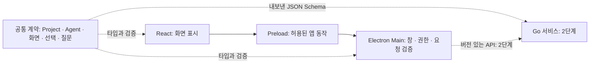
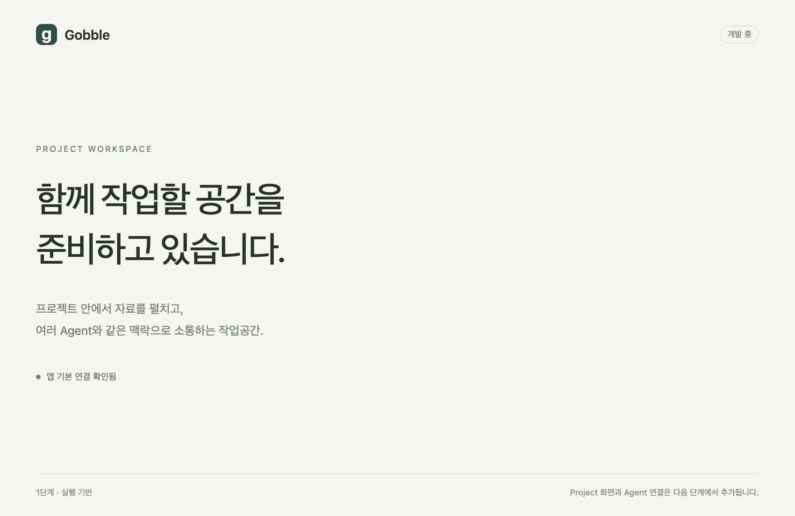
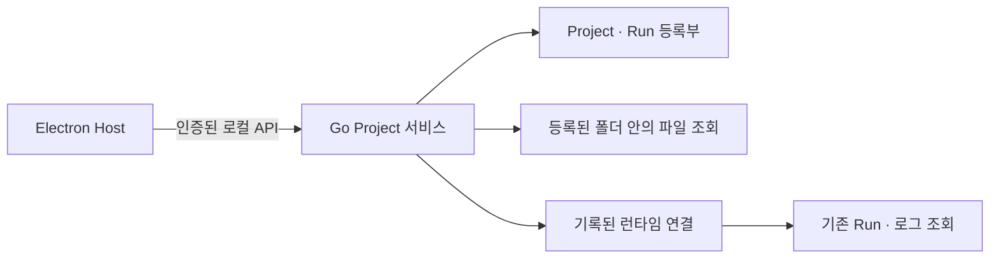

# 1단계 — 공통 계약과 프로세스 경계

상태: 1단계 결과 사용자 승인 완료. [2단계](02-project-service.md) 진행 승인 및 앱 영어 사용 요청을 받았습니다.

## 착수 스케치

목표는 검증 가능한 데이터 계약과 안전하게 실행되는 최소 Electron 기반입니다.
`app/contracts`는 전송 가능한 데이터만 소유합니다. `app/desktop` 안에서도
main, preload, renderer는 각각 별도 진입점과 컴파일 경계를 가집니다.
기존 Go 엔진과 CLI는 이 작업공간을 참조하지 않습니다.

TypeBox 정의에서 TypeScript 타입과 JSON Schema를 함께 만들고, 버전이 있는
JSON 파일을 저장소에 보관합니다. 이후 Go 빌드에는 Node가 필요하지 않습니다.
스키마 검증과 실제 자원 소유권 확인은 별개이며, 후자는 서비스와 controller의
책임입니다. 교차 참조 등 JSON Schema로 표현되지 않는 규칙도 명시합니다.

## 이번 단계의 검증 범위

- 올바른 계약 값 수용, 잘못된 식별자·버전·상태·선택 영역 거절.
- 프로세스 간 금지된 코드 의존성 탐지, 스키마 생성 결과 일치.
- 실제 Electron에서 분리된 preload 실행, 제한된 앱 정보 조회, 렌더러 권한 차단.
- 잘못된 요청·프레임·내비게이션·경로 요청 거절.

Project UI, 저장·복원 구현, Go 서비스, Agent 연결, 실행 제어와 설치 패키지는
해당 단계에서 구현합니다. 초기 실행 화면은 완성된 제품 화면을 주장하지 않습니다.

## 결과와 승인

이 화면은 생성한 컨셉 이미지가 아니라 빌드한 Electron 앱의 실제 캡처입니다.
최종 Project 화면은 3단계에서 구현하며, 현재는 앱 연결을 확인하는 시작 화면입니다.

| 구현 결과 | 위치와 책임 |
|---|---|
| 버전 있는 공통 계약 | [contracts](../../../app/contracts/src/index.ts): Project·Agent·화면·선택·질문·작업공간·오류 |
| 언어 간 스키마 | [v1.json](../../../app/contracts/schema/v1.json): TypeBox에서 생성, 변경 일치 검사 |
| Electron 기반 | [main](../../../app/desktop/src/main/index.ts): 단일 인스턴스·창 생명주기·권한·검증 |
| 좁은 화면 연결 | [preload](../../../app/desktop/src/preload/index.ts): 이름 있는 앱 정보 조회 1개, 응답 검증 |
| 표시 책임 | 당시 `Foundation.tsx`: React와 임시 연결 상태. 3단계에서 [WorkspaceApp](../../../app/desktop/src/renderer/workspace/WorkspaceApp.tsx)으로 대체 |
| 유지 관리 | [앱 안내](../../../app/README.md), 프로세스별 컴파일·의존성 검사·공통 포맷·고정 의존성 |
| 자동 검증 설정 | [Desktop workflow](../../../.github/workflows/desktop.yml): macOS용 검사 정의; 원격 CI 실행은 아직 안 함 |

검증 대상: 2026-09-06, macOS 26.5.2 arm64, Electron 44.2.0,
Node 25.7.0, TypeScript 5.9.3, React 19.2.8.
Vite 7.3.6 / electron-vite 5.0.0 / Vitest 4.1.11 / Playwright 1.63.0을
사용했습니다. 최종 잠금 파일의 npm 보안 검사 결과는 알려진 취약점 0개입니다.
처음 설치한 Vite·Vitest를 수정 버전으로 올렸으며, Vite의 esbuild만 0.28.2로
고정했습니다. 해당 조합의 빌드·개발 시작·Electron 테스트를 확인했습니다.

| 검증 | 결과와 범위 |
|---|---|
| 타입·포맷·스키마 일치 | 통과. main/preload/renderer/contracts 각각 컴파일 |
| 계약·구조·보안 단위 테스트 | 45개 통과. 잘못된 ID/버전/추가 필드, Project 혼합, 질문 상태, 선택 범위, 탭 참조, 금지 의존성, 경로 탈출과 심볼릭 링크 포함 |
| 실제 Electron 테스트 | 5개 통과. sandbox/context isolation, 좁은 bridge, 실제 IPC의 잘못된 요청/미등록 창 거절, CSP/프레임/이동/팝업/알림 차단, macOS 창 닫기와 activate 이벤트 후 복원, 중복 앱 실행의 기존 인스턴스 재사용 |
| 개발 모드 | 로컬 개발 주소에서 실제 창과 접근성 트리의 ‘앱 기본 연결 확인됨’ 확인 |
| 기존 macOS Go 런처 | `go test -race -count=1 ./cmd/gobble-container` 통과 |
| 기존 Go 전체 테스트 | macOS에서 빌드 실패: `internal/containerenv/runtime.go:113`의 `useProjectOwner`가 Linux 파일에만 정의됨. Go 소스·go.mod·go.sum이 기준 HEAD와 동일함을 확인. Linux 전체 실행은 이번 단계에서 검증하지 않음 |
| 설치 패키지·실제 분석·로그인 | 이번 단계 범위 아님. 테스트 실행 산출물을 배포 가능한 `.app`으로 주장하지 않음 |

IPC 부정 테스트는 테스트 임시 프로필에만 별도 preload를 등록해 실제 메시지를
보냅니다. 제품 코드에는 테스트 전용 우회나 일반 IPC 호출 기능이 없습니다.
스키마는 데이터와 참조 일관성을 검증하며, 아직 존재하지 않는 자원 권한·최신 버전
조회·실제 렌더 확인·저장 복원의 구현을 대신하지 않습니다.

## 다음 단계 검토용 스케치

2단계 목표는 사용자 폴더를 Project로 등록하고, 그 범위의 파일과 호환되는 기존
Run을 읽는 서비스입니다. 디렉터리 경계, 프로젝트 격리, 재요청, 호환되지 않는
런타임과 연결 실패를 테스트합니다. 새 분석 실행이나 Stop/Resume는 포함하지 않습니다.
Docker가 없는 상태에서도 Project 등록과 파일 조회를 사용할 수 있도록 분리합니다.

사용자 승인 완료: 2단계로 진행합니다. 이후 앱 문구는 영어를 사용합니다.
