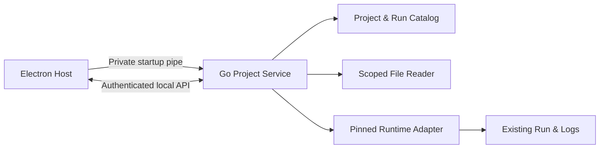
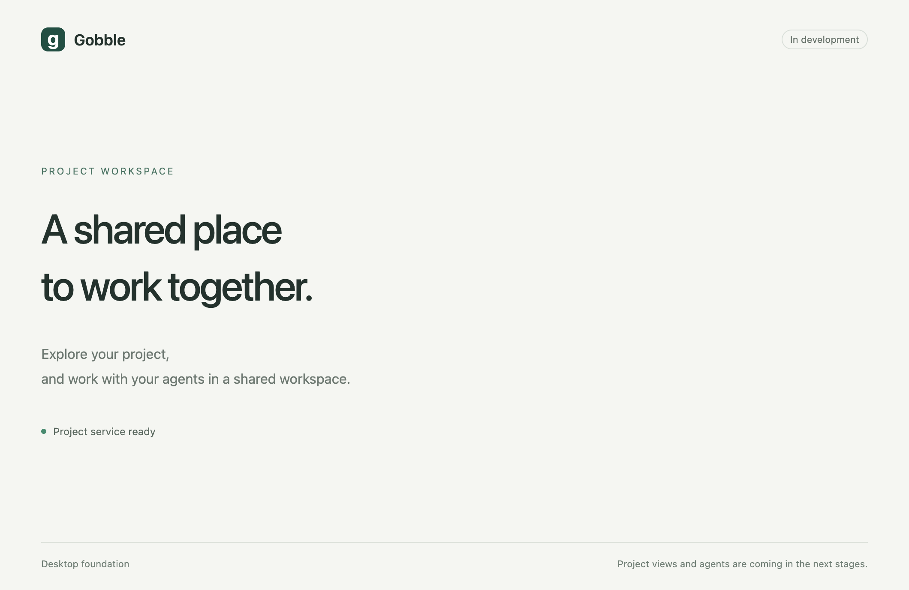

# 2단계 — Project 서비스

상태: 2단계 코드 구현과 아래 로컬 검증 완료. 실제 Docker 연동 증거는 미확인으로 남깁니다.
1·2단계 결과와 3단계 진행은 사용자 승인 완료입니다. 후속 구현은 [3단계 기록](03-workspace.md)을 봅니다. 아래 결과는 2단계 당시의 증거입니다.
추가 결정: 앱 문구·메뉴·오류·접근성 라벨은 영어로 작성합니다. 사용자 자료는 번역하지 않습니다.

## 착수 스케치와 범위

작성 모드(author mode)로 승인된 서비스·앱 연결·테스트·관련 문서를 구현합니다.
`cmd/gobble-service`는 프로세스 입출력과 종료를, `internal/appservice`는 등록·파일·
조회 라우팅을 소유합니다. `app/contracts`에 전송 계약을 추가하고 Electron main의
서비스 클라이언트와 좁은 preload에 연결합니다. 전체 Project UI는 3단계 범위입니다.

기존 승인: 네이티브 Go 서비스, 인증된 loopback HTTP /v1, private pipe 인증 전달,
단일 writer의 버전 JSON과 백업, 기록된 런타임 조회, 실행 제어 제외.
새 엔진 저장 형식이나 source 실행 경로를 만들지 않습니다.
검증 대상은 macOS/arm64이며 Linux/amd64 서비스 빌드도 확인합니다.
Go 모듈 기준 1.26, 현재 도구 1.27.1. 표준 라이브러리를 사용합니다.

## 구현 규칙

- Project 등록: 선택한 실제 폴더를 canonical root로 등록, 같은 root 재사용, 겹치는 root 거절.
- 파일: 서비스 소유 resource ID로 조회. 폴더 읽기에서 발견한 상대경로 매핑을 카탈로그에 보존.
  `os.Root`로 사용 시점의 경계를 보장하며 일반 파일만 읽고 크기·행·열·이미지 픽셀 수를 제한.
- 카탈로그: 프로필 전용 잠금, 직렬화된 atomic replacement와 이전 정상 백업. 손상/미지 버전은
  중단하며 자동 삭제·덮어쓰기·자동 백업 복구를 하지 않음. 요청 ID와 내용 충돌 검사.
- API: 127.0.0.1 임의 포트, 세션별 인증, Host/Origin 검사, 본문·작업 동시성·시간 제한.
  renderer에는 포트·토큰·프로필 경로를 전달하지 않음.
- Run: Project 안의 workspace 후보 발견과 명시적 연결. `.gobble-runtime.json`의 daemon/image를
  고정해 호환성 확인 후 등록. 외부 workspace는 첫 단계의 등록 root 밖에 자동 연결하지 않음.
  `.gobble` 존재는 후보일 뿐 실행 상태가 아님.
- 조회: 고정 이미지의 `/usr/local/bin/gobble inspect identity/monitor`만 실행. bootstrap을 끄고
  읽기 전용 mount, 네트워크 차단, Docker socket 미노출. engine identity와 run ID를 재확인.
  명시적 instance/attempt 로그와 관찰 시각·snapshot equality revision을 별도로 반환.
- 종료: 부모 pipe 종료 시 service와 service 소유 조회 helper만 종료. 기존 분석 controller는 건드리지 않음.

자료: 기존 `cmd/gobble/main.go`, `cmd/gobble-container/main.go`, `internal/engine/inspect.go`,
`distribution/runtime/Dockerfile` 및 [Go의 경로 제한 API 설명](https://go.dev/blog/osroot).

## 검증 계획

Go service의 등록·복원·중복/충돌·카탈로그 손상·경로 탈출·파일 제한·HTTP 인증을 실제 임시
폴더와 HTTP 경계에서 검증합니다. Docker adapter는 명령/응답 경계 fixture로 pin·권한·
schema·늦은 attempt·취소를 검증하고 실제 Docker 증거와 구분합니다.
실제 서비스 프로세스와 Electron을 함께 실행해 ready handshake, 영어 문구, 좁은 IPC,
파일 조회와 종료를 검증합니다. 공통 스키마는 TypeScript 측에서 실제 Go 응답을 검증합니다.

## 결과

2026-09-06, macOS 26.5.2 / arm64, Go 1.27.1, Node 25.7.0에서 확인했습니다.

위 이미지는 빌드한 Electron 앱의 실제 테스트 화면입니다. 현재 화면은 초기 진입 화면이며,
`Project service ready`는 실제 Go 프로세스의 인증된 Project 조회 성공을 반영합니다.
Project 탐색기·분할 화면·탭 UI 및 실제 Agent 연결은 아직 구현하지 않았습니다.

### 구현한 동작과 코드 체계

| 책임 | 구현 위치 | 확인한 결과 |
|---|---|---|
| 서비스 프로세스 | `cmd/gobble-service` | private pipe 시작, 임의 loopback 포트, 인증, 부모 종료에 따른 정리 |
| Project와 카탈로그 | `internal/appservice/catalog.go` | 등록·중복 재사용·겹침 거절·재시작 복원·이동한 동일 폴더 재선택·저장 실패 보호 |
| 파일 자료 | `internal/appservice/files.go` | 범위가 제한된 폴더·UTF-8 텍스트·CSV·PNG/JPEG, 버전 검사와 명시적 제한 |
| 기존 Run 연결 | `internal/appservice/runs.go`, `runtime.go` | 후보 발견·명시적 등록·고정 런타임 조회 adapter·선택 attempt 검사 |
| 서비스 HTTP | `internal/appservice/service.go` | `/v1`의 인증·Host/Origin·엄격한 요청 검사·동시성/시간 제한 |
| 언어 간 계약 | `app/contracts/src/service.ts` | 스키마·타입·생성 JSON Schema, 실제 Go 응답에 대한 TypeScript 검증 |
| 앱 연결 | `app/desktop/src/main/service`, `preload` | native 폴더 선택, 이름이 고정된 기능별 IPC, 프로세스 시작/종료 |

Go 서비스는 표준 라이브러리만 사용하며 기존 Gobble 엔진을 import하지 않습니다.
기존 엔진·CLI 소스, `go.mod`, `go.sum`은 변경하지 않았습니다. 앱 프로세스별
의존 방향과 서비스의 엔진 독립성을 테스트로 확인합니다. 앱 자체 문구·오류·접근성
라벨은 영어로 정리했고, 사용자 파일명과 내용은 원문을 유지합니다.

카탈로그는 프로필 아래에서만 저장합니다. 손상·미지 버전·백업만 남은 상태를 자동
초기화하지 않으며, 불확실한 저장 실패 뒤에는 재시작 전까지 사용을 중단합니다.
Project root 교체, 외부 symlink, 특수 파일, 읽는 도중 변경 및 오래된 선택을 검사합니다.
폴더·표의 잘린 결과는 명시하며 현재 페이지를 전체 결과라고 표현하지 않습니다.

Run은 Project root 또는 바로 아래 `runs/*`의 후보에서 연결합니다. 등록 시 기록된
daemon·이미지·engine identity를 확인하고, 조회마다 다시 검사합니다. 동일한 동시 조회는
하나로 합치고 같은 Run의 서로 다른 조회는 순서대로 실행합니다. 한 클라이언트의 취소는
다른 클라이언트가 기다리는 조회를 취소하지 않습니다. Start/Stop/Resume 또는 소스 수정
경로는 이번 서비스에 없습니다.

### 실행한 검증

| 검증 | 결과와 증거 범위 |
|---|---|
| `go test -race -count=1 ./internal/appservice ./cmd/gobble-service ./cmd/gobble-container` | 통과. 서비스 26개 최상위 테스트와 기존 native launcher 테스트. 서비스 entry point에는 별도 Go 단위 테스트가 없으며 아래 실제 프로세스 테스트로 검증 |
| `go vet ./internal/appservice ./cmd/gobble-service` | 통과 |
| `npm run check` | 포맷·프로세스별 타입·생성 스키마 일치·테스트·앱 빌드 모두 통과 |
| Vitest | 49개 통과. 공통 계약/격리 및 실제 Go 프로세스 시작·인증·파일·재시작·종료 포함 |
| 실제 Electron | 6개 통과. 영어 UI, 실제 Project/CSV 연결, 제한된 IPC, 격리 정책, macOS 창 재열기와 중복 실행 |
| Linux/amd64 서비스 교차 빌드 | `GOOS=linux GOARCH=amd64 CGO_ENABLED=0 go build` 통과. Linux 실행 검증은 아님 |
| npm 의존성 검사 | `npm audit --omit=optional`: 알려진 취약점 0개 |
| 변경 검사 | `git diff --check` 통과; 기존 Go 코드 변경 없음; 계획 디렉터리 4개 파일 구조 유지 |

Electron의 폴더 선택 테스트는 **native dialog가 돌려주는 선택 경로만 모의 처리**합니다.
이후 Electron IPC, Go 서비스, 실제 임시 디렉터리와 CSV 읽기는 실제로 실행합니다.
Go Run 테스트는 Docker 명령/응답 경계 fixture로 정확한 이미지·daemon, 읽기 전용 옵션,
identity/schema/attempt 불일치, 조회 취소·공유·정리를 검사합니다. 실제 컨테이너 증거가 아닙니다.
GitHub Actions에 해당 검사 구성을 추가했으며 원격 CI는 실행하지 않았습니다.

### 남은 조건과 다음 단계

- 이 Mac의 Docker daemon에 연결되지 않아 실제 기존 Run 조회와 앱 종료 후 독립 controller
  유지 여부는 확인하지 못했습니다. 계획의 6단계 실제 통합 검증 항목으로 계속 남깁니다.
- 이번 adapter는 Project-local workspace, 로컬 Unix Docker endpoint, 정확한 Linux/amd64
  이미지와 기본 `/gobble/project` mapping을 대상으로 합니다. Custom Compose mapping,
  외부 workspace, 원격 daemon 및 다른 플랫폼은 지원 검증 범위가 아닙니다.
- 기존 엔진 전체의 macOS 테스트는 Linux 전용 `useProjectOwner` 때문에 빌드되지 않는
  기존 제약이 있습니다. 이를 native 서비스 지원과 혼동하지 않습니다. 엔진 수정은 하지 않았습니다.
- 화면은 영어 초기 화면입니다. 3단계는 Project 탐색기, 1/2 패널, 탭·고정·크기 조절,
  실제 자료 뷰, 하단 소통 영역, 키보드 조작 및 작업공간 저장·복원을 구현합니다.
  착수 전 영어 화면 스케치를 제시하고, 실제 Agent 연결은 4단계에서 진행합니다.
- 설치 가능한 `.app`과 provider 연결은 후속 단계이며 현재 산출물은 개발 빌드입니다.

계정 자격 증명은 읽거나 복사하지 않았습니다. 서비스 자체가 생성한 로컬 인증 토큰만
private pipe에서 사용했습니다. Project 원본 변경, 분석 실행, 커밋·push·배포는 수행하지 않았습니다.
실행 방법과 파일 제한은 [앱 개발 안내](../../../app/README.md)에 정리했습니다.

후속 전환: 사용자가 3단계 진행을 승인했습니다. 실제 Docker 미검증 조건은 계속 유지합니다.
