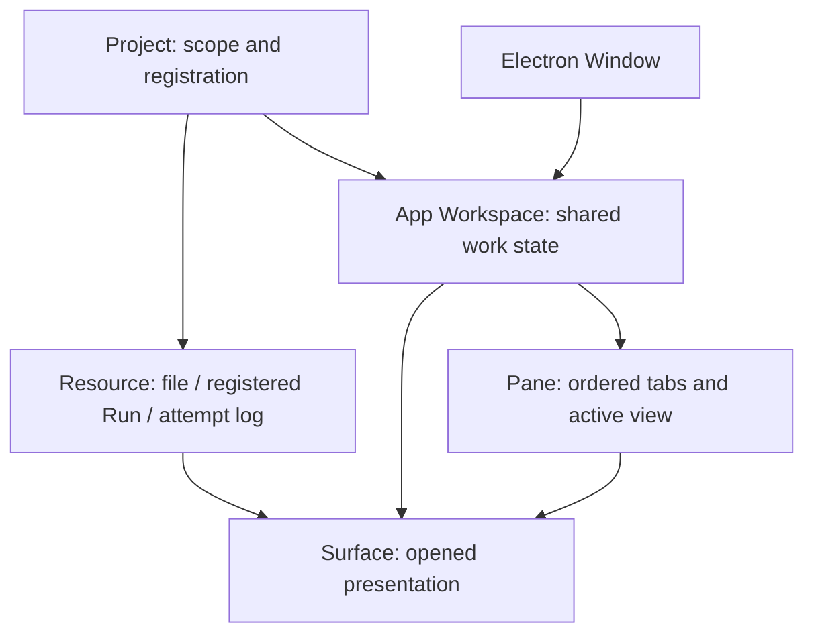

# 3단계 보완 — 개념 정의와 코드 설계 리뷰

상태: 사용자가 4단계 전에 현재 코드베이스의 설계 리뷰와 수정을 요청했습니다.
리뷰와 수정은 별도 활동입니다. [읽기 전용 자기 리뷰](../reviews/03-design-review.md)는
수정 전 파일 집합을 식별하며, 이 문서는 수정 범위와 결과를 기록합니다.

## 착수 스케치

| 경계 | 수정 |
|---|---|
| 개념 | Project / App Workspace / execution workspace / Pipeline / Plan / Run / Instance / Resource / Surface / Pane / Window 정의와 메타데이터 소유자 |
| 계약 | Project·Agent·Resource·파일·Run·저장 문서·bridge를 변경 이유별로 분리; 기존 v1 저장 JSON과 Go HTTP 계약 유지 |
| 로그 대상 | authored task와 runtime instance 구분. 코드 API는 instanceId, v1의 taskId 필드는 호환성 adapter에서만 해석 |
| 서비스 API | private process transport와 이름 있는 ProjectService 조회 API 분리; IPC와 workspace adapter가 같은 typed gateway 사용 |
| Run 화면 | host가 typed presentation을 만들고 React는 표시와 의미 있는 callback만 담당. Pipeline 이름은 관찰 metadata |
| 작업공간 | 영속 상태 controller와 ephemeral RenderSession 분리; 없는 Pane lookup 명시 |
| React 탐색 | Sidebar는 배치, FilesBrowser/RunsBrowser는 해당 기능의 조회·표시. Run의 로그 대상은 부모 Pane이 배치 |

새 provider, Pipeline registry/편집기, 실행 명령, OS 분리 창은 추가하지 않습니다.
이는 현재 기능의 개념·코드 경계 수정이며, 4단계 진행 승인은 별도로 받습니다.

## 검증 계획

기존 저장 fixture의 의미/JSON 호환성, instance와 authored task가 다른 Run projection,
잘못된 서비스 응답 association, 없는 Pane 조회, 두 번째 Pane에서 로그 열기,
기존 Project·분할·선택·초안 복원과 IPC 격리 경로를 확인합니다.
제품 코드에 새 의존성이나 프레임워크는 추가하지 않습니다.

## 결과

2026-09-06 macOS 26.5.2 / arm64, Node 25.7.0, Go 1.27.1,
Electron 44.2.0 / TypeScript 5.9.3 / React 19.2.8에서 확인했습니다.

### 정의와 소유자

[Workspace domain model](../../../.gobbi/projects/gobble/memory/design/architecture/workspace-domain.md)에
핵심 개념과 파일·이미지·Run·로그·향후 Pipeline/Plan 표시의 관계, 데이터 소유자,
함수/클래스 경계, 호환 규칙을 정리했습니다. 특히 Pipeline 이름은 엔진의 관찰값이며
Pipeline 정의의 등록 ID나 소스 revision이 아니라는 점을 명시했습니다.

### 수정 대응

| 리뷰 항목 | 수정 결과 |
|---|---|
| P1 Task / Instance 혼동 | `LogTarget.instanceId`와 `logResource`/`logTarget` API 도입. v1 저장 key는 그대로 유지. `RunPresentation`에 `instanceId`와 authored `taskId` 구분 |
| P2 엔진 JSON 해석이 React에 위치 | `main/service/run-presentation.ts` 한 곳에서 읽기 전용 표시 모델 생성. RunView는 typed props 사용. Pipeline 이름·상태·정의 수준 의존 관계를 추측 없이 전달 |
| P3 없는 뷰의 Pane 추정 | `paneOf`는 명시적 not_found 오류. `PaneSchema`/`PaneIdSchema` 공개와 계약 주석 추가 |
| P4 개념·메타데이터 소유 공백 | canonical domain 문서 추가와 관련 설계 연결. Go `Run` 등록 모델을 `RunRegistration`으로 명확히 명명 |
| P5 Run 화면의 배치 결정 | `RunView.onOpenLogs` 의미 callback → 부모 Pane이 반대 Pane 선택. Run이 두 번째 Pane에 있어도 로그는 첫 번째에 표시 |
| I1 계약 파일 혼합 | Project·Agent·Resource·File·Run·presentation·persisted document·bridge·result별 분리; 한 barrel 유지 |
| I2 서로 다른 상태 수명 | WorkspaceController는 Project/순서/저장, RenderSession은 session/ticket/visibility/ready 담당. 오래된 조회 무효화와 동시 조회 제한 유지 |
| I3 중복 서비스 API | transport와 typed ProjectService 분리. URI·스키마·Project/resource/attempt association 검사 단일화; resource equality도 한 함수 사용 |
| I4 Sidebar 기능 혼합 | Sidebar는 탐색 배치, navigation/FilesBrowser와 RunsBrowser는 기능별 조회와 표시 담당 |

순수 상태 전이·projection·검증은 함수로 유지했습니다. I/O와 수명을 갖는 객체만 클래스로
두었으며, DI 프레임워크·plugin registry·generic event bus는 추가하지 않았습니다.
큰 엔진 리팩터링이나 provider 연결도 포함하지 않았습니다.

기존 v1 저장 문서와 Go HTTP 필드는 유지했습니다. **앱 내부 workspace load IPC의 Run
payload는 typed display model로 바뀌므로 main/preload/renderer는 함께 빌드해야 합니다.**
독립 배포된 외부 v1 클라이언트의 호환성을 주장하지 않습니다. 기존 프로필에는 이 payload가
아닌 resource 참조만 저장되어 있으며, v1 log surface/selection/draft fixture의 읽기와
JSON round trip을 확인했습니다. 자동 파일 초기화나 추측에 의한 migration은 없습니다.

### 실행한 검증

| 검사 | 결과와 범위 |
|---|---|
| `npm run check` | 포맷·타입·생성 스키마·빌드·전체 테스트 통과 |
| Vitest | 72개 통과. 이전 66개에 persisted v1, Task/Instance/의존 관계, missing/invalid metadata, 응답 association/error/attempt 검증 6개 추가 |
| 실제 Electron | 12개 통과. 기존 저장·복원·선택·키보드·격리 경로 유지. Run 테스트를 서로 다른 authored/instance ID와 두 번째 Pane→첫 번째 로그 경로로 강화 |
| Go race tests | `go test -race -count=1 ./internal/appservice ./cmd/gobble-service ./cmd/gobble-container` 통과. 서비스 26개 최상위 테스트와 native launcher 포함 |
| Go vet | `go vet ./internal/appservice ./cmd/gobble-service` 통과 |

리뷰는 작성자 본인의 설계 중심 자기 리뷰입니다. 별도 독립 reviewer나 대표 사용자 검증을
수행했다고 주장하지 않습니다. 수정 전 리뷰의 SHA와 findings는 보존하고 historical로
표시했습니다. 실제 Docker와 provider 검증은 이번에도 하지 않았고, Run UI는 Docker CLI
fixture와 실제 Go/Electron 경로를 사용했습니다. 이는 이후 단계의 실제 통합 조건을
해소하지 않습니다. 커밋·push·배포는 수행하지 않았습니다.

### 다음 전환

이 개념·구조 보완을 사용자에게 보여주고 검토받습니다. 4단계 계정과 여러 Agent 연결은
별도 승인 후 시작하며, Agent-facing API는 이 문서의 Project/Surface/Resource 권한·수명을
그대로 존중하도록 구체화합니다.

최종 소스 식별: `c7d528004a91b0f7cdbe7ae0750a4ed83ccdffb27d269976fc99079793a949ba` (111개 nonignored app/·internal/appservice/·cmd/gobble-service/ 파일, 정렬 경로 + NUL + 내용 + NUL의 SHA-256).
