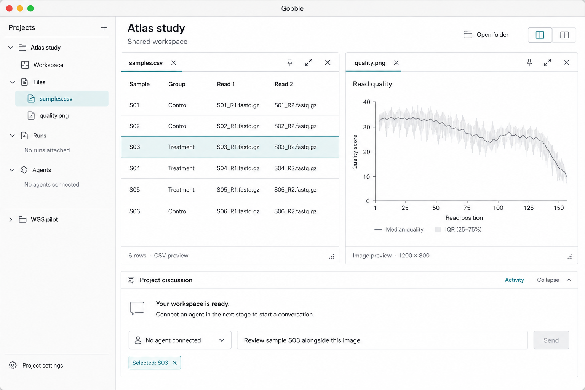
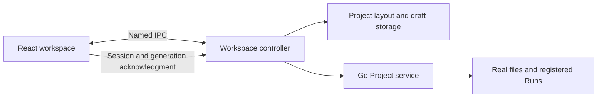
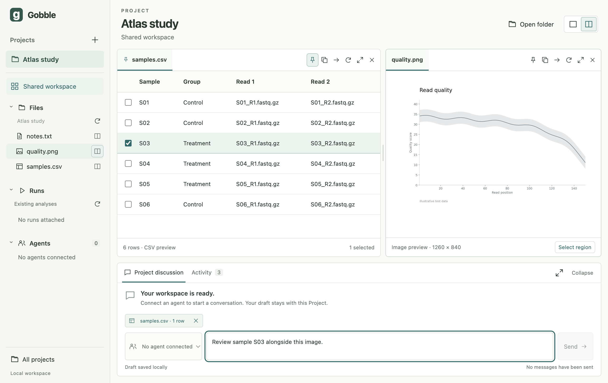

# 3단계 — Project 공유 작업공간

상태: 사용자가 2단계 결과와 3단계 진행을 승인했습니다. 3단계 구현·로컬 검증 완료, 4단계 전환 승인 대기입니다.
영어 UI를 유지합니다. [승인된 전체 설계](../README.md)와 [계획](../session-plan/plan-index.md)을 구현합니다.

후속 기록: 사용자가 4단계 전에 요청한 [개념·설계 리뷰와 구조 보완](03-design-refinement.md)을 참조합니다.
아래 코드 위치와 검증 개수는 최초 3단계 완료 당시 기준입니다.

## 착수 스케치

내장 Imagegen으로 승인된 Project 컨셉을 구체화했습니다. [프롬프트](03-workspace-sketch.prompt.txt)를 보관합니다.
예시 표와 이미지는 스케치 자료이며 앱에는 실제 Project 파일만 표시합니다. Agent 연결 상태나 응답을 만들지 않습니다.

## 구현 모델과 경계

작성·구현 모드입니다. 기존 stage 2 트리와 Electron 44.2.0 / React 19.2.8 / TypeScript 5.9.3을 사용합니다.
새 패키지·분석 실행·provider 호출은 필요하지 않습니다. 화면 조작은 사용자 요청으로 수행하고,
미래 Agent 요청은 별도로 인증된 진입점에서 actor·pin 정책을 확인한 뒤 같은 controller의 revision·저장 규칙을 재사용합니다. 현재 사용자 명령 IPC를 Agent에 직접 노출하지 않습니다.

| 소유자 / 위치 | 생성·조회·변경·종료 규칙 |
|---|---|
| `app/contracts/src/workspace*.ts` | 저장 문서·명령·렌더 준비 계약. 기존 Project/Surface/Evidence identity를 재사용 |
| `app/desktop/src/main/workspace` | 단일 controller가 Project별 탭·패널·고정·선택·대화 초안·활동과 요청 순서를 관리. JSON 저장 후 성공 반환 |
| `app/desktop/src/main/workspace` 저장 adapter | 프로필의 `workspace/projects/<projectId>.json`, 백업, 원자 교체, 손상 시 보존·명시적 오류. 정상 종료는 수신한 변경 저장을 기다림 |
| Electron main / preload | 신뢰한 최상위 창과 payload 검증. 새 창/재연결의 renderer session 및 로딩 generation으로 늦은 렌더 결과 거절 |
| `app/desktop/src/renderer/workspace` | 앱·탐색기·패널·자료 뷰·discussion을 작은 컴포넌트로 구성. transient 로딩·focus·입력 표시만 소유 |
| Electron 창 상태 | 정상 bounds와 마지막 Project 보존. macOS 창 닫기/재열기, Quit/재실행 구분. 화면 밖 위치는 현재 display로 보정 |

등록 Project가 없으면 폴더 열기 화면을 표시합니다. 파일 실패는 해당 자료 뷰에서 재시도하며,
root 누락은 폴더를 다시 선택해 복구합니다. 저장 실패는 저장 완료로 표시하지 않습니다.
Project/Agent 참조·대기 질문은 저장 구조에서 보존하되 실제 Agent 연결·질문 도구는 4/5단계 범위입니다.
복원은 화면 참조와 초안을 되살리며 메시지·실행·질문 응답을 재전송하지 않습니다.

패널은 최대 두 개이며 탭별 pin, 닫기, 다른 패널로 이동·복제, 패널 확대·복원이 가능합니다.
좁은 창은 활성 패널만 보이며 다른 패널의 탭과 분할 비율을 유지합니다. Files는 폴더 단위
탐색과 상위 이동을 제공합니다. 표는 실제 행 선택, 텍스트·이미지는 안전한 preview를 제공합니다.
선택은 자료 revision에 묶이고 오래된 선택은 현재 자료의 선택으로 표시하지 않습니다.
하단은 초안·local context·실제 UI 활동을 보존하며 연결 전 Send는 비활성화합니다.

## 순서와 검증

1. 계약과 상태 전이, 저장소: 동일 열기 재사용, 명시적 복제, pin, stale revision, 타 Project 격리, 손상/복원 테스트.
2. 좁은 IPC와 렌더 수명: 실제 파일 조회, 늦은 load/ack, 닫힌 창·자료의 ready 거절, 저장 후 종료.
3. React 작업공간: chooser → Project → 실제 CSV/이미지 → 두 패널 → 선택·초안 → 재열기.
4. 실제 Electron에서 키보드 탭·닫기·분할·separator 조절, 좁은 창, 파일 오류와 복원 확인.
5. 기존 계약/격리/Go 서비스 테스트와 전체 앱 검사, 실제 screenshot 및 결과 문서. Docker 미연결은 계속 명시.

UI 구조 근거는 사용자 승인 컨셉입니다. 독립적인 사용성 연구나 성능 개선 주장은 하지 않습니다.
새 컴포넌트/Hook 테스트 도구를 추가하기보다 순수 상태 테스트와 기존 실제 Electron 테스트로 관찰 가능한 동작을 확인합니다.
키보드 separator는 [WAI APG](https://www.w3.org/WAI/ARIA/apg/patterns/windowsplitter/),
창 복원은 [Electron BrowserWindow](https://www.electronjs.org/docs/latest/api/browser-window)와
[screen](https://www.electronjs.org/docs/latest/api/screen/) 및 설치된 선언을 기준으로 구현합니다.

## 설계 활동 기록

담당은 이 세션의 구현 maintainer이며, 범위·입력·근거 위치는 위 설계/스케치/코드/테스트입니다.

| 활동 | 처리 | 한계와 다시 검토할 조건 |
|---|---|---|
| Discovery | Reused current evidence: 2026-09-06 사용자 Project workflow와 저장소 설계 | 다른 사용자에게 일반화하지 않음 |
| Framing | Reused current evidence: 승인된 3단계 작업 범위 | Project보다 Agent/Run이 상위가 되면 재검토 |
| Concepts | Reused current evidence: 대화/Run 중심 대안 대신 사용자 승인 Project 컨셉 | 이번 refinement는 대안 결정을 다시 열지 않음 |
| Prototyping | Performed for the current subject: 영어 이미지와 실제 React 구현 | 이미지 자체는 동작·접근성 증거가 아님 |
| Representative-user testing | Reused current evidence: owner 피드백만 존재 | 실제 대표 사용자 테스트는 미실시. 일반 사용성 승인 전 필요 |
| Design–implementation collaboration | Performed for the current subject: 계약→controller→UI→실제 테스트 | pin 침해, 잘못된 선택 복원, 늦은 결과 혼합이 있으면 원인부터 수정 |
| Post-release improvement | Not applicable with exact reason: 배포·실사용자가 아직 없음 | 배포 이후 담당자와 지표를 정하고 수행 |

## 결과

2026-09-06, macOS 26.5.2 / arm64, Electron 44.2.0, React 19.2.8,
TypeScript 5.9.3, Go 1.27.1, Node 25.7.0에서 검증했습니다.

위 화면은 빌드한 실제 앱입니다. 테스트용 Project에 저장한 CSV와 PNG를 실제 Go 서비스로
읽었습니다. 그래프에는 `Illustrative test data`를 표시하며 분석 실행 결과로 제시하지 않습니다.

### 구현 결과

| 기능 | 동작과 확인 범위 |
|---|---|
| Project 탐색 | 폴더 등록·선택, 폴더 단위 Files 탐색·상위 이동·새로고침, 기존 Run 연결과 조회 |
| 공유 작업영역 | 1/2 패널, 탭, pin, 이동·명시적 복제, 확대·복원, 분할 비율 저장. 현재 패널에 새 자료를 열고 다른 패널도 직접 선택 |
| 실제 자료 뷰 | CSV 표·행 선택, UTF-8 텍스트·범위 선택, PNG/JPEG·영역 선택, Run 상태·작업·의존 관계 목록·현재 attempt 로그 |
| 하단 소통 영역 | Project별 미전송 초안, 선택 자료 chip, 실제 UI 활동. 기본 240px, 확장·접기. Agent 미연결과 비활성 Send를 명시 |
| 접근과 작은 창 | 탭의 방향키/Home/End, 닫은 뒤 초점 복귀, 키보드 separator·이미지 범위 입력, 1100px 미만 단일 활성 패널 전환 |
| 저장·복원 | Project별 레이아웃·선택·pin·초안·참조, 창 위치와 마지막 Project 복원. 정상 종료 시 수신한 저장 완료를 기다림 |
| 오류 처리 | 변경된 자료의 선택을 stale로 표시, 파일 삭제/복원 후 재시도, 손상·미지 버전·외부 변경 파일 보존. 초안 저장 실패 시 Project 이동을 막고 창 닫기에서 Keep Open 제공 |

패널과 discussion은 React 컴포넌트, 상태 전이는 순수 model, 조회는 service adapter,
명령 순서와 렌더 수명은 controller, 파일 보존은 storage로 나눴습니다. 계약은 TypeBox와
생성 JSON Schema를 사용하며 renderer→Node/엔진 직접 의존을 허용하지 않습니다.
이번 단계에서 새 제품 의존성과 Go 엔진·CLI·서비스 소스 변경은 없습니다.

동일 자료 열기는 기존 surface를 재사용하고 복제만 새 ID를 만듭니다. 패널당 32개 탭,
총 64개 surface, 100개 활동, 256개 요청 receipt, 초안 16000자, 문서 4 MiB로 제한합니다.
닫거나 숨긴 자료는 렌더 준비 상태를 잃으며, 현재 session·generation·자료 revision을
모두 확인한 결과만 ready로 인정합니다. 조회는 최대 4개가 동시에 진행되고 표시 중인
자료만 보유합니다. 선택은 Project·surface·resource 모두 일치해야 하며, 로그는 같은
engine checkpoint에서도 출력이 바뀌면 표시 텍스트 hash로 선택을 무효화합니다.

백업은 이전 정상 문서를 보존하며 실패한 저장을 성공으로 돌려주지 않습니다.
복원은 마지막 정상 저장을 사용합니다. 앱 crash 시 아직 저장되지 않은 입력까지 복원한다는
보장은 하지 않으며, 복원 과정에서 메시지·분석·질문 응답을 자동 실행하지 않습니다.

### 검증 결과

| 검사 | 결과 |
|---|---|
| `npm run check` | 포맷·프로세스별 TypeScript·JSON Schema 일치·단위/경계 테스트·빌드·실제 Electron 테스트 통과 |
| Vitest | 66개 통과. 기존 49개 + workspace 상태·권한·선택·저장/복원·창 bounds 17개 |
| 실제 Electron | 12개 통과. 기존 격리/창 수명 6개, 실제 파일·분할/선택/초안 복원·키보드/작은 창·오류/Project 격리·실패 초안 보호 5개, Run/로그 UI 1개 |
| 시각 확인 | 실제 앱 screenshot 확인. 선택 행·표/이미지·하단 초안과 저장 상태가 함께 표시됨 |
| 변경 범위 | 기존 Go 소스 수정 없음. 계획의 4개 문서 구조 유지, 원격 CI/배포 미실행 |

Electron 테스트는 실제 Go 프로세스, IPC, 임시 Project 파일을 사용합니다. native 폴더 선택
결과와 저장 실패 dialog의 사용자 선택만 모의 처리합니다. Run/로그 테스트는 **Docker CLI를
테스트 fixture로 대체**하여 adapter→IPC→화면 경로를 확인합니다. 실제 Docker daemon,
고정 이미지, Gobble 분석 실행 또는 독립 controller 생존을 검증한 것이 아닙니다.

Go 구현은 이번 단계에서 변경하지 않았습니다. 서비스 자체의 race/vet와 26개 Go 테스트
증거는 [2단계 기록](02-project-service.md)에 있습니다. 이번 검사는 실제 native 서비스를
다시 빌드·실행한 TypeScript 경계 테스트와 Electron 테스트를 포함합니다.

### 남은 범위와 다음 승인

- 실제 계정 로그인, Agent 연결·응답·여러 Agent 전환은 4단계입니다. 지금의 초안과 선택은
  로컬에만 남고 provider에 전달되지 않습니다. Agent 참조/대기 결정 보존 구조는 구현했으나
  실제 질문 도구와 Agent가 창을 여는 동작은 5단계입니다.
- Docker는 2단계에서 연결할 수 없었고, 이번 fixture 검증은 이를 해소하지 않습니다.
  실제 고정 런타임과 앱 종료 후 분석 독립성은 6단계 필수 조건입니다.
- 그래픽 Plan 편집기, 실행 가능한 HTML 보고서, source 편집, Start/Stop/Resume,
  분리된 OS 창과 설치 가능한 `.app`은 이번 단계에 포함하지 않습니다.
- 키보드와 오류 경로를 자동 검증했지만 대표 사용자 사용성 연구나 화면 읽기 도구의 전체
  수동 검증은 수행하지 않았습니다. 출시 접근성·플랫폼 지원 주장으로 확대하지 않습니다.

[앱 실행 안내](../../../app/README.md)에 사용법·키보드·소유 경계와 저장 규칙을 정리했습니다.
다음 전환은 사용자 승인 후 **4단계: 공식 Codex 로그인과 여러 Agent 연결**입니다.
착수 전에 계정/Agent/Project 관계와 영어 UI 스케치를 먼저 보여줍니다.
