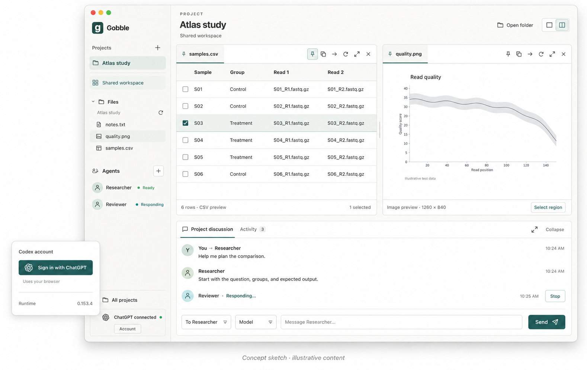
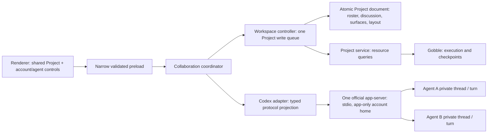
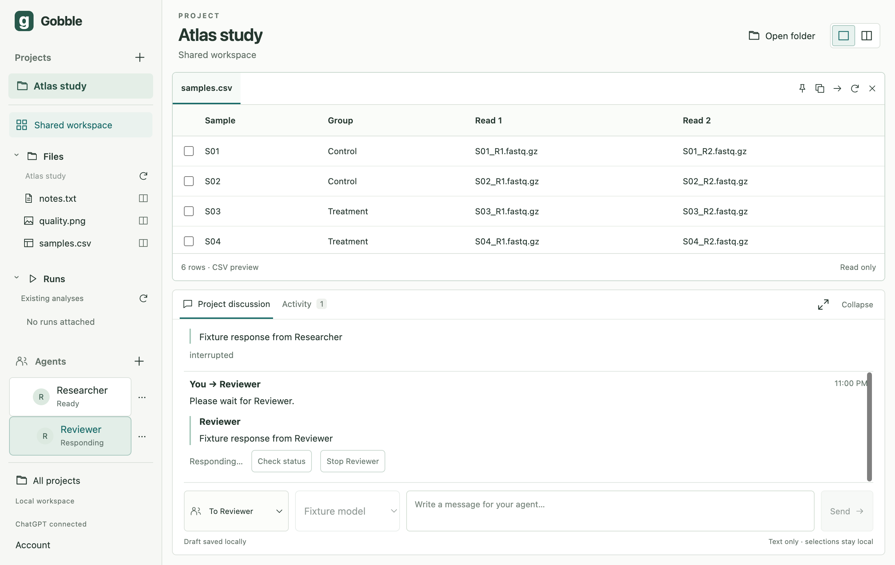
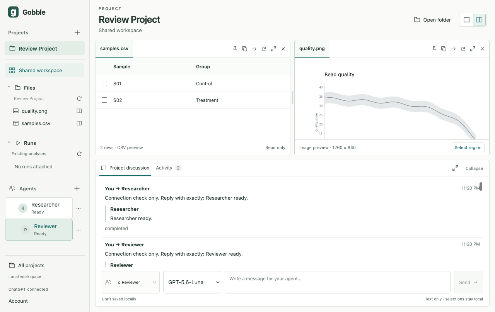
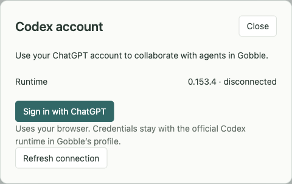
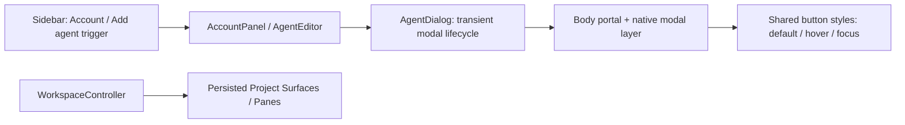

# Stage 4 — Codex account and Project agents

Status: implementation, automated checks and live ChatGPT acceptance complete.
User approved proceeding on 2026-09-06. Stage 5 design is now in review; its
application implementation has not started.
Authorized after the stage 3 design review.
Baseline: stage 3 refinement source digest
`c7d528004a91b0f7cdbe7ae0750a4ed83ccdffb27d269976fc99079793a949ba`.
The user requested continued concept/ownership refinement, English UI, structured
code, tests, and a review before proceeding to stage 5.

## Concepts and authority

| Concept | Meaning and owner |
|---|---|
| Account | App-profile ChatGPT sign-in, owned by the official Codex runtime. Main exposes status and official browser sign-in; credentials never enter app contracts or renderer. |
| Agent attachment | Named collaborator belonging to one Project. Its name, instructions, selected model/effort and provider binding are durable Project data. It is a peer, not a spawned subagent. |
| Provider thread | One private conversation bound by main to an attachment and an app login session. Its opaque ID is a reference, not authorization. |
| Turn | Provider work following one explicitly addressed user message. At most one active/uncertain submission per attachment. Two attachments may run independently. |
| Submission | App request ID persisted before `turn/start`, also sent as `clientUserMessageId`. Tracks submitting/running/completed/interrupted/failed/uncertain; explicit abandonment
retains an unconfirmed outcome. Never automatically resent. |
| Project discussion | Shared, addressed user messages and published agent text. It does not expose reasoning, raw tools, credentials, or another agent's private history. It is not automatically included in any other agent's input. |
| Pane / Surface | Existing layout container / opened presentation. Choosing an Agent changes the recipient, not shared panes. This stage transmits typed text only; saved selections remain local. |

The earlier per-attachment process was a candidate, not a finalized requirement.
This stage chooses one app-server per app profile: its protocol already
multiplexes threads and targets interruption by thread/turn. One account writer
avoids concurrent credential refresh across processes. A process crash affects
all attached threads' connectivity, but does not merge their conversations.
Future remote/provider adapters retain the same attachment and delivery ports.
Stage 5 must derive tool identity from host-established thread bindings.

## Storage and module design

`main/codex/` owns process/version verification, bounded JSONL requests, protocol
decoding, account and model projection, and conversation operations. It imports
no React or Gobble engine code. `main/collaboration/` coordinates app-owned
attachments and submission state through a narrow Project store port. It does
not implement native windows or render views. `renderer/agents/` owns account,
agent forms, status and message presentation; the existing workspace shell
composes them. Provider DTOs stop in main.

The Project document remains the sole durable aggregate writer, avoiding a
two-file transaction between agent binding and addressed-message acceptance.
Roster settings and a collaboration-history section are optional additions to
the existing v1 document: old saved documents remain readable without invented
provider connections; old apps reject the new fields and preserve their files.
Collaboration code changes only the roster/history through a narrow transaction
port. A saved submission, draft clear and recipient association commit together.
Stream deltas are transient; completed message items and turn outcomes persist.
Host document changes notify the current renderer with monotonic revisions.

The app login-session reference is local bookkeeping, not a token or an OpenAI
account ID. A new explicit login creates a new session; old thread bindings
cannot silently move into that account. No auth file parsing or external token
import is permitted. The official runtime owns its private history and secrets.

## Process and lifecycle decisions

- Pin official Codex 0.153.4, independently obtained from the official npm package;
  inspect generated protocol from that exact binary. Never discover another
  desktop app's private executable at application runtime. Development may use
  an explicitly configured absolute compatible executable. Packaged delivery
  and notices remain stage 7.
- Private `CODEX_HOME` inside the Gobble profile, explicit file credential store,
  restricted inherited environment and an app-owned working directory. No API
  billing fallback or fixed model list. Model/effort choices come from `model/list`.
- Stage 4 has no environment access (`environments: []`), read-only sandbox,
  approval policy `never`, no shells, patch execution, browser/computer use,
  hooks/plugins/apps, automatic agents, web search or image generation. Unknown
  server requests fail closed. The no-tools capability is verified separately
  from the model's instructions; instructions alone are not an access boundary.
- One provider transport, bounded requests/frame sizes/deadlines, two admitted
  concurrent turns across the app. Per-attachment admission prevents implicit
  steering. Provider responses/events must match known thread and turn IDs.
- Transport loss or acceptance timeout records uncertainty, never success or
  an automatic retry. Reconcile via official thread history and the persisted
  client message ID. An unresolved submission blocks another turn for that agent.
- Window close disconnects render observation only. App quit interrupts owned
  turns, persists terminal/uncertain outcomes and closes the owned process. It
  never stops Gobble/Docker controllers or reopens a window from an agent event.

## Affected set and implementation order

Implementation (not read-only review): contracts/schema and compatibility;
provider runtime/transport/adapter; collaboration store/coordinator; host IPC and
lifecycle; preload; renderer controls and discussion; scripts/docs/tests.
Existing Go engine and Project service behavior are consistency reads only.
No source editing, analysis execution, agent workspace tools, OS window splitting,
public packaging or stage 5 feature work is included.

Create: account-session metadata, optional Project collaboration records,
provider modules, English UI, tests and this stage record. Read: app-owned
account status/model catalog/thread history through official APIs and registered
Project state through its controller. Update: attachments, selected model and
submission outcomes, with one atomic Project writer. Delete: no user source or
provider history; cancellation ends only the selected turn/login. Cleanup:
listeners, timers, pending requests, owned process and transient streams.

## Validation plan

Construction: strict type checks, formatting, generated app-schema consistency,
architecture imports and production build. Behavior: protocol malformed frames,
timeouts and process exit; two independent recipient streams; isolated interrupt;
durable submission-before-send; uncertainty/history reconciliation and no resend;
account-session changes; old document restoration; trusted IPC and renderer
subscription cleanup; actual Electron account/agent UI with a clearly classified
test-local provider. Actual official unauthenticated startup is separate evidence.
Live acceptance is recorded separately below, after the user's browser login;
automated protocol substitutes do not count as authenticated provider evidence.

## Sources

Official OpenAI documentation read 2026-09-06:
[App Server](https://developers.openai.com/codex/app-server),
[configuration reference](https://learn.chatgpt.com/docs/config-file/config-reference).
Exact local protocol: official `@openai/codex@0.153.4-darwin-arm64`,
generated using `app-server generate-ts --experimental`.
Image: built-in Imagegen, based on stage 3 screenshot; prompt requested the
existing off-white/teal Project layout with two peer agents, account sign-in inset,
addressed messages, model selection and independent Stop control. Its data is
illustrative; the app must not present it as live evidence.

## Implementation result and evidence

The screenshot is the actual built app using test-local `Fixture model` responses,
not live ChatGPT output. It demonstrates a Project file view retained while
Researcher is interrupted and Reviewer remains independently active.

Source subject: 136 nonignored files in `app`, `internal/appservice` and
`cmd/gobble-service`, sorted path + NUL + bytes + NUL, SHA-256
`0fec48e8c57d298c36ea1d90c5316cdbac2c756cc4f92674d5ce0fa636dfee81`.
No pre-existing Go engine source changed in this stage.

| Evidence | Result and boundary |
|---|---|
| `npm run check` | Passed: formatting, separate process type checks, generated app-schema check, **93 Vitest tests**, production build and **15 real Electron tests**. |
| `npm run codex:schema:check` | Passed: 14 focused types reproduced from the official pinned binary; outgoing thread/start, thread/resume and turn/start payloads satisfy them. |
| Official runtime smoke | In a new isolated unauthenticated profile: initialize, account/read (signed out), catalog read, and a read-only thread with empty environment/tool lists succeeded. No model turn was submitted. |
| Protocol and storage tests | Two recipients/streams, isolated interrupt, persist-before-send, duplicate suppression, missing acknowledgment, exact client-ID recovery, account-session changes, malformed frames/timeouts, lost-login recovery, terminal-before-disconnect ordering and save-failure ownership passed. |
| Native UI integration | Actual Electron/main/preload/React/Go service with test-local Codex peer: account/add-agent/recipient/model controls, shared Pane retention, separate Stop controls, restart and recovery without resend passed. |
| Live official login and two agents | Passed after the user completed official browser login: Researcher and Reviewer on `gpt-5.6-luna` / `low`, two distinct provider threads, two exact addressed replies, two simultaneous admitted turns, isolated Researcher interruption and normal Reviewer completion. No account was imported. |
| Live restart | Normal quit/relaunch and explicit Refresh connection restored signed-in runtime readiness, two agents, two Panes and all four submissions (`completed`, `completed`, `interrupted`, `completed`). No input was resent and no stream restarted. |
| Button regression | Reproduced invisible default sign-in text at 1.04:1 contrast. Dialog placement now isolates it from sidebar CSS. Real Electron checks cover 4.5:1-or-better text contrast before hover, on hover and with keyboard focus, plus Escape and focus restoration. |
| Docker / shared Agent views / package | Outside stage 4. Existing service/Run UI regression tests remain green; test-local Docker evidence is not live engine verification. |

The npm-native package is `@openai/codex@0.153.4-darwin-arm64`, independently
installed through the pinned workspace dependency. Package integrity:
`sha512-B1qhN3fa1ay0R0wGziXqgwSkB5icpYChNKHhtBHff/0UtSTC7z+l8aTtvMlGjH3E8HEvY3+njIJelM9CAAoVWg==`.
The inspected macOS arm64 executable SHA-256 is
`b973d440acac501fd2594a43e7ca9ce41e0a65b9dfb28d0d7a7837c99e1261e3`.
These development provenance facts do not replace stage 7 artifact verification.

## Review closure and remaining acceptance

The [author design review](../reviews/04-design-review.md) records boundaries,
corrections and limitations. Account, attachment, provider thread, turn,
submission and shared discussion definitions were added to the canonical
[domain model](../../../.gobbi/projects/gobble/memory/design/architecture/workspace-domain.md).
The canonical provider process candidate now matches this stage's single account
owner and independent thread design. The four-file session plan remains intact.

Current limits: 32 attachments per Project, two admitted turns across the app,
40 retained addressed exchanges per Project, 16000 input / 32000 response
characters, and the existing 4 MiB encoded Project document cap. There is no
silent history eviction. A future paginated history store needs an explicit
migration. A new explicit conversation may preserve an uncertain prior submission
as abandoned; it must not portray non-delivery or automatically resend it.

The user accepted stage 4 and authorized the next design step. The
[stage 5 proposal](05-shared-context.md) contains the scoped tool, observation
and image/selection sketch for approval before implementation.

## Live acceptance after user sign-in — 2026-09-06

This screenshot uses the official pinned runtime and the user's completed
browser login. The CSV and image are generated review fixtures, not scientific
results. The model replies are live. The account dialog is closed so account
identifiers do not appear in the artifact.

The user explicitly addressed each peer through the Project composer:
`Connection check only. Reply with exactly: Researcher ready.` and the matching
Reviewer request. Both completed with the requested public text. Model and effort
were selected from the account's current catalog, not a hard-coded fallback.
The app's read-only Project snapshot confirmed two distinct thread bindings.

A second, bounded text request to each peer exercised concurrent output. With
two active streams and both Stop controls present, Stop Researcher produced a
terminal `interrupted` record. Reviewer remained active immediately afterward
and then completed its response. The file view remained present. The image was
then opened in the second Pane before normal quit/relaunch. After explicit
Refresh connection, both Panes, the roster and the same four submission outcomes
were restored, with zero active streams and no replay. This is text-delivery and
lifecycle evidence; Agent file/view access remains outside stage 4.

## Dialog ownership and hover correction

An app dialog is a transient, modal account/settings interaction. It is not a
Resource, Surface or Pane, is not saved in Project layout, and is not an Agent
workspace-opening target. `renderer/agents/Dialog.tsx` owns native modality,
Escape/close behavior, focus restoration and its DOM placement in the app body.
AccountPanel and AgentEditor own the content and requests. The renderer process
may import React DOM for this presentation responsibility; privileged APIs
remain excluded by the architecture test.

The original account dialog was visually modal but remained a DOM descendant of
`.sidebar-footer`. Its broad button selector overrode the primary background
with transparency while retaining white text; hover's more specific selector
restored a dark background. Native `showModal()` alone does not prevent ancestor
CSS from matching. Moving the dialog through a React portal fixes that ownership
boundary, without increasing CSS specificity. The default button now renders
white text on `rgb(23, 105, 103)` (6.46:1 contrast). Keyboard tests also exposed
focus loss when the dialog unmounted; cleanup explicitly returns focus to the
connected trigger. Login, Add agent, Save settings, Sign out and Refresh connection
are covered in the rendered-state regression test.
