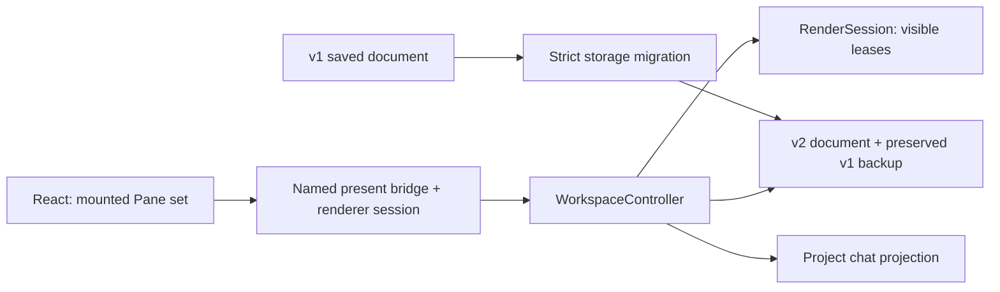
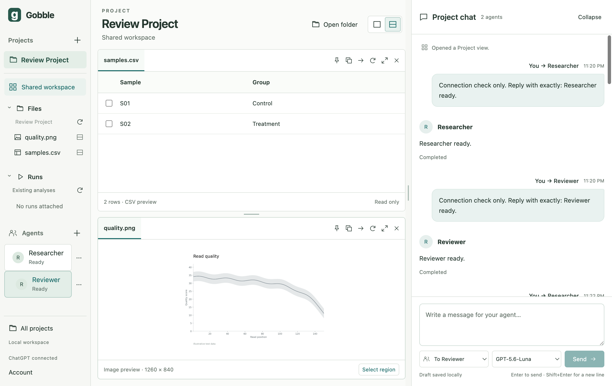

# Stage 5.1 — Right chat and stacked resource workspace

Status: **implemented, verified and accepted; user authorized slice 5.2**, 2026-09-07. User approved the revised sketch and
requested bidirectional selection communication. This is the first sequential review checkpoint
of Stage 5, not completion of shared Agent tools.

## Accepted subject and outcome

[Approved visual and shared communication contract](05-shared-context.md).
One Project window with left navigation, central upper/lower resource Panes and right chat.
One message timeline and one composer; no separate questions route or second input.
Existing text-only peer conversations continue, including separate streams, Stop, uncertain
delivery and unsent draft recovery. Source files and provider credentials are not edited.

## Source and ownership map

| Source owner / affected files | Change and boundary |
|---|---|
| contracts/workspace-document, workspace-document-v1, workspace-migration | Current v2 document, strict storage-only v1 reader; Pane graph remains its compatible v1 domain representation. v2 explicitly assigns vertical orientation and height-ratio meaning. No provider types in shared app records. |
| main/workspace/storage | Atomic current writes and separate immutable `.v1.backup` before first migrated write; retain corruption/future/external-change protection. |
| main/workspace/controller, render-session, workspace IPC/preload | Single Project writer; validated per-session visible Pane report before resource load. Render acknowledgment remains necessary after data load/paint. No native-width guess of mounted content. |
| renderer/workspace layout, Splitter, presentation hook and shell styles | Resource geometry, independent separators, compact Workspace/Chat switch, low-height active Pane fallback. No provider ownership. |
| renderer/chat ProjectChat, ChatComposer, ChatTimeline, timeline projection, chat styles | One mounted composer owner through collapse/resize; author-aligned messages, compact activity, tail-follow behavior and keyboard send. Agent execution remains in collaboration/coordinator. |
| renderer/agents | Agent/account setup only; existing MessageList moves to chat instead of duplication. |
| tests, schema export, documentation | Migration/visibility rejection unit checks; real Electron layout, keyboard, resize/collapse, draft/restart and existing agent flow regressions. |

CRUD: create v2 records and migration backup; read v1/v2 and existing public submissions;
update Project layout/chat preferences/draft through the existing single queue; delete only
obsolete discussion renderer files/styles. No document/history/source deletion or provider replay.

## Verification plan and completion gate

Migration retains tabs, active views, pins, selections, agents, public submissions, draft and
recipient. Former width ratio resets to equal upper/lower heights; old collapsed state stays.
Invalid/foreign/future records cannot be overwritten. A second save cannot replace the v1 backup.

Real Electron verifies upper/lower bounds and right chat, separator keyboard/pointer axes,
compact switching and low-height fallback, exactly one retained composer, IME-safe Enter,
Shift+Enter, tail reading position, per-agent Stop and normal restart. Tests use isolated profiles
and the existing protocol fixture; they do not establish live Stage 5 tools or image consumption.

Completion requires current formatting/types/schema/unit/build/Electron checks and an inspected
actual screenshot. Stage 5.2 begins after user review of this bounded result. Agent pointing,
immutable evidence, attachments and question replies remain the following implementation work.

## Completed result and exact evidence

Source subject: 145 app/native-service files, SHA-256
`dad2bf599688369111f1fd0ceddf4d9d9e6f4d81609d5feb0a4ee0bebaa4bf6f`, using the Stage 4 sorted path/NUL/content/NUL convention.
Development build on macOS 26.5.2 arm64, Electron 44.2.0, React 19.2.8,
TypeScript 5.9.3. Source is uncommitted; no installable/signed package or release claim.

`npm run check` passed on 2026-09-07 at 00:54 KST: formatting, process-specific
TypeScript checks, generated v2 schema consistency, **98 tests in 9 Vitest files**,
native service build and **18 actual Electron tests**. Full Electron run: 28.1 seconds.
The final source tree passed after the fixes below; earlier failures are retained here.

- Existing peer stream/Stop, uncertain delivery/restart, account-button contrast,
  navigation, saved draft failure, selection revision and native trust-boundary tests pass.
- v1 migration preserves immutable original bytes through multiple saves/restart,
  rejects malformed/foreign/future documents and a conflicting archive, retains source
  selection/pins/draft/recipient/public history, and resets only presentation dimensions.
- Real layout assertions verify stacked bounds, right chat, full fitted image, opposite
  pointer/keyboard axes and rapid sequential resizing followed by collapse/compact mode.
- A retained DOM handle proves one composer survives hide/show and compact switching.
  IME Enter does not submit; Shift+Enter adds a newline; ordinary Enter sends once.
  Reading position stays put as another peer responds, with an explicit New messages button.
- Main rejects obsolete/foreign/impossible presentation reports. Chat-only mode revokes
  ready leases; returning to a Pane requires a fresh load and acknowledgment.
- A pointer-selected image region (25% left, 20% top, 50% width, 40% height) restores
  unchanged after resource/chat resizing and compact-mode remount. Selection remains local.

### Construction and behavior repairs

Inspection found the previous full-width image rendering clipped a Plot in a short
stacked Pane. ImageView now fits both dimensions and anchors its overlay to the actual
image frame. Dragging does not open controls and resize the image mid-gesture.

Rapid resize tests exposed two related problems: earlier persistence acknowledgments
replaced later optimistic input, and collapsing chat carried an obsolete width value.
Splitter now preserves pending input until saves settle. The API separates `resizeChat`
(width only) from `chat` (collapsed only), so collapsing cannot overwrite a concurrent
size preference. The unchanged rapid-action assertion now passes.

### Author design review

- `WorkspaceController` remains the only Project writer. Visibility reports are ephemeral,
  per-renderer-session inputs; no DOM, provider conversation, or engine state enters its model.
- `workspace-migration` is a storage-only boundary. IPC requires v2; the old schema bundle
  remains frozen. Unsupported stored data is preserved instead of silently normalized.
- `renderer/chat` owns timeline/composer presentation. Agent/account management stays under
  `renderer/agents`; provider lifetime/admission/recovery stays in `main/collaboration`.
  Old Discussion/MessageList components and obsolete dock CSS were removed.
- ChatTimeline derives existing submission/response pairs and activity; it creates no
  independent writable transcript and does not fabricate inter-agent response chronology.
- ResourceWorkspace owns responsive Pane choice; a keyed PresentedViews boundary registers
  the visible set before mounting views, preventing reuse of a prior layout's ready receipt.
- Images retain exact original dimensions/revision and normalized coordinates. The fitted
  raster is not a semantic Plot model. Shared User/Agent pointing is documented for 5.2.

This was author verification/review, not independent review. No installed performance,
engine execution, live dynamic-tool use or new image-understanding claim is made.

## Actual app for review

The existing review profile was normally closed with no draft or active turns, then
reopened with the new build. The official account connection refreshed successfully;
Researcher and Reviewer remain attached, two resource views are ready, and the same four
public submission states remain `completed`, `completed`, `interrupted`, `completed`.
The screenshot shows previously verified real replies; no new provider message was sent
for this layout check. The review app is left open for the user.

[Selection and resize screenshot](05-1-chat-selection.png) comes from the isolated
actual-Electron regression profile. Native filesystem/UI are real; its resources are fixtures.

## Next review gate

User approval of this implemented layout opens slice 5.2: pinned Codex dynamic-tool
qualification and scoped view/observation/pointing tools, with author-labelled shared
references and Pane overlays. Immutable addressed evidence follows in 5.3, question replies
in 5.4, and live integration qualification in 5.5. The current UI sends text only and labels
saved selections as local. Shared pointing/attachments are not implemented by this slice.
