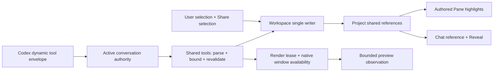
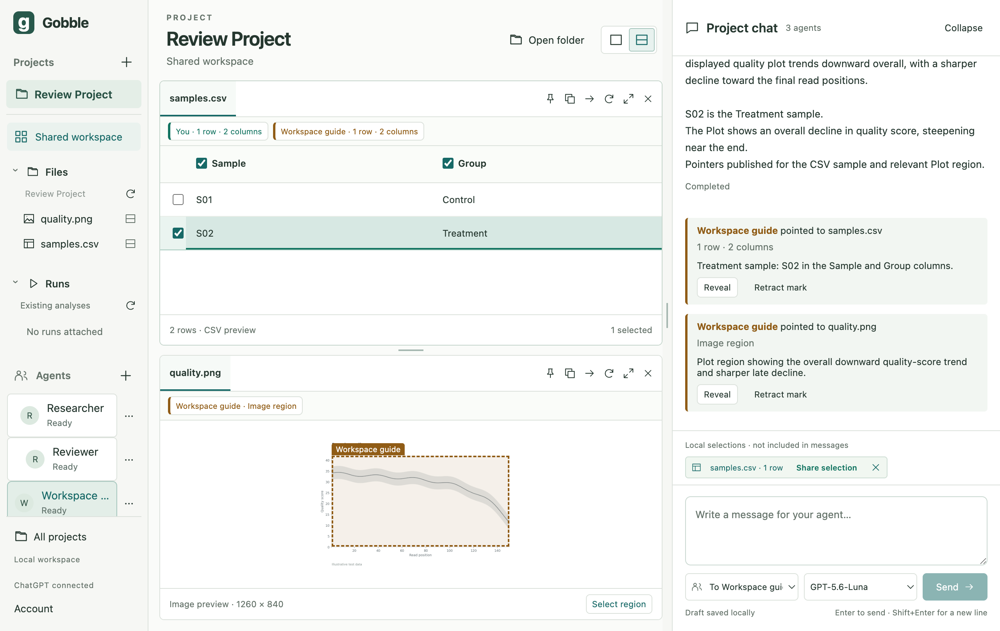

# Stage 5.2 — Shared views and authored pointing

Status: implemented, verified and accepted; the user authorized 5.3 on 2026-09-07. Authorized 2026-09-07 after review of 5.1.
The accepted [shared-context design](05-shared-context.md) remains the product contract.
This checkpoint implements shared tools and pointing; addressed immutable attachments
and question replies remain the separate 5.3 and 5.4 checkpoints.

## Concepts and visible flow

A Project owns resources, attached Agents, public collaboration history and shared references.
A Surface is an opened presentation of one resource. A Pane places Surface tabs in the window.
A local Selection is editable private workspace state. `Share selection` publishes an authored,
revision-bound SharedReference, independently of sending a message. Agent `workspace_point`
creates the same record with host-derived authorship. Sharing never starts another Agent turn.
A static Plot is an ImageView: its rectangle identifies pixels, not semantic data points.

## Source ownership and APIs

| Owner | Responsibility |
| --- | --- |
| contracts/shared-context | Authored reference and access values; closed serializable schemas, no provider types |
| main/collaboration | Active submission/account/turn authority and immediate revocation; no layout logic |
| main/codex | Generated 0.153.4 schema, dynamic-tool registration and callback adapter; no Project authorization |
| main/shared-context | Bounded tool catalog, invocation deduplication, protective layout policy and observation materialization |
| main/workspace | Single durable writer, current renderer leases and local/shared command validation |
| renderer/shared-context | Authored overlays, explicit sharing/retraction and reference reveal; local selections remain independent |
| main/service and Gobble | Existing opaque resource/run queries and engine truth; no new engine state in the renderer |

Existing agents default to `Messages only`. Enabling `Shared views` explicitly starts a new
conversation because the pinned runtime registers tools only at thread start. The app retains
old public history and records the toolset version on each binding. Disabling revokes admission
immediately and requests interruption of owned work; a later enable starts another conversation.
Unknown versions are not silently resumed. Model input modalities come from the runtime catalog.

Callbacks have a 15-second deadline, at most four in flight and 32 distinct calls per submission.
Admission derives Project/Agent/session/thread/turn from the host, never model arguments.
Duplicate invocation IDs must have identical canonical tool/arguments. Results are cached only
for the active turn; restart revokes prior authority and never replays old invocations. Durable
workspace changes use the existing atomic Project writer. The 5.3 addressed evidence store is
not introduced here. Shared references have a bounded 128-record capacity, explicit retraction
and preserved historical authorship; they do not contain source bytes.

UI tools require the selected Project and a visible, foreground, non-minimized window with no
modal. Observation also requires an acknowledged current Surface generation. Loaded preview
content is the observation source. Text is bounded to 64 KiB, images to 1536 pixels on the long
edge and 1 MiB encoded bytes, and tool frames to 4 MiB. Async materialization rechecks the lease
and caller before returning. Source changes never silently remap old references.

User-opened, pinned or user-claimed views are protected. Agent opens prefer a free Pane, return
background/protected outcomes honestly, and do not move keyboard focus. An Agent may release
only its own unclaimed temporary views. Closing a resource prevents that active submission from
reopening it. No tool exposes drafts, other Agent conversations, arbitrary paths, source writes,
code execution, analysis controls, credentials or detached native windows.

## Verification gates

1. Exact-runtime dynamic tool callback and actual image-content consumption qualification.
2. Contract and domain checks for foreign IDs, invalid selections, stale revisions, protection,
   callback identity/retry/conflict/bounds, access revocation and renderer/turn cancellation.
3. Real Electron User share, Agent point, text/table/image highlights, Reveal and stale state;
   modal/foreground gating, history retention and existing messages-only regression.
4. Formatting, types, schema consistency, native service build, unit and Electron checks.
5. Inspected actual screenshot and source digest, followed by user review before 5.3.

Results below will distinguish the real runtime, actual Electron with protocol fixtures,
and anything still unverified. No release or engine-execution claim belongs to this checkpoint.

## Runtime capability qualification

Official Codex 0.153.4, using the existing Gobble-owned ChatGPT sign-in and an ephemeral
probe thread, returned a dynamic-tool callback with matching thread/turn/call identity.
The model catalog reported `gpt-5.6-luna` with `text` and `image` input modalities.
No credential contents were read or copied; the existing review app was normally closed
before the probe runtime used its owned profile.

Initial probes failed: the Stage 4 policy disabled the code-mode host, so the
model could not dispatch a dynamic tool. Enabling that host allowed the callback, but a
model that assumed MCP `content`/`contentItems` received no usable result. The pinned
[tool-output conversion](https://github.com/openai/codex/blob/rust-v0.153.4/codex-rs/tools/src/tool_output.rs)
returns a string containing text and image URLs to the isolated tool orchestrator. The
[dynamic handler](https://github.com/openai/codex/blob/rust-v0.153.4/codex-rs/core/src/tools/handlers/dynamic.rs)
accepts the generated `contentItems` response. The adapter instruction now explicitly prints
the receipt string and forwards its extracted data URL through the orchestrator image helper.
It does not print base64 or guess an MCP shape.

The final probe produced one successful callback and a real model reply identifying the
unprompted receipt `N7Q4`, a **green vertical rectangle on the left**, and an **orange circle
on the right**. Raw qualification events confirmed that the tool result was emitted as an
`input_image` to the model. The image was a fresh, controlled raster; its shapes were absent
from both the user input and receipt text. This proves text/image consumption through the
pinned dynamic-tool path, not arbitrary desktop observation or analysis accuracy.

The code-mode host is an isolated tool-orchestration facility. OS shell, source execution,
filesystem tools, browser, plugins, other host skills and delegation remain disabled by the
pinned policy; only registered shared callbacks can reach Gobble resources. The Stage 4
messages-only mode registers no dynamic tools. This refines “no execution” to distinguish
sandboxed orchestration of allowed calls from executing Project/OS code.

## Construction refinements

- Shared reference labels are captured at publication, so closing a Surface cannot erase
  the resource name from chat history. Retraction removes the overlay, preserving the record.
- The v2 document accepts absent shared-reference fields for older v2 saves. Reference IDs,
  Project association, author attachment and originating Agent submission are validated.
- Tool argument schemas live in `contracts/shared-tools`; provider registration descriptions
  stay in the host catalog. The original process dependency rules remain intact.
- A renderer dialog obtains a named host interaction block before showing native modality,
  then releases it on close. Native blur/hide/minimize invalidate in-flight observations.
- `workspace_list` declares `ready`, `loading` or `hidden` presentation. Opening has an
  explicit `opening` state until acknowledgment, in addition to revealed/background placement.
  Observation waits at most about 2.5 seconds for a current ready lease without holding the
  Project write queue. Read retries revalidate their original observation lease.
- Direct pointer/focus interaction claims an Agent-created Surface before subsequent Agent
  release or placement can replace that work. New two-resource opens prefer distinct Panes.
- Up to four relevant reference overlays are shown at once. Chat retains the complete bounded
  history; Reveal brings an older pointer into that visible set. Text has a synchronized mark
  layer behind its read-only textarea, preserving the independent native local range.

Further verification exposed two actionable issues. Account refresh now publishes connection
state and model catalog together; a deliberately delayed catalog no longer exposes a premature
ready state. On this macOS Electron tuple, read-only textarea arrow keys scroll rather than
adjusting a caret. The text communication view now explicitly handles arrow/Home/End range
navigation, including Shift extension and Unicode boundaries, while retaining read-only data.
An unchanged exact-range Electron assertion verifies the repair.

Per-turn tool results are capped at 8 MiB with room reserved for bounded failure receipts;
32-call identities remain cached, rather than evicting them and repeating a mutation. An
observation retry closure retains only renderer acknowledgment identity and authority guards,
not original full-resolution image bytes. A lease changes on reload, project switch, renderer
rotation or visibility loss. Native focus/modality epochs prevent a later focus return from
reviving an in-flight observation.

## Verified implementation result

On 2026-09-07 at 06:57 KST, `npm run check` passed: formatting, each process's
TypeScript checks, current schema consistency, native service build, **118 tests in
10 Vitest files**, and **21 actual Electron tests** (36.6 seconds). The pinned
`npm run codex:schema:check` also passed with 21 focused upstream types. Final README
formatting was checked after documentation updates. The native engine/service source is
unchanged in this checkpoint; no Docker execution, package or release qualification is claimed.

The exact app/native-service source subject contains **160 files**, SHA-256
`6dfa882fa3f6ea40553283749ba75368778d5aa3c85fc6e0ffe7dd2868ab13e1`, using the
sorted unique path/NUL/content/NUL convention from Stage 4. This remains uncommitted work.

Verified behavior includes atomic two-Pane opens, protected and claimed views, user-dismissal
protection, repeat/conflicting invocation IDs and limits, foreign/stale evidence, hidden
Project read-versus-write scope, model modality rejection, observation invalidation during
modal/focus/cancel/refresh/revocation, cache size limits, exact UTF-16 selections, retraction,
reference preservation after closing a Surface, and active conversation/account/turn authority.
Transport tests exercise actual stdio with text/image output envelopes, unknown requests,
four-callback admission, expiry and disconnection cancellation.

Actual Electron verifies table/image shared pointers from the protocol fixture, independently
retained local row selection and composer focus/draft, text mark overlays and keyboard ranges,
stale-version warnings after source refresh, close/Reveal, explicit access opt-in and normal
restart. The existing account contrast, peer isolation, IME, layout/migration, save failure,
source containment and Run/log fixture regressions also pass. These are author-run checks and
an author design review; no independent review is claimed.

## Actual signed-in app evidence

The existing review Project retains Researcher and Reviewer with Messages-only access and
their original provider bindings. A dedicated `Workspace guide` Agent was added with explicit
Shared views, `gpt-5.6-luna` and low effort. The user-side UI published the S02 row selection.
The real Agent then observed the loaded CSV and Plot, correctly identified **S02 / Treatment**
and the Plot's overall downward trend with a steeper late decline, and published one table
pointer and one image pointer through the bound tools. The final provider outcome is completed.
No fixture supplied that Agent response. The Plot itself remains illustrative test data,
not a biological/analytical conclusion.

The screenshot was inspected: two ready resource Panes, visible author labels, independent local
selection, Agent marks, Reveal/retraction actions, an empty single composer and retained original
peers. [The automated Electron screenshot](05-2-shared-pointing-electron.png) documents the
separate protocol-fixture journey and is not presented as a real-model result.

A normal quit/reopen restored the same three references, two ready views and all five then-saved
public submission outcomes, without automatic resend. The guide retained `shared-views-v1`;
the two original peers retained their Messages-only bindings. A separate explicit follow-up
verified shared-tool access on the resumed provider conversation: after restart, the User
published a fresh reference and asked the guide to use `workspace_list` to identify it.
The completed reply exactly matched `ref_66f222d2-82e3-42c2-b0d4-cbcf3eee087f`, an ID absent
from the prompt and earlier provider context. The duplicate qualification mark was then
retracted through the UI, preserving its history. The final review state has three active
references, one retracted record, six terminal submission outcomes and an empty composer.

## Author design review and next checkpoint

The Gobble/native-service boundary is unchanged: resource registration and engine truth stay
behind the existing typed Go service. App Workspace owns view placement, local selections,
references and public collaboration records. Provider credentials and private history stay
with Codex. Shared tools do not import provider schemas or write storage directly.

Construction keeps portable schemas, active caller lifecycle, protective layout policy,
preview materialization, durable Project mutation and React overlays in separate source owners.
The callback adapter does not become an authorization layer. The renderer has named interaction
and User actions; it cannot choose Agent authorship, active turns, toolsets or native paths.
Observation closures and result caches have explicit lifetime and size bounds.

Stage 5.3 remains a separate user-review gate: capture immutable addressed evidence, attach
selected content to the one composer and deliver it to an explicitly chosen Agent. Stage 5.4
then adds inline questions/replies; 5.5 broadens live integration qualification. No further
stage is implemented by this checkpoint.
