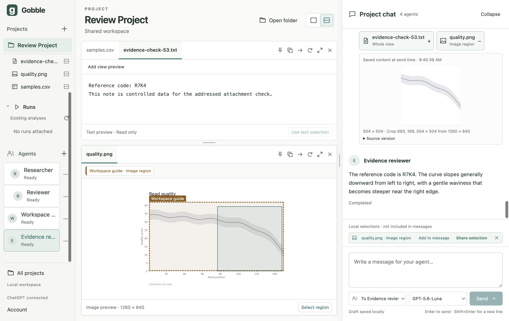

# Stage 5.3 — Immutable addressed attachments

Status: implemented, verified and accepted; user authorized 5.4 on 2026-09-07. Authorized 2026-09-07 after the user accepted Stage 5.2.
The [accepted Stage 5 design](05-shared-context.md) supplies the contract, interface and ownership
decisions. This checkpoint ends at user review; questions/replies remain Stage 5.4.

Starting subject: 160 app/native-service files, SHA-256
`6dfa882fa3f6ea40553283749ba75368778d5aa3c85fc6e0ffe7dd2868ab13e1`.
Implementation mode; no independent review, packaging or release claim.

## Concepts and sketch

SharedReference is a pointer in the Project. DraftAttachment is an explicit copy of an EvidenceRef,
with its own identity and captured label. PreparedEvidence contains the exact bounded content for
that attachment intent, recipient, model, account and renderer session. Sent evidence is an immutable
asset plus a manifest inside the addressed Submission. It stays readable without an open Surface.
The Project document owns the manifest; the evidence storage owner owns only content-addressed bytes.
There is no second message database or a new Gobble engine state.

```mermaid
flowchart LR
  S[Local selection / explicit view preview] -->|Add to message| D[Draft attachment references]
  D --> E[App evidence service: revision and bounds]
  E --> P[Inline composer preview]
  P -->|Send| V[Recipient, model, intent and source revalidation]
  V --> B[Store immutable assets]
  B --> W[Workspace single writer: Submission + manifests + draft consumption]
  W --> C[Provider-neutral text/image input]
  C --> A[Addressed Agent]
```

One existing composer gains removable attachment chips and one bounded inline expansion. A selected
region uses `Add to message`; a view without a selection has an explicit `Add view preview` action.
Attachment-only messages are allowed. Selecting, sharing a pointer or preparing content never sends.
An Agent may receive explicit attachments with Messages-only access; shared tools remain a separate
permission. Historical previews expand inside their original user message.

Attachment intent has a monotonic revision changed by adding/removing attachments and changing
recipient. Editing the message text does not alter prepared source content. The preparation binding
also includes the current Agent configuration, account session and renderer session. Changing any
binding invalidates a token, even if another Project/model is later selected. Send consumes only the
matching persisted draft and attachment intent. New or failed drafts are preserved.

Preparation reads through the existing contained Project resource service, checks the exact revision
and selection, and builds bounded content in memory. It is not a rendered-observation claim. Send
rechecks all sources immediately before durable acceptance; a changed or missing source rejects the
whole send. After acceptance, historical content never falls back to current source bytes.

Limits: 16 attachments, two images, 64 KiB combined serialized text content, 1 MiB encoded image data
per image, 1536-pixel longest edge, 4 MiB encoded provider payload, and 64 MiB physical evidence quota
per Project. Explicit selections that exceed the content bound are refused instead of dropping rows
or characters. Whole previews disclose source truncation. Assets are stored before the manifest
commit; an interrupted acceptance may leave an unreferenced owned asset. Historical assets are never
automatically deleted. Missing or corrupt historical bytes produce `Evidence unavailable`.

## Implementation ownership and affected set

| Layer | Create/read/update/cleanup and reason |
| --- | --- |
| contracts/evidence, evidence-bridge | Closed draft, manifest, preparation and preview schemas; named bridge. No provider/Electron types. |
| contracts/collaboration, workspace-document, workspace-document-v1, evidence-validation, workspace-bridge, bridge, index, generated v2 schema | Optional compatible v2 attachment fields, semantic associations and addressed Send intent; explicitly restrict the legacy reader to legacy message fields and keep the v1 JSON bundle frozen. |
| main/evidence/{draft,materialize,storage,service,ports} | Pure draft changes, exact bounded materialization, immutable assets, preparation lifecycle and narrow application ports. |
| main/workspace/controller, model | Validate User attachment capture against loaded data; single draft/manifest writer; invalidate attachment intent on recipient change. |
| main/collaboration/{provider,store,coordinator,host,ipc}, main/codex/conversations | Prepared-content admission, atomic consumption, no-replay delivery and text/image wire projection. |
| main/index, preload/index | Compose existing resource/image adapters and register named preparation/preview calls; shutdown releases ephemeral content. |
| renderer/chat and renderer/evidence | One composer and historical inline preview, loading/error/removal states, stale async-result protection and blob URL cleanup. |
| renderer/workspace/SelectionChips and views/{SurfaceView,TableView} | Explicit attachment actions; existing local selection and shared pointing remain separate. Column selection uses the same pending-state feedback already used for rows. |
| desktop/tests, existing Electron fixture and focused evidence journeys | Pure/service/stdio tests plus actual Electron IPC, crop rendering, single-composer and restart evidence. |
| app/README and desktop design/stage records | Current API, ownership, bounds and qualified results. |

No Go source, engine, pipeline, provider credential, synced source or session-plan file change.
Order: contracts and complete port skeleton; materialization/storage and acceptance; renderer;
construction checks; behavioral checks; actual app inspection and documentation.

## Verification request 5.3

Dynamic handoff — Development → testing. Target: current macOS arm64, Electron 44, pinned Codex
0.153.4, existing Vitest/Playwright/native-service framework. Construction checks are separate from
behavior. Pure/service cases cover exact UTF-16/rows/crops, foreign/stale references, recipient/model/
account/intent changes, image capability, quota/hash/missing assets, write failure before provider
input, duplicate requests, no replay and unchanged source history. Real Electron covers explicit
selection and whole-preview attachment, inline expansion/removal, recipient switch, one composer,
attachment-only send, source change rejection and quit/restart restoration. Actual provider input
will be separately qualified with real text and image content. Docker execution, other OSes,
installed artifacts and updates are unsupported claims for this checkpoint.

No material render-performance claim is proposed: at most one bounded attachment preview is expanded
per composer/message list, and original full file bytes do not enter the durable Project JSON.

## Implementation and evidence results

Construction and focused verification exposed a table interaction defect: a controlled column
checkbox briefly reverted while its durable selection update was pending. TableView now retains
the pending columns, just as it already retained pending row keys, and rolls back to host state
after the outcome. The unchanged Electron `uncheck` assertion then passed.

Two test-only locator issues were corrected after inspecting their actual UI output: error status
text shares a region with its retry button, and an unanchored filename matched both preview and
removal buttons. Assertions now target the status region and filename-prefixed preview control.
The same content, recipient, disabled-send and history assertions remain. Focused evidence:
40 tests across evidence/collaboration/shared-context, plus all three new actual Electron journeys.
The final results follow.

## Verified result and author design review

On 2026-09-07, the final `npm run check` run started its unit suite at 09:43:12 KST and
passed formatting, all process TypeScript checks, v2 schema consistency, native service build,
**132 tests in 11 Vitest files**, and **24 actual Electron tests** (47.4 seconds). The pinned
`npm run codex:schema:check` also passed with 21 focused upstream types. Final README wording
passed formatting afterward; it changed no executable behavior. Earlier full construction and
behavior checks also passed before the small selection-label width refinement.

Final source subject: **174 app/native-service files**, SHA-256
`8fdd55cf752058da45e15fd36c886246d33bde4629c2f03f973d6441778bb77c`, using sorted unique
path/NUL/content/NUL over `app`, `internal/appservice` and `cmd/gobble-service`. Work remains
uncommitted. Synced sources, engine/service source and the four session-plan files were untouched.

The author review checked these boundaries:

- Portable evidence schemas contain no provider or Electron types. Legacy message fields are
  explicitly selected for the v1 reader; v2 owns its optional new draft and Submission fields.
  The frozen v1 JSON bundle is not regenerated. Semantic checks cover Project, unique attachment
  identity, asset representation, normalized/pixel crop association and text/image budgets.
- Main accepts references from named User actions, validates against the loaded selection, then
  materializes through contained resource reads. Prepared content follows attachment intent;
  changes to unrelated view layout, local selection or typed text cannot rewrite its bytes.
- The evidence service owns only bounded session preparation and the storage port. The controller
  remains the single durable Project writer, delegating attachment and consumption transitions to
  `evidence/draft`. Provider binding, capacity and uncertain delivery remain in collaboration.
- Account/model, current Project/session, recipient and attachment intent are checked again after
  asynchronous work and inside acceptance. Provider input is sent only after the immutable blobs
  and addressed manifest are durable. Duplicate accepted IDs never resend; conflicting preparation
  IDs are rejected even when the message text matches.
- Storage publishes hashes exclusively, validates existing bytes, enforces physical quota and
  rejects symlinks. Sent preview lookup requires a Project/message/attachment association rather
  than a raw hash or path. Missing history assets never read current source as a fallback.
- React owns one composer, one expanded draft preview and one expanded historical preview across
  the timeline. Late preview/preparation responses are discarded and image blob URLs are revoked.
  Source metadata expands inline; neither a new Pane nor another text input is introduced.

These are author-run tests and an author design review, not an independent review. Automated
provider journeys use the explicit protocol fixture; real Electron, IPC, native crop decoding,
resource containment and app storage run in the actual process chain. No Docker execution,
scientific correctness, other OS, package, install, update or release qualification is claimed.

## Actual signed-in Agent and restoration

A dedicated `Evidence reviewer` was added through the visible UI with **Messages only** access,
`gpt-5.6-luna` and low effort. Researcher, Reviewer and Workspace guide retained their original
provider bindings. A new controlled note in the review Project contained the otherwise unprompted
code `R7K4`. The UI attached its preview and a selected 504 × 504 crop from `quality.png`:
pixel rectangle `(693, 168, 504, 504)` from the 1260 × 840 source. The text asset was 113 bytes;
the PNG asset was 12,866 bytes. Both exact previews were inspected before Send.

The prompt asked only for the attached note's code and the curve's direction. The real provider
completed submission `req_3762285c-3907-4457-9a45-eadab2970cd1` with:

> The reference code is R7K4. The curve slopes generally downward from left to right, with a gentle
> waviness that becomes steeper near the right edge.

The new conversation had no shared dynamic tools; content arrived through explicit text/image
turn input. The code and curve direction were absent from the message text and role instructions.
This verifies actual consumption of both attachment types on the pinned runtime. The Plot is
controlled illustrative data and this observation is not a scientific result.

The app was then normally quit and reopened. Seven terminal public submission records, all four
Agent bindings, the empty draft and the same two evidence hashes were restored without resend.
The saved note and image were expanded again through the historical preview path. The live
review app remains open. The inspected [pre-send screen](05-3-addressed-evidence-live-draft.png)
shows the single composer with its exact crop. The separate [Electron fixture screen](05-3-addressed-evidence-electron.png)
shows selected CSV columns and an image attachment; it is not labelled as a real-model result.

## Next user-review checkpoint

Stage 5.3 is complete within its accepted scope. After user approval, Stage 5.4 will add Agent
questions as ordinary chat messages, an explicit reply target and answers through this same
composer. Draft autosave will not answer questions, and evidence/delivery state will remain
separate. No Stage 5.4 behavior is implemented by this checkpoint.
