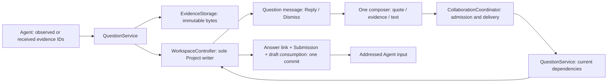
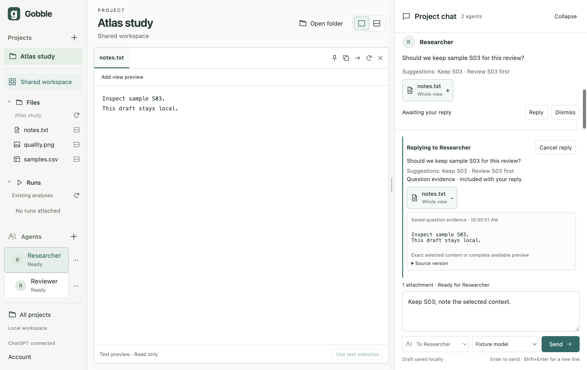
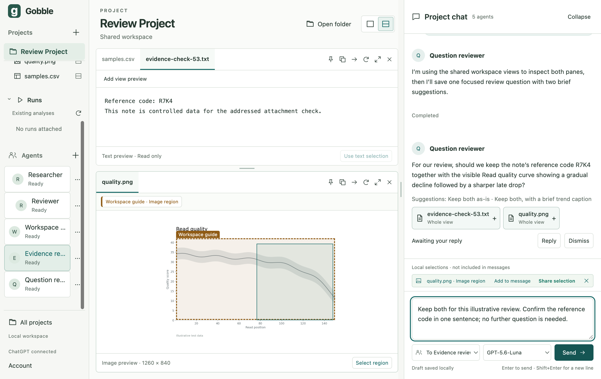
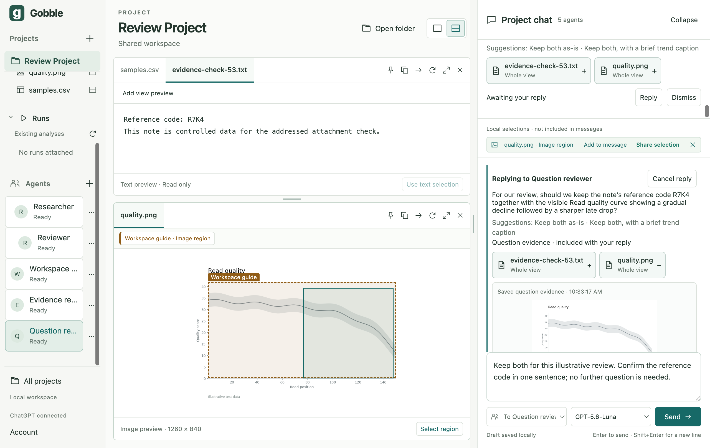
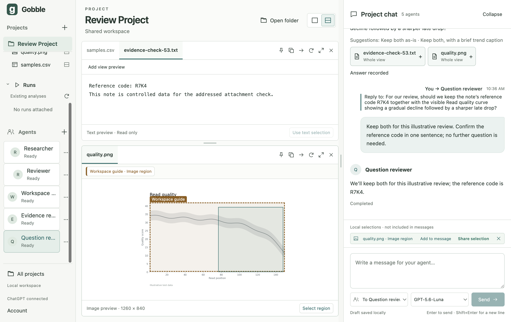

# Stage 5.4 — Questions and replies in Project chat

Status: **5.4 accepted 2026-09-07; continued in [5.5](05-5-ui-integration.md)**.
Authorized 2026-09-07.

## Scope and sketch

A Question is an Agent-authored message backed by immutable evidence and a durable
Decision. It lives in the Project's existing decision collection and is projected
into chat. A reply target is a link in the one composer, not another answer form.
The answer is the addressed Submission referenced by the Decision; its text and
delivery state are not copied into a second record. Historical foundation Decisions
remain readable, but cannot masquerade as evidence-backed questions.

Arriving questions never change the recipient, reply target or draft. Explicit
Reply keeps text/attachments and binds the recipient; Cancel reply only removes
that link. Suggested options are plain text. Dismiss sends nothing. Autosave is
not an answer. Send validates the pending question and its exact dependencies,
stores the answer link and normal submission together, then delivers. Failed
admission preserves the draft; uncertain delivery preserves the recorded answer.
Restart restores pending questions and drafts without replay.

## Owners and affected paths

| Owner | Responsibility / change |
|---|---|
| `contracts/src/decision.ts`, question schemas/validation | Versioned Question variant, immutable manifests, origin/call receipt, answer submission link; frozen legacy shape |
| `main/questions/` | Bounded observation authorization, question creation/idempotency, dependency validation, reply rules; no separate database |
| `main/evidence/` | Reuse materialization and content-addressed storage; authorize saved question previews through their record |
| `main/workspace/controller.ts` | Sole writer for question transitions, reply selection, and atomic answer acceptance |
| `main/shared-context/` | Active caller dispatch; expose observation IDs and `workspace_question`; retain existing cancellation/budgets |
| `main/collaboration/` | Admission, combined payload limits, accepted submission and independent delivery outcome |
| `main/codex/` | Provider translation and explicit tool-set compatibility; no question business rules |
| `renderer/chat/`, `renderer/questions/` | Read projection, inline question evidence/actions, read-only reply quote in the same composer |

Gobble/native-service execution and resource ownership do not change. No Pipeline
execution, native question window, second input, automatic answer, source write,
broadcast, remote bridge or packaging is in this slice.

Observation receipts authorize bounded exact assets only for the active requesting
Agent/turn. Sent attachment IDs authorize that Agent's own received evidence, never
another peer's attachments or draft. Persist only assets referenced by a created
question; retain the existing 64 MiB Project quota. Questions have at most 16
evidence items, two images, 64 KiB text and six textual suggestions. The answer
payload combines quoted question evidence and explicit new attachments under the
same delivery limits. Pending questions are checked at creation and explicit Send;
there is no background filesystem watch or assumed source freshness after restart.

The new tool set is `shared-views-v2`. Earlier v1 shared conversations require the
user's explicit Start new conversation action to gain questions; public history
and evidence remain. The product explains this in settings and when Send is blocked.
No provider binding is silently replaced.

## Verification request

Construction: formatting, process type checks and generated portable schema.
Behavior: one writer/commit, caller and evidence ownership, immutable question
previews, matching/conflicting call retries, invalid/capacity-bounded requests,
source change, answer idempotency, dismissal, busy/offline/uncertain delivery,
save failure, recipient/reply/attachment intent races, frozen v1 compatibility,
normal restart with no replay. Real Electron: questions arriving during a draft,
single composer, keyboard Reply/Cancel/Send, plain suggestions, preserved text
and attachments, exact historical previews, and explicit tool-version transition.
Use protocol fixtures for deterministic failures and label real model observations
separately. Author review covers owner/API/module boundaries; no independent review
is claimed. Report results and obtain approval before 5.5.

## Construction and author review

The new portable Question variant stores immutable manifests, creation time,
originating Submission and a hashed invocation receipt. Its answered state holds
only the answer Submission ID/time; the answer body and delivery outcome have one
owner. `validateQuestions` checks these bidirectional associations. The original
Decision shape is frozen as `LegacyDecisionSchema` in the v1 reader. Existing v2
profiles without questions or reply targets still parse unchanged.

QuestionService uses a provider-neutral QuestionTools/QuestionReplies port. Its
read model receives only submission identity, recipient, state and evidence links,
not message bodies or private provider responses. Replied-to question evidence
counts as received evidence only when that requesting Agent actually receives it
in the active or a completed submission of the same conversation. This also
supports an explicitly created replacement conversation. Agent-generated pointers
and another peer's question history do not grant this receipt authority.

The service validates outside the writer while the writer rechecks intent and
pending state at acceptance. Reply/Cancel and recipient/configuration changes
invalidate prepared attachment intent; canceled/dismissed/changed replies cannot
silently become plain messages. Historical previews read only their immutable
assets through Project/question/attachment membership. Surfaces may close without
removing that history. The same source text/table/PNG materializer serves User
attachments and question observation snapshots. Images reuse the exact already
rendered observation output, not a second capture with different coordinates.

QuestionMessage and ReplyTarget have no writable text field or submission method.
ChatTimeline projects Questions into the existing chronology; ChatComposer owns
the only input. Question options stay plain text. A saved question preview is
labelled `Saved question evidence`, and the reply quote explicitly names the
Agent and the evidence included with the answer.

Author review found and repaired a missing authorization path for the immutable
question evidence delivered with a reply into an explicitly replaced conversation;
a regression case now proves that receipt path without exposing other peers.
No independent or delegated review is claimed.

## First failures and repairs

- The initial 132-test regression run had one stale fixture expectation for
  `shared-views-v1`. The accepted new registration is `shared-views-v2`; the test
  was updated and the actual old-binding transition gained its own Electron case.
- The initial Electron run had a wrong accessible button label in the new test.
  The corrected locator uses the existing `Add view preview of notes.txt to message`
  action. No product behavior was weakened.
- The migration fixture initially copied its document before queued UI changes
  finished and wrote that stale copy back after quit. It now reads the final
  durable document after normal quit, modifies only the old tool-set identity,
  and removes the new question tool from the test provider's old registration.
- The test's first attempt to control question arrival used an environment variable
  that the provider's existing environment filter correctly did not forward.
  The fixture now uses a gate file in its own temporary home and asserts that no
  question exists before opening the gate. Product environment restrictions stay intact.
- Rapid recipient changes overlapping Agent/question/draft commits reproduced a
  product `stale_revision` refusal after the renderer's single retry. The renderer
  now bounds fresh-state retries at four, only after explicit no-side-effect
  rejection. The composer holds the pending recipient choice and disables Send
  until it is saved or visibly rolled back. The original failure is retained in
  `/tmp/gobble-54-electron-race.log`; the unchanged recipient/draft assertions pass.
- A diagnostic run invoked the Electron test from the repository root rather than
  `app`; its fixture lookup failed before application launch. The proper test
  directory was restored. This is runner error, not application evidence.
- Concurrent observation admission now rechecks the 16-item limit after image/text
  materialization. A focused concurrent case proves one remaining slot admits only
  one result. Question capacity (100) and combined reply evidence limits are also tested.

Full check records before the final receipt-path refinement:
`/tmp/gobble-54-check-first.log` (147 unit/contract, 27 Electron, 57.8 seconds) and
`/tmp/gobble-54-check-final.log` (147 unit/contract, 27 Electron, 57.5 seconds).
These are superseded by the final identity and result below.

Visual author review additionally reproduced a stretched question avatar and a
Send control below the visible composer when a large inline preview expanded.
Question headers now share the ordinary Agent header geometry. Only composer
context scrolls; its one input, recipient/model controls, Send and save status stay
anchored. Actual Electron assertions check the 28px avatar and the Send button's
viewport bounds with a question preview open.

## Final verification identity

`npm run check` passed in `app` after all source refinements:
**148 tests in 12 Vitest files** and **27 actual Electron tests** (57.4 seconds).
The unit run began **2026-09-07 10:29:22 KST**. Formatting, all process type checks,
v2 schema consistency and native-service build passed in the same run.
Record: `/tmp/gobble-54-check-reviewed.log`. Earlier full records are superseded.
The pinned Codex schema check also passed (`/tmp/gobble-54-codex-schema.log`).
`git diff --check` passed; the session-plan directory remains its four accepted files.

Final source identity: **184 files**, SHA-256
`1c539f874384ea03d8e9bbd887f2e36eff7590a76032ec9cbfa9d2704f173203`,
using sorted unique tracked/untracked, nonignored paths in `app`,
`internal/appservice` and `cmd/gobble-service`, hashing path + NUL + bytes + NUL.
The source manifest is `/tmp/gobble-stage54-source.json`. Starting accepted 5.3:
174 files, `8fdd55cf752058da45e15fd36c886246d33bde4629c2f03f973d6441778bb77c`.
No Go source, synced reference, dependency pin, credential or package artifact was changed.
No commit or push was performed.

This screenshot is actual Electron UI with controlled temporary files and the
protocol test peer; it is not a real-model response. Existing account/IME/layout,
selection, attachment, security, save-failure and migration regressions remain
part of the passing suite. The Run/log test still substitutes a Docker CLI and
does not establish real engine execution or packaging readiness.

## Actual model qualification

Used the existing signed-in review profile with official Codex **0.153.4**, model
**gpt-5.6-luna**, effort **low**. Created a dedicated **Question reviewer** with
shared views; the four pre-existing Agent bindings and public histories remained.
The new binding uses `shared-views-v2`, thread
`01a0797f-58b1-7c63-8ec3-219a5ae9fb23`.

The explicit request asked the Agent to observe the two open note/Plot previews,
create one question from their observation IDs with two brief suggestions, and
finish. It did not include `R7K4` or describe the curve. The actual saved question was:

> For our review, should we keep the note’s reference code R7K4 together with the visible Read quality curve showing a gradual decline followed by a sharper late drop?

The two suggestions were `Keep both as-is` and
`Keep both, with a brief trend caption`. The requesting submission
`req_3902e207-f629-4e97-8d19-9de887480e48` completed, while the question remained pending.
Question ID: `dec_a7740aea84490d1c8a8b260325c6b881d14015bd02dca186`.

Its immutable evidence:

| Preview | Stored representation | Content hash |
|---|---|---|
| `evidence-check-53.txt` | Exact whole text, 113 JSON bytes | `sha256:1cc1dc1cd75a9618b318fb6b4fd9e9d79c5f68d7eaac8b597163fa666db4979b` |
| `quality.png` | Whole 1260×840 PNG, 45,355 bytes, crop `(0,0,1260,840)` | `sha256:5a764f0de4dbacadc6f3cafcd73ca78607251fa52927385820e36c399ff17714` |

The note/plot are controlled illustrative data from earlier qualification, not
scientific findings. Source files were not edited for this slice. The question's
nonce and curve description establish real content use, separate from the protocol
fixtures. Existing local raster selection and the earlier Workspace guide pointer
remained independent of the question's whole-preview evidence.

While the Agent worked, the composer was addressed to **Evidence reviewer** with
an unsent draft. The question arrived without changing that recipient or text.
Explicit Reply then bound **Question reviewer** and preserved the exact text:
`Keep both for this illustrative review. Confirm the reference code in one sentence; no further question is needed.`
The original image preview expanded through the saved-question evidence bridge.

A normal quit/relaunch before Send restored the same pending question, both hashes,
reply target, exact draft and eight existing submissions. No answer or request was
replayed. The original v2 provider thread binding was retained. After reconnect,
the saved image preview opened and Enter explicitly submitted the reply through
the same composer.

The real reply completed on the same resumed provider thread. Submission
`req_a0a76283-1204-4c06-b3b4-3282d662be5e` is the Question's unique recorded answer.
The Agent responded:

> We’ll keep both for this illustrative review; the reference code is R7K4.

A second normal quit/relaunch restored that answered state, nine terminal
submissions, the same two evidence hashes and all five Agent bindings. The draft,
reply link and attachments were consumed once; nothing was resent. The review
app is open, connected and idle. No credential contents were read or copied.
The live controller's first attempt to choose a model used an overly exact label
locator and stopped in the unsaved dialog. The observed dialog label was then
used correctly; no duplicate Agent or provider submission was created.

## Next review gate

Stage 5.4 is complete within its approved scope. Review this result before **5.5**:
combined Project chat/workspace journeys, interleaved peers, reading-position and
compact-layout review, with any missing concept/ownership diagrams supplemented
before implementation. At this 5.4 checkpoint, no 5.5 work, real engine qualification, installer, commit or
publication starts without the user's next approval.
