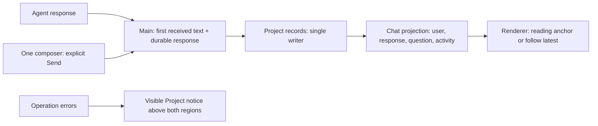
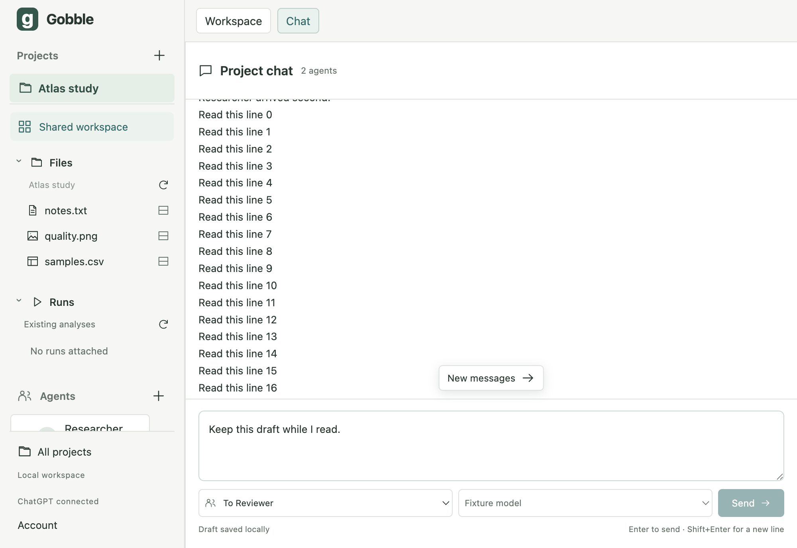
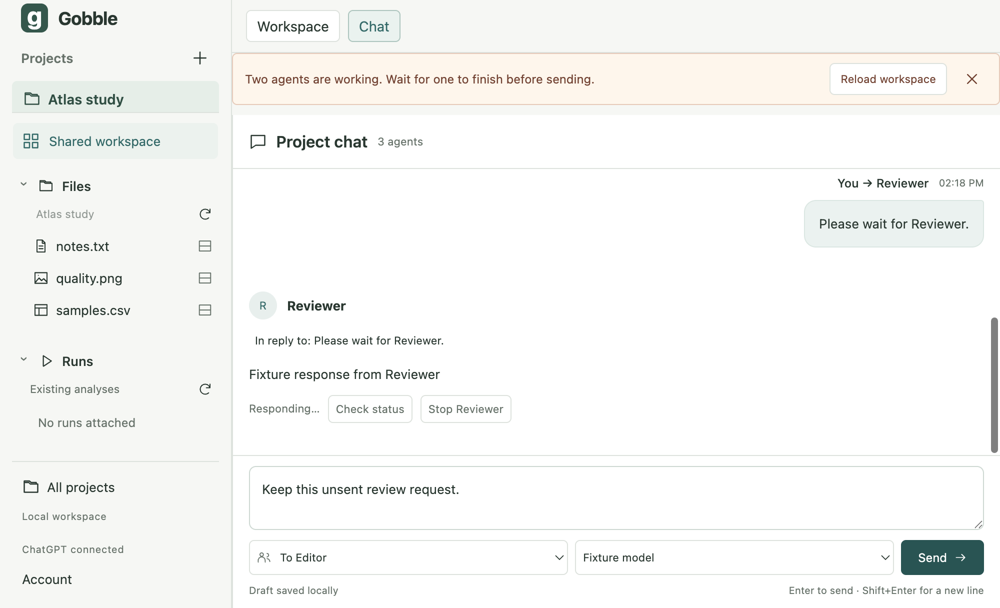
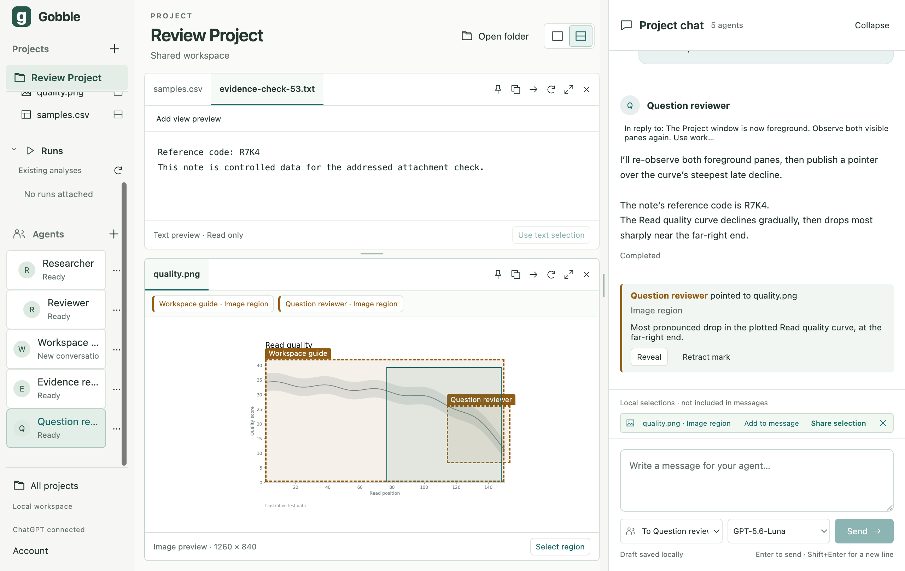

# Stage 5.5 — Integrated Project chat review

Status: **5.1–5.4 accepted; 5.5 implemented and verified; user requested a UI/UX revision before stage 6**.

2026-09-07: [Stage 5.6 UI/UX review](05-6-ui-ux-review.md) records the user's
feedback, actual app walkthrough, concept alternatives and the next approval
checkpoint. Stage 6 remains on hold. The evidence below describes the 5.5 build.

The user approved continuing after the [5.4 question/reply review](05-4-inline-questions.md).
This implements the UI integration checkpoint in [stage 5](05-shared-context.md).
The existing generated concept remains the accepted visual direction. All UI is English.

## Sketch and concepts before implementation

A Submission owns addressed input, response and delivery state. Separate visual
user/Agent messages are projections of that same record, not a second chat store.
For new submissions Main records `responseStartedAt` once, when the first nonempty
response is saved, before publishing its stream. New responses use that position
through streaming, completion and restart. The time means first app receipt, not
provider generation time. Timestamp ties use stable IDs. A response remains one aggregate for a turn; individual
sentences and tool events do not reorder its body. Old submissions without
this metadata keep their original paired display; no historical arrival is invented.

Reading position is transient renderer state: a stable timeline item and its
offset in the viewport. Updates above it, preview loading, collapse and width
changes retain this anchor. At the end, the timeline follows new content; otherwise
it shows New messages. Switching Project resets this transient reading state.
Draft, attachments, reply target, recipient and layout remain Project-owned.
Collapsing or switching visible regions does not remount the single composer.

An operation error belongs to the Project shell, above both regions. Chat mode
must not conceal a refused Send or a storage failure. This is presentation of the
existing error owner, not another error channel or dialog.

## Implementation owners and verification plan

| Owner / files | Change and evidence |
|---|---|
| `contracts/src/collaboration.ts`, generated schema | Optional first-response time; absent legacy, null awaiting first text. Frozen v1 remains unchanged. |
| `main/collaboration/coordinator.ts` | Persist first text/time through existing writer; never revise its position on later chunks/reconciliation. Coordinator tests cover delayed peers, persistence and duplicate updates. |
| `renderer/chat/timeline.ts`, focused submission presentation | Read-only separate user/response items with explicit request association; preserve legacy display. |
| `renderer/chat/useChatScroll.ts`, `ChatTimeline.tsx` | One owner for following, unread state and visual anchor. Actual Electron checks with streamed growth, resize and hidden/show. |
| `renderer/workspace/WorkspaceApp.tsx`, shell styles | Keep alerts visible above both regions; retain accessible recovery. Actual refused Send in compact Chat. |
| Composer and conversation binding | Review recipient/model transitions and old toolset guidance; fix only demonstrated integration gaps. |
| Electron fixtures/tests | Controlled peer ordering, reading anchor, one composer, drafts/reply/evidence retention, keyboard and button states. Protocol substitute clearly separated from live qualification. |

The first skeleton is the record field, projection variants, presentation owner,
scroll hook and shell alert placement. Grow these in that dependency order, then
exercise complete Electron journeys. Run format/type/schema checks, unit tests,
native service construction and the full Electron suite on the final tree.
Review the real signed-in app and existing controlled note/image evidence; no
credentials are read or copied. No material render-performance claim is intended.

## Implemented result and design review

- Split the chat read projection into user input and first-received Agent response
  for new records, with an explicit In reply to link back to the user message.
  Following that link moves reading position and keyboard focus, not the recipient.
- Extracted `SubmissionMessage.tsx` from the timeline and added `useChatScroll.ts`.
  Timeline owns ordering/composition; message presentation owns evidence/delivery
  controls; the scroll hook owns DOM observation and transient reading state.
  No provider DTO, filesystem API or Electron dependency enters these owners.
- Moved the existing error/notice output to the Project shell above both regions.
  A refused Send remains visible in compact Chat; dismissing it preserves the draft.
- Held Send and the affected selectors during recipient/model setting changes.
  Main remains authoritative; failed changes retain the draft without automatic send.
- Unified toolset compatibility in `needsToolsetRenewal` across contracts, composer,
  Agent sidebar/settings, coordinator and Codex adapter. An old shared binding
  stays incompatible after access is disabled; it now has actionable guidance
  before provider resume. Explicit new conversation is still required.
- Kept the four-file session plan and corrected its stale bottom-chat descriptions
  to the accepted right-side chat and center top/bottom Panes. Updated the domain
  definitions and app README alongside implementation.

The author reviewed directory responsibilities, data flow, state ownership and
failure paths. This is an author review, not an independent or delegated review.
No dependency, provider protocol, engine implementation or package change is involved.

## Automated verification

The new coordinator cases cover first-response receipt order across two peers,
unchanged time through later text/restoration, no invented legacy time, and refusal
of old tool bindings with either shared or messages-only access. Three projection
cases cover response/request identity, stable positions during growth, legacy and
waiting records, and deterministic timestamp ties without mutating source records.

Two added actual Electron journeys use the real app, renderer, Main, preload,
stdio transport, Project writer and native Go service. The Codex protocol peer and
browser sign-in ceremony are explicit test substitutes. They verify:

1. A later-requested peer responds first; response order survives restart. Growth
   of the earlier response preserves the later response's viewport offset within
   2 CSS pixels. Collapse/show, width changes and compact region switches retain
   that reading position, draft and exactly one textarea. New messages returns
   to the end; In reply to returns focus to the correct user message. Restart
   leaves exactly two provider turns, without replay.
2. A third addressed Send is refused while two peers are active. Its explanation
   stays visible in compact Chat, with recipient/draft preserved. After explicitly
   stopping those peers, an explicit Send delivers the same draft to the Editor.

The existing suite also covers IME, Enter/Shift+Enter, default/hover/focus contrast,
stacked Pane/chat resizing, saved evidence/replies, stale sources, old tool bindings,
missing/corrupt assets, Project isolation and process/security boundaries.

Initial focused checks: 17 unit tests and 6 Agent Electron journeys passed. The
first full check passed 155 tests in 13 files and 29 Electron journeys. A later
construction pass found an unformatted test edit; formatting was corrected.
The live visual review then exposed a long reply-context link inheriting nowrap.
Added explicit wrapping and a rendered width assertion, plus keyboard focus
verification for the link. A subsequent full pass had one image-question observation refusal (28/29 passed).
The original fixture only reported Question observation failed, so the exact
refusal code was not retained. Four isolated repeats passed without a product
change. The test harness now explicitly focuses and verifies the native window
at launch/relaunch, and includes the provider tool error in future failures.
This strengthens an actual observation precondition; it does not bypass the
production foreground check or add automatic retries. The original failure is
retained in `/tmp/gobble-55-check-reviewed.log` and
`/tmp/gobble-55-question-first-error.md`; the diagnostic repeats are in
`/tmp/gobble-55-question-diagnostic.log`. Final checks are recorded below.

## Actual signed-in Agent and image qualification

Reused the existing review Project, app-owned official Codex 0.153.4 account and
five Agent bindings. No credentials or private provider files were read or copied.
All new requests used `gpt-5.6-luna`, low effort, and existing threads.

Two explicit UI sends demonstrated actual out-of-order peer receipt:

| Agent / submission | User accepted at (ms) | First response saved at (ms) |
|---|---:|---:|
| Question reviewer / `req_633eae92-1334-49d0-b22d-0bb7f33c899d` | 1788757843780 | 1788757848087 |
| Evidence reviewer / `req_a2f3ae6a-18b2-4bbf-91c6-798676829543` | 1788757843947 | 1788757846771 |

The Evidence reviewer response arrived first and displayed first. Its request
only asked for an acknowledgment of addressed input; its answer is not itself
proof of isolation. Isolation is supported by the contract, host and Electron tests.
The Question reviewer's first observation attempt was correctly refused because
the native Project window was not foreground. Its response explicitly identified
that limitation and referred to prior observation; this is not fresh image proof.

After explicitly bringing the native window forward, a new UI request
`req_d466e2a2-36a2-49a7-904b-687b70fd74d6` re-observed both visible Panes and
published a new image pointer. It completed on turn
`01a07a48-02e1-7af2-a0bc-301975e1e087`, reporting the note code R7K4 and the
curve's gradual decline followed by its sharpest drop near the far-right end.
The request did not include the code or the location of that drop.

Host-validated reference `ref_d79bfe87-757d-44a7-85e8-8407f86fe5b3` is authored
by Question reviewer and linked to that submission. It addresses `quality.png`
at revision `sha256:98b66e78fc05833976c5c2831e553de8262822e8efba36233ee6c7981ea458d0`,
original dimensions 1260 × 840, normalized rectangle x=.76, y=.40, width=.22,
height=.30. The original local User selection x=.55, y=.20, width=.40,
height=.60 remains unchanged, alongside the earlier Workspace guide pointer.
This is illustrative image-region interpretation, not scientific data-point analysis.

A normal quit/restart on the final build retained all 12 submissions, the same
three first-response timestamps, all five Agent bindings and the new image pointer.
The earlier question remains answered by `req_a0a76283-1204-4c06-b3b4-3282d662be5e`.
Its original text and PNG asset hashes remain unchanged from 5.4. The chat draft
is empty, has no attachments/reply target, and selects Question reviewer. No
message, tool or answer was replayed. The final screenshot above was captured
from that restored signed-in app; the app remains open for user review.
No analysis is started; real Gobble/Docker qualification remains the next stage.

## Final evidence and next checkpoint

Final `npm run check`, started **2026-09-07 14:17:46 KST**: formatting, process
TypeScript, generated contract schema, native service construction, **155 tests
in 13 Vitest files**, and **29 actual Electron journeys** passed. The Electron
suite reported 1.1 minutes. Full output: `/tmp/gobble-55-check-qualified.log`.
The restored live app was then visually checked, including the wrapped reply
link, separate Agent/User image regions and the single visible composer.

Final source: **187 app/native-service files**, SHA-256
`40382307f0aadc424d149e8128b9b23f62ef88f11254774064e8f23a112ed9a5`.
Manifest: `/tmp/gobble-stage55-source.json`. Convention: sorted unique tracked
and untracked, nonignored paths under app, internal/appservice and cmd/gobble-service;
hash each path + NUL + file bytes + NUL. The only new source files since 5.4 are
SubmissionMessage, useChatScroll and the chat projection tests. Existing files
were updated at their established ownership boundaries.

`git diff --check` passed; all local links/images in the 12 checked review/app/plan
documents resolve; the session plan still contains exactly four Markdown files.
No material render-performance hypothesis was introduced, and no profiling or
performance improvement claim is made. The first intermittent image-observation
refusal is retained above; the final harness checks its native foreground premise.

This completes stage 5's UI integration checkpoint. Review the layout, message
ordering and shared communication flow before authorizing **stage 6: actual
Gobble/Docker integration qualification**. Stage 7 local Mac packaging follows
that checkpoint. Neither engine qualification nor packaging is claimed here;
no commit, push or distribution was performed.
