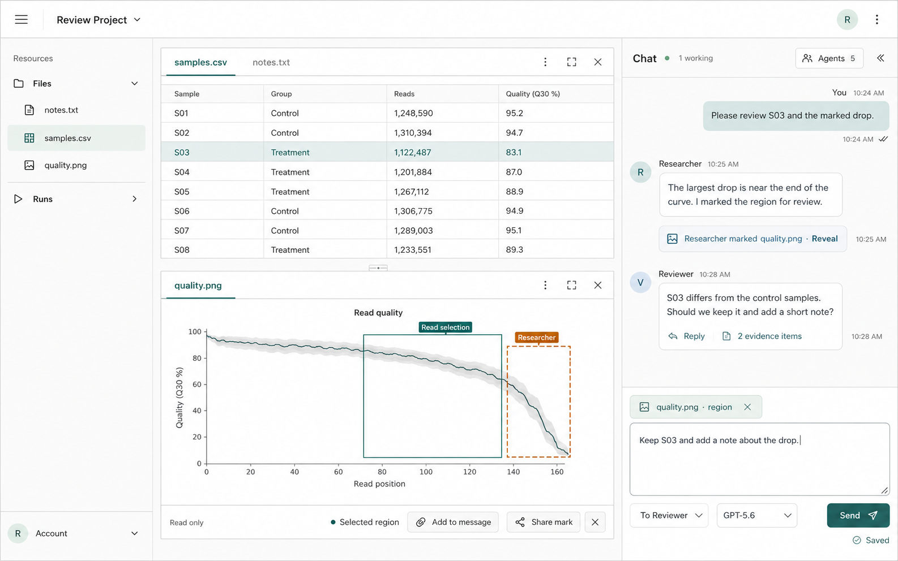
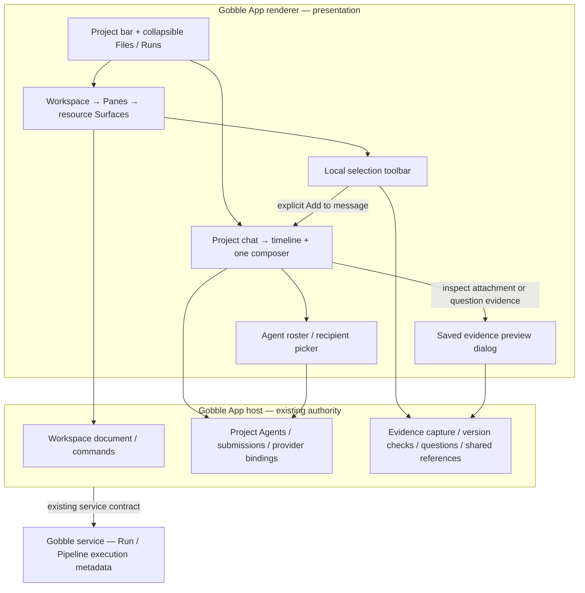

# Stage 5.6 — Focused workspace UI/UX review

Status: **A and 5.6a/b accepted; 5.6c implemented and verified, awaiting user acceptance.**
Current implementation: [5.6c integrated review and bounded corrections](05-6c-integrated-review.md).
See [5.6a implementation and evidence](05-6a-structure.md). The observations below
record the pre-change app; prototype measurements are still separate from production evidence.
Stage 6 engine qualification is on hold at the user's request (2026-09-07).

## Brief and decision boundary

The user identifies oversized/misaligned Agent cards, questions their placement
in navigation, and requests a smaller Project heading without redundant Shared
workspace labels. The primary content is the work product and the conversation.
Review the whole hierarchy and control placement through actual app scenarios,
then present improvement concepts before implementation.

Identity authority: the accepted Project-centric design and right-side single
composer in [stage 5](05-shared-context.md), the live 5.5 app and its current muted
teal/light-neutral tokens, constrained by this new user brief. This review does
not invent a new brand or project-wide DESIGN.md. Product UI remains English.

Evidence classes chosen before concept selection: (1) this user's direct product
feedback, (2) actual Electron interaction, screenshots and geometry, (3) source
inspection for mechanisms behind observed issues, (4) generated concepts for
hierarchy/visual discussion. Concept images are proposals, not implemented
behavior or representative-user task evidence. Only the user can confirm whether
the proposed work emphasis fits their actual workflow.

## User scenarios

| ID | Task | States and questions |
|---|---|---|
| S1 | Open and compare a note/table and image | Can two work products remain useful with chat visible? How much space do headings, toolbars and navigation consume? |
| S2 | Draft for one Agent, inspect another Agent, then return | Can the recipient, Agent status and settings be found near the conversation without losing the draft or changing the visible history? |
| S3 | Point to an image region and prepare evidence | Is selection distinct from attached evidence? Can the user inspect/remove it without losing access to the result or composer? No Send is needed for the review. |
| S4 | Read a long chat response and temporarily focus on outputs | Can auxiliary regions collapse and reopen without draft/reading-position loss? Which controls remain discoverable? |
| S5 | Work in a 1000 × 720 and 900 × 600 native window | Do Agent management, Project identity, results and chat remain accessible without crowded controls or hidden actions? |
| S6 | Use keyboard, hover and unhovered controls | Are focus, labels, action groups and long Agent names legible? Do primary actions rely on hover? |

## Reusable review checklist

Record results separately; do not turn this reusable checklist into a completion claim.

- [ ] Work products and messages have visual priority over headings and management.
- [ ] Project identity is present once at a useful scale.
- [ ] Resource navigation can yield space without hiding how to restore it.
- [ ] Agent management is adjacent to conversation and distinct from recipient selection.
- [ ] Selecting a recipient does not filter Project chat or switch work products.
- [ ] Long Agent names, status and settings controls fit their allocated space.
- [ ] Activity, errors and delivery status remain discoverable without dominating idle UI.
- [ ] Local selection, attached evidence and Agent pointer have distinct meanings.
- [ ] The one composer and explicit recipient remain available with a reply/preview open.
- [ ] Frequent actions are directly available; secondary actions have a discoverable menu.
- [ ] Primary buttons remain legible before hover and with keyboard focus.
- [ ] Collapsing/resizing restores content and focus without sending anything.
- [ ] Empty, disconnected, working and incompatible-Agent states have usable actions.
- [ ] Compact mode preserves a path to both results and the conversation.

## Observed findings

All dimensions below are CSS pixels, measured in the actual Electron app on
2026-09-07. The normal native window was 1280 × 840 (content 1280 × 808).
These are layout observations, not timed usability results.

| ID / priority | Observation and mechanism | Consequence | Proposed response |
|---|---|---|---|
| F1 / high | Five Agent rows are 56px high (280px total). Recipient buttons inherit centered justification; avatar x positions differ (19, 26, 33px). Three names/statuses require 117–136px in an 87px label area. | Management dominates navigation and genuinely looks misaligned. | Move membership/status/settings to the chat header's on-demand roster; left-align 46px rows. Keep explicit outgoing recipient next to Send. |
| F2 / high | Project heading is 103px high; the name is repeated in navigation. “Shared workspace” adds no action or state. Chat header is 72px high. | Permanent headings consume the area intended for results and messages. | One 44px Project bar; 44px Chat header. Remove redundant labels. |
| F3 / high | Opening one attached image preview grows composer to 510px and leaves 156px for messages. At 900 × 600 native bounds, only 68px remains. Send is visible, as fixed in 5.4. | The user can send but can barely read the discussion they are replying to. | Compact attachment chips; saved evidence preview in a temporary dialog; one composer. |
| F4 / high | Sidebar is 190px at 1280px width but grows to 232px at 1000px because media rules disagree. | A smaller window gives more width to navigation while hiding the central result in Chat mode. | Consistent explorer width when visible; collapse it on demand and use a drawer in compact mode. |
| F5 / medium | Active Pane has six equal-weight actions beside up to three tabs; Pane header is 46px high. | Filename and work product compete with management controls. | 36px header, More / Expand / Close directly available; labeled secondary actions in More. |
| F6 / medium | Local selection controls consume 69.5px below chat; sidebar footer consumes 147px. | Resource actions are separated from the resource; account/navigation metadata competes with discussion. | Resource-owned selection toolbar and compact Account entry. Keep selections from inactive views reachable. |
| F7 / medium | Repeated view-change activity and large pointer presentations occupy message space. | Routine layout changes interrupt discussion scanning. | Group consecutive benign layout events; concise authored mark with Reveal/details. Never hide failures, pending questions or new Agent messages in that group. |
| F8 / low | Empty secondary Pane reserves a large illustration while all views occupy the first Pane. | A split can appear to waste half the workspace. | Compact, actionable empty Pane: Open file / Move a view here; keep existing single/split choice. |

Source trace: former AgentsPanel (now [AgentMenu](../../../app/desktop/src/renderer/agents/AgentMenu.tsx))
and [agents styles](../../../app/desktop/src/renderer/styles/agents.css), generic
button centering in [tokens](../../../app/desktop/src/renderer/styles/tokens.css);
[WorkspaceApp](../../../app/desktop/src/renderer/workspace/WorkspaceApp.tsx) and
[shell styles](../../../app/desktop/src/renderer/styles/shell.css);
[ProjectChat](../../../app/desktop/src/renderer/chat/ProjectChat.tsx),
[ChatComposer](../../../app/desktop/src/renderer/chat/ChatComposer.tsx),
[AttachmentList](../../../app/desktop/src/renderer/evidence/AttachmentList.tsx),
SelectionChips (replaced in 5.6b by [SelectionToolbar](../../../app/desktop/src/renderer/selections/SelectionToolbar.tsx))
and [Pane](../../../app/desktop/src/renderer/workspace/Pane.tsx).

### Scenario results and counterevidence

| Scenario | Actual interaction / evidence | Result and limit |
|---|---|---|
| S1 | Opened note in primary and moved image to secondary; [two results](05-6-review/04-two-results.png). | Useful comparison works; heading, tools and selection strip still occupy substantial space. No performance benchmark. |
| S2 | Wrote a temporary draft for Evidence Reviewer, opened Question Reviewer's settings and returned; [settings](05-6-review/03-agent-settings.png). | Draft and recipient survived. Existing behavior must be preserved when Agent controls move. |
| S3 | Attached the existing local image selection, inspected it and removed the attachment; [preview](05-6-review/05-evidence-preview.png). | Selection remains distinct from evidence; preview severely compresses chat. No Send or new Agent turn. |
| S4 | Collapsed and restored chat; [focused results](05-6-review/09-focused-results.png). | Show chat receives focus after collapse. This run did not repeat the 5.5 streaming/reading-position regression. |
| S5 | 1000 × 720 and 900 × 600 native bounds; [compact chat](05-6-review/06-compact-chat.png), [compact workspace](05-6-review/07-compact-workspace.png), [small chat](05-6-review/08-small-chat.png). | Send remains visible; navigation and preview leave too little discussion space. |
| S6 | Real keyboard Tab / Shift+Tab and hover/unhover; [focus](05-6-review/10-keyboard-focus.png). | Agent settings has a visible 2px teal keyboard outline; default controls are legible. Earlier programmatic focus lacked an outline because it was not keyboard modality: not a product failure. |

Review started from the user's current layout: quality.png active in primary with
samples.csv and evidence-check-53.txt tabs; secondary empty; Files/Runs collapsed.
At finish, window bounds, layout, active surface, empty draft, Reviewer recipient,
empty attachments and local image selection matched the baseline. Submission
count remained 12. Ordinary layout activity was recorded by the app; no messages,
Agent configurations, credentials or provider conversations were changed.
The first settings-close attempt used an incorrect harness label; the actual
“Close Agent settings” control worked.

[Initial actual UI](05-6-review/01-workspace.png) and
[Agent list](05-6-review/02-agent-list.png) are actual product evidence.
The generated image below is separately labeled as a proposal.

## Two material concepts

| Decision | A — Agents on demand (recommended) | B — Visible participants |
|---|---|---|
| Membership/status visibility | Chat header shows working count and Agents button; roster opens on demand. | Persistent compact participant strip below Chat header; overflow opens full roster. |
| Message recipient | Explicit To Agent picker beside Send; roster also offers Message. | Participant chips offer direct To Agent actions; composer still names the recipient. |
| Advantage | Maximum quiet space for results and conversation; scales to longer lists. | Faster frequent recipient changes and continuous awareness of the visible Agents. |
| Cost / possible failure | One extra action to inspect all states; users may overlook Agent management. | About 43px permanently consumed in the sketch; names may overflow as team grows. |
| Best-fitting task | Long review discussions with occasional Agent changes. | Rapid back-and-forth with several Agents where status scanning is frequent. |

Both retain Files/Runs in a collapsible explorer, one Project identity, stacked
work Panes, one Project timeline, and one composer. Neither uses the Agent roster
as a timeline filter. The recommendation for A follows this user's stated
priority, not measured proof that everyone completes tasks faster.

[Interactive A/B sketch](05-6-review/prototype.html) uses illustrative data and
never sends a message or calls Gobble. The toggle changes the actual information
hierarchy, not just color or spacing.
[Generation prompt and provenance](05-6-review/concept-a.prompt.txt).

The image is a visual direction: exact dimensions, icons, model availability and
chart values are not specifications. For example, final copy should say
“Your selection”; generated “Read selection” is not adopted. Approved existing
tokens and real data stay authoritative. The interactive sketch and requirements
below define the proposed interaction.

## Concepts and ownership

- **Project** owns the identity and membership of the ongoing work. It contains
  Agents, resource references, Runs and shared discussion. Selecting a recipient
  never changes this scope.
- **Workspace** is the Project's arrangement of visible Surfaces and Panes. It is
  not a second container that needs a permanent heading.
- **Pane** is a placement region with tabs; a **Surface** is an opened resource
  presentation inside it. File/image/Run presentations remain typed views of
  resources. This review does not change Run or Pipeline ownership.
- **Agent roster** is a presentation of Project membership, status and settings.
  **Recipient picker** selects who receives the next message. They can share row
  rendering/status projection, but are distinct actions with clear headings.
- **Local selection** is the User's current reference to a part of a Surface.
  Its toolbar belongs to the resource. Selections in other/inactive Surfaces stay
  reachable through a compact selection overview, with source and Reveal.
- **Attachment** is captured evidence prepared for a message. The composer shows
  its chip. **Evidence preview** is temporary inspection of that saved snapshot,
  not a new live resource/Surface, not a new Pane, and not another input window.
  Question evidence is labeled as belonging to the question; inspection does not
  silently attach it to the draft.
- **Shared mark** is an authored Project pointer. It is displayed on its resource
  and represented in chat with author, source and Reveal. It is separate from a
  local selection and from sending source content.

The UI consumes existing snapshots/commands; a roster must not become a second
Agent store, and CSS layout must not gain provider or filesystem authority.
Gobble remains the execution owner. No new IPC, provider permissions, backend
protocol, storage version or engine capability is proposed by this review.

### Proposed code boundaries and API obligations

| Owner / location | Bounded responsibility | Constraint |
|---|---|---|
| workspace/WorkspaceApp and extracted ProjectBar / Explorer presentation | Project switcher, visible regions, compact navigation, focus restoration. | Keep useWorkspace as the existing command/state boundary. Do not duplicate persisted layout or re-create Agent hooks on each popup. |
| agents/AgentRoster and AgentRow; chat recipient control | Explicit Agent/status props and separate onMessage / onEdit / onAdd intents. | Keep useAgents and the host coordinator authoritative. Settings inspection never selects the recipient. Recipient changes retain existing pending/error/compatibility guards. |
| chat/ProjectChat and ChatComposer | Compact chat header, working summary and one composer. | Header props should be explicit; avoid expanding the current inherited composer-props dependency into a generic service bag. |
| workspace/Pane and PaneActions | Present direct and secondary existing workspace commands. | Move/pin/duplicate/refresh semantics and keyboard commands do not change. Keep labeled actions available without hover. |
| workspace selection presentation | Render active Surface selection controls plus access to other saved selections. | Use existing EvidenceRef and select/attach/share commands; no copied selection state inside chat. |
| evidence/AttachmentList and EvidencePreviewDialog | Compact chips and reusable read-only preview with source/version/error states. | Reuse EvidencePreview and current host checks. Escape closes; focus returns to invoking chip. Opening must not alter Pane placement or draft. |
| chat/timeline projection | Group only consecutive routine layout activities for rendering. | Preserve event IDs/order and expanded detail; do not change durable history or hide submissions, questions, errors or shared marks. |
| styles owned by corresponding feature | Shared size tokens, aligned rows, responsive layout. | Avoid global button changes to fix one feature. Derive compact breakpoint from actual minimum content widths. |

These are proposed extraction seams, not a request for one file per tiny control.
Keep existing domain contracts; add a component when it owns a coherent behavior,
not merely to reduce line counts.

## Prototype review and limits

Author-operated browser review used content 1280 × 808 and 900 × 600. The sketch
has an extra 38px/34px review strip, so its measured space includes that overhead.

| Check | Observed sketch result |
|---|---|
| A / desktop hierarchy | 44px Project bar, 44px chat header, 180px explorer, 36px Pane header. One attachment: composer 155px, timeline 527px. |
| Agent roster | Five aligned 46px rows, full current example names visible, settings adjacent. |
| Draft / recipient / reply | Settings inspection retained draft and recipient. B recipient switch retained draft; Reply targets Reviewer; switching away requires Cancel. |
| Preview recovery | Saved snapshot dialog opens; Escape closes and returns focus to preview chip; underlying timeline stays 527px. |
| A / compact Chat | At 900 × 600, composer 141px, timeline 337px, Send within viewport; document width 900px. Explorer opens without taking a permanent column. |
| B comparison | Participant strip visibly adds a permanent row and direct recipient actions. |
| Runtime | No captured browser console errors during the reviewed interactions. |

The old 900 × 600 measurement uses native outer bounds and the prototype uses
content bounds; these are not an exact before/after performance comparison.
Production acceptance will use matched inner dimensions and identical content.

The sketch exercises roster, recipient/reply state, A/B switch, attachment
inspection, navigation and chat toggles. Settings forms, actual sending/stopping,
file switching, Pane resizing/moving, shared marks, data loading and persistence
are explanatory placeholders. It does not establish production accessibility,
real-provider behavior, screen-reader usability, errors/reconnect handling or
human task completion. Chart values and Agent messages are illustrative.
Two sketch-only ambiguities found during review were corrected: question evidence
is no longer described as draft evidence; duplicate permanent Account/Chat
controls were removed. Responsive explorer aria-expanded now follows visibility.

## Implementation slices proposed for approval

1. **5.6a — Structure and Agent placement.** Implement the approved A or B shell,
   compact Project bar, Files/Runs collapse/drawer, Agent roster beside chat and
   explicit recipient control. Preserve settings, per-Agent Stop, incompatible
   bindings, empty/offline states and draft. Show actual screenshots and source
   boundary review; get the user's review before starting 5.6b.
2. **5.6b — Resource and discussion controls.** Contextual selection toolbar,
   inactive-selection overview, attachment chips and saved-preview dialog, Pane
   actions menu, compact pointer/layout activity and actionable empty Pane.
   Preserve source freshness, question/reply semantics and delivery failures.
   Review the concrete screen and receive approval before advancing.
3. **5.6c — Integrated visual regression.** Replay S1–S6 on the real app, including
   long names, 0/1/5/many Agents, pending/new-conversation states, long messages,
   multiple attachments, large text, errors, keyboard and resized windows.
   Update the accepted design and test evidence, then request stage 6 approval.

The user approved A and accepted 5.6a, then authorized 5.6b with a preference for comfortable operation rather than further shrinking. The next checkpoint is the implemented 5.6b result before 5.6c; stages 6 and 7 remain outside that approval.

### Acceptance and verification obligations

- At matched desktop content dimensions, one Project heading at roughly 44px;
  no permanent Shared workspace text; no left Agent cards. Explorer can collapse.
- Names/settings align; current long names remain readable in the roster. With
  larger text or longer names, rows may grow/wrap instead of hiding status/actions.
- Roster, recipient picker, settings and reply have distinct labels; recipient is
  visible before Send; a failed recipient/model change cannot send to the wrong Agent.
- With one attachment and no reply at 1280 × 808 content, target composer <=180px.
  At 900 × 600 content with one attachment, target >=250px usable timeline.
  Multiple attachments/reply/errors remain scrollable and do not obscure Send.
  These are scoped layout checks, not caps that clip growing text or failures.
- Preview preserves layout, draft, recipient and reading position; Escape restores
  focus. Loading, stale-source and refusal states remain visible with recovery.
- Keep 28–32px direct control targets with accessible labels and visible keyboard
  focus; retain current in-window shortcuts. Keep macOS titlebar/drag regions,
  minimum window size and native menu actions operational. No new tray, global
  shortcut or notification flow is needed for this scoped rearrangement.
- Use instant, predictable toggle/overlay changes for this pass; decorative motion
  is unwarranted. Any later transition must explain location/state and respect
  reduced-motion preferences.
- Run existing architecture/type/build checks and relevant Agent, workspace,
  evidence/question and timeline unit/contract tests. Add Electron regressions for
  changed user paths (recipient preservation, preview restoration, compact sizing,
  keyboard menus). Existing 5.5 completed suite is a baseline, not proof of 5.6.
- Verify before/after screenshots at identical content sizes and data; inspect
  keyboard and screen-reader labels. No screenshot pixel test should replace
  functional evidence or become an excuse for brittle style-only assertions.

## Design activity record

Exactly one disposition is recorded per activity. “Performed” describes the
bounded review work, not approval of the proposed UI or completion of development.
All records are owned by Codex for preparation and the project user for the
concept decision; each remains reopenable under the conditions below.

| Activity / named result | Disposition | Scope, inputs, method and evidence | Decision, limitations / counterevidence / failure | Dependency, route and reopen condition |
|---|---|---|---|---|
| Discovery — Discovery evidence reviewed | Performed for the current subject | Existing 5.5 layout and this user's 2026-09-07 feedback; S1–S6 native interaction, geometry and source inspection; findings F1–F8 and screenshots above. | Concrete layout causes identified. This is one local profile; working/disconnected and assistive-input paths were not all re-exercised. Draft/focus preservation is positive counterevidence. Review is open for those states. | Route missing states to 5.6a/c. Reopen when different content, platform or real usage contradicts priorities. |
| Framing — Design requirements accepted for the current subject | Performed for the current subject | User brief plus accepted Project/single-composer design; translate findings into ownership and acceptance obligations above. | User's work/discussion priority is established; solution dimensions remain proposed. Do not infer that all metadata should disappear. | Concept approval from user; implementation must preserve useful status/recovery. Reopen if a required task loses discoverability or space targets conflict with legibility. |
| Concepts — Concept decision recorded | Performed for the current subject | Compare on-demand roster A versus persistent participant strip B using hierarchy/action tradeoffs and user priority. A image and interactive A/B sketch above. | A accepted by the user after this review; 5.6a implementation linked above. B may be better for frequent multi-Agent switching; no measured human comparison yet. | Present both to user, route choice to 5.6a. Reopen if user cannot find roster/recipient or repeatedly needs full status visibility. |
| Prototyping — Prototype evidence reviewed | Performed for the current subject | Codex constructed and controlled an illustrative browser sketch at desktop/compact sizes; geometry, A/B, roster/settings, reply protection and Escape recovery observed above. | Sufficient to discuss hierarchy; production paths and assistive modalities remain unproven. Question/draft evidence ambiguity and duplicate controls were corrected. | Route placeholders and focus/error checks to implementation and 5.6c. Reopen on draft loss, unusable compact view, inaccessible menu or misleading evidence ownership. |
| Representative-user testing — Test evidence reviewed | Reused current evidence | Exact source: project user's message in this task, 2026-09-07; affected person is this user working in the existing Project UI with left Agent cards. Reports size/alignment/placement issues and work/chat priorities. | Reach is the old UI and that user's reported experience only; not observed completion or validation of the novel concepts. New-design acceptance remains open; author walkthrough is not representative-user proof. Falsifiable by the user's trial of A/B and subsequent actual-app review. | User can try roster, draft, Reply and preview in the sketch, then S1–S6 in 5.6c. Reopen on wrong-recipient ambiguity, navigation difficulty or a preference for continuous Agent status. |
| Collaboration — Design and implementation obligations reconciled for the current subject | Performed for the current subject | Same Codex design/implementation owner checked current files and contracts against proposed boundaries, APIs, preservation rules and three slices above. | Preliminary seams identified; no implementation yet proves reconciliation. Current props inheritance, shared selection placement and event projection need care. | Keep diagram/code in sync at each slice; existing tests and user screenshots are handback. Reopen if extraction duplicates authority, changes snapshot semantics or loses host guards. |
| Post-release — Post-release design review closed | Not applicable with exact reason | Subject is an unreleased, isolated review/prototype; no release or new deployed cohort exists and no production behavior changed in this turn. There is no post-release dataset to evaluate and no binding release-risk trigger in this review scope. | No post-release improvement/no-change or Maintenance decision is asserted. This cannot determine which unreleased concept the user approves; release-readiness remains out of scope. | On later release, the named owner (project maintainer with Codex) reviews the first two agreed review sessions, consumes task feedback, and records an explicit improvement/no-change plus Maintenance decision. Reopen if rollout occurs or any guardrail below fails. |

### Reopenable success measures

| Measure | Intended interpretation | Harmful interpretation and guardrail |
|---|---|---|
| More visible messages and useful result area | Less permanent management chrome. | Do not shrink text/targets or hide errors to meet a pixel target. Check enlarged text and keyboard access. |
| User can find Agent settings and identify recipient in a short task | Agent relocation remains discoverable. | Fewer clicks alone must not favor accidental recipient changes; preserve explicit To label and guards. |
| Preview closes to the same task state | Inspection does not interrupt drafting. | A tiny/unfinished preview is not a win; preserve source/version and refusal details. |
| Less routine activity in chat | Discussion is easier to follow. | Never suppress substantive events. Grouping is reversible and only applies to consecutive benign layout records. |

No background telemetry or automatic monitoring is added. The first two
post-implementation user review sessions provide a bounded initial follow-up;
the maintainer/user consumes the findings and chooses improvement or a dated
no-change outcome. Timing/engagement metrics alone cannot establish usability.

## Original review checkpoint and evidence integrity

This section records the review-only turn, before subsequent 5.6a implementation.

Only this review document, its local sketch/concept/evidence, and documentation
links were changed. Production source remains the completed 5.5 subject; no new
production test pass is claimed. Native app state was restored as recorded above.
The prior 5.5 155 unit/contract + 29 Electron result remains historical evidence.

End-of-review integrity check: the same 187 application/native-service files hash
to SHA-256 `40382307f0aadc424d149e8128b9b23f62ef88f11254774064e8f23a112ed9a5`
(sorted unique Git-tracked/untracked, non-ignored paths under app,
internal/appservice and cmd/gobble-service; hash path + NUL + bytes + NUL).
All local links in this review resolve; the governing session-plan directory
still contains its original four Markdown files.

**Resolved:** user approved A and 5.6a. Each subsequent slice returns with actual
app screenshots, code-boundary review and appropriate test results before moving
on. Stage 6 remains on hold.
