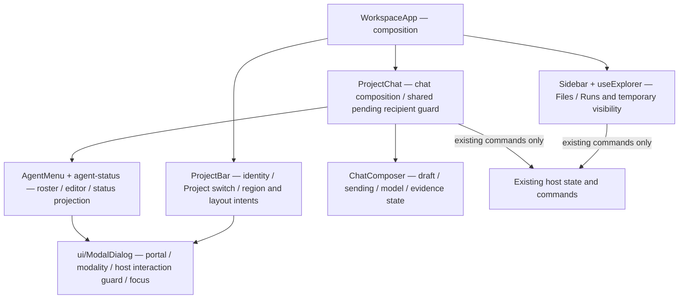
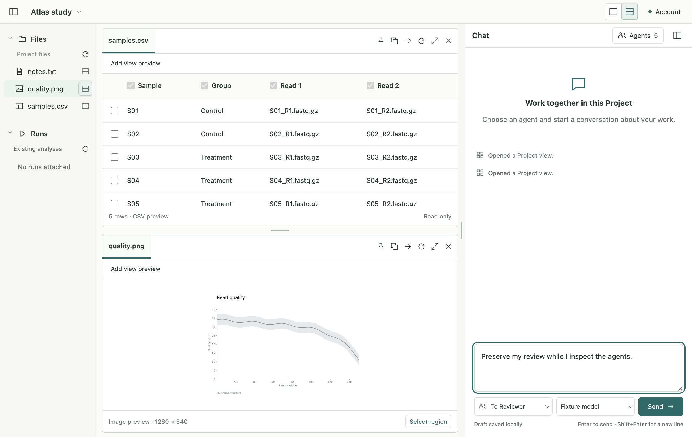
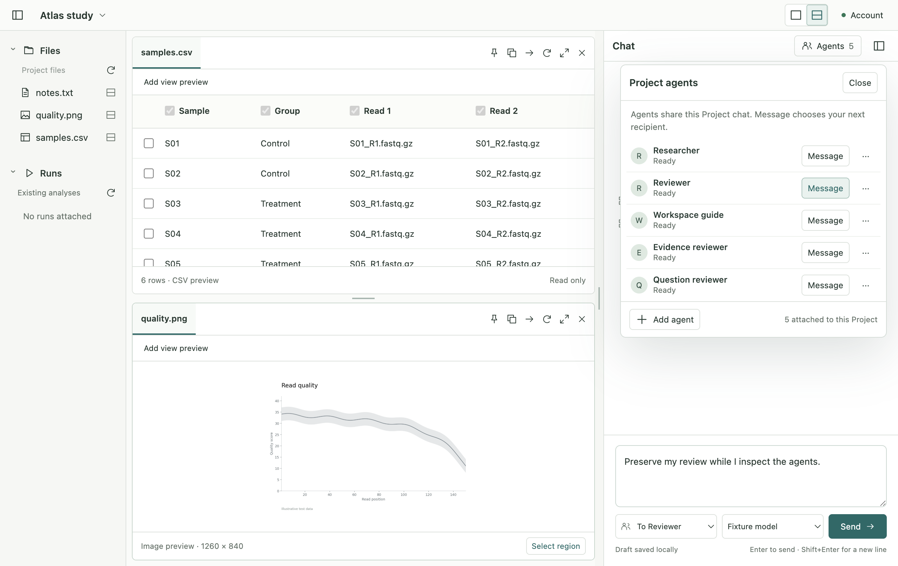

# Stage 5.6a — Compact shell and chat-side Agents

Status: A and 5.6a implementation authorized by the user's “네 진행해주세요”.
[Review and accepted concept](05-6-ui-ux-review.md). The user subsequently accepted 5.6a and authorized [5.6b](05-6b-communication.md); 5.6c and stage 6 remain subsequent checkpoints.

## Implementation model before source changes

Owner: Codex; decision authority: project user. Target: existing Electron renderer,
macOS arm64 development app, English UI. No provider, storage, IPC, engine or dependency change.

- ProjectBar owns one compact Project identity and switcher, visible-region controls and existing layout intents.
- Sidebar owns only Files/Runs. WorkspaceApp owns temporary explorer visibility; compact drawer overlays the mounted explorer and restores focus. Existing Workspace/Chat remain mounted while hidden.
- Account stays in the top bar so it is always reachable with explorer or chat collapsed. This replaces the redundant large footer and prevents reparenting/remounting its dialog.
- AgentMenu owns roster/editor visibility; agent-status is a pure projection of existing snapshots.
- ProjectChat explicitly composes header, timeline and composer and owns the shared pending recipient operation.
- ChatComposer retains draft, sending/model/evidence state and existing failure/compatibility guards.
- Shared ui/ModalDialog retains host interaction blocking and focus restoration; an optional style class provides compact roster presentation.

Skeleton/affected set: new ProjectBar, AgentMenu, agent-status; replace AgentsPanel,
narrow Sidebar; add useExplorer; move agents/Dialog to ui/ModalDialog; adapt WorkspaceApp, ProjectChat, ChatComposer, AccountPanel,
FilesBrowser root breadcrumb and Icon; feature CSS only. Tests: existing Electron
Agent/settings/project navigation callers, plus bounded preservation/compact/focus
regressions. No public contract/configuration changes.

Installed baseline: React 19.2.8, TypeScript 5.9.3, React types 19.2.18.
Renderer uses react-jsx, DOM/ES2022, Bundler resolution, strict typing and exact
optional properties. No React Compiler or Hooks lint is configured; use the existing
formatter, type/build, architecture, unit/contract and Electron checks.

Construction order: shell/roster/explicit props skeleton → shared recipient guard
and focus recovery → feature styles and migrated callers → type/build → focused
rendered tests → final regression suite and actual visual review. No client-render
performance claim or new expensive computation; render profiling is not triggered.

## Implemented result and boundaries

**5.6a implemented, verified and accepted by the user; 5.6b is authorized.**

Project identity is a single compact bar (44px in the normal reviewed layout),
with Project switching and Open folder grouped together. Account remains
reachable from the top bar when either navigation or chat is hidden.
The Files/Runs explorer is 180px and can collapse; compact windows use a
temporary explorer without reserving a navigation column.

The chat header is 44px and opens the Project Agent roster. Current five-name
examples align in 46px rows; long names and statuses wrap instead of forcing
ellipsis. Working/check-status projection stays descriptive; host state and
compatibility rules remain authoritative. Existing per-Agent Stop stays in
the timeline. Message selects an explicit recipient without sending or filtering
history; settings inspection never changes the recipient.

Self-review corrections: ProjectChat no longer inherits all ChatComposer props.
Its explicit API owns shared pending recipient state used by both selection
entry points; the composer retains its Send/model guards. Roster results arriving
after dismissal or editing do not close a later UI state. The common modal
lifecycle moved from agents/Dialog to ui/ModalDialog because Project switching
also needs it. Feature CSS is separated from generic dialog rules; deleted
sidebar-card/heading/footer rules were removed rather than layered over.

The explorer stays mounted while hidden, preserving local file navigation.
Its temporary overlay blocks shared-view observations while it obscures a
resource; Escape, leaving focus, or successful file opening dismisses it.
Opening a file from compact Chat returns to Workspace. No new durable store,
storage migration, runtime protocol, permission or dependency was introduced.

## Verification evidence

Environment: existing pinned Electron 44.2.0 / React 19.2.8 / TS 5.9.3,
macOS arm64 development build. User controls and native Electron host/service are
real; automated Agent scenarios use the existing controlled Codex protocol peer.

| Evidence | Result |
|---|---|
| Construction type check | Passed before full presentation detail. |
| Focused existing Agent/workspace regression | 13 passed. Stop separation, uncertain delivery recovery, IME input, timeline position, compact errors, Project isolation and restart remain covered. |
| New shell/roster scenarios | 2 passed. Five aligned rows, settings versus Message, no implicit send, recipient/draft retention, focus return, collapse and compact file-to-workspace recovery; disconnected empty roster explains sign-in. |
| Reply regression extension | Roster Message is disabled while replying, matching the existing recipient picker and host guard. |
| Final complete check | Formatter, TypeScript, schema generation check, 155 unit/contract tests across 13 files, build, and 31 Electron scenarios passed. Log: /tmp/gobble-56a-final-check.log. |
| Documentation formatting | app/README structure was updated after the final software check; formatter check passed again. No executable source changed afterward. |
| Visual review | Inspected desktop and roster screenshots from the final built app tests; compact screenshot captured at 900 × 600 content. |
| Existing signed-in profile | Normal quit and new built launch; refreshed the existing account connection to ready. Native controls expose the new title/navigation and five Agents, including “New conversation needed” for the old shared-tool binding. No new Agent turn was sent. |

[Compact Chat screenshot](05-6a-review/05-6a-compact.png).

No product test failures occurred in the recorded focused/full runs. Common modal
extraction followed the first full pass; the complete check was repeated on that
final executable tree (31 passed in 1.1 minutes). The native control tool sometimes
returned an older frame while accessibility state had already advanced; those
captures are not used as screenshot comparison evidence. Saved screenshot
evidence above comes from the final controlled Electron run.

The real review profile retained all 12 submissions, chat draft/recipient/attachments,
selection, active Pane, maximized Pane and layout. Window bounds are restored to
x=260, y=149, 1280 × 840. The app remains open and connected.
Account refresh used the existing sign-in; no credentials were read or copied.

Final documented subject: 191 application/native-service files;
SHA-256 `91d005c0d3ce0e4144fbad4e49a7c2a851fe162b1c8b840e95d21dedf680c903`.
The executable/test subject at the full check was
`2b49440dc83f69be2d7b438966104e2a607d35cb9936a3d2cd2ee452e042ef2c`;
the only subsequent app difference is README documentation.
Convention: sorted unique tracked/untracked non-ignored paths under app,
internal/appservice, cmd/gobble-service; path + NUL + bytes + NUL.

## Result review and next branch

5.6a completes the accepted structure/Agent-placement slice. The design owner
and implementation owner remain Codex, with the project user accepting the
observable result. This evidence supports the macOS development build only;
it is not installed-artifact, Windows/Linux, packaging or actual Docker execution
qualification, nor independent representative-user task evidence.

5.6b still owns local-selection placement, compact attachment chips and saved
snapshot preview, Pane More actions, routine activity grouping and empty Pane
presentation. No claim is made yet that expanded attachments leave more chat
space. Enlarged-text/many-Agent and broader integrated visual scenarios remain
in the subsequent 5.6c plan.

Reopen this slice if Agent management is hard to find, a selection is mistaken
for sending/filtering, a resize loses navigation/draft/focus, or useful status
becomes hidden. Next action after user review is the 5.6b sketch and bounded
implementation. Stage 6 and packaging remain on hold.

