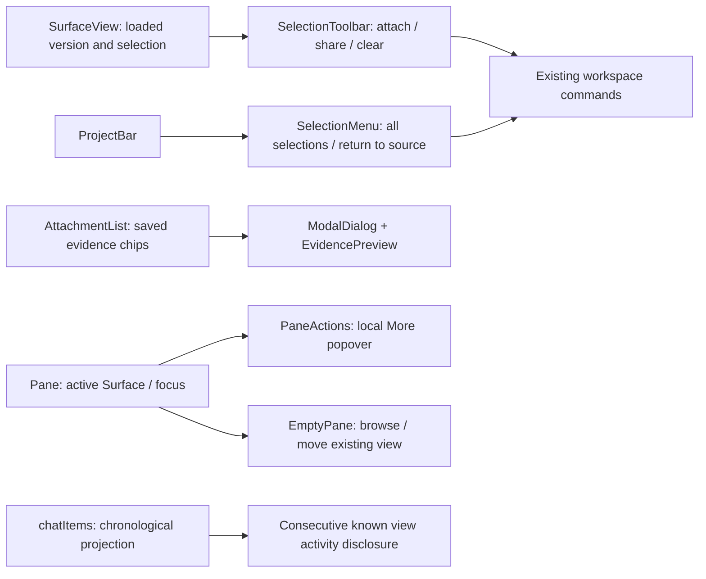

# Stage 5.6b — Comfortable communication around the work

Status: **implemented and verified; awaiting user review before 5.6c.** Implementation authorized by the user's approval of 5.6b, with an explicit preference for comfort over further compaction. Stage 5.6a is accepted. Stage 5.6c and stage 6 retain separate checkpoints.

## Accepted implementation model

Owner: Codex. Decision authority: project user. Subject: English Electron renderer, existing Project workspace. Identity: accepted Project-centric design → live 5.6a neutral/teal UI and tokens → current comfort brief. React 19.2.8, TypeScript 5.9.3, React types 19.2.18, strict Bundler/DOM renderer; no compiler or Hooks lint configuration change.

Evidence classes chosen before the bounded choice: author scenario walkthrough, actual Electron geometry/screenshots, keyboard interactions, deterministic renderer/host regression. These can verify layout and behavior, not representative-user task success.

Two action models: (A) all selections and expanded evidence stay in chat; fewer dismissals, but source actions compete with reading and composing. (B) source-local selection actions plus an overview; attachments open saved-content dialogs. B preserves reading/draft geometry and source ownership, with an explicit Close/Escape return cost. Choose B within the previously approved concept A shell. Keep 46px Pane headers, readable labels and at least 32px action targets. Native profile review found that a repeated helper sentence reduced the Plot area in stacked Panes; remove that permanent sentence, retain the explanation in Selections and the action description, and label pointer publication Share mark. Feedback appears after an action. No motion is needed to communicate these transitions.

Ownership and complete skeleton:
- SurfaceView retains loading, acknowledgment, data version and whole-preview attachment. SelectionToolbar takes one EvidenceRef, title, readiness and Command; only current loaded selections get actions. Each selection owns its pending action and feedback. No command sends a message.
- SelectionMenu takes selections/titles, Command and onReveal; it opens a guarded dialog for inactive/hidden selections. After ModalDialog completes close/focus cleanup, WorkspaceApp returns compact Chat to Workspace with a transient focus intent. Pane fulfills it only after PresentedViews has obtained the host receipt and mounted its tab; no guessed delay or DOM polling. Selection state remains host-owned.
- AttachmentList retains its existing controlled expanded ID API and mounts ModalDialog containing EvidencePreview. EvidencePreview owns saved-content load, retry, obsolete-result protection and image URL disposal; preview is neither a Surface nor live file access. Escape/Close returns to its attachment trigger.
- PaneActions owns only temporary popover state and interaction guard; Pane supplies the active Surface, other Pane, Command and refresh callback. Pin/move/duplicate/refresh use existing intents. Expand/Close remain direct. Native popover dismissal and keyboard focus return must be verified.
- EmptyPane receives available opposite-pane views and explicit browse/move callbacks. WorkspaceApp/useExplorer owns navigation visibility; no new navigation store.
- chatItems remains chronological; groupViewActivity creates a read-only projection of adjacent recognized routine view events. Unknown activity remains explicit. Messages, errors, questions and references interrupt grouping. First event ID anchors each group; source records are untouched.
- ReferenceEvent keeps author, source, selection and Reveal visible. Full note remains visible; secondary retraction is a disclosure.

Exact affected set: new selections/{SelectionToolbar,SelectionMenu}.tsx, workspace/{PaneActions,EmptyPane}.tsx, styles/selection.css and pane-actions.css; remove SelectionChips.tsx. Update workspace/{Pane,ResourceWorkspace,WorkspaceApp,ProjectBar,useExplorer}, workspace/views/SurfaceView, chat/{ProjectChat,ChatTimeline,timeline}, evidence/{AttachmentList,EvidencePreview}, shared-context/ReferenceEvent; styles/{shell,views,chat,evidence,shared-context}, ui/ModalDialog. Tests: chat-timeline.test.ts and Electron/{support,workspace,evidence,questions,shared-context,runtime}. Documentation: this stage, 05-6a-structure, 05-6-ui-ux-review, workspace README, app README and workspace-domain memory. No public contracts, dependencies, migrations, engine/provider/storage changes.

Build order: interfaces/ownership skeleton → attachments and source selection → Pane affordances → timeline presentation → focused type/build/tests → final exact-tree checks and visual review. This is not a rendering-performance change; no performance claim or profiling trigger.

## Scenarios and acceptance checklist

- [x] Select rows/text/image: source-local Add to message and Share selection have distinct outcomes and feedback.
- [x] Leave a selected tab or switch to compact Chat: Selections returns to the exact source without attaching or sending.
- [x] Inspect prepared/sent/question evidence: saved content stays readable; source revision, truncation, missing-content recovery and image dimensions remain truthful.
- [x] Close preview with Escape: return focus; preserve draft, recipient, attachments, Pane identity and timeline position.
- [x] Use More with keyboard and pointer: pin/move/duplicate/refresh remain discoverable; dismiss returns focus; direct expand/close stays available before hover.
- [x] Empty primary/secondary Pane: browse targets that Pane; moving an existing view preserves identity.
- [x] Routine activity groups only consecutive known events; messages/questions/errors/marks remain visible and in order.
- [x] Review actual Electron at desktop and compact/short sizes: no clipped actions; one composer; comfortable targets; source area and conversation remain useful.

Success means less interruption while inspecting and discussing work, not maximal density or more attachments/messages. Guardrails: no automatic send/share, no hidden failure/question, no false current-source proof. Reopen on clipping, failed focus recovery, accidental actions, or user difficulty finding selections. User review remains required before the next stage.

## Verification and result

Implemented source actions, saved-evidence dialogs, Pane More controls, actionable empty Panes and routine activity grouping. The selection toolbar and overview were separated into a feature directory because they own different interactions; no placeholder, duplicate state store or renderer-owned source authority remains.

Self-review: local vs attached vs shared evidence retains its existing host boundary. Preview loading/retry ignores obsolete requests and disposes image URLs. Menus hold/release the existing host interaction guard and recover focus; a dismissed selection overview ignores later UI callbacks. Known routine activity is recognized conservatively, with unknown activity and substantive events kept separate. Full notes remain visible. No native engine, packaged artifact, independent review or representative-user result is claimed.

Final verification: **156 unit/contract tests in 13 files and 32 Electron scenarios passed**, with formatting, TypeScript, schema consistency and build checks. The final log is [verification.txt](05-6b-review/verification.txt). The native Run UI scenario uses a substituted Docker CLI; this does not qualify an actual engine or packaged release.

Actual Electron screenshots from the final build, using controlled fixture data:
- [Workspace and draft attachments](05-6b-review/05-6b-workspace.png)
- [Chat and authored marks](05-6b-review/05-6b-chat-marks.png)
- [Saved-image preview](05-6b-review/05-6b-attachment-preview.png)
- [Compact saved-image preview](05-6b-review/05-6b-compact-preview.png)
- [Compact selection tools](05-6b-review/05-6b-compact-selection.png)

The screenshots were visually inspected. Preview content and Close fit at 900 × 650; the one-attachment 900 × 600 scenario keeps at least 250px of timeline and Send within the viewport. Pane headers remain 46px, direct/actions targets at least 32px. Images, tables, text, reply evidence, missing-content Retry, source-change refusal, IME, drafts, reading anchors and recipient guards retain tested behavior. This is author/automated evidence, not representative-user completion.

The user's review profile was normally quit and relaunched with the final development build. Native control review confirmed source-local actions, the Selections dialog and labeled Pane controls. Final scoped persistence comparison exactly matches the pre-review snapshot for selections, draft/attachments/recipient, surfaces/titles, layout, active/maximized Pane and 12 submissions. Window bounds remain 1280 × 840 at the original position. No new Agent message was sent.

Verified subject: 196 sorted unique Git-tracked/untracked non-ignored files under app, internal/appservice and cmd/gobble-service. SHA-256 (path + NUL + bytes + NUL): `4aa30ae6c55c212550cafbd7509ec4e770eaca2c7c97f337bb3480fd77e702cb`. This includes the formatted app README and final source/tests. Subsequent result-document changes are outside that subject. The governing session-plan directory retains exactly four Markdown files.

**Review checkpoint resolved:** the user accepted 5.6b and approved [5.6c integrated visual regression](05-6c-integrated-review.md). Stage 6 real-runtime qualification and stage 7 packaging remain outside this approval.

## Design activity results for this slice

Owner for every row: Codex, with the project user as decision consumer/authority.
Subject: this 2026-09-07 development-renderer slice on macOS arm64; affected person:
the project user discussing files/results with Agents. Records remain bounded to the
specified evidence and reopen conditions; they do not claim independent evaluation.

| Activity / result | Disposition | Inputs, method, evidence and location | Decision, limits, counterevidence / failure | Dependency, route and reopen condition |
| --- | --- | --- | --- | --- |
| Discovery — evidence reviewed | Reused current evidence | Exact source: 2026-09-07 5.5 native S1–S6 review, F3/F6/F7/F8 in [review](05-6-ui-ux-review.md), plus accepted 5.6a shell screenshots. Those source-action/inline-preview owners were unchanged by 5.6a. | Reach: clutter and reading-area interference in that profile. Does not prove this arrangement suits all users. Current comfort brief constrains further compaction. | Current screenshots can falsify prior layout findings; route differing content/size conditions to 5.6c. Reopen on clipped content or missing controls. |
| Framing — requirements accepted | Performed for the current subject | User's current approval/comfort brief, source ownership inspection and checklist above. Sketch shown before implementation. | Keep readable targets, single composer, explicit attach vs share and source/snapshot identity. More clicks to inspect is a known tradeoff. | User reviews this result before 5.6c. Reopen if inspection feels disconnected or actions become difficult to discover. |
| Concepts — decision recorded | Performed for the current subject | Inline chat action/preview model versus source actions plus saved-content overlay, compared above; existing approved shell remains the identity source. | Choose overlay with clear Close/Escape return; no claim of measured human preference or universal task improvement. Reversible renderer-only change. | Route pointer/keyboard mechanics to actual tests; reopen if users repeatedly need side-by-side attachment inspection. |
| Prototyping — evidence reviewed | Performed for the current subject | Preimplementation Mermaid ownership/action sketch, followed by built Electron walkthrough screenshots and tests listed below. | Actual controls test reachability and preservation. Generated 5.6 concept remains proposal provenance only. No production or representative-user proof. | Keep screenshot/source correspondence; route remaining full-profile/high-density review to 5.6c. Reopen on behavior diverging from the sketch. |
| Representative-user testing — evidence reviewed | Reused current evidence | Exact source: project user's 2026-09-07 messages on existing UI, acceptance of 5.6a and current comfort preference in this task. Context: personal Project workspace. | Reach is that user's reported experience and direction only. Acceptance of this implemented slice and observed task completion remain open. Author tests do not fill that gap. | User trials this result; broader S1–S6 trial belongs to 5.6c. Reopen on wrong selection/recipient, accidental share or failure to return to a draft. |
| Collaboration — obligations reconciled | Performed for the current subject | Component/API map above; split selection toolbar and overview by responsibility; existing host capabilities; tests and final tree trace below. | No new durable store, IPC or engine owner. Two initial test failures were outdated UI selectors; fixed those callers. Keyboard exit/focus return and missing-content retry were additionally verified. A later focus failure exposed asynchronous Pane presentation, corrected by the after-close/Pane-owned focus intent; the targeted scenario passed three consecutive runs. | Exact final source/build/test evidence is required below. Route any changed source after verification back to applicable checks; reopen on ownership duplication or stale-source proof changes. |
| Post-release — review closed | Not applicable with exact reason | This is an unreleased development app with no deployed cohort, telemetry or rollout in scope. No binding release-risk trigger applies to the local presentation change. | No post-release improvement/no-change or Maintenance decision is asserted. A missing production dataset cannot determine this local user review. | On a later authorized release, maintainer and Codex review the first two agreed user-review sessions, record an explicit improvement/no-change and Maintenance decision. Reopen if rollout occurs or the guardrails above fail. |

### Final review corrections

The smallest-window check initially measured 240px of timeline with one attachment,
below the earlier 250px target. Removing duplicated attachment margins recovered
space without changing text or button sizes; the same 900 × 600 check now passes.
Selection actions use visible-name-matching accessible labels (Add to message from…,
Share mark from…). Removed the obsolete chat selection CSS.

A naive animation-frame focus handoff sometimes ran before PresentedViews finished
its host acknowledgment. The final design uses ModalDialog.onAfterClose and a
transient WorkspaceApp focus intent completed by Pane after it mounts. This leaves
presentation authority with the host and focus ownership with the rendered Pane.
No public protocol or time-based retry was added.
