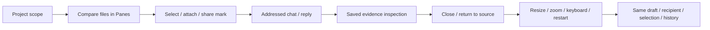
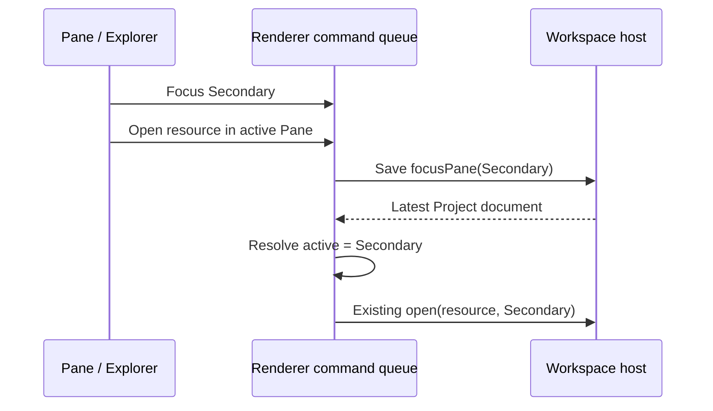

# Stage 5.6c — Integrated UI/UX review

Status: 5.6b accepted; 5.6c implemented and verified, awaiting user acceptance. Stage 6 and packaging retain separate approval checkpoints.

## Review request and ownership

Request ID: UX-56C-20260907-01. Requester/consumer: Codex as desktop-interface owner and project user as decision authority. Exchange: renderer/interface claim → Electron Testing evidence. Predecessor: [5.6b](05-6b-communication.md), 196-file subject `4aa30ae6c55c212550cafbd7509ec4e770eaca2c7c97f337bb3480fd77e702cb`, 156 unit/contract and 32 Electron cases. Identity: accepted Project-centric design → current neutral/teal UI → user's comfort-over-density brief. All app text remains English.

Target: macOS arm64 desktop development build; Electron 44.2.0, React 19.2.8, TypeScript 5.9.3, Playwright 1.63.0. Existing real display, sandboxed bridge and native Go service. Automation uses temporary profiles, actual files and the existing deterministic Codex fixture. Native user-profile walkthrough uses the existing signed-in profile and existing history; temporary drafts/attachments/layout are restored. No new real-provider turn is required.

Evidence classes chosen before decisions: actual UI actions, geometry, screenshots, keyboard focus, saved-state comparisons and regression results. Source/type/build evidence stays separate from behavior. These are author/automated results, not representative-user task completion or a release decision.



Testing owns cases, fixtures and interpretation. Any product defect routes to React Development under the user's already-authorized fix scope; it is not corrected by weakening a test. Main/Go retain files, evidence, presentation, runtime and persistence authority. Renderer owns layout, overlays and focus intents only. No dependency, protocol, model, permission or release expansion is planned.

## Scenario and case matrix (before execution)

| ID | Scenario / start and trigger | Pass observation / lowest sufficient layer | Risks and environment |
| --- | --- | --- | --- |
| C1 | 0 → 1 → 5 → 12 Agents, long names; open roster/settings, keyboard navigation, 150% zoom | Full names/statuses and actions remain reachable, no horizontal clipping, draft/recipient unchanged unless explicitly chosen; real Electron | Overflow, mistaken recipient; fixture account and names |
| C2 | Two live materials, long filename, multiple attachments and long draft; inspect at desktop and compact/short windows with 100–150% zoom | Single composer, usable Send and Close, all toolbar controls within viewport, saved previews preserve reading/draft/source identity; real Electron | Overflow, overlay/focus races; fixture files/evidence |
| C3 | Pending question with evidence and unsent reply; inspect another attachment, unsupported model/error, cancel and restart | Reply target and recipient guards truthful, visible recovery, preserved long draft and attachments, no unintended send; real Electron plus existing host regressions | Hidden failures or lost reply; existing controlled question fixture |
| C4 | Existing signed-in Project: compare, inspect selection/evidence, roster/settings, collapse/restore, keyboard/zoom | Native author walkthrough; original saved state and 12 submissions retained | Do not expose credentials or send new messages; user profile |
| C5 | Existing security, sources, shared marks, model/recipient failures, IME/streaming/reading anchors, native lifecycle, schema/build tests | Rerun appropriate existing suite on exact final subject | This proves only the recorded target; Docker CLI remains substituted |

Actual-engine qualification, packaging/signing/updates and Windows/Linux execution are `unsupported target or claim` for this scoped UI request. Screen-reader task completion and representative-user trials are `not run`: author AX-label inspection cannot substitute for those sessions. No new OS integration or adversarial trust surface is introduced.

New test skeleton: desktop/tests/electron/ux-review.spec.ts (shared fixture setup; named C1/C2/C3 cases; existing launch/preview/roster helpers). Initial source affected set is empty; document exact owner/files before any discovered correction. Governing session-plan directory keeps its existing four files. Record first failures and reruns below.

## Findings, decisions and corrections

Initial run: C1 and C3 passed their behavior assertions; C2 reached restart but looked for a hidden Chat control before selecting Chat. Classify that final C2 assertion as `test defect`: compact restart correctly starts in Workspace; add the missing user navigation. Preserve the [first log](05-6c-review/first-run/test-log.txt).

Visual review exposed two additional observations. Long Project names can overflow their shrinking h1 container and overlap region controls at 150% zoom (`product defect`, shell presentation owner). The current button max-width is relative to the viewport instead of the width its flex parent actually receives. Compare a two-row Project bar against keeping one row with a correctly bounded title. Choose bounded title to retain established navigation and comfortable controls; the full name remains in the Project picker and accessible title.

React Development correction request RD-56C-01: accepted user scope is the approved integrated review/fixes; exact product affected set is styles/shell.css. Keep the Project h1 bounded by the existing viewport/400px preference, and constrain its button to the h1 width. No state, effect, host, schema or performance claim changes. Test C1/C2 direct title/action separation before accepting the correction.

Native zoom also makes Playwright page screenshots capture only part of the physical Electron surface. Classify these initial enlarged images as `test defect` for complete-window visual evidence, not product clipping or final evidence. Electron Testing adds support.captureWindow using BrowserWindow.capturePage for complete native-window screenshots. Exact test affected set: support.ts and new ux-review.spec.ts. Existing product rendering/zoom settings are unchanged.

Compare keeping the accepted layout versus a local correction for each reproduced defect. Prefer no change when controls remain readable/reachable; do not pursue density targets by shrinking content or hiding failures.

RD-56C-01 evidence: the title's right edge was 262 CSS px while adjacent controls began at 195.49 CSS px (66.51px overlap), reproduced in C1 and C2. [Failure record](05-6c-review/first-run/title-overlap.txt). The renderer correction changes two width constraints in shell.css; all type and host ownership remain unchanged. Focused cases and their final-suite dependents must run against the rebuilt replacement subject.

React Development correction request RD-56C-02: C3's full native capture shows that a question and its evidence can scroll the model refusal out of sight while Send remains disabled. This is a `product defect` in composer presentation, not a model-policy change. Compare putting errors first in the same scroll area against keeping one current blocking explanation next to the draft. Choose the latter: it remains visible even after evidence inspection. Render question-image incompatibility first, then toolset renewal, then attachment preparation failure; recovery exposes the next applicable explanation. The existing preparation retry stays with its error. Routine readiness and evidence remain scrollable. Exact product affected set: ChatComposer.tsx and styles/evidence.css. No extra state, effect, public API, provider call or persistence owner is added. C3 now checks the full explanation and recovery action inside the viewport both during and after cancelling a reply, while preserving draft and submission count.

```text
Question and attachment context  ↕ scroll
Current blocking explanation / retry when applicable
Message draft
Recipient · Model · Send
```

RD-56C-02 was reproduced by a viewport assertion: the explanation's visible ratio was 0 ([failure log](05-6c-review/first-run/hidden-error.txt), [complete before image](05-6c-review/first-run/hidden-error.png)). After the product correction, the reply explanation passed. A subsequent exact-text lookup failed because the attachment status also contains its retry button. Classify that lookup as `test defect`; selecting the status by its contained explanation checks the whole visible status and retry action without changing product behavior. [Intermediate log](05-6c-review/first-run/error-locator.txt). The corrected C3 passed.

### RD-56C-03 — Ordered navigation intent

The first complete suite passed 34/35 Electron cases and all 156 unit/contract cases. The existing empty-Pane scenario opened quality.png in Primary after Browse files in Secondary. [Full first-suite log](05-6c-review/first-run/full-suite.txt), [failure state](05-6c-review/first-run/browse-target.md). Classify as `product defect`: the explorer captures the rendered activePane before queued focusPane persistence completes. Fast input can carry that stale target into a later open command.

Compare temporary duplicate target state in the renderer against resolving navigation intent in its existing command queue. Choose the latter. File/Run navigation emits `active` or `other`; useWorkspace resolves the exact Pane from the latest Project document after preceding commands/drafts complete. Main still receives the existing explicit-Pane action and owns persistence. No protocol change, additional state store or renderer source authority. The existing Project identity check cancels queued work if its Project no longer matches.

React Development affected set: useWorkspace.ts, WorkspaceApp.tsx, Sidebar.tsx, navigation/{types.ts,FilesBrowser.tsx,RunsBrowser.tsx}. Sidebar no longer receives the full WorkspaceDocument merely to pick a destination. Testing strengthens the existing failing case with back-to-back Browse/file events to reproduce this ordering without waiting for the save; adds no arbitrary sleep. Validate the explicit other-pane path through existing file/Run regressions too.



RD-56C-03 reproduction: immediate Browse/file events reproduced the same Primary-vs-Secondary error ([deterministic failure log](05-6c-review/first-run/browse-repro.txt)). A TypeScript-only test helper error (Locator may be SVG) was corrected with an HTMLButtonElement guard; it is a `test defect`, not an app behavior change. The strengthened workspace case then passed on the rebuilt correction. Full-suite replacement is required because the shared queue implementation changed.

## Code and ownership review

| Owner / affected file | Decision and API boundary | Evidence / limitation |
| --- | --- | --- |
| Shell layout — shell.css | The title's flex allocation bounds the Project switcher. Preserve the existing one-row bar, text sizes and controls. | C1/C2 test real title/action separation at native zoom. No navigation/persistence change. |
| Composer presentation — ChatComposer.tsx, evidence.css | Existing reply/tool/evidence state chooses one visible explanation outside scrolling context. Retry calls the existing preparation operation. | C3 checks reply then attachment refusal, model recovery, one submission and retained draft. canSend and all host checks are unchanged. |
| Electron scenarios — ux-review.spec.ts | Dedicated cross-feature UX journeys use the existing launch, Project, Agent and preview helpers. Temporary files/profile and deterministic provider fixture have one setup/teardown owner. | Three behavioral cases; no new product test-only hook or dependencies. |
| Test capture — support.ts | Electron main-process capture owns complete-window PNGs. This helper belongs only to test support. | Avoids cropped zoom evidence from page screenshot coordinates; no renderer capability exposure. |
| Explorer intent — useWorkspace.ts, WorkspaceApp.tsx, Sidebar.tsx, navigation files | Resolve active/other destination after preceding queued commands. Existing command API and host protocol keep explicit Pane actions. Remove full document/targetPane props from navigation. | Deterministic immediate Browse/file events fail before correction and pass after; Project scope and revision retry policy remain unchanged. |
| Existing features — unchanged | Project persists work, Pane positions Surface tabs, Surface identifies a live resource view, and saved evidence previews read immutable snapshots in a temporary dialog. User and Agent actions still share the host-owned contract. | No duplicate composer, evidence authority, selection store or runtime abstraction. Source review is author review, not independent review. |

## Design activity results

Owner: Codex; decision consumer and approval authority: the project user. Subject: the exact development build recorded below, used to compare results and discuss them with Agents on macOS arm64. Each disposition is bounded by its evidence; failures reopen the named owner.

| Activity / result | Disposition | Inputs, method and decision | Limits, dependency and reopen route |
| --- | --- | --- | --- |
| Discovery — evidence reviewed | Performed for the current subject | Accepted 5.6a/b plus C1–C3 stress scenarios, real-window geometry and captures. Found title overlap, hidden model refusal and a rapid-navigation target race. | One target and controlled fixtures. Native profile is an additional author check. Reopen shell/composer owner on other content clipping. |
| Framing — requirements accepted | Performed for the current subject | User's comfort brief, Project-centered design and the pre-run diagram/case matrix above. Preserve readable controls, work/chat priority, visible recovery and saved state. | This stage approval authorizes bounded corrections, not stage 6 or release. Reopen if navigation or recovery requires hidden knowledge. |
| Concepts — decision recorded | Performed for the current subject | Two-row bar vs bounded single-row title; scroll-first errors vs one persistent explanation; transient target state vs queued destination intent. Choose bounded title, persistent explanation and queued intent. | Title truncation requires the picker for the full name; more context must scroll at 150%. User can reject those tradeoffs at this checkpoint. |
| Prototyping — evidence reviewed | Performed for the current subject | Pre-edit sketches followed by actual development-renderer trials at 100/125/150% native zoom. Review correct full-window captures and functional recovery. | The native build is the interactive prototype for this bounded refinement. Does not prove packaged lifecycle or general assistive usability. Reopen on failed focus, missed failure, or lost draft. |
| Representative-user testing — evidence reviewed | Reused current evidence | Exact source: the project user's preceding feedback in this task on large Agent cards, hierarchy and the now-compact layout; latest brief prioritizes comfort. | Evidence supports the problem and priority only. No observed representative-user completion of 5.6c is claimed. Current-result acceptance awaits the user's app review. |
| Collaboration — obligations reconciled | Performed for the current subject | Testing handed three reproduced defects to React Development via RD-56C-01/02/03. Source review above ties corrections and regression evidence to existing owners. | Same author performs both roles; no independent reviewer. Reopen if correction alters a contract, send policy, persistence or host authority. |
| Post-release — review closed | Not applicable with exact reason | This is an unreleased development build; no deployment or post-release dataset exists. | No release-readiness or Maintenance decision is inferred. After a future release, maintainer/user should review the first two agreed usage sessions and explicitly choose improvement or no change. No background monitoring added. |

## Evidence and final checkpoint

Final `npm run check` passed: formatting, strict TypeScript for all processes/tests, schema consistency, **156 unit/contract tests in 13 files**, production build and **35 actual Electron scenarios**. [Final verification log](05-6c-review/verification.txt). The first full run's 34/35 result is retained above; the corrected replacement suite is the completion evidence. Go service is real; provider requests and Docker CLI in automation remain controlled substitutes.

| Case | Final classification | Observed result |
| --- | --- | --- |
| C1 | passed | 0/1/5/12 Agents, long name visible in settings, keyboard Message returns to draft, explicit recipient preserved, title/actions separate at 150%. |
| C2 | passed | Four long-named attachments, two resources, long draft, full preview/Close and Send at 1280×808/100%, 900×600/125%, 900×650/150% native content size/zoom. Closing preview returns focus; saved draft/attachments/surfaces match after restart. |
| C3 | passed | Question image refusal remains visible beside the draft; after Cancel reply the attachment refusal and retry remain visible. Compatible model restores Send; no unintended second submission. |
| C4 | passed | Native signed-in profile: note/Plot tabs, saved image evidence, settings cancellation, selection return, collapse/restore, native zoom and normal quit/relaunch preserve the task. See detailed scope below. |
| C5 | passed | Existing feature/security/model/evidence/IME/timeline/lifecycle cases plus deterministic rapid Browse → file ordering case, on the final subject. |
| Real Gobble/Docker and packaged release | unsupported target or claim | Requires stage 6 and stage 7 approval and their separate evidence. |
| Screen-reader task completion / representative-user completion | not run | Native AX labels and author screenshots do not prove these outcomes. |

Actual Electron screenshots from the final suite, using clearly illustrative fixture data:

- [Desktop comparison with four attachments](05-6c-review/C2-workspace-1.png)
- [Twelve Agents and a long name at 150%](05-6c-review/C1-roster-large-text.png)
- [Long-named saved preview at 150%](05-6c-review/C2-preview-1.5.png)
- [Question/model refusal kept visible at 150%](05-6c-review/C3-reply-errors-large-text.png)
- [Attachment refusal and recovery at 150%](05-6c-review/C3-attachment-error-large-text.png)

Full-window captures were visually reviewed alongside geometry/focus assertions. Text and buttons were not reduced further. At enlarged text, context scrolls while the draft, controls and current refusal remain accessible. Long Project/file labels use existing truncation; picker, label/title and full preview expose their full names. Work panes retain direct maximize for detailed reading. These are scoped development-build findings, not measured user task success.

The existing user profile was normally quit and relaunched with the final build. Native control confirmed five Agents, cancel-safe settings, the historical 504×504 image crop with saved-at-send identity, Escape focus recovery, note/Plot switching, Selections returning to the selected Plot tab, chat collapse/restore and enlarged Chat/roster access. A temporary unsent draft survived normal quit/relaunch with Reviewer still selected. That draft was then cleared and the saved account connection refreshed through the UI. No new real-provider message was sent.

[Native restoration record](05-6c-review/native-restoration.json): the final persisted selections, chat (including empty draft, attachments and recipient), titles, references/reveal state, surfaces, active/maximized Pane and layout match the pre-review snapshot; submission count remains 12. Window bounds remain 1280×840 at (260,149). Ordinary workspace revisions/activity may advance during these explicit review actions; no history rewrite or full-profile byte equality is claimed. The final app remains open for the user's review.

Verified subject: **197** sorted unique Git-tracked/untracked non-ignored files under app, internal/appservice and cmd/gobble-service. SHA-256 (path + NUL + bytes + NUL): `b786f7d9a51168b6911782f5e6b18ebbb34c529bf859781b9e16d84a4088c79d`. Includes final source/tests and app README. The same hash was rechecked after the native walkthrough. Subsequent stage-result documentation is outside this subject. Governing session-plan remains exactly four Markdown files.

**Review checkpoint:** the user reviews this 5.6c result before stage 6 real Gobble/Docker integration qualification. Stage 7 packaging follows its own later approval. No commit, publication or release is part of this slice.

