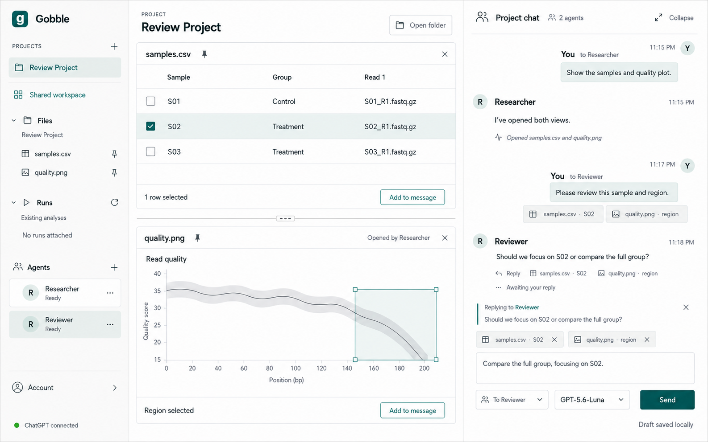
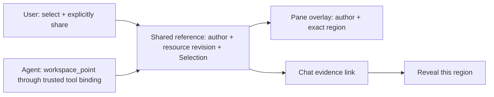
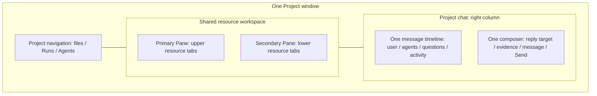
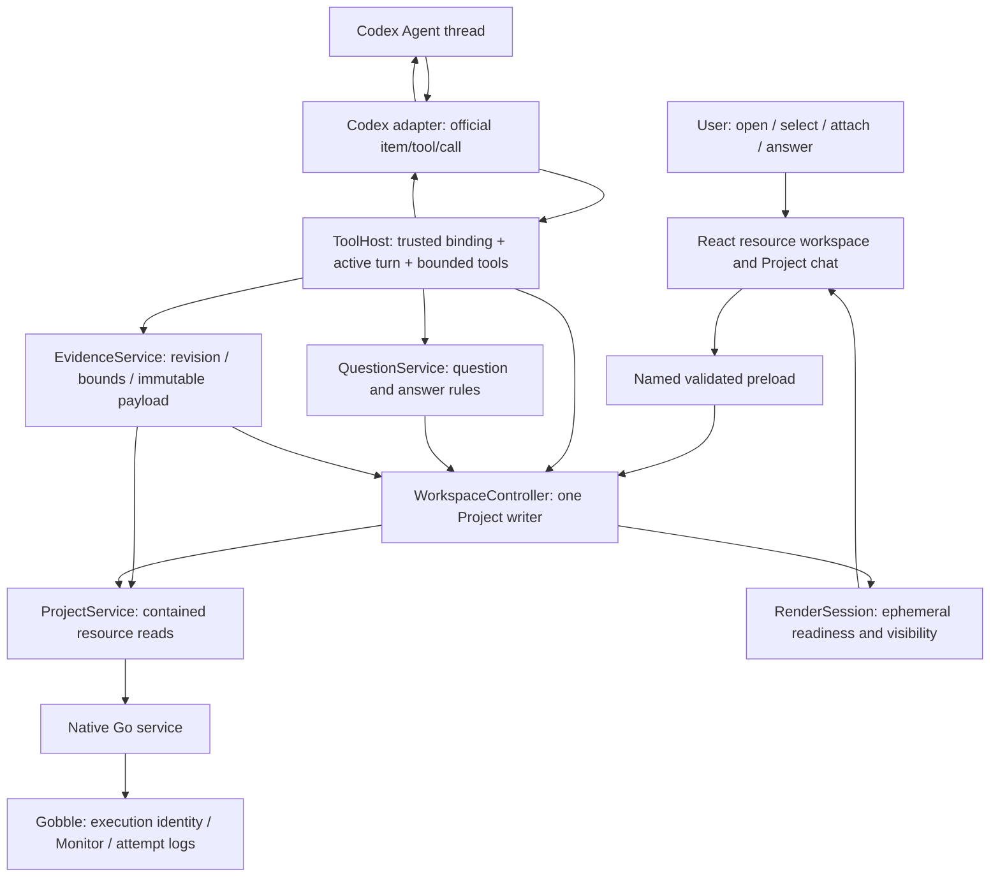
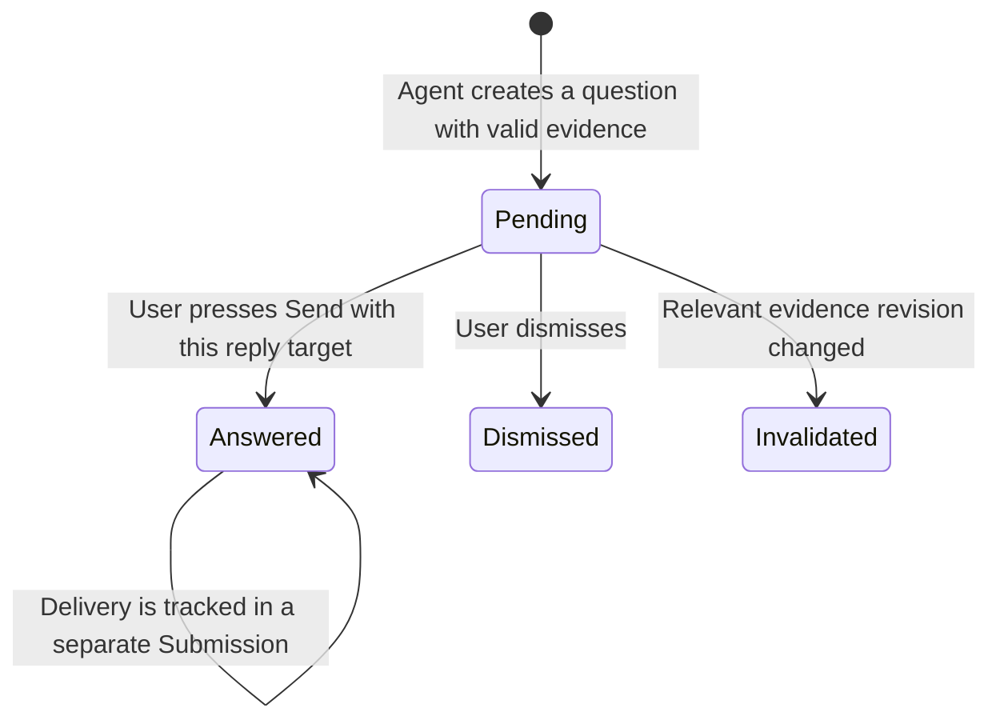

# Stage 5 — Shared views, addressed evidence and questions

Status: **design approved 2026-09-07; slices 5.1–5.4 accepted; 5.5 implemented and verified, awaiting review before stage 6**.
The user accepted the revised layout and asked for communication tools usable by both User and Agent.
Implementation follows the review checkpoints in [slice 5.1](05-1-chat-foundation.md).
Revised 2026-09-07: user requested vertically stacked central Panes and a right-side
chat with one shared composer, removing the separate question/answer interface.
The user accepted stage 4 and authorized this design step on 2026-09-06.
This proposal includes a deliberate provider-transport change for review.
It does not silently amend the previously accepted MCP candidate.

Starting source: 136 app/native-service files, SHA-256
`0fec48e8c57d298c36ea1d90c5316cdbac2c756cc4f92674d5ce0fa636dfee81`,
using the [stage 4](04-agents.md) digest convention. Existing engine source,
analysis inputs, synced references and provider credentials remain outside the
edit set. All app-owned UI, errors, labels and menus remain English.

## Intended result

In one Project, Researcher can open a CSV and an image in the shared workspace.
The user selects a row and an image region, adds those specific items to a
message for Reviewer, reviews the evidence inside the composer and sends it. An agent can
observe a supported view and create a question linked to that evidence. The
user answers explicitly. Restart restores the layout, immutable evidence
references and question state without replaying tools, messages or answers.

This revised Imagegen concept replaces the earlier bottom-docked discussion
and separate question card. The first implemented layout slice is recorded in [5.1](05-1-chat-foundation.md); the tool/evidence/question interactions in this image remain the Stage 5 target.
This sketch is not proof of implemented tools or live model behavior. The chart and question are illustrative.
[Generation and refinement prompts](05-shared-context-chat-v2.prompt.txt) record
its provenance. The behavior definitions below govern implementation where a
pixel-level detail in the generated concept is ambiguous.

## Bidirectional pointing — accepted user direction, 2026-09-07

The shared communication primitive is a revision-bound selection target, reusing
`EvidenceRef` + `Selection` rather than creating unrelated User and Agent coordinate formats.
A **shared reference** adds author, identity, creation time and a message/evidence link.
A local editable selection, an explicit shared reference, and immutable sent evidence remain distinct.
Agent-created references never replace the user's current local selection or draft.

- Text: ordered nonempty UTF-16 line/column range in the exact preview, validated by the host.
- Table: stable row keys and column IDs, never screen pixel positions or display indices.
- Plot image: normalized rectangular coordinates in the original image with dimensions/hash.
  A PNG region does not claim to identify a data point or axis interval. A future interactive
  Plot Surface requires a separate selector with series/point IDs and axis/data revisions.
- User and Agent share the same host validation/materialization path. Author and Project scope
  come from the trusted user bridge or active provider binding, never model-supplied identity.
- `workspace_point` will create a bounded, author-labelled shared reference; it may return a
  background/not-revealed result. It cannot steal focus or silently open a different Project.
  `Reveal this region` is an explicit user navigation action; it checks the original revision.
- Replacing local selection or resizing a Pane cannot move a shared reference. Multiple authors'
  references remain separate. Author names and outlines identify them without relying on color alone.
- On source changes, show the original immutable evidence (when sent) and mark the live overlay stale;
  do not remap a coordinate to new content or claim that the current Pane shows the original.
- Sharing/pointing is not a message broadcast to all peers. Only the addressed Agent receives
  evidence on explicit Send or through its authorized tool result. Shared Project UI is visible
  to the user; private provider history is never disclosed to another Agent.

Implementation order: 5.1 layout, storage and this shared contract definition; 5.2 scoped tools,
shared-reference creation/reveal and overlays; 5.3 immutable addressed attachments; 5.4 inline
questions/replies; 5.5 live qualification. Each completed slice is reviewed before the next. Tool and evidence
implementation is deliberately not claimed by the 5.1 screen change.

## Concepts that must remain separate

| Concept | Definition and owner |
|---|---|
| Project | Durable collaboration scope: registered resources, peer attachments, Runs, shared layout, discussion and questions. The native service owns root/resource registration; the app owns collaboration and presentation state. It is useful without an Agent or Run. |
| App workspace | The Project's opened Surfaces, Pane placement and local interaction state. WorkspaceController owns its durable state. It is distinct from a Gobble execution workspace. |
| Resource | An existing Project file or a registered Run/attempt-log reference. The native service resolves it and enforces containment. A source file preview does not execute it. |
| Surface | A Project-owned presentation of a Resource as text, table, image, Run or log. Its ID outlives the agent that opened it. Switching recipient does not switch Surfaces. |
| Pane / Window | A Pane contains Surface tabs. One native Window hosts up to two central Panes, stacked top/bottom by default, and a right-side Project chat. Chat is an app region, not a Resource Surface or a third Pane. |
| Local selection | The user's current row/text/image selection. It is editable and remains local. Selecting or changing it does not attach, send or grant broader access. |
| Draft attachment | An explicit copy of a selected EvidenceRef added to the current message. Later selection changes do not silently change that attachment. The composer exposes its recipient, removal and preview. |
| Prepared evidence | Main's immutable, bounded payload assembled from validated resource bytes and exact revision/selection. It is bound to one recipient, draft intent and selected model capability before delivery. |
| Observation | A receipt for bounded content from a supported, ready Surface, with resource revision, time, scope, truncation and recipient. Opening a Surface, reading a source and observing a rendered preview are different outcomes. |
| Question | An Agent chat message with durable Decision metadata and immutable evidence references. It appears in the same message timeline, with no separate Questions route, panel or answer form. |
| Reply target / answer / delivery | A reply target identifies the question and requesting Agent in the single composer. Unsent text is a draft, not an answer. Explicit Send records the answer and its addressed submission; provider delivery still has its own outcome. |
| App dialog | Transient settings/account UI; not a Resource, Surface, Pane, observation target or Agent-created question window. |

A Pipeline remains authored analysis logic, with validation/Plan and execution
metadata owned by Gobble. This stage does not add a Pipeline catalog, execute a
Pipeline to inspect it, or synthesize a graph from its name. Pipeline source can
be a text Resource. A Run Surface continues to show the compatible engine's
observed Pipeline/Run facts through the existing service projection. A future
saved Plan/graph presenter needs its own versioned Resource contract.

## Revised layout and conversation model

The normal desktop arrangement is navigation on the left, resource Panes stacked
in the middle, and a full-height chat on the right. There is no bottom discussion
dock, separate Questions view, option-selection form or second answer input.
User messages align right with a subtle teal background; agent messages align
left with name/avatar. Each user message names its actual recipient. Chat remains
Project-owned and can contain both peers' public messages; choosing an Agent
changes the outgoing recipient, not the visible files or Project scope.

A question is presented as an ordinary Agent message. Evidence links and a small
`Awaiting your reply` status stay with that message. `Reply` quotes it above the
one composer; suggested options are readable text, not another form. Activity
such as opening views is a compact inline event. Detailed provenance can expand
inside that event instead of opening a new panel. Auto-scroll follows new content
only while the user is at the end; otherwise expose `New messages` without moving
their reading position. Streaming and Stop remain specific to the named agent.

### Layout state and adaptation

- Primary and secondary are stable Pane IDs, now displayed upper/lower. A
  horizontal divider resizes their heights using vertical pointer movement and
  Up/Down keys. A separate vertical divider resizes chat width using horizontal
  movement and Left/Right keys. Focus indicators and separator labels identify
  which region is being resized.
- WorkspaceDocument v2 records the stacked orientation explicitly and the upper
  Pane height fraction. Discussion height becomes chat width; the proposed
  default width is 420 CSS pixels, adjustable between 360 and 560 where space
  permits. Agent calls can request Pane placement, but cannot resize/collapse chat
  or change the user's reply target.
- Migrating a v1 split maps primary to upper and secondary to lower, retaining
  tabs, active references, pins, selections, recipient and message draft. Its old
  width fraction is not reused as a height preference: start with equal Pane
  heights and preserve the original document in the migration backup. A prior
  collapsed chat stays collapsed. New v2 dimensions restore as user preferences.
- When three useful columns no longer fit, first compact navigation. If there is
  still insufficient room, use a `Workspace` / `Chat` switch within the same
  window, preserving both states and the single composer. Do not move chat back
  into a second bottom interface. If stacked Panes lack sufficient height, show
  the active Pane with a control to reveal the other, retaining both tab sets.
- Visible-lease tracking uses the actual available resource region, active
  compact-mode view and hidden/maximized Panes. A full-width Chat mode hides
  resource views and invalidates their live observation leases. Collapsing chat
  never discards a draft, answers a question or stops an Agent.

## Interaction sketch

1. **Open together.** User asks Researcher in the right chat to show two
   registered resources. Main commits their placement in the upper/lower Panes
   and reports whether they are revealed or opened as background tabs. A compact
   chat event names the agent. Keyboard focus stays in the composer.
2. **Point locally.** Select a row, text range or image region. `Add to message`
   copies that selection into the single composer. For no selection, use the
   explicit `Add view preview` action. Selection alone remains local.
3. **Review in place.** The composer shows the recipient, model and removable
   evidence chips. Expanding a chip reveals its bounded text/table or exact crop
   inline in the same composer. No preview modal or additional input appears.
   Allow one expanded preview at a time, with bounded height, so the message field
   remains reachable. Historical evidence similarly expands inside its chat
   message and never pretends changed source data is the original.
4. **Send normally.** One `Send` control handles both ordinary messages and
   question replies. Main revalidates recipient/model/evidence and persists the
   addressed submission before provider input. Successful consumption clears only
   the matching text, attachments and reply target. Pane selection can remain.
5. **Reply in the same composer.** The user's explicit `Reply` action sets a
   visible quote and the requesting Agent as recipient, preserving typed draft
   text and attachments. It invalidates any payload prepared for another
   recipient before new preparation. The quote is plain read-only text, visually
   distinct from the single editable message field. No arriving question changes
   the active recipient or draft by itself. While a reply target is set, recipient
   choice is bound to that Agent; `Cancel reply` removes the link and preserves
   text/attachments, after which the user may choose another recipient.
6. **Preserve explicit intent.** Unsent reply text is automatically saved as a
   draft while the question remains pending. Busy/offline/capacity-blocked sends
   preserve this draft; there is no separate Save answer action. Pressing Send
   creates the recorded answer and normal follow-up submission together. A plain
   message without a reply target is not guessed to answer an outstanding
   question. Multiple pending questions are distinguished by their quoted target.
   A secondary message action can dismiss a question without sending any answer.

Message actions, evidence expansion/removal, Reply/Cancel reply, Agent/model
selection, Send and Stop require keyboard support and visible default states.
Enter sends and Shift+Enter inserts a newline; IME composition must never submit.
Changing model invalidates prepared evidence as before. Chat uses one composer
state owner across resize, collapse, compact mode and re-rendering.

## Ownership and communication

Gobble retains execution authority. The Go service retains file containment and
runtime-qualified reads. The App owns view placement, evidence sharing and
questions. The Codex adapter owns provider protocol translation. None receives
another owner's private state file as an integration API.

### Proposed transport decision — explicit change from the MCP candidate

For the first local Codex implementation, use the official App Server's
**dynamic tool calls** as the transport for a provider-neutral `WorkspaceTools`
port. Do not add a loopback MCP bridge process in this stage. Keep the logical
`workspace_*` and read-only `gobble_*` tool families.

The exact 0.153.4 generated protocol has `threadId`, `turnId` and `callId` outside
model-supplied arguments on `DynamicToolCallParams`, and text/image result items
on `DynamicToolCallResponse`. These give the existing single account owner a
concrete callback route. This is a proposed architecture choice, not a claim that
MCP lacks adequate isolation or that live dynamic image delivery is already proved.

Main derives authority from its established provider binding, login session,
active submission, tool-set revision and invocation envelope. Tool arguments
contain Resource/Surface/evidence references, never an authoritative Project or
Agent identity. Every lookup checks membership in the derived scope. Stale
turns, revoked access, unknown tool names and fabricated or foreign references
fail before reading or changing state. Authorization is checked again after
asynchronous preparation and before committing or returning content.

The future MCP adapter must invoke the same typed application port using an
authenticated host-issued session bound to a Project/attachment, with its own
transport/lifecycle tests. It must not trust model-supplied actor IDs. Remote
clients will additionally need service authentication and an explicit visible
workspace host identity. No speculative adapter, HTTP server, alternate account
process or generic event bus is added now. Adoption requires approval of this
proposal; there is no silent transport fallback if a capability test fails.

### Existing attachments and tool versions

The inspected protocol exposes dynamicTools at thread creation, but not in the
supported ThreadResumeParams. Do not assume an old stage 4 thread can be upgraded
in place. Existing attachments stay `Messages only`. Agent settings offers
`Project files and shared views` with an explicit
`Enable shared views and start new conversation` action and explains that earlier
messages remain in Project history. Access is scoped to this registered Project;
no source writes, shell, browser, code execution or new analysis is enabled.

Persist the tool-set version with the new provider binding. Resume only a
compatible version. A mismatched version requires an explicit conversation
transition; it does not rewrite the provider's private history. New attachments
show the same access choice. Disabling access blocks new and queued tool calls
immediately and interrupts owned in-flight work; it does not delete prior evidence.
The precise disable/interrupt outcome is part of the implementation tests.

## Narrow application APIs

These approved tool contracts are implemented through slices 5.2–5.4. Their
slice records specify exact enabled behavior and qualification. Application
methods receive a host-derived Caller separately.

| Tool | Input and result boundary |
|---|---|
| `workspace_list` | Current Project Surface/layout summaries and availability, without private discussions, account data or file bytes. |
| `workspace_resources` | One bounded directory listing through ProjectService; opaque resource IDs, names, kinds and truncation. No arbitrary absolute paths. |
| `workspace_open` | One or two validated ResourceRefs with preferred Pane placement. One atomic layout transaction; returns each Surface ID and opened/revealed/protected outcome. |
| `workspace_arrange` | One/two Pane arrangement for permitted Surfaces, subject to user-protection rules and layout revision. Cannot close or unpin user work. |
| `workspace_observe` | A Surface ID and optional bounded selection. Requires a current visible/render-ready view and returns an observation/evidence receipt plus the actual bounded data or image content. |
| `workspace_release` | Only the caller's unpinned, unclaimed temporary Surfaces. Never deletes resources; user-owned or protected views return a named refusal. |
| `workspace_question` | Question text, up to six options or free text, and one to sixteen already-authorized evidence IDs. Persists an idempotent question and returns its ID immediately. It does not hold a live provider request open while a person considers an answer. |
| `gobble_runs` / `gobble_run` / `gobble_logs` | Existing read-only service queries and their freshness/unavailable results. Monitor status remains an engine fact. No Start, Stop, Resume or Plan execution. |

`workspace_question` intentionally completes after durable creation. The model
can finish its turn while the Project keeps the question pending. A later answer
uses the normal addressed submission pipeline, not an indefinitely held JSON-RPC
response. The agent cannot call an answer/approve API on behalf of the user.

Main owns bounded callback admission, cancellation and exactly one RPC response.
Use a stable invocation identity including binding/tool version, thread, turn and
call IDs plus a canonical argument digest. A matching retry returns a saved
receipt; different arguments under the same identity fail. At most 32 distinct
tool invocations per submission and four in-flight callbacks across the app;
refuse excess work explicitly. Reads and render waits have deadlines. Never hold
the Project write queue while waiting for rendering or provider I/O: reserve,
release the queue, prepare/wait, then revalidate and commit.

## Layout and observation rules

An Agent cannot unpin, replace or release a user-protected view, change another
Project's visible layout, reopen an explicitly dismissed resource during the
same submission, or create a native window. Opening alongside uses the free Pane
when available. When a target is protected, create a background tab and return
`opened_not_revealed`, or return `protected_view` if no permitted placement exists.
A later observe call cannot treat that background tab as visible. Keep a focused
selection editor protected until its edit ends. Normal user interaction can claim
an agent-opened Surface, after which agent release cannot close it.

Do not bring the app to the foreground or focus an input from an agent callback.
A hidden Project may serve an authorized structured resource query. UI writes
and observation require that Project to be current. A closed, minimized or
unavailable window, an active modal, or a nonvisible Surface returns an explicit
unavailable result. Rendered observation requires a foreground window; when the app is behind
another app, return `ui_unavailable` rather than claiming a currently seen view.
Structured resource reads may still succeed. Native-window visibility, foreground
state and renderer readiness must all be covered; a stale saved acknowledgment is never enough.

For this stage an observation describes a **loaded preview**, not an exact
screenshot of desktop pixels. Text/table/Run/log output states its content scope,
source bounds and truncation. An image observation returns a crop or scaled image
from the exact revision loaded into the supported ImageView, with original and
returned dimensions. Source-image content is distinct from UI chrome. No full
window/desktop capture is exposed, and account/settings/dialog content is never
an observation target. If exact viewport pixels or interactive reports are needed
later, that is a separate capture contract rather than a stronger claim about
this result. Real image bytes reaching the model and informing its response must
be proved in the capability gate below.

The broker checks the ready lease and source revision, builds bounded content,
then rechecks the Project, Surface, generation and access. Navigation, refresh,
resize that hides a Pane, modal opening, disconnect or turn termination during
that interval invalidates the operation. Refresh of source content is explicit;
it cannot silently substitute a newer revision for selected evidence.

## Evidence, persistence and questions

### Preparation and retention

Main assembles a PreparedContext for one draft intent, recipient and model.
The renderer sends evidence references rather than trusted text/base64 content.
The native service verifies containment at use time. Main verifies the revision,
row keys and columns, ordered UTF-16 text positions or normalized image rectangle.
A stale/missing item blocks the entire submission and leaves the draft intact.
No attachment is silently dropped, broadened to a whole file or replaced with
fresh content. The inline composer preview exposes exactly what will be sent.

Proposed delivery limits: 16 evidence items, at most two images, 64 KiB combined
UTF-8 text, 1 MiB encoded image bytes per image, longest returned image edge 1536
pixels, and at most 4 MiB for an encoded tool/turn payload inside the existing
8 MiB transport frame. Output declares crop, scale and truncation. A text-only or
unknown-capability model cannot send image attachments; retain the draft and
show `This model cannot receive images. Choose a supported model.` The model
catalog's input modalities are projected by the adapter rather than guessed from
model names. Actual image support still needs a live test.

Prepared payloads are immutable app-owned evidence assets addressed by content
hash. Store bytes before the Project document references them. Then commit the
manifest, addressed submission and matching draft consumption through the single
Project writer before any provider input. A crash before the document commit can
leave an unreferenced owned asset, but cannot produce a committed message pointing
to bytes that were never stored. No provider submission is automatically replayed.
There is a 64 MiB evidence quota per Project, with explicit refusal before input
rather than silent eviction. No automatic deletion of historical evidence in
this slice. Missing/corrupt assets show `Evidence unavailable`; current source
bytes never reconstruct historical evidence without an explicit new attachment.
Freshness is a point-in-time validation immediately before acceptance; the
delivered immutable revision remains identified even if the file changes afterward.

### Version and writer boundary

Use WorkspaceDocument v2 for the new semantics: stacked Pane geometry and chat
width, one draft with optional reply target and attachments, evidence manifests,
question metadata/answer delivery links, tool-version bindings and compact tool
receipts. Question records carry an originating submission reference. A chat
read model projects messages, questions and activity in host-assigned display
order; ordering metadata references existing records rather than copying bodies
into a second writable chat store. Keep the v1 reader as a compatibility adapter. Migrated
v1 selections remain local and existing attachments remain messages-only. A v1
profile is preserved in a migration backup before its first v2 durable write.
Unknown future/corrupt documents keep the existing preservation/recovery behavior.
The named IPC envelope and native Go service protocol remain separately versioned;
no Go service or engine data migration is implied by a Project document upgrade.

Binary/image data stays out of the 4 MiB Project JSON document. EvidenceStorage
owns immutable blobs; WorkspaceController remains the only manifest and Project
aggregate writer. Prepared tokens, active callbacks and render observations are
session state, not durable claims that a window was seen after restart. Persist
compact receipt metadata and only bounded evidence referenced by messages or
questions. The existing 40-submission limit still applies; capacity checks must
include new metadata before accepting a send.

### Question and answer transitions

A question captures evidence already delivered to or observed by its requesting
agent; it cannot refer to fabricated or another agent's private evidence. A
question's links and options are immutable once recorded. Answer validation
checks relevant source revisions; changes invalidate a pending question with a
visible reason. Ordinary unrelated Run progress is not a dependency. An already
answered question remains historical; a later source change blocks sending that
old answer as current context but never rewrites the recorded answer.

The single composer's `Send` action includes an optional reply-to-question
reference. When present, Main validates that the question is pending, the
recipient is its requesting Agent and evidence is current, then records the
answer and normal follow-up submission in one Project transaction after
admission/preparation. This operation uses the same delivery coordinator as an
ordinary message. The UI has no separate answer form, answer submission button,
Questions route or questions database.

Draft autosave does not change question state. If provider acknowledgment is
lost after Send, the recorded answer remains and delivery becomes uncertain;
Check status uses the existing submission ID. If a dependency changes before
Send, the draft remains available while the invalidated question requires a new
question. No delayed automatic send occurs when an agent becomes available.
Dismissal, stop, logout, window close and restart do not select an option or turn
a draft into an answer. A reply whose question became answered/dismissed/stale
cannot be silently sent as a second answer; preserve its draft with a clear
explanation and allow the user to cancel the reply link.

## Source organization and API responsibilities

| Location | Responsibility and boundary |
|---|---|
| `contracts/src/context.ts`, new `evidence.ts`, `workspace-tools.ts`, existing `decision.ts` | Closed portable schemas and semantic association rules. Keep evidence payloads/receipts separate from layout and provider DTOs. |
| `contracts/src/workspace-document.ts` and a focused v1 compatibility module | v2 aggregate validation and explicit old-document conversion; fixtures cover original profiles. |
| `main/workspace/controller.ts`, `model.ts`, `render-session.ts` | Sole Project writer; stacked geometry/chat-width/reply-draft state, pure layout transitions and visibility leases. Delegate evidence/question rules rather than growing one controller with all feature logic. |
| `main/shared-context/tool-host.ts` | Authenticated call admission, bounded dispatch, idempotency, cancellation and result association. No renderer or provider wire types in its application API. |
| `main/shared-context/evidence.ts`, `evidence-storage.ts` | Revision/bounds validation, content materialization and immutable blob lifecycle. Image encoding/cropping stays in a small platform adapter. |
| `main/shared-context/questions.ts` | Pure question/answer rules and narrow Project-store operations, including explicit delivery references. No separate writable questions database. |
| `main/codex/transport.ts`, provider adapter and focused generated protocol | Validated server request/response handling, dynamic tools, modality projection and typed text/image input. Unknown provider requests still fail closed. |
| `main/collaboration/coordinator.ts` and application ports | Reuse addressed-send, capacity, durable acceptance, cancellation and uncertainty. Accept prepared evidence/answer intent through a narrow port, without layout code. |
| `preload`, named main IPC and `renderer/chat/`, `renderer/context/` | Named preparation/send calls; one ChatTimeline and ChatComposer, with inline QuestionMessage and evidence previews. The question renderer owns no text input or submit flow. Move existing discussion presentation into these owners instead of maintaining competing chat implementations. |

These are responsibility boundaries, not a requirement to create a class for
every row. Stateful lifetime/I/O owners can be classes; projections, validation
and transitions remain functions. Create a module when its owner or reason to
change differs. Only the composition root imports both the Codex implementation
and the application tool host. No provider DTO or Electron import enters contracts
or renderer. Read-only Go methods are reused without adding an engine command API.

## Sequential implementation and verification gates

| Order | Bounded work | Evidence required before moving on |
|---|---|---|
| 5.0 | Approve this concept and the explicit transport/storage decisions | User review of the sketch, concepts and boundaries. No source implementation before this checkpoint. |
| 5.1 | Revised layout, single-composer structure and foundation contracts | Stacked Pane and chat-width geometry, v1 preservation, opposite-axis resize controls, one draft owner, compact-mode visibility and readable keyboard controls. Define the chat projection and reply association without creating a second chat store. |
| 5.2 | Pinned capability probe, tool host and shared-view rules | Exact dynamic-tool/image/modality types and real text/image round-trip before exposing tools; resume/tool-version proof. Two peer callers, common selection target validation, author-separated pointing/reveal and overlays, foreign scope rejection, atomic stacked open, protected/dismissed/claimed views, nonblocking render wait and late/unavailable results. Failure returns to the transport decision without a silent fallback. |
| 5.3 | Immutable evidence and addressed attachments | Exact rows/ranges/crops, current revision checks, prepared recipient binding, image-capability rejection, quotas, v1 migration, missing assets and failure-before-send. |
| 5.4 | Question messages and replies through the same composer | No second input/submit flow; explicit reply target and recipient binding; draft preservation on new questions, busy/offline sends and cancellation; immutable evidence, stale/duplicate answers and restart without replay. |
| 5.5 | UI integration and review | Actual Electron stacked-view/chat journey; interleaved peer messages, scroll retention, one composer across collapse/resize/compact mode, Enter/Shift+Enter/IME, default-hover-focus states; live image interpretation, design review and updated evidence. Present stage 5 results for approval before stage 6. |

Within the approved stage, complete these dependent steps in order and report
results. A materially changed design returns for review. No automatic expansion
into stage 6 engine qualification, detached windows, arbitrary report execution,
source editing, analysis control, broadcasting or package delivery is included.

## Current evidence and limits

- Read current app contracts, single-writer controller, render leases, selection
  validation, peer conversation adapter and accepted design records.
- Regenerated schemas from the locally pinned official Codex 0.153.4 binary in
  an isolated temporary home. Inspected DynamicToolSpec/FunctionSpec,
  DynamicToolCallParams/Response/OutputContentItem, ThreadStartParams,
  ThreadResumeParams, UserInput and Model. This establishes protocol shapes,
  not successful tool execution or image consumption.
- Official [App Server documentation](https://learn.chatgpt.com/docs/app-server),
  read 2026-09-06, documents the experimental dynamic-tool flow and persistence
  on thread resume. The exact generated ThreadResumeParams remains the source
  of truth for fields this pinned integration may send.
- The original design pass changed no application source. The approved first layout slice now has its own [implementation and evidence record](05-1-chat-foundation.md). Later slices now record implemented dynamic tools, image consumption, pointing, attachments and question replies; see the 5.2–5.4 evidence records.

## Approval and next checkpoint

The user approved the revised layout on 2026-09-07 and added bidirectional Selection
communication. Slices 5.1–5.4 are accepted. The user authorized
[5.5 UI integration and review](05-5-ui-integration.md). Review its completed result before stage 6.
The transport/storage decisions remain as documented above. New tools must not be
presented as enabled on earlier or messages-only Agent conversations.
