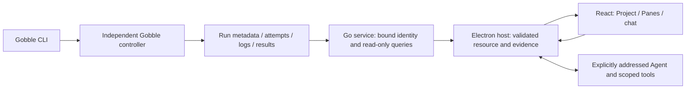
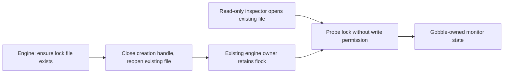
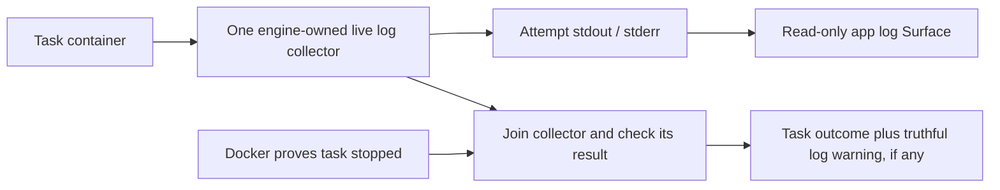

# Stage 6 — Actual engine and Agent integration

Status: stage 6 implementation and scoped integration verification finished; user review pending. The full legacy engine suite retains two baseline packed-runner failures documented below. Stage 7 packaging is unstarted and remains a separate approval checkpoint.

## Request and subject before execution

Request INT-06-20260907-01. Requesting/consumer owner: desktop integration owner (Codex), with the project user as acceptance authority. Exchange: accepted application/engine contracts → Electron Testing evidence. Claims: session-plan tasks 6.1/6.2 and the completed 5.6c renderer/host behavior. Testing owns tests, fixtures, runs, interpretation and evidence. A product defect returns to its implementation owner under the authorized correction scope; Testing does not alter a product policy to obtain a pass.

Predecessor: [5.6c](05-6c-integrated-review.md), 197-file subject SHA-256 `b786f7d9a51168b6911782f5e6b18ebbb34c529bf859781b9e16d84a4088c79d`, 156 unit/contract and 35 Electron scenarios. Current app source, contracts and service are the initial subject. Engine source is the unchanged clean Git commit `7fe3d5c9e10d0cc104a15b6e7aa3def0d15b98f1`; build a separate clean copy rather than assigning an engine identity to the uncommitted desktop work. Record the exact constructed image and daemon before runtime claims.

Target: macOS arm64, Electron 44.2.0, React 19.2.8, TypeScript 5.9.3, Playwright 1.63.0, native Go service. Engine runs Linux/amd64 on local Docker Desktop (emulation on this arm64 host). Existing real display and app-specific Codex 0.153.4 login. No credential copying/import. Initial Docker daemon was unavailable; starting the installed Docker app restored access to local daemon `bfc24268-2f66-46d9-a1d1-969af8291bec`. The earlier gap does not count as a pass.

## Concepts and ownership

- Project is the durable scope for resources, Agents and discussion; it can contain multiple Runs.
- A Gobble workspace directory is one engine execution/storage boundary. It is different from the app's shared workspace layout. Run metadata, task attempts, statuses and logs remain Gobble-owned.
- The Go service binds an attached Run to its Project, local daemon, exact image and workspace identity. It reads via the recorded runtime and cannot start/stop/resume analysis.
- Pane is an app layout slot. A Surface is a live view of a resource (file, Run monitor, or attempt logs). Pipeline graphs/status displayed in a Run Surface are projections of Gobble's monitor, not app-owned pipeline state.
- Agent observations require an actually presented, ready Surface. Saved message/question evidence is a snapshot with source/version/recipient identity, not another live Surface. App quit must not own or terminate an independently launched Gobble controller.

## Cases selected before execution

| Case | Claim / start and trigger | Observation and lowest sufficient layer | Required environment / failure modes |
| --- | --- | --- | --- |
| I1 | Clean engine image, fresh small Project, CLI init/doctor/plan/run | Real engine identity, source plan and expected count output; actual Docker/CLI | Local daemon, exact Linux/amd64 image, local shared paths; no proxy image or mutated lock |
| I2 | Attach actual Run; show monitor and current-attempt logs | CLI run/task/attempt/status/log values match service/bridge/Electron display; actual Electron | Same Project/image/daemon; no read-only query mutation, wrong attempt or invented success |
| I3 | Independent detached controller while app closes/restarts | Same controller remains running after app quit; gated work completes through CLI and app reconnect reads the final state; actual Docker + Electron | Owned disposable fixture only; no unrelated container/engine stop |
| I4 | Real signed-in Agent observes result and image, points/asks/replies | Evidence-backed result and actual image consumption, explicit addressed reply, normal restart without resend; native app + real provider | Existing login, foreground window; a fixture provider cannot establish this claim |
| I5 | Invalid/stale identity, Project scope, duplicate requests, late results, invalidated questions, service failure/recovery | Existing focused service/host/Electron regression evidence plus real-runtime refusal/recovery where feasible | Distinguish controlled fault injection from actual environment failure; preserve first failures |

Tests may create only owned isolated fixture projects/profiles, small runs and evidence output. Retain useful final fixture results; stop/remove only explicitly owned test controllers at teardown. Existing user Project source/history and unrelated Docker containers are protected. Native review may register a separate validation Project, with its final state and relationship to the user's original Project documented. No publishing, analysis-scale dataset, model/configuration change, installed-app claim or package work.

Source/type/build checks remain construction evidence. Existing fixture-based regressions remain labeled as such. Stage 7 packaging/install/signing/update paths and Windows/Linux app execution are `unsupported target or claim` for this request. OS shutdown/suspend and representative-user/screen-reader task trials are `not run` unless explicitly exercised; normal quit/relaunch cannot substitute for them.

## Results

The scoped desktop integration claims pass on the final runtime. The complete legacy engine suite is **not green** on this Mac target: two packed-runner tests fail identically on the unchanged baseline. Their cause is not established, and their separate packed executable path is not used by this app's generic container runtime. This limitation must travel with the acceptance record; no skipped test or substituted provider is counted as a pass.

| Case | Result | Evidence boundary |
| --- | --- | --- |
| I1 | Pass | Actual Docker init/doctor/plan/run; expected output 2 |
| I2 | Pass | Real CLI/service/Electron Run status, task attempt, exact image and final logs; no finalization warning after repair |
| I3 | Pass | Exact controller alive after normal app quit; finishes independently; final Run/logs/draft restore |
| I4 | Pass | Actual signed-in Agent observes Run and image, creates pointer and one question; explicit reply; normal restart preserves exactly two submissions. A further real Agent observes the final corrected image and reports no log warning. |
| I5 | Pass within selected cases | Real duplicate attachment, daemon mismatch and foreign-Project refusal; 156 unit/contract and 35 Electron regressions cover the listed controlled faults, late results and invalidated questions |

[Final actual-runtime run](06-review/final-runtime/live-test.txt) · [CLI/UI result files](06-review/final-runtime/fixture-location.json) · [Agent on the corrected runtime](06-review/actual-agent/final-project-review.json) · [App regression suite](06-review/app-check-final.txt).

The initial failed attempts and their exact test/product classifications remain below. OS shutdown/suspend, Windows/Linux desktop app execution, signed installation and representative-user/screen-reader trials are not established by these results.

Test construction: separate opt-in `playwright.live.config.ts`, `desktop/tests/live/runtime-fixture.ts` (fresh Project and controller/process lifetime) and `runtime.spec.ts` (observable CLI/bridge/UI assertions). Standard tests remain daemon-free. `test:live-runtime` requires `GOBBLE_LIVE_RUNTIME_IMAGE` and fails if prerequisites are absent; no skipped proxy case. New configuration is included in existing strict test type checking. No product source changes are part of the initial test subject.

Engine image built successfully from the clean engine commit: `sha256:ebbc987ef351361afdc2c82accb115a579be2cbde71073fdd8ff6d3712201df0`, Linux/amd64. [Build evidence](06-review/engine-build.txt). Native service/launcher race tests passed ([Go evidence](06-review/go-tests.txt)). BuildKit reports two existing constant-platform lint warnings; they do not alter the explicitly required engine platform. These construction facts do not yet establish engine/UI integration.

## First failures and bounded correction design

1. First live test: test defect. A whole-Run monitor intentionally returns an empty logs array; task logs require `--instance`. The readiness poll omitted the instance and timed out. Preserved [first execution](06-review/first-run/live-test.txt) and commands. Fixed only the poll. The service accepts `logs: []`: its header field is raw JSON (`[]` has two bytes), not a slice of log entries. No service defect or service patch is warranted.
2. Second live test: actual CLI init/doctor/plan/output, attachment, monitor and current-attempt log rendering succeeded. App quit left the exact controller running. The fixture wrote its release marker to the workspace input, but Gobble stages independent input copies into the task isolate. The task correctly reached its bounded exit 88. Fix owner: Electron Testing; release only the task container identified by this fresh Project's checkpoint and matching submission label. [Second execution](06-review/second-run/live-test.txt).
3. Separate product defect: the live controller holds a lease but CLI and app report `interrupted`, with active occupancy/live=false and a running task. A minimal Linux/amd64 Go probe reproduced simultaneous successful exclusive locks on a newly created Mac/VirtioFS bind-mounted file; existing files and container-local files correctly conflict. An arm64 probe also reproduced the bind-mount problem, ruling out amd64 emulation alone. This matches the creation-specific report [Docker for Mac #7004](https://github.com/docker/for-mac/issues/7004), but local reproduction is the evidence for this target. The actual engine regression tests fail both fresh occupancy and checkpoint exclusion on the same host bind mount ([before](06-review/lock-before.txt)). Separately, read-only mounts reject the observer's O_RDWR open with EROFS. The observer needs no write access.

Diagnosis result: reproduced root cause / success; engine production source stayed unchanged through diagnosis. Local disposable probes and normal Go build cache only; no credentials, publishing or Docker settings changes. Testing now hands the reproducible defects to Go Development author mode within the user's stage-6 correction authorization.

Affected set before implementation: update `internal/engine/occupancy.go` and `checkpoint.go`; create one private `filelock.go` opener shared by their two real callers; create `filelock_test.go`; update live test assertions and fixture; retain stage evidence. Package/import/module and public CLI/schema remain unchanged (`github.com/HahyeonJeon/gobble/internal/engine`, module Go 1.26). Ownership remains engine-exclusive flock, caller-held descriptor lifetime, closed at the existing boundaries. The helper owns only create/close/reopen; it does not acquire locks or decide liveness. No dependency or migration, new process, app-owned execution state or runtime privilege expansion.

Accepted contract determines the repair: ensure a created lock is reopened before locking, and observe the existing occupancy lock through O_RDONLY. Replacing flock with PID/daemon leases would change recovery/ownership/API assumptions and is outside this correction; guessing a Run status in the app would violate the accepted engine boundary. This repair preserves the selected mechanism and restores its exclusion/read-only claims. Checkpoint locks share the exact creation defect and must be corrected in the same slice.

Verification: reproduce new lock tests on the original Docker/VirtioFS target, then on the repaired source; Go 1.26 Linux/amd64 container test compilation, native Go 1.27.1 darwin/arm64 race/default tests, source build and the original live Electron scenario. Build a new honest engine identity in the isolated verification checkout only, keeping this user working tree uncommitted; retain its exact commit/diff/image mapping. No push. Scope and general app design are already approved; this is an implementation repair of that contract. Author mode uses no credentials and performs no external mutation.

## Correction and rerun results in progress

Engine correction identity: isolated verification commit `0533b01258a2b3ff66d429d4e67b476e36612b86` (parent `7fe3d5c9e10d0cc104a15b6e7aa3def0d15b98f1`), four files only, matching the uncommitted correction in the user checkout. Runtime image `sha256:b1513698d8855b2b721a73dc48042fe3dd56c6c7454c490d24f06c5b87bdc6ac`, Linux/amd64, Go 1.26.8. [Identity](06-review/engine-fix-identity.txt), [build](06-review/fixed-engine-build.txt). No user-branch commit or push. The same fresh-lock regressions now pass on the original bind-mounted target ([after](06-review/lock-after.txt)).

The third live execution proved running/live=true and independent completion, then failed a new test assertion using `completed` instead of Gobble's defined `succeeded`. This is a test defect; the actual final result was successful. The corrected fourth execution passes the complete scenario in 54.6 seconds: I1 output 2; I2 Run/task/current-attempt logs and exact image; I3 controller alive after app quit, output produced, relaunch restores final Run/logs and draft; I5 duplicate attachment deduplicated, daemon mismatch refused, foreign Project Run lookup refused. [Actual runtime evidence](06-review/actual-runtime/live-test.txt), [CLI and UI outputs](06-review/actual-runtime/fixture-location.json).

One pre-existing Codex test used a 120 ms deadline for both simulated timeout and real subprocess initialization. During simultaneous engine builds, the malformed-input case timed out before its fault could be tested (155/156 passed). Preserved [first result](06-review/app-check-first.txt). Testing-only correction in `desktop/tests/codex.test.ts`: retain the normal process handshake budget and advance a controlled clock only around the no-response request; malformed-frame rejection and real reconnect remain actual child-process observations. All 15 focused protocol cases pass ([result](06-review/codex-test-fixed.txt)). No product timeout or transport source changes.

Native Go service/launcher race tests passed. Native engine compilation is unsupported (`useProjectOwner` is Linux-only), consistent with the documented engine target; no platform stub was introduced. An attempted whole-engine suite in the root runtime image was an invalid test environment: root bypassed permission checks and runtime-bootstrap variables differed from the documented hermetic test image. Two permission assertions and CLI cases failed; the remaining CLI test was stopped with SIGQUIT after retaining diagnostics. This is not a production regression verdict or a pass. Re-execution uses the repository's dedicated unprivileged test Dockerfile, network disabled and one CPU as documented in `tests/docker/README.md`.

## Actual Agent review and log-finalization correction

I4 passed using the existing signed-in account through the native UI, in new Project `prj_DXT6JIS3LZCPFX6BEA7ZMUURGS`. One new default-model Integration reviewer observed the actual Run and the chart, correctly reported status/attempt and the displayed warning, identified blue/orange equal-height 8 nt bars, and marked the second bar. It saved one question referencing both observations; Reply used the existing composer, included question evidence, and produced one explicitly addressed answer. Normal app Quit, relaunch and account Refresh restored the answered question/reference and exactly the same two submissions, with no resend. [Scoped Project record](06-review/actual-agent/project-review.json), [restart equality](06-review/actual-agent/restart.json). The original Review Project/history was preserved. No credential files were read or copied. The chart was separately prepared with matplotlib 3.9.4 from the real starter FASTA (2 × 8 nt); it is review material, not a pipeline-generated result. Its source/version is recorded in [chart provenance](06-review/actual-runtime/chart-provenance.json).

The Agent and native visual review surfaced a second engine defect: successful live tasks displayed `log-copy-failed`. `followLogs` already exclusively creates stdout/stderr, then `finishStopped` cancels it and calls `writeDockerLogs`, which uses the same exclusive-create operation. Consequently final collection refuses the existing files even when the collector captured all bytes. New regression `TestStoppedDockerTaskUsesItsCompletedLiveLogs` reproduces the incorrect warning in the Linux target ([before](06-review/logs-before.txt)). Existing symlink, hardlink and foreign-file refusal tests are part of the required boundary and must remain unchanged.

Correction owner: Go Development author mode under stage-6 repair authorization. Affected set: `internal/engine/exec/logs.go`, `docker.go`, `logs_test.go`; live test adds a clean-final-reason assertion; engine identity/evidence rebuilt truthfully. The existing collector keeps exclusive ownership of its files and closes them on exit. Record its result before closing its done channel. For a proven-stopped task, join the collector to EOF and consume that result; when no collector exists, retain the existing final-copy path. A failed/canceled collector remains an explicit incomplete-log warning. Caller cancellation still bounds joining and cancels the collector. Existing Cancel/recovery file refusal stays conservative; this slice does not claim recovery log replacement.

Alternative considered: reopening or replacing existing attempt files. Rejected for this slice because it introduces new replacement/identity rules and would risk weakening the accepted foreign-file refusal. Consuming the already owned collector's result restores the existing normal-completion contract without another file writer, new process, public API, schema or resource owner. File handles still close in the collector; its result is published through the existing done channel. No product timeout is extended.

## Final subject and review checkpoint

App/service subject: 200 nonignored tracked/untracked files, SHA-256 `66da48d30c9f586652351c00a64c9130d6eae5973503091cdf7dc2c5eb01e0b3`; algorithm is sorted unique path + NUL + file bytes + NUL, over `app`, `internal/appservice`, `cmd/gobble-service`. [Affected app/service paths](06-review/final-subject.json). Product Electron/React/Go-service code and public contracts did not change in this stage; app changes are the opt-in live suite/configuration, the deterministic protocol test and usage documentation.

Final engine verification commit `f83b18d3b7d20514358a1b2f7c0d319bdf6bf17b`, parent `0533b01258a2b3ff66d429d4e67b476e36612b86`; original base `7fe3d5c9e10d0cc104a15b6e7aa3def0d15b98f1`. Final image `sha256:5f3d800dd82d3bea4474b562aad5ec3dd34133b2d251da99948faa15318f55f7`. [Final identity](06-review/final-engine-identity.txt), [build](06-review/final-engine-build.txt), [complete engine correction](06-review/engine-correction.patch). The two local commits exist only in the isolated verification checkout; the user's branch remains uncommitted. Seven Go files and one engine document changed, with no public schema/API or dependency change. File locking stays with the engine; log files stay with one collector; service and app remain read-only consumers.

Final live scenario passes in 59.6 seconds, including a new assertion against the erroneous log warning. Linux Go 1.26.8 race tests pass for `./internal/engine/... ./monitor/...`; strict app type/format/schema/build checks and 156 + 35 app tests pass. Linux `go vet ./...` passes. The root full-suite limitation is recorded separately, not hidden behind these passing checks. Existing foreign/symlink/hardlink refusal tests remain unchanged. Cancellation/recovery still conservatively reports incomplete logs if it cannot complete collection; this slice does not introduce log replacement during recovery.

The native app is left on `verified-integration`, Project `prj_BLTEOBDGRONGZGKXPNPFK6P2WI`, showing the final Run and chart with Run reviewer’s real response and image pointer. The earlier `desktop-integration` Project intentionally preserves the question/answer and pre-correction warning as historical evidence. The original Review Project document is byte-equivalent as parsed JSON, including its 12 submissions, draft, selections and layout ([preservation](06-review/original-project-preservation.json)). Two validation Projects and three explicitly submitted review turns were added; no prior message was resent. The existing account was refreshed through the UI, not copied.

Stage 7 local Mac app packaging remains unstarted and requires the user's next stage approval. This checkpoint qualifies the named desktop integration behavior with the explicitly retained legacy packed-runner test limitation; it does not declare the entire engine release or other operating systems qualified.

Final full-engine execution finished with exactly the two same baseline failures: `TestPackPrintpipeArtifact` and `TestPackHostpipeEmptyInspectProtocol` in `cmd/gobble` (both report child exit 1 with empty stderr). All other reported packages, including engine, executor, monitor, assay run/resume/stop and failure scenarios passed. [Final full suite](06-review/hermetic-final.txt), [unchanged-baseline reproduction](06-review/packed-baseline.txt), [static check](06-review/engine-vet.txt). The same failures on original commit `7fe3d5c…` rule out these stage-6 changes as their introduction; they do not by themselves prove the underlying emulation cause. Owner follow-up: engine packed-executable qualification on this Docker Desktop target, with these two exact baseline tests as the reproducer. This app uses the verified generic runtime, not that packed execution path.

Cleanup: all detached test controllers/task containers completed or were stopped/removed by their owning fixtures. The five empty Compose networks were removed only after matching their recorded project labels and confirming no attached containers. The dedicated temporary Go-cache volume was removed after tests and vet finished. No unrelated container, network, volume or Docker setting was changed. Exact runtime images, verification checkouts, failure inputs, review Projects and evidence remain available. Current Docker has no running test containers; the app can continue its read-only queries on demand.
