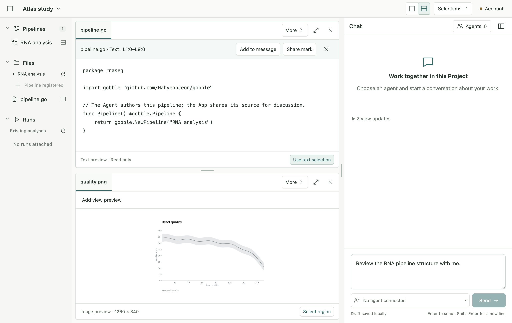
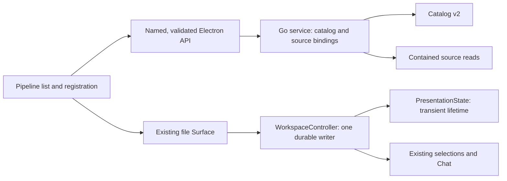
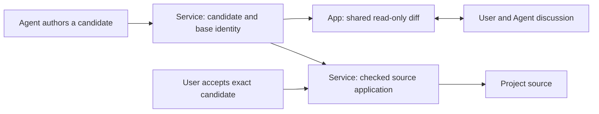

# P1 — Pipeline foundation implementation

Date: 2026-09-09. Implements the owner's approved `task-01-foundation` from the
[pipeline collaboration plan](../../proposals/pipeline-collaboration/plan/plan-01.md).
Stage 2 remains a separate owner approval checkpoint.

## Result

An existing Go package can be registered as a distinct Project-owned Pipeline,
found in a compact collapsible Pipelines section, and opened in the existing
read-only code Pane. Selecting source uses the existing exact text reference and
Chat flow. A Pipeline exists independently of Runs; this registration does not
compile Go or establish a valid executable Plan.

The implementation follows the [stage sketch and contract](design.md). It adds
the first usable source consumer and one focused presentation-lifetime boundary.
It does not introduce speculative Change, Plan or execution service scaffolding.



This is an isolated development App with owned example files. The example contains
an entry declaration, not a qualified analysis. No Agent is connected in this
capture. The [compact capture](pipeline-compact.png) shows the existing 900 × 700
window adaptation and preserved two-Pane workspace after restart.

## Concepts and owners

| Concept             | Meaning and current owner                                                                                                                                                                               |
| ------------------- | ------------------------------------------------------------------------------------------------------------------------------------------------------------------------------------------------------- |
| Project             | Stable association with a chosen local root. The Go service owns its catalog and resource namespace.                                                                                                    |
| Pipeline definition | Stable `pipelineId` plus Project, display name, package and entry-source resource IDs. The service owns registration; one definition per Project/package in P1.                                         |
| Source              | Current bytes of the registered entry file, read through the existing contained file API. Registration is not a multi-file source revision or proof that Go compiles.                                   |
| Workspace           | Project presentation, selections, Chat and durable collaboration state. Electron Main's `WorkspaceController` remains the sole workspace writer.                                                        |
| Pane / Surface      | Pane is a layout slot; Surface is the opened resource/view instance. A Pipeline source opens a normal file/text Surface; no new persisted Pane or view kind is introduced.                              |
| Presentation state  | Transient render leases, Show/Return sessions, observed reference views and retained table/source sessions. `PresentationState` coordinates their lifetime; existing helpers keep their own invariants. |
| Plan / Run          | Gobble's validation/execution concepts. A definition is not inferred from a Run label. P1 adds no Plan generation, source application or execution controls.                                            |



## Code organization and API review

This is an author self-review of the implemented P1 slice. It is not a new
independent review of all historical App or Gobble behavior. The earlier frozen
[architecture review](../../proposals/pipeline-collaboration/architecture-review.md)
remains an approval-era baseline; it is not relabeled as evidence for changed code.

| Files / boundary                                          | Design decision and checked behavior                                                                                                                                                                                                                               |
| --------------------------------------------------------- | ------------------------------------------------------------------------------------------------------------------------------------------------------------------------------------------------------------------------------------------------------------------ |
| `internal/appservice/pipelines.go`                        | Owns registration, bounded declaration recognition and source binding. Reads only contained files; no engine imports, compiler or subprocess. Catalog mutation and request receipt publish together.                                                               |
| `internal/appservice/catalog_migration.go`, `catalog.go`  | Strict v1/v2 decoding, relationship validation and storage migration stay at the catalog boundary. Read does not rewrite. First mutation archives the exact original v1 bytes before publishing v2. Missing primary plus either backup requires explicit recovery. |
| `app/contracts/src/pipeline.ts`, service contracts        | Closed DTOs carry resource IDs. List/register are named APIs; arbitrary paths, commands and code payloads are rejected. Bundle v17 is additive; earlier bundles are frozen.                                                                                        |
| Main `service/project-service.ts`, IPC and preload        | Main validates service responses and Project/package associations. Existing trusted-window and main-frame checks gate the IPC. Preload exposes two specific Pipeline operations.                                                                                   |
| `workspace/presentation-state.ts`, `controller.ts`        | Extracts lifetime reconciliation, clear and disconnect. The controller keeps authorization, revision checks, mutation serialization, evidence epochs and draft/Chat transactions. No second queue or durable writer.                                               |
| Navigation `PipelinesBrowser.tsx`, `RegisterPipeline.tsx` | Listing/rendering and registration request lifecycle have separate components. The request ID survives retries; concurrent submits are blocked. An accepted response refreshes its Project's list even if its folder has closed.                                   |
| Existing `Sidebar`, `FilesBrowser`, `Icon`, shell styles  | Small integration using existing navigation and Pane opening. No replacement viewer, editor, dashboard or large new header.                                                                                                                                        |

The public TypeScript declarations were emitted and inspected; the registration
API exposes only its intended DTO fields. See [declaration evidence](pipeline-declaration.txt).
No dependencies or package lockfiles changed.

### Storage compatibility

- Service HTTP protocol stays v1 with advertised `pipelines` / `register_pipeline`
  capabilities. Service catalog becomes v2; current contract bundle becomes v17.
- Workspace v14, shared toolset v9, source/reference formats and frozen historical
  bundles retain their prior contents.
- Exact original `catalog.v1.backup.json` is retained separately from the rolling
  backup. A conflicting archive is preserved and the mutation fails visibly.
- Older service binaries do not read catalog v2; there is no automatic downgrade.
  Corrupt or unsupported data is never replaced by an empty success state.

## Verification and visual review

See [verification record](verification.md) for commands, results, corrections and
platform limits; [source manifest](after.json) binds the implementation to its
before-state and identifies preserved files.

The actual native workflow covers keyboard registration, exact code selection,
another image Pane, a preserved message draft, restart, and visible errors followed
by a successful retry. The full suite also checks source changes, shared marks,
captured evidence, Show/Return, renderer lifetimes, questions and shutdown recovery.

| User scenario / visual checklist         | Observed result                                                                                                                  |
| ---------------------------------------- | -------------------------------------------------------------------------------------------------------------------------------- |
| Find a Pipeline without starting a Run   | Compact Pipelines list above Files and Runs; separate catalog identity and no Run created.                                       |
| Register from a Go folder using keyboard | Visible text button; Enter registers and exposes the source action.                                                              |
| Discuss source while retaining context   | Read-only source and selection controls in the primary Pane, image in the secondary Pane, draft in right Chat.                   |
| Reopen the App                           | Same Pipeline IDs, source bytes, two Pane contents and draft restored.                                                           |
| Correct an invalid entry and retry       | Inline error and usable retry; one accepted registration, no partial definition.                                                 |
| Use a narrow window                      | Existing navigation collapse and Workspace/Chat switching remain usable; no overlapping header controls in the reviewed capture. |

## Next checkpoint: Agent changes

P1 is the registration/read foundation. The next approved-plan group would let
the Agent produce a bounded candidate and discuss its exact diff through the same
Project, Panes and Chat. The service would own candidate/source lifecycle; the App
would present changes and User acceptance; Gobble would own later validation and
execution. Starting P2 still requires the owner's approval of this result.

```text
Project navigation     Shared workspace                     Chat
▾ Pipelines            Change 1 · pipeline.go               Agent's explanation
  RNA analysis         [read-only source diff]              User: “this hunk…”
                       Select hunk → discuss                Shared hunk reference
                       [context in optional second Pane]   One composer
```



P2 must first refine the concrete multi-file manifest, hunk reference and recovery
contract before changing source code. Stale bases and unsupported writes must have
explicit outcomes; partial application cannot appear accepted. App UI stays in
English. P2 does not include Plan jobs or Start/Stop/Resume, which retain their own
later checkpoints.
