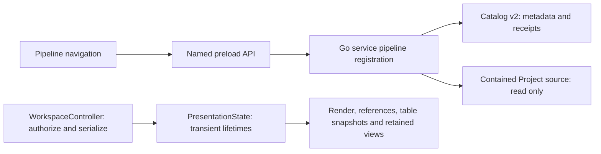

# P1 — Pipeline identity and presentation ownership

Status: stage 1 implementation authorized by the owner on 2026-09-09 after review
of the pipeline-collaboration proposal. This sketch narrows that accepted stage;
it does not enable later authoring or execution stages.

## Observable outcome

Register an existing Go pipeline package from the Project file browser. Find it in
a compact collapsible Pipelines section and open its entry source in the existing
read-only text Pane. Source selection, Chat, Show/Return and restart retain their
existing contracts. App UI is English.

```text
Project navigation       Shared workspace               Chat
▾ Pipelines              pipeline.go                    Agent
  RNA analysis           [existing read-only code view] References
▾ Files                  Select text → discuss          Composer
  rnaseq/
  [Register pipeline]
▸ Runs
```



## Domain and API

Pipeline definition is a stable Project-owned registration of a Go package whose
entry convention is `Pipeline()`. It exists without a Run. A Run label does not
create this identity. Registration recognizes a source declaration; it does not
compile Go, import dependencies, build a Plan or prove executable validity.

Stored/wire definition: `projectId`, `pipelineId`, `name`,
`packageResourceId`, `sourceResourceId`. The source is the current registered
entry-file binding, not an immutable multi-file source revision. Reading it uses
existing file hash/reference behavior. New Change/Plan/Operation concepts remain
documented in the parent design until their stages supply real consumers.

- `GET /v1/projects/{project}/pipelines`: Project ID and its definitions.
- `POST /v1/projects/{project}/pipelines`: request ID, registered package resource
  and display name; returns the same registration on a compatible repeat.
- One definition per Project/package resource in this slice. New request IDs do
  not duplicate that registration. Reusing an ID with a changed payload conflicts.
- Only a Project-contained directory is scanned, bounded to 500 entries, 1 MiB
  per inspected Go file and 8 MiB total. Test files are excluded. One unambiguous
  non-method, non-generic, zero-argument `Pipeline` declaration with one result
  is required. Parser errors, missing/ambiguous entries and unsupported files
  produce explicit errors. Build constraints and return-type semantics are Plan
  concerns, so registration must not be called validation.
- Source paths stay inside the service. UI sends resource IDs and receives source
  metadata; existing file views handle missing/changed source visibly.
- No source writes or association guessed between existing Runs and definitions.

## Storage and compatibility

Service catalog v2 adds Pipeline definitions and Pipeline registration receipts.
Strict v1 decoding migrates in memory; first mutation preserves the original v1
bytes in a dedicated archive before publishing v2. Ordinary read/open does not
rewrite the catalog. Existing Project/Run records and request receipts survive.
Unknown versions/fields or corrupt relationships are refused with original data
preserved. Older service binaries do not support v2; no automatic downgrade.

HTTP protocol v1 gains advertised additive capabilities. Current schema bundle
advances to v17; v16 and older bundles remain frozen. App Workspace v14, retained
evidence and shared Agent toolset v9 are unchanged. Pipeline navigation opens an
existing file resource, so no new persisted Pane type is needed.

## Presentation boundary

`PresentationState` owns transient render leases, reference-view sessions,
observed reference views and retained table snapshots. Its reconcile/clear/
disconnect methods keep these lifetimes consistent. Existing specialized helpers
remain authoritative for their own invariants.

`WorkspaceController` remains the only durable workspace writer and owns
authorization, mutation order, view/evidence epochs and input preservation. It
calls presentation reconciliation within the existing serialized path. Moving
this lifetime policy does not introduce another queue or split chat/evidence
transactions. The existing source adapter is not broadly reorganized in this stage.

## Transitions and verification

Target: current macOS/arm64 development Electron app; no installed-artifact promise.
All new native checks use isolated profiles and owned fixtures.

| Trigger / start                                | Outcome and preservation                                                             | Failure / retry / evidence                                                                                           |
| ---------------------------------------------- | ------------------------------------------------------------------------------------ | -------------------------------------------------------------------------------------------------------------------- |
| Register a Project folder containing Go source | Stable definition and receipt persisted; source and engine files untouched.          | Invalid/missing/ambiguous source or stale Project is shown; retry does not create another definition.                |
| Open registered pipeline                       | Existing code Pane with exact current file revision; draft and other Pane preserved. | Missing/replaced source uses existing visible file error; no silent rebinding or execution.                          |
| Relaunch                                       | Definitions restored by service, workspace by its existing writer.                   | Catalog parse/storage errors preserve bytes; no empty reset of corrupt state.                                        |
| v1 catalog first mutation                      | Exact v1 archive, preserved registrations/receipts, valid v2 primary.                | Failed archive/publication does not advertise an accepted new definition.                                            |
| Hide/switch/close view or Project              | Transient presentation reconciles/clears as before; durable references remain.       | Old render acknowledgments/late loads cannot become current; exercise existing reference/restart scenarios.          |
| Quit / child failure                           | Existing App lifecycle and visible unavailable state retained.                       | This stage adds no background execution, new entry mode, installation/update/uninstall or external file association. |

Planned evidence: focused Go catalog/source/HTTP tests; typed service response
association and schema checks; existing workspace/reference/provider unit tests;
native pipeline registration/source/restart plus existing shared-view scenarios.
Supported Gobble Linux baseline qualification remains separate from the known
native root-library compile limitation. No broad host execution support is added.
