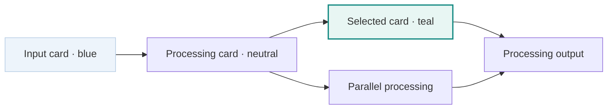

# P2A-1 — Flow visual refinement

2026-09-09. The owner requested rounded orthogonal connections, clearer card
colors and small icons, using the accepted visual concept before proceeding to
P2A-2. This is a refinement of the existing interaction, not a new workflow phase.

[Selected card and details](pipeline-flow-selected.png) · [Verification](verification.md)

## Visual and semantic decisions

- Connections travel horizontally/vertically with small rounded corners. Column
  gutters and row corridors keep connections that skip columns outside cards.
  Individual artifact edge IDs, endpoints and hit targets are retained.
  Connections using the same named port share its anchor; different ports remain distinct.
- Cards use a quiet border/shadow, a role icon, two-line title and secondary port
  information. Inputs are pale blue; ordinary steps are neutral; the locally
  selected card/connection is teal. A visible legend and `aria-pressed` accompany
  color, so meaning does not depend on color alone.
- The icons represent input data and processing roles. They do not guess tool
  brands from step names. Verified per-tool identities can support tool logos in a
  later explicit presentation contract.
- This Surface describes a checked design. It has no attached Run state, so no
  invented running/succeeded/failed badges are shown. Those states continue to
  belong to Gobble's Run observations. Current selection is not execution success.
- Fit/zoom, connected list, independent Panes, saved artifacts and right Chat keep
  their existing interaction. No motion, source editing or Agent reference API is
  introduced.

The figure describes role and local selection, not execution or proposal state.
The before-change sketch was also shown in the conversation. The owner already
specified this refinement and the reference concept; a second cosmetic option
would not constitute a distinct interaction concept or require another approval.

## Implementation boundary

| Unit                                                      | Responsibility                                                                                           |
| --------------------------------------------------------- | -------------------------------------------------------------------------------------------------------- |
| `flow-layout.ts`                                          | Node grid and shared card dimensions; actual flow identity and labels unchanged.                         |
| `flow-routing.ts`                                         | Pure orthogonal routing and rounded path geometry for existing edges. No graph semantics or React state. |
| `PipelineNode.tsx`                                        | Stateless card, decorative role glyph and local selection presentation.                                  |
| `PipelineFlow.tsx`                                        | Existing diagram/list interaction and zoom; renders routes and cards.                                    |
| `PipelineView.tsx`, `PipelineDetails.tsx`, `pipeline.css` | Color legend and scoped appearance; no new persisted state.                                              |

The schema bundle, service, Gobble engine, retained source/artifact format and
Workspace version are unchanged. The previous P2A-1 evidence remains immutable;
this directory records the newer renderer result. P2A-2 remains a later owner
approval checkpoint.

## Design evidence and review dispositions

For all seven results below, the actor is the implementing assistant and the
decision owner is the Project owner. The subject is this existing Electron flow
Surface, used by the same owner reviewing a research pipeline in one/two Panes.
Evidence sources are the dated owner request, the accepted 2026-09-09
[concept](../../proposals/visual-pipeline-collaboration/flow-concept.png), P2A-1
[actual screen](../p2a1-pipeline-flow/pipeline-flow.png), existing App tokens and
the renderer/files named above. Scope excludes execution states and new interaction
models. Evidence is local code/native visual review, not representative-user proof.
Each result is reopenable on the owner's visual feedback, obscured connections,
unreadable titles, lost keyboard access or a new state/metadata contract.

| Activity / result                            | Disposition                       | Method, decision, limits and next consumer                                                                                                                                                                                                            |
| -------------------------------------------- | --------------------------------- | ----------------------------------------------------------------------------------------------------------------------------------------------------------------------------------------------------------------------------------------------------- |
| Discovery evidence reviewed                  | Reused current evidence           | The owner identified the current curved/diagonal lines and plain cards; exact prior screen and concept are available. No claim about other users. Implementation consumes this bounded correction.                                                    |
| Design requirements accepted                 | Performed for the current subject | Translate the owner request into orthogonal rounded geometry, readable cards and truthful color meanings. Running-state metadata is absent; preserve that constraint.                                                                                 |
| Concept decision recorded                    | Reused current evidence           | The accepted flow/card interaction and owner-prescribed refinement leave one in-scope concept. Arbitrary free-layout/editing is outside the request. Cosmetic variants are not counted as alternatives. Reopen if routing/list hierarchy must change. |
| Prototype evidence reviewed                  | Performed for the current subject | Conversation sketch plus built native UI are the fidelity needed to review card/line expression. Prototype arrows are not engine facts; actual native screenshots use a real artifact.                                                                |
| Representative-user test evidence            | Reused current evidence           | The owner's current visual review is direct feedback for this reversible presentation correction, not a usability study. New result awaits that same owner's visual acceptance; no general user-performance claim.                                    |
| Design–implementation obligations reconciled | Performed for the current subject | Separate card/routing geometry from facts, preserve IDs and compare actual native screenshots. Geometry tests cover hidden-card intersections and independently addressable parallel connections.                                                     |
| Post-release design review                   | Not applicable with exact reason  | This is an unshipped local development correction. No release cohort, telemetry or monitoring decision exists. The local maintenance decision is to retain current scope and reopen on owner feedback; do not create an automation.                   |

Useful success signals are traceable connections, legible step titles and preserved
selection/draft. More color, fewer bends or a smaller image are not success by
themselves. A wire crossing a card, a color implying an unavailable Run state, or
a label lost at fit zoom invalidates the refinement. No client performance claim
is made; the existing graph/list size boundary remains the guardrail.

## Verification and review

Final command results and screenshot review are recorded in `verification.md`;
the exact before/after file scope is retained with this stage. The new tests assert
geometry and identity outcomes rather than pixel snapshots. The native scenario
uses an owned temporary Project and profile with the pinned real Gobble runtime.
It creates no Run and contacts no Agent.
