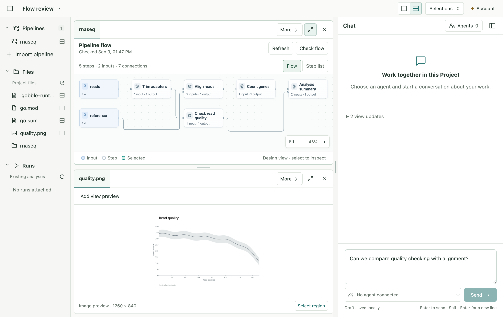
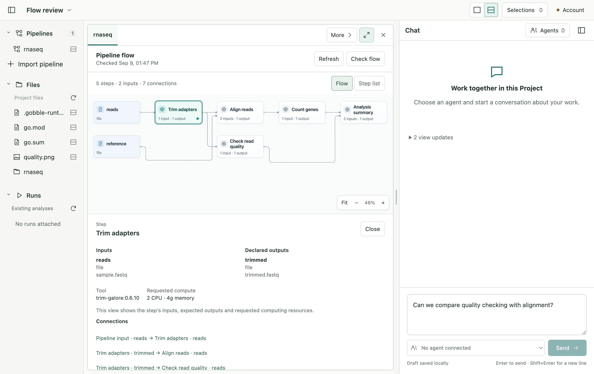
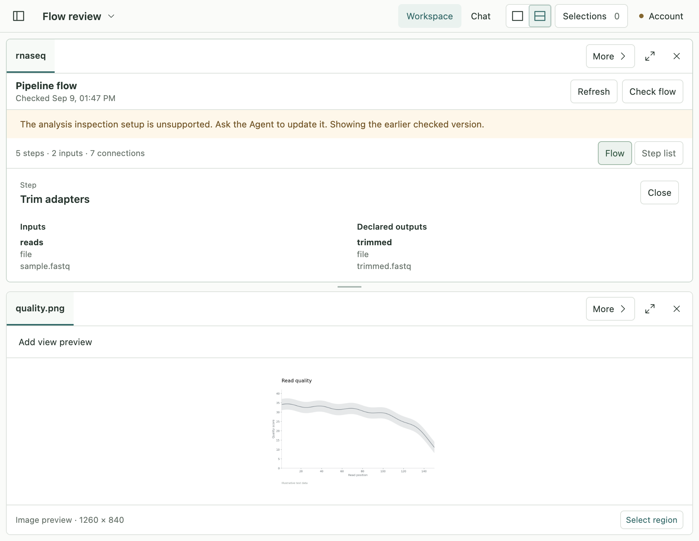

# Flow refinement — verification

The subject is the final renderer refinement of P2A-1.
Final focused tests: **seven passed**. Final native scenarios: **three passed**
(55.9 seconds), including the final contrast and detail-copy adjustments. The
final screenshot run is recorded in `native.log`. Previous
[P2A-1 verification](../p2a1-pipeline-flow/verification.md) remains the baseline;
its whole-App numbers are not re-labeled as results of this narrower check.

## Checks

| Check                                | Evidence                                                                                                                                                                                                               |
| ------------------------------------ | ---------------------------------------------------------------------------------------------------------------------------------------------------------------------------------------------------------------------- |
| Focused pipeline unit/contract tests | Seven cases: the existing identity/storage/flow checks plus orthogonal routing outside every card and separate connections sharing a real named output. `unit.log`.                                                    |
| TypeScript process checks            | Contracts, Main, preload, renderer and tooling. `types.log`.                                                                                                                                                           |
| Built native App                     | Production Main/preload/renderer and native service build. `build.log`.                                                                                                                                                |
| Actual Electron scenarios            | Real Gobble checked flow, native import/error handling, keyboard selection, selected card/details, exact edge navigation, graph/list, two Panes, failed-check preservation and restart. `native.log`.                  |
| Formatting                           | Existing App formatter, plus this stage's Markdown. `format.log`.                                                                                                                                                      |
| Scope preservation                   | Final source hashes are compared with the P2A-1 manifest; only listed renderer/test/document paths may change. Gobble/service/contracts/dependencies and prior stage/proposal evidence remain unchanged. `after.json`. |

The local runtime, owned test Project and Electron environment are the same exact
tuple recorded by P2A-1. The native flow is actual inspection output; no analysis
Run is created and no Agent is contacted. There is no new runtime release or
whole-engine qualification claim.

## Visual review

Compare the screenshots retained beside this file with the approved concept and
previous native result. Review ordinary and selected cards at fitted scale,
straight primary connections, rounded branch/long connections, readable titles,
visible role glyphs, precise hit targets and compact details. The default wire changed from
`#a8b6c0` to `#788f9c`: its mathematical contrast against `#fafcfb` increased
from 2.01:1 to 3.28:1. This is a bounded color check, not an overall accessibility
conformance claim. The detail note describes current view contents instead of
promising future tool settings.

Inputs, processing steps and local selection have distinct treatments. Legend
labels and pressed-state semantics accompany color. Running/success/failure or
proposal-change badges are absent because this checked-design Surface does not
have authoritative values for them. The lower quality image is an existing static
test fixture, not an executed analysis or a generated CSV chart.

Early native checks exposed test timing assumptions: short Panes intentionally
hide the diagram while showing details, and maximizing replaces the presented
view before it is acknowledged. The test now observes the restored/maximized
chrome and acknowledged view before keyboard action, then separately verifies
the visible selected card. Earlier failure evidence is retained in `native-first.log`.
No assertion was removed or reduced to bypass selection verification.

## Remaining limits

- The graph/list size boundary from P2A-1 remains. Large/very dense diagrams use
  the connected list; this is not a universal graph layout engine.
- Geometry validation covers the representative real branching flow and parallel
  port relationships, not all possible graph topologies.
- Local inspection selection is still distinct from Agent-visible references.
  P2A-2 is not started by this visual correction.
- The review is by the implementing assistant, with owner visual acceptance still
  pending. No broader representative-user or performance result is claimed.

## Final native screenshots

