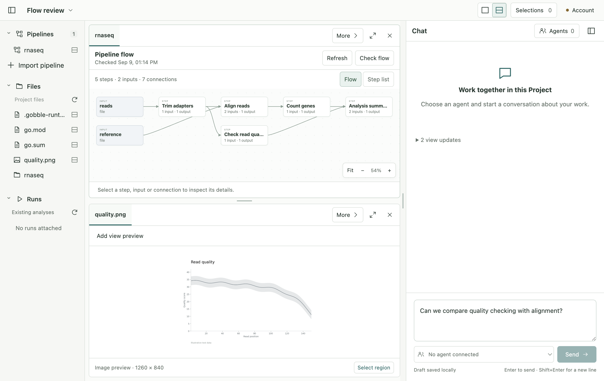
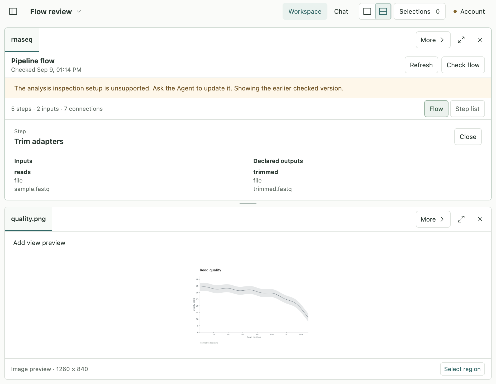

# P2A-1 — Real pipeline flow

Implemented 2026-09-09 after the owner approved the visual collaboration proposal.
**Result review checkpoint: P2A-2 starts after the owner's approval.**

Opening a pipeline now shows its actual checked flow in a central Pane. The User
can explore processing steps, input/output data and exact connections, while the
right Chat and other materials remain available. Source/configuration and runtime
identity are handled behind this view.

This is a real native App screenshot using an owned qualification Project: Gobble
composed five steps and seven connections, including parallel alignment and
quality checks, without creating a Run. The lower image is labeled illustrative
test data. No Agent is connected in this test profile; it is not evidence of
Agent pipeline references or an executed analysis result.

## Delivered

- Native **Import pipeline**, default flow opening and useful setup/runtime errors.
- Explicit **Check flow**, saved check time, cancellation and refresh. Failed,
  cancelled or stale candidates preserve the service's earlier good artifact.
- Actual Gobble pipeline inputs, steps, declared outputs, connections and explicit
  control/resource facts. No dependency inference from source text or data paths.
- Flow fit/zoom, accessible step/connection details, connected list, independent
  opening in both Panes and compact detail display.
- Versioned artifact contracts and Workspace v14→v15 migration; bundle v18 with
  historical schemas and shared toolset v9 preserved.

## Review material

- [Definitions, ownership diagram, APIs and limits](design.md)
- [Code and visual review, fixes and checklist](review.md)
- [Verification results and reproducible qualification](verification.md)
- [Before/after scope and source hashes](after.json)
- [Accepted concept and sequence](../../proposals/visual-pipeline-collaboration/README.md)

Final checks: **328 unit/contract tests across 30 files; 68 native Electron
scenarios; native service race tests and vet; focused Gobble/CLI Linux tests.**
The final full App check includes real native service → isolated Linux Gobble
inspection, both-Pane open/close, failed-check preservation and restart. Historical
schema and prior stage/proposal preservation are recorded separately.

## Next owner decision

P2A-2 makes a step, port, connection or supported setting an exact shared subject:
the User attaches it to Chat; the Agent observes and points to the same checked
artifact without taking the User's selection or focus. P2B then introduces
Agent-authored changes and visual acceptance. P3–P5 handle prepared execution,
Start/Stop and refinement/Resume.

This slice supplies the checked view and local inspection foundation. Shared
pipeline references, arbitrary settings, automatic pipeline creation, source
application and Run controls are not yet implemented. Existing prepared pipelines
require Agent-maintained inspection setup and a compatible pinned runtime. The
qualified image is a local development artifact, not a released runtime.
