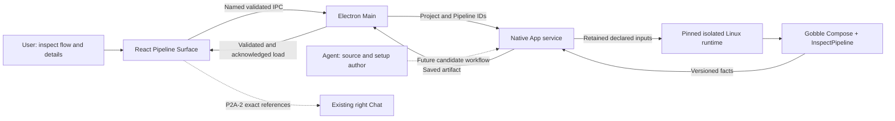
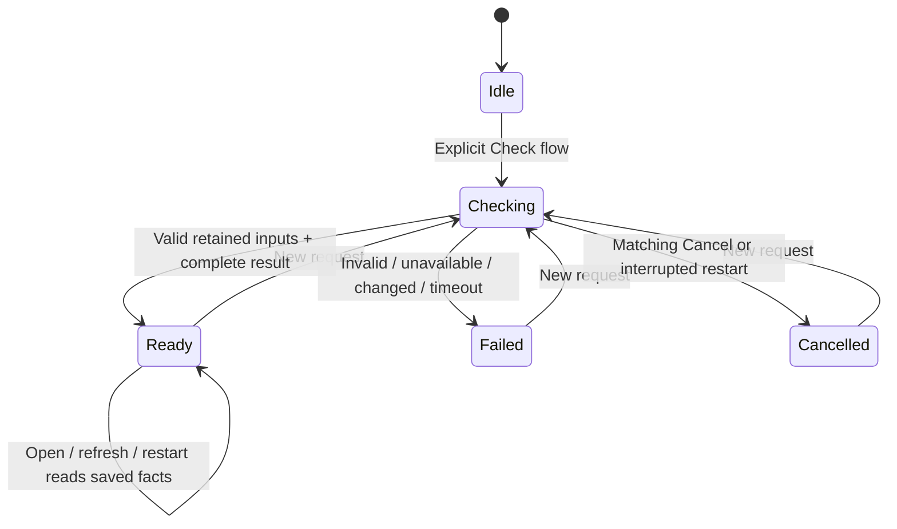

# P2A-1 — Checked pipeline flow

Date: 2026-09-09. Implementation of the owner's accepted
[visual collaboration proposal](../../proposals/visual-pipeline-collaboration/README.md).
The default pipeline surface is a scientific flow. The Agent maintains its
implementation; the User does not enter a package, command or Go declaration.

## Concepts and ownership

| Concept                  | Meaning and owner                                                                                                                                                            |
| ------------------------ | ---------------------------------------------------------------------------------------------------------------------------------------------------------------------------- |
| Project                  | The registered research context: pipelines, files, Runs and App collaboration. Its root/resource identities belong to the native service.                                    |
| Pipeline definition      | Stable Project registration of an existing supported analysis. Registration recognizes an entry declaration without executing it. It is not a checked revision or a Run.     |
| Inspection candidate     | One bounded attempt to evaluate a retained set of declared source/configuration inputs in the pinned Linux runtime. The native service owns its job and history.             |
| Checked artifact         | Immutable Gobble inspection facts plus source/runtime identity and check time. It describes a composed graph; it does not authorize execution or prove input datasets exist. |
| Pane                     | A presentation slot in the App workspace. A pipeline Surface in either slot displays an artifact; it does not own source, jobs or execution.                                 |
| Step / port / connection | Gobble's declared processing operation, named input/output, and exact directed port relationship. Pipeline input connections have an explicit boundary endpoint.             |
| Local inspection target  | The step, pipeline input or connection currently expanded in one Surface. This is transient UI state, not a shared reference or a Chat attachment.                           |
| Run                      | An actual execution and its observations, owned by Gobble. Opening or checking a pipeline creates no Run.                                                                    |



Solid paths are implemented here. Dashed paths are later reviewed slices. Neither
the renderer nor the native service imports the execution engine. Gobble's new
public inspection function uses its existing validated Plan construction; existing
Plan serialization and engine source are preserved.

## Source and artifact identity

The existing Project runtime lock selects a local daemon and immutable image ID.
The Agent prepares a package-local `.gobble-inspection.json`:

```json
{
  "schemaVersion": 1,
  "files": ["go.mod", "go.sum", "rnaseq/pipeline.go"],
  "sample": ""
}
```

All paths are Project-relative. The service automatically includes the setup,
`go.mod` and `.gobble-runtime.json`; the entry source must be explicitly declared.
The optional sample path is a small configuration input. Local imports/configuration
must also be declared, and external modules must already exist in the pinned
runtime. No dependency downloads or automatic runtime installation occur.

Each candidate retains the exact bytes, path/hash/size manifest, Project/Pipeline
IDs, package/sample choice and runtime binding. Only that retained tree is mounted.
After inspection, the service rechecks the runtime and declared files before
adopting a result. Changed inputs preserve the previous artifact and require an
explicit new check. An artifact remains a checked historical observation after
later source changes; opening it does not silently evaluate or claim freshness.

`sourceRevision` hashes the manifest; `artifactId` hashes the manifest and returned
flow. Check time is separate from content identity. Step/port identities come from
Gobble. Edge IDs are stable only within that exact artifact; future references
must never treat an `edge-N` as an identity across changed artifacts.



Failed/cancelled candidates retain an earlier good artifact when one exists. Only
the matching current job can cancel or publish. Repeated current request IDs return
the same operation; an older used ID cannot create another evaluation. Candidates
and results live under the native profile's `service/pipeline-inspections/`,
separately from catalog v2 and Workspace presentation storage.

## Code organization and APIs

| Owner             | Files / responsibility                                                                                                                                                                                               |
| ----------------- | -------------------------------------------------------------------------------------------------------------------------------------------------------------------------------------------------------------------- |
| Gobble            | `pipeline_inspection.go`: versioned read DTOs and graph projection. `cmd/gobble`: dedicated `flow` verb and generated inspection driver; no Run invocation.                                                          |
| Service source    | `internal/appservice/pipeline_source.go`: root confinement, explicit inputs, retained bytes and manifest. `pipeline_import.go`: native folder recognition and registration.                                          |
| Service lifecycle | `pipeline_inspection.go`: one pipeline job, cancellation, artifact adoption and restart. `pipeline_runtime.go`: bounded Docker invocation and cleanup.                                                               |
| Contracts         | `app/contracts/src/pipeline-inspection.ts`: closed transport types and endpoint/identity/DAG validation. Active pipeline Resource and Surface branches are distinct from historical discussion types.                |
| Main / preload    | Named inspection, check, cancel and import calls. Response Project/Pipeline/job associations are checked. Existing Workspace writer owns presentation changes and render acknowledgment.                             |
| Renderer          | `views/pipeline/PipelineView.tsx`: saved state/check controls. `PipelineFlow.tsx`: accessible flow/list navigation and fit/zoom. `flow-layout.ts`: pure placement. `PipelineDetails.tsx`: declared scientific facts. |

Service endpoints are `GET /pipelines/{id}/inspection`, `POST /pipelines/{id}/check`
with a request ID, and `POST /pipelines/{id}/cancel` with the exact job ID, within
the existing Project-scoped API. Native import accepts the chooser's folder path;
renderer IPC accepts only Project/request IDs. There is no arbitrary command API.

Workspace storage advances from v14 to v15; schema bundle advances from v17 to v18.
Historical bundles and frozen storage schemas are untouched. The new v14 frozen
storage schema captures the old contract. Shared toolset v9 and existing reference
schemas remain unchanged in meaning: pipeline observation/capture/attachment is
explicitly unavailable until P2A-2 defines exact artifact subjects.

## View behavior

- Pipelines navigation opens the flow; native **Import pipeline** recognizes an
  existing supported folder. Missing setup/runtime errors describe recovery through
  the Agent. Optional source navigation remains in Files.
- **Check flow** is explicit. Saved facts remain visible while a later check runs.
  Polling reads job status; **Refresh** reads saved state. Neither launches analysis.
- The diagram preserves actual branching and pipeline boundary inputs. Declared
  outputs appear in step details. Gobble currently has no separate top-level final
  output role, so terminal nodes are not relabeled as final products.
- Step details show declared ports, data paths/members, tool, CPU/memory and explicit
  control rules. Arbitrary module commands are not parsed into invented settings.
  Typed settings are part of P2A-2.
- Fit/zoom keeps a representative flow visible beside Chat. Keyboard-accessible
  nodes/connections and a connected step list expose the same facts. A short Pane
  prioritizes selected details; closing details returns to the flow.
- Inspection selection is local to each Surface. Draft, recipient, other views
  and existing file/Run references retain their current owners. Two Panes can open
  the same pipeline independently.

## Qualified limits

- At most 1,000 explicitly listed inputs, plus automatic setup/runtime/module/sample
  entries; 8 MiB per file, 32 MiB total. Research datasets are not copied to inspect
  their declared paths.
- At most two concurrent checks, one per pipeline; 32 retained candidates per
  pipeline. At the retention limit, refuse visibly rather than delete history.
  History management UI is not implemented in this slice.
- Host deadline 120 seconds; container-local deadline 110 seconds. The image must
  provide `/usr/bin/timeout` and the supported `/usr/local/bin/gobble flow` command.
- Linux/amd64, non-root user, one CPU, 768 MiB memory, 128 PIDs, network disabled,
  read-only root and retained source, 512 MiB disposable executable scratch.
  No host Project, Docker socket, credentials or writable shared cache is mounted.
- Flow payload at most 768 KiB, 500 steps, 500 pipeline inputs and 2,000 connections.
  Main validates complete closed fields, references, duplicate identities and DAG
  structure; the service enforces wire version/size/count bounds.
- Diagrams above 80 total step/input nodes or 200 edges use the connected list.
  No partial graph is advertised as a complete flow.

The qualified runtime is an owned local development image, not a distributed
supported runtime release. This slice does not establish arbitrary pipeline,
macOS engine, remote/HPC, source authoring, shared flow reference or execution
control support.
