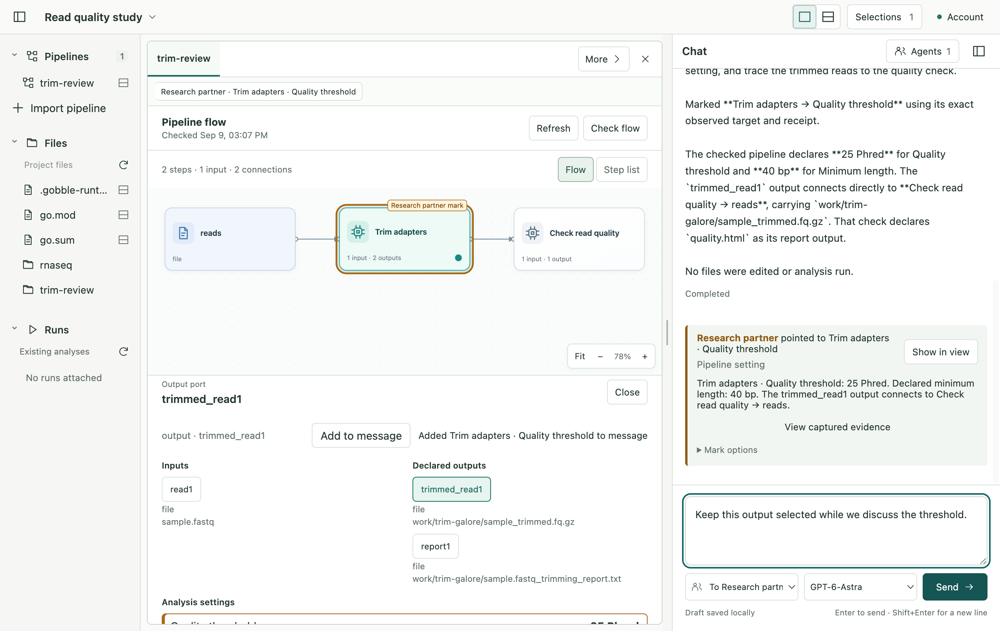

# P2A-2 — Discuss the checked flow

2026-09-09. The owner accepted the rounded flow refinement and authorized this
part. Implementation is complete; owner result review precedes P2B.

Choose a step, data connection, directional port or supported setting in the
central flow/Step list, inspect its details, and use **Add to message**. Chat keeps
an immutable copy of those checked facts. The Agent can observe the same artifact
and mark its exact subject without replacing the User's selection, draft, Pane
or camera. Both participants discuss the scientific UI.

[Interaction and ownership design](design.md) · [Code review](review.md) ·
[Verification and limits](verification.md)

## Concepts and boundaries

| Concept            | Meaning and owner                                                                                                                                                           |
| ------------------ | --------------------------------------------------------------------------------------------------------------------------------------------------------------------------- |
| Checked artifact   | Gobble's composed steps, named ports, exact edges and declared metadata, retained by the service with source identity. It is not a Run or execution authorization.          |
| Pipeline selection | A Project/Pipeline/artifact/source address plus a semantic subject. Main validates it; the renderer chooses and displays it. No pixel or cross-version name matching.       |
| Capture            | Immutable Main-owned facts copied from the acknowledged artifact into existing evidence storage. Later checks do not rewrite earlier messages.                              |
| Observation        | A bounded semantic read of the loaded checked artifact, independent of camera/Flow/list. Only exact returned targets can authorize a mark in that Agent turn.               |
| Mark               | An independently authored shared reference. It does not edit source or change User selection. User-triggered Show/Return remains separate.                                  |
| Supported setting  | A module-authored value derived from validated Options. Trim Galore publishes Quality threshold and Minimum length. Null means Tool default; other modules are not guessed. |

Gobble owns the analysis facts. The service retains inputs, jobs and artifacts.
Main owns reference validation, single-writer workspace changes and evidence
lifetime. React owns the visible interaction. Existing Chat and dynamic tools
carry these objects; no additional messaging channel or persistence layer is added.

## User scenario checklist

- Choose a step using keyboard or pointer; use the same details in Step list.
- Select a named input/output or setting and attach it without sending a message.
- Review an attachment as readable facts, including units and checked identity.
- Let the Agent point at a different subject while preserving the User's draft,
  local selection and camera. Show/Return preserves navigation.
- Re-check changed owned source: reject a held stale Agent receipt and remove the
  old mark from the new diagram; retain the old reference/capture in Chat.
- Restart the App: current settings and earlier captured values remain distinct.
- In a narrow window, switch between Workspace and Chat and read compact details.
- Create no analysis Run during inspection or discussion.

The implementing assistant reviewed these scenarios against the built native App;
this is local qualification, not a broader user-study or accessibility claim.

## Verification result

335 App unit tests and 69 Electron scenarios passed, including real Gobble
inspection and the final immediate-selection correction. The subsequent final
visual build and actual signed-in Agent run also passed. The Agent marked a
setting while the User retained an output-port selection and unsent draft.
See verification.md for exact builds, fixtures, iterations and runtime limits.

Source boundaries are retained in [before.json](before.json) and
[after.json](after.json). No later implementation checkpoint has been started.

## Next checkpoint

P2B will design Agent-authored candidates and a complete visual comparison of
steps, connections and supported settings, with explicit adoption and source
conflict recovery. It has not been started. Execution preparation and controls
follow later. Document/Notebook editing and CSV chart generation remain excluded.
