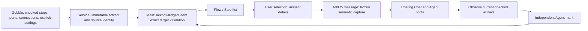

# P2A-2 — Discuss the checked flow

Status: implementation authorized after P2A-1 visual review, 2026-09-09.
Baseline: [before.json](before.json). Historical proposals and stage evidence are preserved.

## Interaction and ownership

Selection means choosing a semantic subject to inspect. It does not edit source,
send a message, or launch analysis. Add to message captures Main-owned facts into
the existing draft. Sending remains an explicit User action. Both graph and Step
list use the same addresses and details. Ports and settings are keyboard buttons
in details; connections remain independently addressable, including parallel edges.

A pipeline reference v7 contains Project, Pipeline, artifact ID, source revision,
and a selector: step ID; exact connection ID plus both port endpoints; pipeline
input; directional step port; or declared setting key. IDs are artifact-local.
No semantic matching across versions, name search, or pixel coordinates.

App data revision continues to describe the loaded inspection state and invalidates
live observation receipts on refresh. The reference data revision is the immutable
artifact ID. This separates historical identity from live presentation authority.
Main verifies both at the existing single-writer boundary. Agent observation is
bounded (48 KiB, at most 128 complete returned subjects and 256 inspected subjects), contains exact returned targets, and only those targets permit pointing
in that turn. Source-preview observations cannot point. Marks never change User
selection, camera, active Pane, or draft. User-triggered reference navigation is
separate. Historical attachments remain readable from immutable capture bytes;
old pointers explicitly report older/unavailable versions, without remapping.

## Supported settings

Gobble inspection v2 adds author-supplied integer setting metadata. TaskSpec owns
copying; Compose retains it; InspectPipeline validates and copies it. Plan and
engine execution serialization do not change. Trim Galore is the first module:
Quality threshold (Phred) and Minimum length (bp) come directly from validated
Options. A null value explicitly means tool default, without guessing the default.
Other module settings remain unsupported. Requested CPU and memory are existing
checked fields, not inferred scientific parameters. No command parsing or image-name
matching. A metadata declaration is a module assertion, not a proof of arbitrary
Project code's scientific correctness.

## Source organization and contracts

- Gobble inspection/settings and Trim Galore metadata; focused owner tests.
- Contracts: pipeline selection/capture model and resolution; active bundle v19,
  Workspace v16, shared toolset v10. Freeze v15 storage and v9 tool inputs first.
- Main: focused pipeline observation/capture adapters into existing evidence and
  shared-context owners. No parallel persistence or IPC/shell API.
- Renderer: Pipeline selection/details and independent marks; reusable captured
  pipeline preview within existing evidence UI. English text throughout.

Create: local selection, immutable draft capture, observed read, shared mark.
Read: checked artifact, retained capture, target details. Update: replace local
selection, re-check explicitly, retract mark through existing policy. Delete:
clear selection/remove draft; retained evidence follows existing ownership/quota.
Inspection jobs and runtime ownership are unchanged.

## Verification and stop boundary

Qualify macOS arm64 Electron 44.2.0 development App, isolated owned Projects and
profiles, cached Linux/amd64 Gobble evaluator. Test malformed/cross-version targets,
parallel ports, setting defaults, copy ownership, stale observation refusal,
independent User state, capture/restart, keyboard/list parity and compact layout.
Run affected owner tests, complete App regression, actual native flow scenario;
report stub Agent and actual signed-in Agent evidence separately. Do not claim
execution, packaging, whole-engine/native support, or source application.

Present working screenshots and result review before P2B. No research Project
source or normal App profile mutations during qualification.

The pipeline observation scope is the loaded checked artifact, independent of canvas
camera or Flow/Step list representation. It is semantic data, not a screenshot.
An off-screen port mark identifies its parent step and exact port in details.
